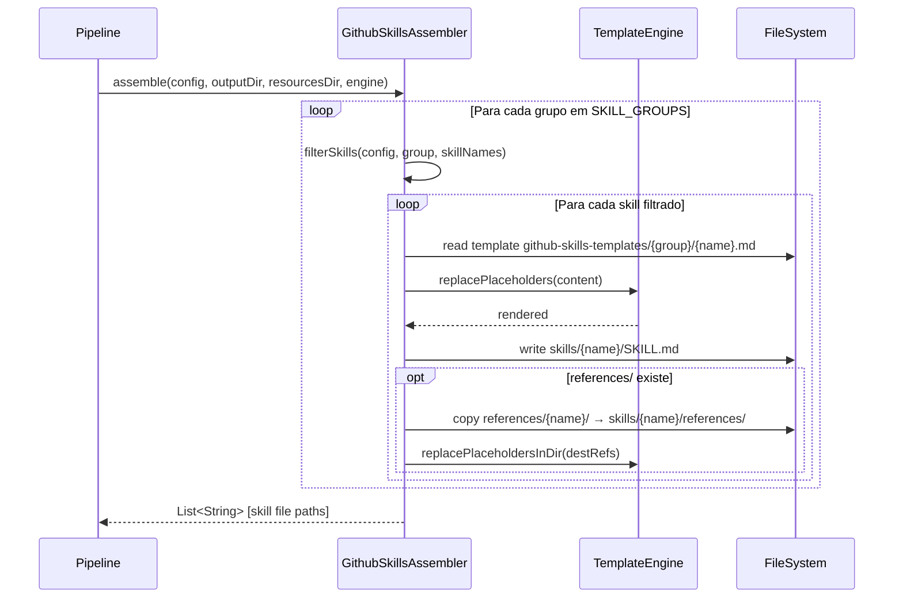
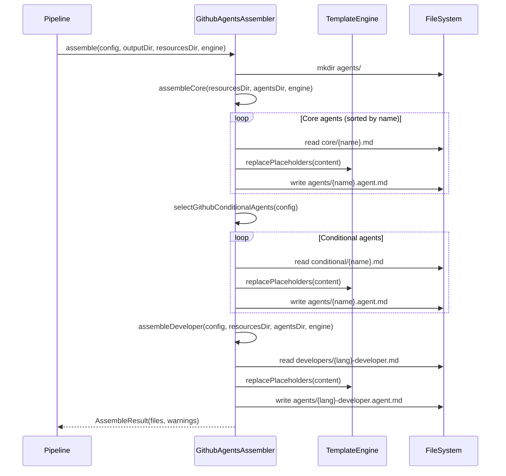

# Historia: GithubSkillsAssembler e GithubAgentsAssembler

**ID:** story-0006-0016

## 1. Dependencias

| Blocked By | Blocks |
| :--- | :--- |
| story-0006-0008, story-0006-0009 | story-0006-0027 |

## 2. Regras Transversais Aplicaveis

| ID | Titulo |
| :--- | :--- |
| RULE-001 | Paridade Byte-a-Byte |
| RULE-004 | Interface Assembler Uniforme |
| RULE-005 | Ordem de Execucao Pipeline |

## 3. Descricao

Como **Desenvolvedor Java**, eu quero portar `github-skills-assembler.ts` (159 linhas) e
`github-agents-assembler.ts` (165 linhas) para Java 21, garantindo que os skills e agents para
GitHub Copilot sejam gerados com paridade byte-a-byte em relacao a versao TypeScript.

GithubSkillsAssembler gera `.github/skills/` com skills para GitHub Copilot, espelhando a estrutura
de `.claude/skills/` mas com formato SKILL.md adaptado para Copilot. Os skills sao organizados em
grupos (story, dev, review, testing, infrastructure, knowledge-packs, git-troubleshooting, lib) e
cada grupo contem uma lista de skill templates. O grupo "infrastructure" aplica feature gates
condicionais baseados no ProjectConfig (ex: k8s-deployment so e gerado se orchestrator=kubernetes).
O grupo "lib" e nested (gera em `skills/lib/{name}/SKILL.md`). Templates sao lidos de
`resources/github-skills-templates/{group}/{name}.md`, renderizados com placeholder replacement,
e escritos em `.github/skills/{name}/SKILL.md`. Skills com diretorio `references/` tambem copiam
essa estrutura.

GithubAgentsAssembler gera `.github/agents/` com agents no formato `.agent.md` (convencao GitHub),
nao `.md` (convencao Claude). O assembler produz 3 categorias de agents: (1) core agents lidos de
`github-agents-templates/core/` — sempre gerados; (2) conditional agents lidos de
`github-agents-templates/conditional/` — gerados baseados no config (devops-engineer se infra
presente, api-engineer se REST/gRPC/GraphQL, event-engineer se event-driven); (3) developer agent
lido de `github-agents-templates/developers/{language}-developer.md` — especifico por linguagem.
Cada agent template tem YAML frontmatter com `tools` e `disallowed-tools`. Retorna `AssembleResult`
com files e warnings (warnings para templates ausentes).

### 3.1 GithubSkillsAssembler

- Constante `SKILL_GROUPS`: Map<String, List<String>> com 8 grupos e seus skill names
- Constante `NESTED_GROUPS`: Set<String> contendo `"lib"` — skills deste grupo sao gerados em `skills/lib/{name}/`
- Constante `INFRA_SKILL_CONDITIONS`: Map<String, Predicate<ProjectConfig>> com 5 condicoes:
  - `setup-environment` → orchestrator != "none"
  - `k8s-deployment` → orchestrator == "kubernetes"
  - `k8s-kustomize` → templating == "kustomize"
  - `dockerfile` → container != "none"
  - `iac-terraform` → iac == "terraform"
- Metodo `filterSkills()`: aplica condicoes apenas para grupo "infrastructure"
- Metodo `renderSkill()`: le template, aplica `replacePlaceholders()`, cria diretorio, escreve SKILL.md
- Metodo `copyReferences()`: copia diretorio `references/{name}/` se existir, aplica replacePlaceholders nos arquivos copiados

### 3.2 GithubAgentsAssembler

- Metodo `selectGithubConditionalAgents(ProjectConfig)`: retorna lista de nomes de templates condicionais:
  - `devops-engineer.md` se container != "none" OU orchestrator != "none" OU iac != "none" OU serviceMesh != "none"
  - `api-engineer.md` se interfaces contem REST, gRPC ou GraphQL
  - `event-engineer.md` se eventDriven=true OU interfaces contem event-consumer/event-producer
- Metodo `assembleCore()`: le todos os `.md` de `core/`, ordena por nome, renderiza cada um
- Metodo `assembleDeveloper()`: busca `{language}-developer.md` no diretorio `developers/`; retorna null se ausente
- Metodo `renderAgent()`: le template, aplica `replacePlaceholders()`, renomeia extensao de `.md` para `.agent.md`
- Retorna `AssembleResult` com warnings para templates condicionais ou developer ausentes

### 3.3 Estrutura de Classes Java

```
src/main/java/com/iadevenv/assembler/
├── GithubSkillsAssembler.java    # implements Assembler
└── GithubAgentsAssembler.java    # implements Assembler, returns AssembleResult
```

## 4. Definicoes de Qualidade Locais

### DoR Local (Definition of Ready)

- [ ] Interface `Assembler` implementada e disponivel (story-0006-0009)
- [ ] `StackMapping` e feature gate helpers funcionais (story-0006-0008)
- [ ] `TemplateEngine` com `replacePlaceholders()` funcional (story-0006-0006)
- [ ] Helpers `replacePlaceholdersInDir()` e `hasAnyInterface()` portados (story-0006-0009)
- [ ] Templates `github-skills-templates/` e `github-agents-templates/` no classpath (story-0006-0004)
- [ ] `AssembleResult` record disponivel (story-0006-0009)

### DoD Local (Definition of Done)

- [ ] `GithubSkillsAssembler` gera skills de todos os 8 grupos
- [ ] Feature gates do grupo infrastructure aplicados corretamente
- [ ] Skills do grupo "lib" gerados em subdiretorio nested
- [ ] `GithubAgentsAssembler` gera core agents, conditional agents e developer agent
- [ ] Agents gerados com extensao `.agent.md`
- [ ] Warnings emitidos para templates condicionais ou developer ausentes
- [ ] Output identico ao golden file para typescript-nestjs profile
- [ ] Javadoc em classes e metodos publicos

### Global Definition of Done (DoD)

- **Cobertura:** ≥ 95% Line Coverage, ≥ 90% Branch Coverage (JaCoCo)
- **Testes Automatizados:** Unitarios (JUnit 5 + AssertJ), integracao, golden file
- **Relatorio de Cobertura:** JaCoCo HTML + XML
- **Documentacao:** Javadoc em classes publicas
- **Performance:** Geracao completa < 2s
- **TDD Compliance:** Test-first, refactoring explicito, TPP incremental

## 5. Contratos de Dados (Data Contract)

**GithubSkillsAssembler output:**

| Artefato | Caminho | Descricao |
| :--- | :--- | :--- |
| Skill regular | `.github/skills/{name}/SKILL.md` | Um SKILL.md por skill em cada grupo |
| Skill nested (lib) | `.github/skills/lib/{name}/SKILL.md` | Skills do grupo "lib" em subdiretorio |
| References | `.github/skills/{name}/references/` | Copiados se existentes no template source |

**Grupos de skills e quantidades:**

| Grupo | Skills | Condicional |
| :--- | :--- | :--- |
| story | 5 | Nao |
| dev | 7 | Nao |
| review | 6 | Nao |
| testing | 6 | Nao |
| infrastructure | 0-5 | Sim (feature gates) |
| knowledge-packs | 9 | Nao |
| git-troubleshooting | 2 | Nao |
| lib | 3 | Nao (nested) |

**GithubAgentsAssembler output:**

| Artefato | Caminho | Condicao |
| :--- | :--- | :--- |
| Core agents | `.github/agents/{name}.agent.md` | Sempre (8 agents core) |
| Conditional agents | `.github/agents/{name}.agent.md` | Baseado em config (devops, api, event) |
| Developer agent | `.github/agents/{language}-developer.agent.md` | Baseado em language.name |

**Estrutura do .agent.md:**

```yaml
---
tools:
  - tool1
  - tool2
disallowed-tools:
  - tool3
---
# Agent Prompt Content
...
```

**AssembleResult (retorno do GithubAgentsAssembler):**

| Campo | Tipo | Descricao |
| :--- | :--- | :--- |
| `files` | `List<String>` | Caminhos dos arquivos gerados |
| `warnings` | `List<String>` | Templates condicionais ou developer ausentes |

## 6. Diagramas

### 6.1 Fluxo GithubSkillsAssembler



### 6.2 Fluxo GithubAgentsAssembler



## 7. Criterios de Aceite (Gherkin)

```gherkin
Cenario: Gera skills GitHub espelhando skills Claude
  DADO que os templates existem em resources/github-skills-templates/ para todos os 8 grupos
  E o TemplateEngine esta configurado com contexto do projeto
  QUANDO GithubSkillsAssembler.assemble() e executado
  ENTAO skills sao gerados em ".github/skills/{name}/SKILL.md" para cada grupo
  E cada SKILL.md contem placeholders substituidos pelo TemplateEngine
  E o total de skills gerados corresponde ao esperado para o perfil

Cenario: Feature gates aplicados consistentemente entre Claude e GitHub
  DADO que config.infrastructure.orchestrator="none" e config.infrastructure.container="docker"
  QUANDO GithubSkillsAssembler.assemble() e executado com o grupo infrastructure
  ENTAO "dockerfile" e gerado (container != "none")
  E "k8s-deployment" NAO e gerado (orchestrator == "none")
  E "k8s-kustomize" NAO e gerado (orchestrator == "none")
  E "setup-environment" NAO e gerado (orchestrator == "none")
  MAS "iac-terraform" e avaliado separadamente pelo predicate

Cenario: Gera agents com frontmatter YAML
  DADO que os templates core existem em resources/github-agents-templates/core/
  QUANDO GithubAgentsAssembler.assemble() e executado
  ENTAO cada agent e gerado com extensao ".agent.md"
  E o conteudo inicia com YAML frontmatter entre delimitadores "---"
  E o frontmatter contem campos "tools" e/ou "disallowed-tools"

Cenario: Agent developer especifico por linguagem
  DADO que config.language.name="typescript"
  E o template "developers/typescript-developer.md" existe em resources/
  QUANDO GithubAgentsAssembler.assemble() e executado
  ENTAO o arquivo ".github/agents/typescript-developer.agent.md" e gerado
  E o conteudo contem instrucoes especificas para TypeScript

Cenario: 8 agents core sempre presentes
  DADO que os templates core existem em resources/github-agents-templates/core/
  E os 8 templates core sao: architect, devops-engineer, performance-engineer, product-owner, qa-engineer, security-engineer, tech-lead, typescript-developer
  QUANDO GithubAgentsAssembler.assembleCore() e executado
  ENTAO todos os 8 agents core sao gerados em ".github/agents/"
  E os arquivos sao ordenados alfabeticamente

Cenario: Output identico ao golden file para typescript-nestjs
  DADO que o ProjectConfig e carregado a partir do perfil bundled "typescript-nestjs"
  QUANDO GithubSkillsAssembler.assemble() e GithubAgentsAssembler.assemble() sao executados
  ENTAO os arquivos gerados sao byte-a-byte identicos aos golden files de referencia
  E nenhuma diferenca de whitespace, line ending ou ordenacao e detectada
```

### 7.1 Scenario Ordering (TPP)

> Scenarios seguem TPP: geracao basica (skills espelhando Claude) → condicional (feature gates) → formato especifico (frontmatter YAML) → variacao (developer por linguagem) → constante (8 core agents) → paridade completa (golden file).

### 7.2 Mandatory Scenario Categories

- [x] Degenerate cases (developer template ausente gera warning)
- [x] Happy path (geracao de skills, geracao de agents core)
- [x] Error paths (conditional template ausente gera warning)
- [x] Boundary values (feature gates, nested groups, golden file byte-a-byte)

### 7.3 TDD Implementation Notes

**Outer loop (acceptance):** Golden file test comparando output completo para typescript-nestjs. Verificar tanto skills quanto agents contra referencia.

**Inner loop (unit):**
1. `filterSkills()` — testar com grupo "infrastructure" e diferentes configs (docker only, kubernetes, none)
2. `selectGithubConditionalAgents()` — testar com config variando container, interfaces, eventDriven
3. `renderSkill()` — verificar geracao de SKILL.md com placeholder replacement
4. `renderAgent()` — verificar renomeacao de extensao `.md` → `.agent.md`
5. `copyReferences()` — verificar copia de references/ com placeholder replacement
6. `assembleDeveloper()` — testar retorno null quando template ausente

## 8. Sub-tarefas

- [ ] [Dev] GithubSkillsAssembler.java com SKILL_GROUPS, NESTED_GROUPS, INFRA_SKILL_CONDITIONS
- [ ] [Dev] GithubSkillsAssembler: filterSkills(), renderSkill(), copyReferences()
- [ ] [Dev] GithubAgentsAssembler.java com selectGithubConditionalAgents()
- [ ] [Dev] GithubAgentsAssembler: assembleCore(), assembleConditional(), assembleDeveloper(), renderAgent()
- [ ] [Test] Unitario: GithubSkillsAssembler — geracao de skills por grupo
- [ ] [Test] Unitario: GithubSkillsAssembler — feature gates do grupo infrastructure
- [ ] [Test] Unitario: GithubSkillsAssembler — nested group "lib"
- [ ] [Test] Unitario: GithubAgentsAssembler — core agents (8 sempre presentes)
- [ ] [Test] Unitario: GithubAgentsAssembler — conditional agents com diferentes configs
- [ ] [Test] Unitario: GithubAgentsAssembler — developer agent especifico por linguagem
- [ ] [Test] Unitario: GithubAgentsAssembler — warning para template ausente
- [ ] [Test] Golden file: comparacao byte-a-byte do output para typescript-nestjs profile
- [ ] [Doc] Javadoc em GithubSkillsAssembler e GithubAgentsAssembler
