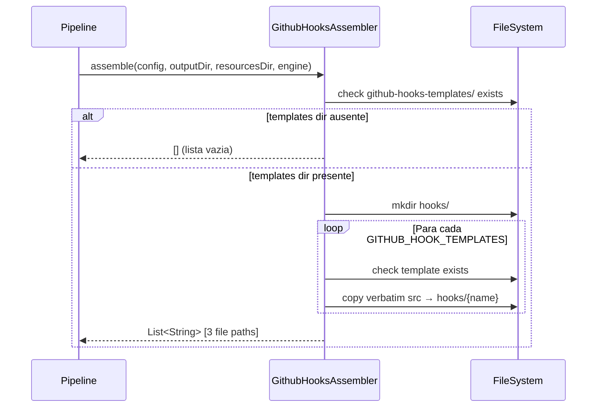
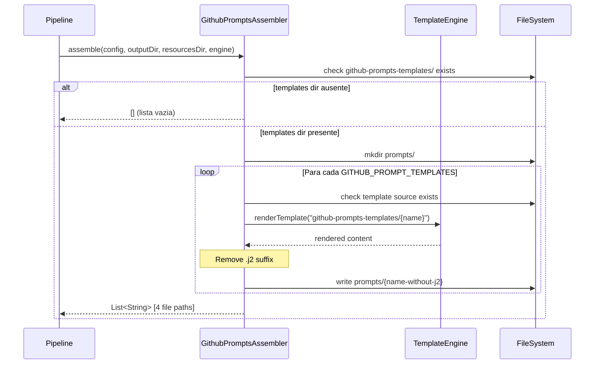

# Historia: GithubHooksAssembler e GithubPromptsAssembler

**ID:** story-0006-0017

## 1. Dependencias

| Blocked By | Blocks |
| :--- | :--- |
| story-0006-0008, story-0006-0009 | story-0006-0027 |

## 2. Regras Transversais Aplicaveis

| ID | Titulo |
| :--- | :--- |
| RULE-001 | Paridade Byte-a-Byte |
| RULE-004 | Interface Assembler Uniforme |
| RULE-005 | Ordem de Execucao Pipeline |

## 3. Descricao

Como **Desenvolvedor Java**, eu quero portar `github-hooks-assembler.ts` (47 linhas) e
`github-prompts-assembler.ts` (52 linhas) para Java 21, garantindo que hooks JSON e prompt
templates para GitHub Copilot sejam gerados com paridade byte-a-byte em relacao a versao TypeScript.

GithubHooksAssembler gera `.github/hooks/` com hooks JSON para GitHub Copilot, definindo automacoes
baseadas em eventos. Os arquivos sao copiados **verbatim** dos templates — nenhuma renderizacao de
template ou placeholder replacement e aplicada. O assembler aceita o parametro `engine` por
uniformidade de API mas nao o utiliza. Os 3 hook templates sao: `post-compile-check.json`,
`pre-commit-lint.json` e `session-context-loader.json`. Se o diretorio de templates nao existir,
retorna lista vazia (graceful no-op).

GithubPromptsAssembler gera `.github/prompts/` com prompt templates no formato `.prompt.md`. Este
e o unico assembler GitHub que usa renderizacao **completa** via `TemplateEngine.renderTemplate()`
(Nunjucks/Pebble), nao apenas placeholder replacement. Os 4 prompt templates sao:
`new-feature.prompt.md.j2`, `decompose-spec.prompt.md.j2`, `code-review.prompt.md.j2` e
`troubleshoot.prompt.md.j2`. O sufixo `.j2` e removido no output (ex: `new-feature.prompt.md`).
Se o diretorio de templates nao existir, retorna lista vazia.

### 3.1 GithubHooksAssembler

- Constante `GITHUB_HOOK_TEMPLATES`: lista fixa de 3 nomes de arquivos JSON
- Templates residem em `resources/github-hooks-templates/`
- Copia verbatim (sem template rendering): `Files.copy(src, dest)`
- Cria diretorio `hooks/` dentro do outputDir
- Graceful no-op: se `srcDir` nao existe, retorna `[]`
- Para cada template: se arquivo fonte nao existe, skip (continue)

### 3.2 GithubPromptsAssembler

- Constante `GITHUB_PROMPT_TEMPLATES`: lista fixa de 4 nomes de templates `.j2`
- Templates residem em `resources/github-prompts-templates/`
- Usa `engine.renderTemplate("github-prompts-templates/{name}")` para renderizacao completa com contexto Nunjucks/Pebble
- Remove sufixo `.j2` para gerar nome de output: `templateName.replace(".j2", "")`
- Cria diretorio `prompts/` dentro do outputDir
- Graceful no-op: se `srcDir` nao existe, retorna `[]`

### 3.3 Estrutura de Classes Java

```
src/main/java/com/iadevenv/assembler/
├── GithubHooksAssembler.java     # implements Assembler (copia verbatim)
└── GithubPromptsAssembler.java   # implements Assembler (renderizacao Pebble)
```

## 4. Definicoes de Qualidade Locais

### DoR Local (Definition of Ready)

- [ ] Interface `Assembler` implementada e disponivel (story-0006-0009)
- [ ] `TemplateEngine` com `renderTemplate()` funcional (story-0006-0006)
- [ ] Templates `github-hooks-templates/` e `github-prompts-templates/` no classpath (story-0006-0004)
- [ ] Modelos `ProjectConfig` disponiveis (story-0006-0002)

### DoD Local (Definition of Done)

- [ ] `GithubHooksAssembler` copia 3 hook JSON files verbatim
- [ ] `GithubHooksAssembler` nao usa TemplateEngine (copia pura)
- [ ] `GithubPromptsAssembler` renderiza 4 prompt templates com Pebble
- [ ] Prompt output remove sufixo `.j2` do nome
- [ ] Ambos assemblers retornam lista vazia quando templates ausentes
- [ ] Output identico ao golden file para python-click-cli profile
- [ ] Javadoc em classes e metodos publicos

### Global Definition of Done (DoD)

- **Cobertura:** ≥ 95% Line Coverage, ≥ 90% Branch Coverage (JaCoCo)
- **Testes Automatizados:** Unitarios (JUnit 5 + AssertJ), integracao, golden file
- **Relatorio de Cobertura:** JaCoCo HTML + XML
- **Documentacao:** Javadoc em classes publicas
- **Performance:** Geracao completa < 2s
- **TDD Compliance:** Test-first, refactoring explicito, TPP incremental

## 5. Contratos de Dados (Data Contract)

**GithubHooksAssembler output:**

| Artefato | Caminho | Tipo | Renderizacao |
| :--- | :--- | :--- | :--- |
| Post-compile check | `.github/hooks/post-compile-check.json` | JSON | Copia verbatim |
| Pre-commit lint | `.github/hooks/pre-commit-lint.json` | JSON | Copia verbatim |
| Session context loader | `.github/hooks/session-context-loader.json` | JSON | Copia verbatim |

**Estrutura de Hook JSON:**

```json
{
  "event": "PostToolUse",
  "script": "./hooks/post-compile-check.sh",
  "match": "*.ts"
}
```

**GithubPromptsAssembler output:**

| Artefato | Caminho | Template Fonte | Renderizacao |
| :--- | :--- | :--- | :--- |
| New feature | `.github/prompts/new-feature.prompt.md` | `new-feature.prompt.md.j2` | Pebble (full) |
| Decompose spec | `.github/prompts/decompose-spec.prompt.md` | `decompose-spec.prompt.md.j2` | Pebble (full) |
| Code review | `.github/prompts/code-review.prompt.md` | `code-review.prompt.md.j2` | Pebble (full) |
| Troubleshoot | `.github/prompts/troubleshoot.prompt.md` | `troubleshoot.prompt.md.j2` | Pebble (full) |

**Estrutura de Prompt:**

```markdown
---
mode: agent
description: "Prompt description"
---
# Prompt Title

Content with {{ project_name }} variables resolved by Pebble.
```

## 6. Diagramas

### 6.1 Fluxo GithubHooksAssembler



### 6.2 Fluxo GithubPromptsAssembler



## 7. Criterios de Aceite (Gherkin)

```gherkin
Cenario: Gera hook JSON files validos
  DADO que os 3 templates JSON existem em resources/github-hooks-templates/
  QUANDO GithubHooksAssembler.assemble() e executado
  ENTAO 3 arquivos JSON sao gerados em ".github/hooks/"
  E os arquivos sao: post-compile-check.json, pre-commit-lint.json, session-context-loader.json
  E cada arquivo e uma copia verbatim do template (conteudo identico)

Cenario: Hooks referenciam scripts corretos para o build tool
  DADO que o template post-compile-check.json contem referencia ao script de compilacao
  QUANDO GithubHooksAssembler.assemble() e executado
  ENTAO o conteudo do JSON copiado e identico ao template original
  E o assembler NAO aplica nenhuma transformacao de template (copia pura)
  E o parametro engine NAO e utilizado

Cenario: Gera prompt templates com frontmatter
  DADO que os 4 templates .j2 existem em resources/github-prompts-templates/
  E o TemplateEngine esta configurado com contexto do projeto
  QUANDO GithubPromptsAssembler.assemble() e executado
  ENTAO 4 arquivos .prompt.md sao gerados em ".github/prompts/"
  E os arquivos sao: new-feature.prompt.md, decompose-spec.prompt.md, code-review.prompt.md, troubleshoot.prompt.md
  E o sufixo ".j2" e removido do nome de cada arquivo

Cenario: Prompts contem variaveis do projeto
  DADO que config.project.name="api-pagamentos" e language.name="java"
  E os templates .j2 contem variaveis Nunjucks/Pebble como {{ project_name }}
  QUANDO GithubPromptsAssembler.assemble() e executado
  ENTAO os prompts gerados contem "api-pagamentos" no lugar de {{ project_name }}
  E os prompts gerados contem "java" no lugar de {{ language_name }}
  E nenhuma variavel {{ }} nao resolvida permanece no output

Cenario: Output identico ao golden file para python-click-cli
  DADO que o ProjectConfig e carregado a partir do perfil bundled "python-click-cli"
  QUANDO GithubHooksAssembler.assemble() e GithubPromptsAssembler.assemble() sao executados
  ENTAO os arquivos gerados sao byte-a-byte identicos aos golden files de referencia
  E nenhuma diferenca de whitespace, line ending ou ordenacao e detectada
```

### 7.1 Scenario Ordering (TPP)

> Scenarios seguem TPP: geracao basica (hook JSON files) → comportamento especifico (copia verbatim, sem engine) → geracao com renderizacao (prompts com frontmatter) → conteudo variavel (variaveis do projeto) → paridade completa (golden file).

### 7.2 Mandatory Scenario Categories

- [x] Degenerate cases (diretorio de templates ausente → lista vazia)
- [x] Happy path (geracao de hooks, geracao de prompts)
- [x] Error paths (template individual ausente → skip)
- [x] Boundary values (copia verbatim vs renderizacao, golden file byte-a-byte)

### 7.3 TDD Implementation Notes

**Outer loop (acceptance):** Golden file test comparando output completo para python-click-cli. Hooks devem ser copia exata, prompts devem ter variaveis resolvidas.

**Inner loop (unit):**
1. `GithubHooksAssembler.assemble()` — verificar que 3 arquivos sao copiados, conteudo identico ao fonte
2. `GithubHooksAssembler` com diretorio ausente — verificar retorno de lista vazia
3. `GithubPromptsAssembler.assemble()` — verificar que 4 arquivos sao renderizados com Pebble
4. `GithubPromptsAssembler` — verificar remocao do sufixo `.j2` no nome do output
5. `GithubPromptsAssembler` — verificar que `renderTemplate()` e chamado (nao `replacePlaceholders()`)

## 8. Sub-tarefas

- [ ] [Dev] GithubHooksAssembler.java com GITHUB_HOOK_TEMPLATES e copia verbatim
- [ ] [Dev] GithubHooksAssembler: graceful no-op quando templates ausentes
- [ ] [Dev] GithubPromptsAssembler.java com GITHUB_PROMPT_TEMPLATES e renderizacao Pebble
- [ ] [Dev] GithubPromptsAssembler: remocao de sufixo .j2 e escrita em prompts/
- [ ] [Test] Unitario: GithubHooksAssembler — 3 hook JSON files copiados verbatim
- [ ] [Test] Unitario: GithubHooksAssembler — no-op quando diretorio ausente
- [ ] [Test] Unitario: GithubHooksAssembler — skip de template individual ausente
- [ ] [Test] Unitario: GithubPromptsAssembler — 4 prompts renderizados com Pebble
- [ ] [Test] Unitario: GithubPromptsAssembler — sufixo .j2 removido dos nomes
- [ ] [Test] Unitario: GithubPromptsAssembler — variaveis de projeto resolvidas no output
- [ ] [Test] Golden file: comparacao byte-a-byte do output para python-click-cli profile
- [ ] [Doc] Javadoc em GithubHooksAssembler e GithubPromptsAssembler
