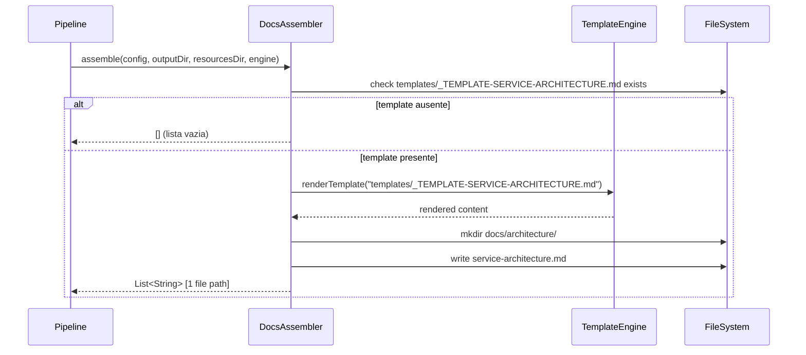
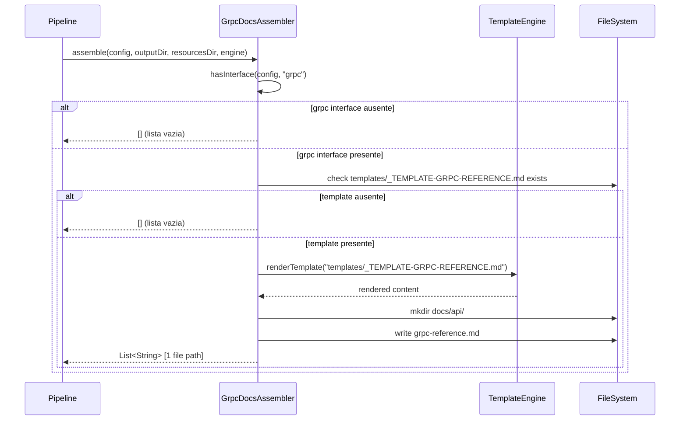

# Historia: DocsAssembler e GrpcDocsAssembler

**ID:** story-0006-0018

## 1. Dependencias

| Blocked By | Blocks |
| :--- | :--- |
| story-0006-0008, story-0006-0009 | story-0006-0027 |

## 2. Regras Transversais Aplicaveis

| ID | Titulo |
| :--- | :--- |
| RULE-001 | Paridade Byte-a-Byte |
| RULE-004 | Interface Assembler Uniforme |
| RULE-005 | Ordem de Execucao Pipeline |

## 3. Descricao

Como **Desenvolvedor Java**, eu quero portar `docs-assembler.ts` (39 linhas) e
`grpc-docs-assembler.ts` (46 linhas) para Java 21, garantindo que a documentacao do projeto
e documentacao gRPC sejam geradas com paridade byte-a-byte em relacao a versao TypeScript.

DocsAssembler gera `docs/architecture/service-architecture.md` a partir do template Nunjucks
`templates/_TEMPLATE-SERVICE-ARCHITECTURE.md`. O assembler usa renderizacao completa via
`TemplateEngine.renderTemplate()` para resolver variaveis do contexto do projeto (nome, linguagem,
framework, arquitetura). Se o template nao existir no classpath, retorna lista vazia (graceful
no-op), garantindo backward compatibility.

GrpcDocsAssembler gera `docs/api/grpc-reference.md` a partir do template Nunjucks
`templates/_TEMPLATE-GRPC-REFERENCE.md`. Este assembler e **interface-aware**: so gera output
quando o ProjectConfig contem uma interface do tipo `grpc`. Caso contrario, retorna lista vazia
imediatamente. Se a interface grpc esta presente mas o template nao existe, tambem retorna lista
vazia (double graceful no-op). A verificacao de interface usa o helper `hasInterface(config, "grpc")`.

### 3.1 DocsAssembler

- Template: `templates/_TEMPLATE-SERVICE-ARCHITECTURE.md` (Nunjucks/Pebble)
- Output: `docs/architecture/service-architecture.md`
- Usa `engine.renderTemplate(TEMPLATE_PATH)` para renderizacao completa
- Cria diretorio `docs/architecture/` se nao existir
- Graceful no-op: se template ausente, retorna `[]`

### 3.2 GrpcDocsAssembler

- Condicao de ativacao: `hasInterface(config, "grpc")` retorna true
- Template: `templates/_TEMPLATE-GRPC-REFERENCE.md` (Nunjucks/Pebble)
- Output: `docs/api/grpc-reference.md`
- Usa `engine.renderTemplate(TEMPLATE_PATH)` para renderizacao completa
- Cria diretorio `docs/api/` se nao existir
- Double graceful no-op: primeiro verifica interface, depois verifica template
- Helper `hasInterface()` verifica se `config.interfaces` contem entrada com `type == "grpc"`

### 3.3 Estrutura de Classes Java

```
src/main/java/com/iadevenv/assembler/
├── DocsAssembler.java       # implements Assembler
└── GrpcDocsAssembler.java   # implements Assembler (interface-aware)
```

## 4. Definicoes de Qualidade Locais

### DoR Local (Definition of Ready)

- [ ] Interface `Assembler` implementada e disponivel (story-0006-0009)
- [ ] `TemplateEngine` com `renderTemplate()` funcional (story-0006-0006)
- [ ] Helper `hasInterface()` portado (story-0006-0009)
- [ ] Templates `_TEMPLATE-SERVICE-ARCHITECTURE.md` e `_TEMPLATE-GRPC-REFERENCE.md` no classpath (story-0006-0004)
- [ ] Modelos `ProjectConfig`, `InterfaceConfig` disponiveis (story-0006-0002)

### DoD Local (Definition of Done)

- [ ] `DocsAssembler` gera `service-architecture.md` via Pebble rendering
- [ ] `DocsAssembler` retorna lista vazia quando template ausente
- [ ] `GrpcDocsAssembler` gera `grpc-reference.md` quando interface grpc presente
- [ ] `GrpcDocsAssembler` retorna lista vazia quando interface grpc ausente
- [ ] `GrpcDocsAssembler` retorna lista vazia quando template ausente (mesmo com grpc)
- [ ] Output identico ao golden file para java-quarkus profile
- [ ] Javadoc em classes e metodos publicos

### Global Definition of Done (DoD)

- **Cobertura:** ≥ 95% Line Coverage, ≥ 90% Branch Coverage (JaCoCo)
- **Testes Automatizados:** Unitarios (JUnit 5 + AssertJ), integracao, golden file
- **Relatorio de Cobertura:** JaCoCo HTML + XML
- **Documentacao:** Javadoc em classes publicas
- **Performance:** Geracao completa < 2s
- **TDD Compliance:** Test-first, refactoring explicito, TPP incremental

## 5. Contratos de Dados (Data Contract)

**DocsAssembler output:**

| Artefato | Caminho | Template Fonte | Renderizacao |
| :--- | :--- | :--- | :--- |
| Service architecture | `docs/architecture/service-architecture.md` | `templates/_TEMPLATE-SERVICE-ARCHITECTURE.md` | Pebble (full) |

**GrpcDocsAssembler output:**

| Artefato | Caminho | Template Fonte | Condicao |
| :--- | :--- | :--- | :--- |
| gRPC reference | `docs/api/grpc-reference.md` | `templates/_TEMPLATE-GRPC-REFERENCE.md` | hasInterface(config, "grpc") == true |

**Variaveis de template utilizadas (contexto Pebble):**

| Variavel | Exemplo | Descricao |
| :--- | :--- | :--- |
| `project_name` | "api-pagamentos" | Nome do projeto |
| `language_name` | "java" | Linguagem de programacao |
| `language_version` | "21" | Versao da linguagem |
| `framework_name` | "quarkus" | Framework principal |
| `architecture_style` | "hexagonal" | Estilo de arquitetura |
| `has_grpc` | true/false | Se projeto tem interface gRPC |

## 6. Diagramas

### 6.1 Fluxo DocsAssembler



### 6.2 Fluxo GrpcDocsAssembler



## 7. Criterios de Aceite (Gherkin)

```gherkin
Cenario: Gera templates de documentacao
  DADO que o template "_TEMPLATE-SERVICE-ARCHITECTURE.md" existe em resources/templates/
  E o TemplateEngine esta configurado com contexto do projeto
  QUANDO DocsAssembler.assemble() e executado
  ENTAO o arquivo "docs/architecture/service-architecture.md" e gerado
  E o conteudo contem informacoes do projeto renderizadas pelo Pebble

Cenario: Templates contem placeholders do projeto
  DADO que config.project.name="api-pagamentos" e config.language.name="java"
  E config.framework.name="quarkus" e config.architecture.style="hexagonal"
  QUANDO DocsAssembler.assemble() e executado
  ENTAO o output contem "api-pagamentos" como nome do projeto
  E o output contem "java" como linguagem
  E o output contem "quarkus" como framework
  E nenhuma variavel Pebble nao resolvida permanece no output

Cenario: Gera docs gRPC quando interface grpc presente
  DADO que config.interfaces contem uma entrada com type="grpc"
  E o template "_TEMPLATE-GRPC-REFERENCE.md" existe em resources/templates/
  QUANDO GrpcDocsAssembler.assemble() e executado
  ENTAO o arquivo "docs/api/grpc-reference.md" e gerado
  E o conteudo contem referencia de servicos gRPC do projeto

Cenario: Nao gera docs gRPC quando interface grpc ausente
  DADO que config.interfaces contem apenas entries com type="rest"
  E nenhuma interface type="grpc" esta configurada
  QUANDO GrpcDocsAssembler.assemble() e executado
  ENTAO nenhum arquivo e gerado
  E o resultado e uma lista vazia

Cenario: gRPC reference contem detalhes do framework
  DADO que config.framework.name="quarkus" e interfaces contem type="grpc"
  E o template gRPC contem variaveis Pebble para framework
  QUANDO GrpcDocsAssembler.assemble() e executado
  ENTAO o output contem informacoes especificas de Quarkus para gRPC
  E o output contem instrucoes de configuracao para o framework

Cenario: Output identico ao golden file para java-quarkus
  DADO que o ProjectConfig e carregado a partir do perfil bundled "java-quarkus"
  QUANDO DocsAssembler.assemble() e GrpcDocsAssembler.assemble() sao executados
  ENTAO os arquivos gerados sao byte-a-byte identicos aos golden files de referencia
  E nenhuma diferenca de whitespace, line ending ou ordenacao e detectada
```

### 7.1 Scenario Ordering (TPP)

> Scenarios seguem TPP: geracao basica (service-architecture.md) → conteudo especifico (placeholders do projeto) → condicional positivo (gRPC presente) → condicional negativo (gRPC ausente) → detalhe de conteudo (framework-specific gRPC) → paridade completa (golden file).

### 7.2 Mandatory Scenario Categories

- [x] Degenerate cases (template ausente → lista vazia, interface ausente → lista vazia)
- [x] Happy path (geracao de docs, geracao de gRPC docs)
- [x] Error paths (double graceful no-op: interface presente mas template ausente)
- [x] Boundary values (golden file byte-a-byte, conteudo framework-specific)

### 7.3 TDD Implementation Notes

**Outer loop (acceptance):** Golden file test comparando output para java-quarkus. O perfil java-quarkus inclui interface gRPC, validando ambos assemblers.

**Inner loop (unit):**
1. `DocsAssembler.assemble()` — verificar geracao de service-architecture.md com Pebble rendering
2. `DocsAssembler` com template ausente — verificar retorno de lista vazia
3. `GrpcDocsAssembler.assemble()` com grpc — verificar geracao de grpc-reference.md
4. `GrpcDocsAssembler.assemble()` sem grpc — verificar retorno de lista vazia (sem I/O)
5. `GrpcDocsAssembler` com grpc mas template ausente — verificar retorno de lista vazia
6. `hasInterface()` helper — testar com diferentes combinacoes de interfaces

## 8. Sub-tarefas

- [ ] [Dev] DocsAssembler.java com renderizacao de _TEMPLATE-SERVICE-ARCHITECTURE.md via Pebble
- [ ] [Dev] DocsAssembler: graceful no-op quando template ausente
- [ ] [Dev] GrpcDocsAssembler.java com verificacao de interface grpc via hasInterface()
- [ ] [Dev] GrpcDocsAssembler: double graceful no-op (interface check + template check)
- [ ] [Test] Unitario: DocsAssembler — geracao de service-architecture.md
- [ ] [Test] Unitario: DocsAssembler — no-op quando template ausente
- [ ] [Test] Unitario: GrpcDocsAssembler — geracao quando interface grpc presente
- [ ] [Test] Unitario: GrpcDocsAssembler — no-op quando interface grpc ausente
- [ ] [Test] Unitario: GrpcDocsAssembler — no-op quando template ausente (com grpc)
- [ ] [Test] Golden file: comparacao byte-a-byte do output para java-quarkus profile
- [ ] [Doc] Javadoc em DocsAssembler e GrpcDocsAssembler
