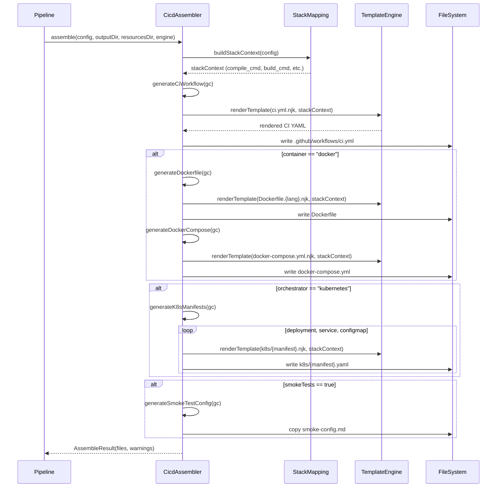
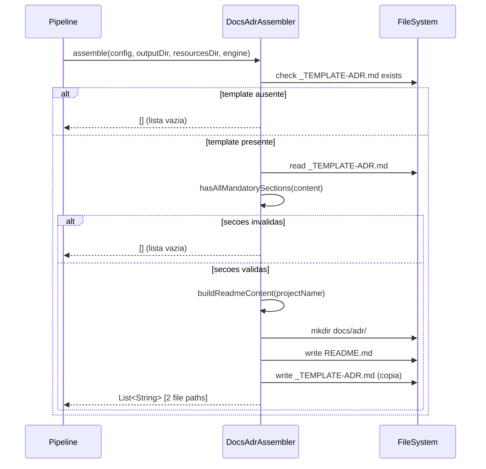

# Historia: RunbookAssembler, DocsAdrAssembler e CicdAssembler

**ID:** story-0006-0019

## 1. Dependencias

| Blocked By | Blocks |
| :--- | :--- |
| story-0006-0008, story-0006-0009 | story-0006-0027 |

## 2. Regras Transversais Aplicaveis

| ID | Titulo |
| :--- | :--- |
| RULE-001 | Paridade Byte-a-Byte |
| RULE-004 | Interface Assembler Uniforme |
| RULE-005 | Ordem de Execucao Pipeline |

## 3. Descricao

Como **Desenvolvedor Java**, eu quero portar `runbook-assembler.ts` (39 linhas),
`docs-adr-assembler.ts` (126 linhas) e `cicd-assembler.ts` (220 linhas) para Java 21,
garantindo que runbook, ADRs e pipelines CI/CD sejam gerados com paridade byte-a-byte em
relacao a versao TypeScript.

RunbookAssembler gera `docs/runbook/deploy-runbook.md` a partir do template Nunjucks
`templates/_TEMPLATE-DEPLOY-RUNBOOK.md`. O runbook contem procedimentos de deploy, rollback,
health checks e troubleshooting com secoes condicionais para Docker, Kubernetes e database
migration. Usa renderizacao completa via `TemplateEngine.renderTemplate()`.

DocsAdrAssembler gera `docs/adr/` com dois artefatos: (1) `README.md` como indice de ADRs
construido programaticamente com nome do projeto, tabela de ADRs vazia e instrucoes de criacao;
(2) `_TEMPLATE-ADR.md` copiado verbatim do resources. O assembler valida que o template ADR
contem as 4 secoes obrigatorias (Status, Context, Decision, Consequences) antes de copiar.
Exporta tambem utilitarios `getNextAdrNumber(adrDir)` e `formatAdrFilename(num, title)` para
uso downstream.

CicdAssembler e o mais complexo dos tres: gera artefatos CI/CD condicionalmente baseados no
ProjectConfig. Produz ate 5 tipos de artefatos: (1) CI workflow (`.github/workflows/ci.yml`) —
sempre gerado; (2) Dockerfile — condicional em `container == "docker"`; (3) docker-compose.yml —
condicional em `container == "docker"`; (4) K8s manifests (deployment.yaml, service.yaml,
configmap.yaml) — condicional em `orchestrator == "kubernetes"`; (5) smoke test config —
condicional em `smokeTests == true`. Usa `buildStackContext()` para resolver comandos especificos
do stack (compile, build, test, coverage, lint) a partir dos mapeamentos de `StackMapping`.

### 3.1 RunbookAssembler

- Template: `templates/_TEMPLATE-DEPLOY-RUNBOOK.md` (Nunjucks/Pebble)
- Output: `docs/runbook/deploy-runbook.md`
- Usa `engine.renderTemplate(TEMPLATE_RELATIVE_PATH)` com contexto completo
- Graceful no-op: se template ausente, retorna `[]`

### 3.2 DocsAdrAssembler

- Metodo `buildReadmeContent(projectName)`: constroi markdown do README.md com:
  - Titulo "# Architecture Decision Records"
  - Citacao com nome do projeto
  - Tabela vazia (ID, Title, Status, Date)
  - Instrucoes de criacao
- Metodo `hasAllMandatorySections(templateContent)`: valida presenca de `## Status`, `## Context`, `## Decision`, `## Consequences`
- Se template nao existe OU nao contem secoes obrigatorias → retorna `[]`
- Utilitarios exportados:
  - `getNextAdrNumber(adrDir)`: scan de arquivos `ADR-NNNN-*.md`, retorna max+1 (ou 1 se vazio)
  - `formatAdrFilename(num, title)`: gera `ADR-NNNN-title-in-kebab-case.md` com padding de 4 digitos

### 3.3 CicdAssembler

- Metodo `buildStackContext(ProjectConfig)`: constroi contexto de template com:
  - `compile_cmd`, `build_cmd`, `test_cmd`, `coverage_cmd` (de `LANGUAGE_COMMANDS`)
  - `lint_cmd` (de `LINT_COMMANDS`, mapa de `langKey → command`)
  - `file_extension`, `build_file`, `package_manager` (de `LANGUAGE_COMMANDS`)
  - `framework_port` (de `FRAMEWORK_PORTS`), `health_path` (de `FRAMEWORK_HEALTH_PATHS`)
  - `docker_base_image` (de `DOCKER_BASE_IMAGES` com replace de `{version}`)
  - `container` (do config)
- `GenerationContext` record interno: agrupa config, outputDir, resourcesDir, engine, ctx, files, warnings
- 5 metodos de geracao privados: `generateCiWorkflow()`, `generateDockerfile()`, `generateDockerCompose()`, `generateK8sManifests()`, `generateSmokeTestConfig()`
- `LINT_COMMANDS` mapa: java-maven → `./mvnw checkstyle:check`, typescript-npm → `npm run lint`, python-pip → `ruff check .`, go-go → `golangci-lint run`, rust-cargo → `cargo clippy -- -D warnings`
- Retorna `AssembleResult` com files e warnings (warnings para artefatos skippados)

### 3.4 Estrutura de Classes Java

```
src/main/java/com/iadevenv/assembler/
├── RunbookAssembler.java      # implements Assembler
├── DocsAdrAssembler.java      # implements Assembler + utilities
└── CicdAssembler.java         # implements Assembler, returns AssembleResult
```

## 4. Definicoes de Qualidade Locais

### DoR Local (Definition of Ready)

- [ ] Interface `Assembler` implementada e disponivel (story-0006-0009)
- [ ] `TemplateEngine` com `renderTemplate()` funcional (story-0006-0006)
- [ ] `StackMapping` com LANGUAGE_COMMANDS, FRAMEWORK_PORTS, DOCKER_BASE_IMAGES (story-0006-0008)
- [ ] Templates `_TEMPLATE-DEPLOY-RUNBOOK.md`, `_TEMPLATE-ADR.md`, cicd-templates/ no classpath (story-0006-0004)
- [ ] `AssembleResult` record disponivel (story-0006-0009)

### DoD Local (Definition of Done)

- [ ] `RunbookAssembler` gera deploy-runbook.md via Pebble rendering
- [ ] `DocsAdrAssembler` gera README.md e _TEMPLATE-ADR.md, valida secoes obrigatorias
- [ ] `DocsAdrAssembler` exporta getNextAdrNumber() e formatAdrFilename()
- [ ] `CicdAssembler` gera CI workflow sempre, Dockerfile/Compose condicionalmente (docker)
- [ ] `CicdAssembler` gera K8s manifests condicionalmente (kubernetes)
- [ ] `CicdAssembler` gera smoke test config condicionalmente (smokeTests=true)
- [ ] `CicdAssembler` usa LINT_COMMANDS correto para cada stack
- [ ] Output identico ao golden file para java-spring profile
- [ ] Javadoc em classes e metodos publicos

### Global Definition of Done (DoD)

- **Cobertura:** ≥ 95% Line Coverage, ≥ 90% Branch Coverage (JaCoCo)
- **Testes Automatizados:** Unitarios (JUnit 5 + AssertJ), integracao, golden file
- **Relatorio de Cobertura:** JaCoCo HTML + XML
- **Documentacao:** Javadoc em classes publicas
- **Performance:** Geracao completa < 2s
- **TDD Compliance:** Test-first, refactoring explicito, TPP incremental

## 5. Contratos de Dados (Data Contract)

**RunbookAssembler output:**

| Artefato | Caminho | Template Fonte | Renderizacao |
| :--- | :--- | :--- | :--- |
| Deploy runbook | `docs/runbook/deploy-runbook.md` | `templates/_TEMPLATE-DEPLOY-RUNBOOK.md` | Pebble (full) |

**DocsAdrAssembler output:**

| Artefato | Caminho | Construcao |
| :--- | :--- | :--- |
| ADR index | `docs/adr/README.md` | Programatico (buildReadmeContent) |
| ADR template | `docs/adr/_TEMPLATE-ADR.md` | Copia verbatim |

**Secoes obrigatorias do ADR template:**

| Secao | Validacao |
| :--- | :--- |
| `## Status` | Presente no template |
| `## Context` | Presente no template |
| `## Decision` | Presente no template |
| `## Consequences` | Presente no template |

**Utilitarios ADR exportados:**

| Metodo | Assinatura | Descricao |
| :--- | :--- | :--- |
| `getNextAdrNumber` | `(String adrDir): int` | Proximo numero sequencial (max existente +1) |
| `formatAdrFilename` | `(int num, String title): String` | `ADR-NNNN-title-kebab.md` |

**CicdAssembler output:**

| Artefato | Caminho | Condicao | Template |
| :--- | :--- | :--- | :--- |
| CI workflow | `.github/workflows/ci.yml` | Sempre | `cicd-templates/ci-workflow/ci.yml.njk` |
| Dockerfile | `Dockerfile` | container == "docker" | `cicd-templates/dockerfile/Dockerfile.{lang}-{buildTool}.njk` |
| Docker Compose | `docker-compose.yml` | container == "docker" | `cicd-templates/docker-compose/docker-compose.yml.njk` |
| K8s deployment | `k8s/deployment.yaml` | orchestrator == "kubernetes" | `cicd-templates/k8s/deployment.yaml.njk` |
| K8s service | `k8s/service.yaml` | orchestrator == "kubernetes" | `cicd-templates/k8s/service.yaml.njk` |
| K8s configmap | `k8s/configmap.yaml` | orchestrator == "kubernetes" | `cicd-templates/k8s/configmap.yaml.njk` |
| Smoke config | `tests/smoke/smoke-config.md` | smokeTests == true | `cicd-templates/smoke-tests/smoke-config.md` |

**Stack Context (buildStackContext):**

| Campo | Fonte | Exemplo (java-spring) |
| :--- | :--- | :--- |
| `compile_cmd` | LANGUAGE_COMMANDS | `./mvnw compile` |
| `build_cmd` | LANGUAGE_COMMANDS | `./mvnw package` |
| `test_cmd` | LANGUAGE_COMMANDS | `./mvnw test` |
| `coverage_cmd` | LANGUAGE_COMMANDS | `./mvnw verify` |
| `lint_cmd` | LINT_COMMANDS | `./mvnw checkstyle:check` |
| `framework_port` | FRAMEWORK_PORTS | `8080` |
| `health_path` | FRAMEWORK_HEALTH_PATHS | `/actuator/health` |
| `docker_base_image` | DOCKER_BASE_IMAGES | `eclipse-temurin:21-jre` |

## 6. Diagramas

### 6.1 Fluxo CicdAssembler



### 6.2 Fluxo DocsAdrAssembler



## 7. Criterios de Aceite (Gherkin)

```gherkin
Cenario: RUNBOOK.md contem comandos de build e test do stack
  DADO que o template "_TEMPLATE-DEPLOY-RUNBOOK.md" existe em resources/templates/
  E config.language.name="java" e config.framework.buildTool="maven"
  QUANDO RunbookAssembler.assemble() e executado
  ENTAO o arquivo "docs/runbook/deploy-runbook.md" e gerado
  E o conteudo contem comandos de build e test especificos para Java Maven
  E o conteudo contem secoes de deploy, rollback, health checks e troubleshooting

Cenario: ADR template segue formato padrao
  DADO que o template "_TEMPLATE-ADR.md" existe em resources/templates/
  E o template contem as secoes "## Status", "## Context", "## Decision", "## Consequences"
  QUANDO DocsAdrAssembler.assemble() e executado
  ENTAO o arquivo "docs/adr/_TEMPLATE-ADR.md" e copiado verbatim
  E o arquivo "docs/adr/README.md" e gerado com titulo "# Architecture Decision Records"
  E o README contem o nome do projeto e tabela de ADRs vazia

Cenario: CI workflow usa Maven para Java
  DADO que config.language.name="java" e config.framework.buildTool="maven"
  QUANDO CicdAssembler.assemble() e executado
  ENTAO o arquivo ".github/workflows/ci.yml" e gerado
  E o context de template contem compile_cmd com "./mvnw compile"
  E o context de template contem test_cmd com "./mvnw test"
  E o context de template contem lint_cmd com "./mvnw checkstyle:check"

Cenario: CI workflow usa npm para TypeScript
  DADO que config.language.name="typescript" e config.framework.buildTool="npm"
  QUANDO CicdAssembler.assemble() e executado
  ENTAO o arquivo ".github/workflows/ci.yml" e gerado
  E o context de template contem lint_cmd com "npm run lint"
  E o context de template contem test_cmd correspondente ao stack typescript-npm

Cenario: CD workflow so gerado quando container configurado
  DADO que config.infrastructure.container="docker"
  QUANDO CicdAssembler.assemble() e executado
  ENTAO o arquivo "Dockerfile" e gerado
  E o arquivo "docker-compose.yml" e gerado
  MAS quando config.infrastructure.container="none"
  ENTAO "Dockerfile" NAO e gerado
  E warnings contem "Dockerfile skipped: container is not docker"

Cenario: Output identico ao golden file para java-spring
  DADO que o ProjectConfig e carregado a partir do perfil bundled "java-spring"
  QUANDO RunbookAssembler, DocsAdrAssembler e CicdAssembler sao executados
  ENTAO os arquivos gerados sao byte-a-byte identicos aos golden files de referencia
  E nenhuma diferenca de whitespace, line ending ou ordenacao e detectada
```

### 7.1 Scenario Ordering (TPP)

> Scenarios seguem TPP: geracao basica (runbook) → formato padrao (ADR) → stack-specific (Maven) → stack-specific alternativo (npm) → condicional (container docker) → paridade completa (golden file).

### 7.2 Mandatory Scenario Categories

- [x] Degenerate cases (template ausente, secoes ADR invalidas, container=none)
- [x] Happy path (runbook, ADR, CI workflow)
- [x] Error paths (warnings para artefatos skippados, ADR sem secoes obrigatorias)
- [x] Boundary values (diferentes stacks, condicionais, golden file byte-a-byte)

### 7.3 TDD Implementation Notes

**Outer loop (acceptance):** Golden file test para java-spring. Este perfil exercita CI com Maven, Dockerfile, Docker Compose, K8s manifests e smoke tests.

**Inner loop (unit):**
1. `RunbookAssembler` — verificar geracao com Pebble rendering, no-op se template ausente
2. `DocsAdrAssembler` — verificar README.md programatico e copia do template
3. `hasAllMandatorySections()` — testar com template completo e incompleto
4. `getNextAdrNumber()` — testar com diretorio vazio (retorna 1), com ADR-0003 (retorna 4)
5. `formatAdrFilename()` — testar padding e kebab-case: `(1, "My Decision")` → `"ADR-0001-my-decision.md"`
6. `buildStackContext()` — verificar resolucao de comandos para java-maven e typescript-npm
7. `CicdAssembler` condicionais — testar cada condicao (docker, kubernetes, smokeTests)
8. `LINT_COMMANDS` — verificar mapeamento correto para cada stack key

## 8. Sub-tarefas

- [ ] [Dev] RunbookAssembler.java com renderizacao de _TEMPLATE-DEPLOY-RUNBOOK.md via Pebble
- [ ] [Dev] DocsAdrAssembler.java com buildReadmeContent(), hasAllMandatorySections()
- [ ] [Dev] DocsAdrAssembler: getNextAdrNumber() e formatAdrFilename() como metodos estaticos
- [ ] [Dev] CicdAssembler.java com buildStackContext() usando LANGUAGE_COMMANDS e LINT_COMMANDS
- [ ] [Dev] CicdAssembler: GenerationContext record, 5 metodos de geracao condicional
- [ ] [Dev] CicdAssembler: LINT_COMMANDS mapa com 8 entries (java-maven, java-gradle, kotlin-gradle, typescript-npm, python-pip, go-go, go-go-mod, rust-cargo)
- [ ] [Test] Unitario: RunbookAssembler — geracao e no-op
- [ ] [Test] Unitario: DocsAdrAssembler — README.md e template, validacao de secoes
- [ ] [Test] Unitario: getNextAdrNumber — diretorio vazio, com ADRs existentes
- [ ] [Test] Unitario: formatAdrFilename — padding, kebab-case, caracteres especiais
- [ ] [Test] Unitario: CicdAssembler — CI workflow sempre gerado
- [ ] [Test] Unitario: CicdAssembler — Dockerfile condicional (docker vs none)
- [ ] [Test] Unitario: CicdAssembler — K8s manifests condicional (kubernetes vs none)
- [ ] [Test] Unitario: buildStackContext — resolucao de comandos para diferentes stacks
- [ ] [Test] Golden file: comparacao byte-a-byte do output para java-spring profile
- [ ] [Doc] Javadoc em RunbookAssembler, DocsAdrAssembler e CicdAssembler
