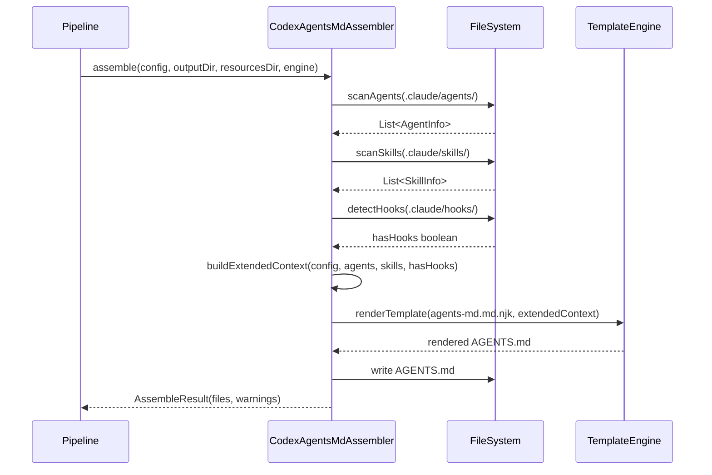
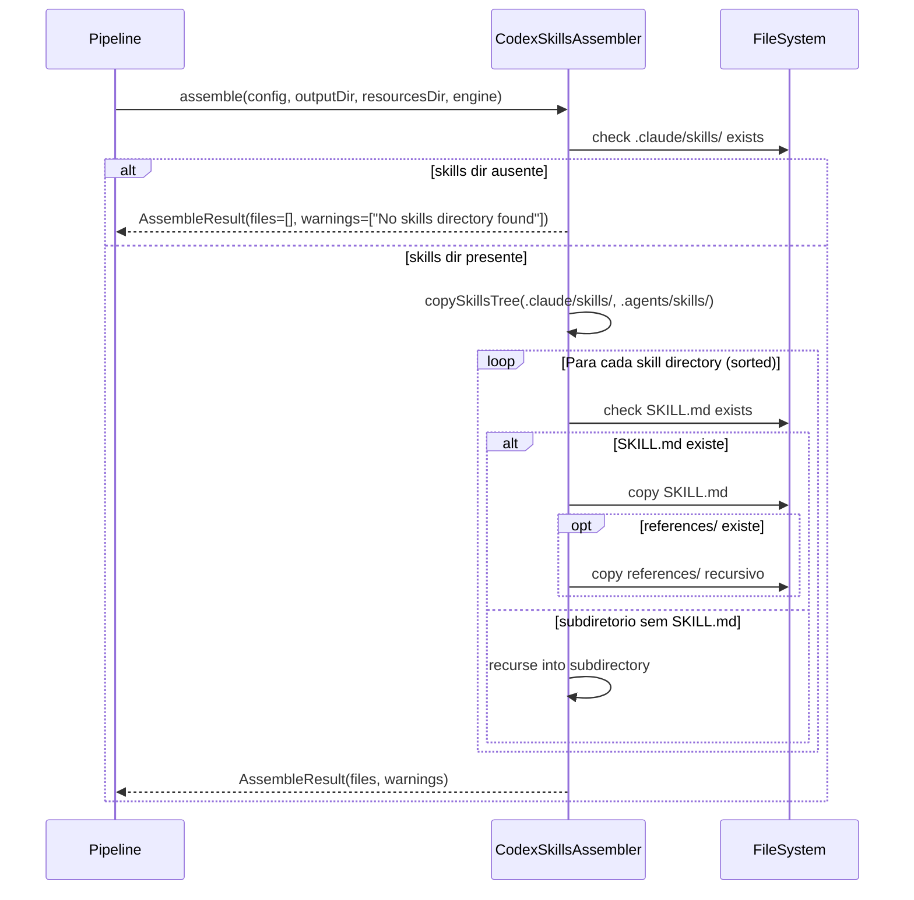

# Historia: Assemblers Codex (AGENTS.md, Config, Skills) e EpicReportAssembler

**ID:** story-0006-0020

## 1. Dependencias

| Blocked By | Blocks |
| :--- | :--- |
| story-0006-0008, story-0006-0009 | story-0006-0027 |

## 2. Regras Transversais Aplicaveis

| ID | Titulo |
| :--- | :--- |
| RULE-001 | Paridade Byte-a-Byte |
| RULE-004 | Interface Assembler Uniforme |
| RULE-005 | Ordem de Execucao Pipeline |

## 3. Descricao

Como **Desenvolvedor Java**, eu quero portar `codex-agents-md-assembler.ts` (245 linhas),
`codex-config-assembler.ts` (89 linhas), `codex-skills-assembler.ts` (114 linhas) e
`epic-report-assembler.ts` (73 linhas) para Java 21, garantindo que os artefatos Codex e o
template de epic report sejam gerados com paridade byte-a-byte em relacao a versao TypeScript.

CodexAgentsMdAssembler gera `AGENTS.md` na raiz do projeto, consolidando todos os agents em
formato OpenAI Codex. Opera em 3 fases: (1) coleta de contexto estendido via scan de agents,
skills e hooks ja gerados no diretorio `.claude/`; (2) construcao de contexto de rendering
mesclando os 25 campos do `buildDefaultContext()` com campos estendidos (resolved_stack,
agents_list, skills_list, has_hooks, mcp_servers, security_frameworks, model, approval_policy,
sandbox_mode); (3) renderizacao do template Nunjucks/Pebble `codex-templates/agents-md.md.njk`.

CodexConfigAssembler gera `.codex/config.toml` a partir do template Nunjucks
`codex-templates/config.toml.njk`. O assembler detecta hooks no diretorio `.claude/hooks/` para
derivar `approval_policy` e valida que IDs de MCP servers sao chaves TOML bare validas. O contexto
de template inclui model, approval_policy, sandbox_mode e mcp_servers.

CodexSkillsAssembler gera `.agents/skills/` copiando os skills ja gerados em `.claude/skills/`.
Nao usa templates — faz copia direta de `SKILL.md` e diretorio `references/` de cada skill.
Percorre a arvore de skills recursivamente para suportar subdiretorios nested.

EpicReportAssembler copia `_TEMPLATE-EPIC-EXECUTION-REPORT.md` verbatim para dois destinos:
`.claude/templates/` e `.github/templates/`. O template contem `{{PLACEHOLDER}}` tokens para
resolucao em runtime pelo subagent de consolidacao (NAO para build-time rendering). Valida que
o template contem 8 secoes obrigatorias antes de copiar.

### 3.1 CodexAgentsMdAssembler

- Interfaces auxiliares: `AgentInfo(name, description)`, `SkillInfo(name, description, userInvocable)`
- Metodo `scanAgents(agentsDir)`: le cada `.md` de agents/, extrai nome e descricao (primeira linha com `# `)
- Metodo `scanSkills(skillsDir)`: le cada `SKILL.md`, extrai frontmatter YAML com js-yaml/SnakeYAML
- Metodo `extractFrontmatterBlock(content)`: extrai bloco YAML entre `---` delimitadores
- Metodo `parseSkillFrontmatter(content, dirName)`: extrai name, description, user-invocable do YAML
- Metodo `buildExtendedContext(config, agents, skills, hasHooks)`: mescla 25 campos basicos + campos estendidos
- Template: `codex-templates/agents-md.md.njk`
- Output: `AGENTS.md` na raiz do outputDir
- Retorna `AssembleResult` com warnings (se nenhum agent ou skill encontrado)
- Funcoes compartilhadas de `codex-shared`: `DEFAULT_MODEL`, `SANDBOX_WORKSPACE_WRITE`, `isAccessibleDirectory()`, `detectHooks()`, `deriveApprovalPolicy()`, `mapMcpServers()`

### 3.2 CodexConfigAssembler

- Metodo `buildConfigContext(config, hasHooks)`: mescla buildDefaultContext + model, approval_policy, sandbox_mode, mcp_servers, has_mcp
- Valida IDs de MCP servers com `isValidTomlBareKey()` — emite warning se ID invalido
- Detecta hooks em `.claude/hooks/` para derivar approval_policy
- Template: `codex-templates/config.toml.njk`
- Output: `.codex/config.toml`
- Retorna `AssembleResult` com warnings

### 3.3 CodexSkillsAssembler

- Metodo `copySkillsTree(sourceDir, destDir)`: walk recursivo copiando cada skill subdirectory
- Metodo `copySkill(srcSkillDir, destSkillDir)`: copia SKILL.md + references/ (se existente)
- Metodo `collectFiles(dir)`: coleta recursiva de todos os file paths sob um diretorio
- Source: `.claude/skills/` (ja gerado por SkillsAssembler)
- Output: `.agents/skills/{name}/` com SKILL.md e references/
- Retorna `AssembleResult` com warnings se nenhum skill encontrado

### 3.4 EpicReportAssembler

- Template: `templates/_TEMPLATE-EPIC-EXECUTION-REPORT.md`
- Copia verbatim para 2 destinos: `.claude/templates/` e `.github/templates/`
- 8 secoes obrigatorias: Sumario Executivo, Timeline de Execucao, Status Final por Story, Findings Consolidados, Coverage Delta, Commits e SHAs, Issues Nao Resolvidos, PR Link
- Se template ausente ou secoes incompletas → retorna `[]`
- NAO usa TemplateEngine (tokens sao para runtime, nao build-time)

### 3.5 Estrutura de Classes Java

```
src/main/java/com/iadevenv/assembler/
├── CodexAgentsMdAssembler.java   # implements Assembler, returns AssembleResult
├── CodexConfigAssembler.java      # implements Assembler, returns AssembleResult
├── CodexSkillsAssembler.java      # implements Assembler, returns AssembleResult
├── CodexShared.java               # utilitarios compartilhados
└── EpicReportAssembler.java       # implements Assembler
```

## 4. Definicoes de Qualidade Locais

### DoR Local (Definition of Ready)

- [ ] Interface `Assembler` implementada e disponivel (story-0006-0009)
- [ ] `TemplateEngine` com `renderTemplate()` funcional (story-0006-0006)
- [ ] `buildDefaultContext()` disponivel no TemplateEngine (story-0006-0006)
- [ ] `resolveStack()` funcional (story-0006-0008)
- [ ] Templates Codex e epic report no classpath (story-0006-0004)
- [ ] Artefatos `.claude/` ja gerados pelos assemblers anteriores (pipeline order)
- [ ] SnakeYAML disponivel para parsing de frontmatter YAML

### DoD Local (Definition of Done)

- [ ] `CodexAgentsMdAssembler` gera AGENTS.md consolidando agents, skills, hooks
- [ ] `CodexConfigAssembler` gera config.toml com domain, architecture, MCP sections
- [ ] `CodexSkillsAssembler` copia skills de `.claude/` para `.agents/`
- [ ] `EpicReportAssembler` copia template para 2 destinos, valida secoes obrigatorias
- [ ] Warnings emitidos para agents/skills ausentes, TOML keys invalidas
- [ ] Output identico ao golden file para python-fastapi profile
- [ ] Javadoc em classes e metodos publicos

### Global Definition of Done (DoD)

- **Cobertura:** ≥ 95% Line Coverage, ≥ 90% Branch Coverage (JaCoCo)
- **Testes Automatizados:** Unitarios (JUnit 5 + AssertJ), integracao, golden file
- **Relatorio de Cobertura:** JaCoCo HTML + XML
- **Documentacao:** Javadoc em classes publicas
- **Performance:** Geracao completa < 2s
- **TDD Compliance:** Test-first, refactoring explicito, TPP incremental

## 5. Contratos de Dados (Data Contract)

**CodexAgentsMdAssembler output:**

| Artefato | Caminho | Construcao |
| :--- | :--- | :--- |
| AGENTS.md | `AGENTS.md` (raiz do outputDir) | Pebble rendering de `codex-templates/agents-md.md.njk` |

**Contexto estendido para AGENTS.md:**

| Campo | Tipo | Fonte |
| :--- | :--- | :--- |
| (25 campos basicos) | variados | `buildDefaultContext(config)` |
| `resolved_stack` | Map (buildCmd, testCmd, compileCmd, coverageCmd) | `resolveStack(config)` |
| `agents_list` | List<AgentInfo> | `scanAgents(.claude/agents/)` |
| `skills_list` | List<SkillInfo> | `scanSkills(.claude/skills/)` |
| `has_hooks` | boolean | `detectHooks(.claude/hooks/)` |
| `mcp_servers` | List<Map> | `mapMcpServers(config)` |
| `security_frameworks` | List<String> | `config.security.frameworks` |
| `model` | String | `DEFAULT_MODEL` (constante) |
| `approval_policy` | String | `deriveApprovalPolicy(hasHooks)` |
| `sandbox_mode` | String | `SANDBOX_WORKSPACE_WRITE` (constante) |

**AgentInfo record:**

| Campo | Tipo | Descricao |
| :--- | :--- | :--- |
| `name` | String | Nome do agent (sem extensao .md) |
| `description` | String | Primeira linha significativa do conteudo |

**SkillInfo record:**

| Campo | Tipo | Descricao |
| :--- | :--- | :--- |
| `name` | String | Nome do skill (do frontmatter ou diretorio) |
| `description` | String | Descricao (do frontmatter YAML) |
| `userInvocable` | boolean | Se o skill aparece no menu `/` |

**CodexConfigAssembler output:**

| Artefato | Caminho | Construcao |
| :--- | :--- | :--- |
| config.toml | `.codex/config.toml` | Pebble rendering de `codex-templates/config.toml.njk` |

**CodexSkillsAssembler output:**

| Artefato | Caminho | Construcao |
| :--- | :--- | :--- |
| Skills | `.agents/skills/{name}/SKILL.md` | Copia de `.claude/skills/` |
| References | `.agents/skills/{name}/references/` | Copia recursiva se existente |

**EpicReportAssembler output:**

| Artefato | Caminho | Construcao |
| :--- | :--- | :--- |
| Claude template | `.claude/templates/_TEMPLATE-EPIC-EXECUTION-REPORT.md` | Copia verbatim |
| GitHub template | `.github/templates/_TEMPLATE-EPIC-EXECUTION-REPORT.md` | Copia verbatim |

## 6. Diagramas

### 6.1 Fluxo CodexAgentsMdAssembler



### 6.2 Fluxo CodexSkillsAssembler



## 7. Criterios de Aceite (Gherkin)

```gherkin
Cenario: AGENTS.md consolida todos os agents
  DADO que os assemblers anteriores geraram 8 agents em .claude/agents/
  E 14 skills em .claude/skills/ (com knowledge packs)
  E hooks em .claude/hooks/
  QUANDO CodexAgentsMdAssembler.assemble() e executado
  ENTAO o arquivo "AGENTS.md" e gerado na raiz do outputDir
  E o conteudo contem a lista de todos os agents com nome e descricao
  E o conteudo contem a lista de skills com nome, descricao e user_invocable
  E o conteudo contem informacoes de hooks e MCP servers

Cenario: config.toml contem domain e architecture sections
  DADO que config.project.name="api-pagamentos" e architecture.style="hexagonal"
  E config.mcp.servers contem um servidor configurado
  QUANDO CodexConfigAssembler.assemble() e executado
  ENTAO o arquivo ".codex/config.toml" e gerado
  E o conteudo e TOML valido
  E o conteudo contem model, approval_policy e sandbox_mode
  E o conteudo contem secao de MCP servers

Cenario: .agents/ skills espelham .claude/ skills
  DADO que SkillsAssembler ja gerou 14 skills em .claude/skills/
  E alguns skills tem diretorio references/ com arquivos
  QUANDO CodexSkillsAssembler.assemble() e executado
  ENTAO cada skill de .claude/skills/ e copiado para .agents/skills/
  E SKILL.md e copiado para cada skill
  E references/ e copiado recursivamente quando presente
  E a estrutura de subdiretorios e preservada

Cenario: Epic report template contem metricas placeholders
  DADO que o template "_TEMPLATE-EPIC-EXECUTION-REPORT.md" existe em resources/templates/
  E o template contem as 8 secoes obrigatorias
  QUANDO EpicReportAssembler.assemble() e executado
  ENTAO o template e copiado para ".claude/templates/" e ".github/templates/"
  E o conteudo e identico ao original (copia verbatim, sem rendering)
  E tokens {{PLACEHOLDER}} sao preservados para resolucao em runtime

Cenario: config.toml e TOML valido
  DADO que CodexConfigAssembler.assemble() e executado com um ProjectConfig valido
  QUANDO o arquivo ".codex/config.toml" e gerado
  ENTAO o conteudo e um TOML valido parseable por um parser TOML padrao
  E chaves bare de MCP servers sao validadas
  E warnings sao emitidos para server IDs com caracteres invalidos para TOML

Cenario: Output identico ao golden file para python-fastapi
  DADO que o ProjectConfig e carregado a partir do perfil bundled "python-fastapi"
  QUANDO CodexAgentsMdAssembler, CodexConfigAssembler, CodexSkillsAssembler e EpicReportAssembler sao executados
  ENTAO os arquivos gerados sao byte-a-byte identicos aos golden files de referencia
  E nenhuma diferenca de whitespace, line ending ou ordenacao e detectada
```

### 7.1 Scenario Ordering (TPP)

> Scenarios seguem TPP: consolidacao basica (AGENTS.md) → conteudo especifico (config.toml) → copia de arvore (.agents/) → copia simples (epic report) → validacao de formato (TOML) → paridade completa (golden file).

### 7.2 Mandatory Scenario Categories

- [x] Degenerate cases (nenhum agent/skill encontrado gera warning, template ausente)
- [x] Happy path (AGENTS.md, config.toml, skills copy, epic report)
- [x] Error paths (TOML key invalida gera warning, secoes obrigatorias ausentes)
- [x] Boundary values (golden file byte-a-byte, TOML valido, preservacao de {{}} tokens)

### 7.3 TDD Implementation Notes

**Outer loop (acceptance):** Golden file test para python-fastapi. Validar AGENTS.md, config.toml, .agents/skills/, e epic report templates.

**Inner loop (unit):**
1. `scanAgents()` — testar com diretorio contendo .md files, verificar extraccao de descricao
2. `scanSkills()` — testar com skills com e sem frontmatter YAML
3. `extractFrontmatterBlock()` — testar com YAML valido, sem frontmatter, frontmatter incompleto
4. `parseSkillFrontmatter()` — testar extraccao de name, description, user-invocable
5. `buildExtendedContext()` — verificar merge dos 25 campos + campos estendidos
6. `buildConfigContext()` — verificar derivacao de model, approval_policy, sandbox_mode
7. `isValidTomlBareKey()` — testar com keys validas e invalidas
8. `copySkillsTree()` — testar copia recursiva com skills nested
9. `EpicReportAssembler` — verificar copia para 2 destinos, validacao de secoes
10. `EpicReportAssembler` — verificar no-op quando secoes obrigatorias ausentes

## 8. Sub-tarefas

- [ ] [Dev] CodexShared.java com DEFAULT_MODEL, SANDBOX_WORKSPACE_WRITE, isAccessibleDirectory(), detectHooks(), deriveApprovalPolicy(), mapMcpServers(), isValidTomlBareKey()
- [ ] [Dev] CodexAgentsMdAssembler.java com scanAgents(), scanSkills(), extractFrontmatterBlock(), parseSkillFrontmatter(), buildExtendedContext()
- [ ] [Dev] CodexConfigAssembler.java com buildConfigContext(), validacao de TOML bare keys
- [ ] [Dev] CodexSkillsAssembler.java com copySkillsTree(), copySkill(), collectFiles()
- [ ] [Dev] EpicReportAssembler.java com validacao de 8 secoes obrigatorias e copia para 2 destinos
- [ ] [Dev] AgentInfo e SkillInfo como Java records
- [ ] [Test] Unitario: CodexAgentsMdAssembler — scan de agents e skills, AGENTS.md gerado
- [ ] [Test] Unitario: scanAgents — extraccao de descricao de primeira linha
- [ ] [Test] Unitario: scanSkills — parsing de frontmatter YAML com SnakeYAML
- [ ] [Test] Unitario: buildExtendedContext — merge de campos basicos + estendidos
- [ ] [Test] Unitario: CodexConfigAssembler — config.toml gerado, TOML key validation
- [ ] [Test] Unitario: CodexSkillsAssembler — copia de skills tree com references
- [ ] [Test] Unitario: EpicReportAssembler — copia para 2 destinos, validacao de secoes
- [ ] [Test] Unitario: EpicReportAssembler — no-op quando secoes ausentes
- [ ] [Test] Golden file: comparacao byte-a-byte do output para python-fastapi profile
- [ ] [Doc] Javadoc em todos os assemblers e records
