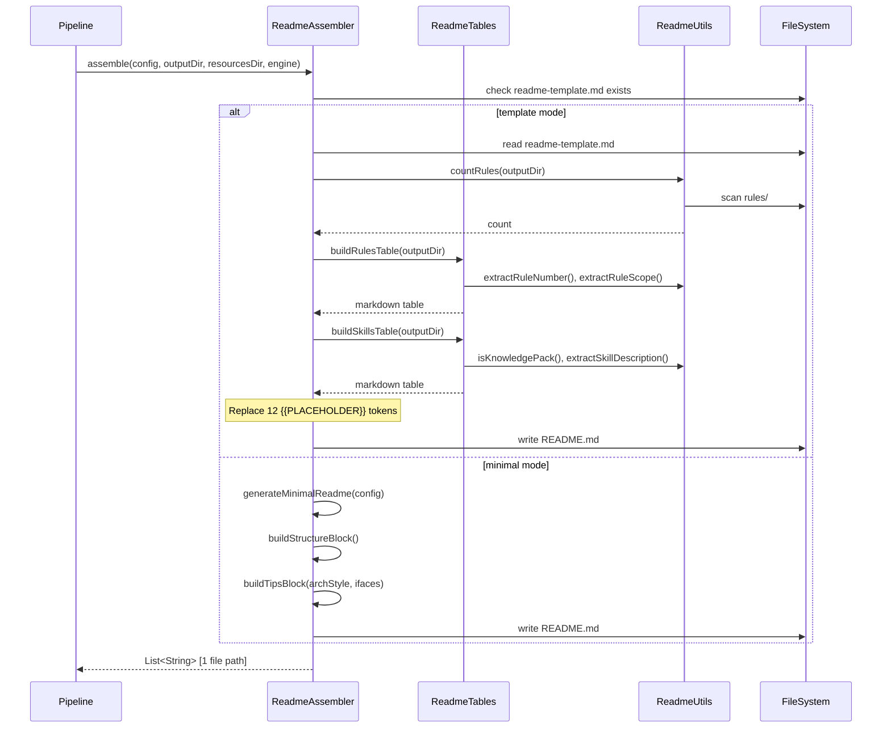
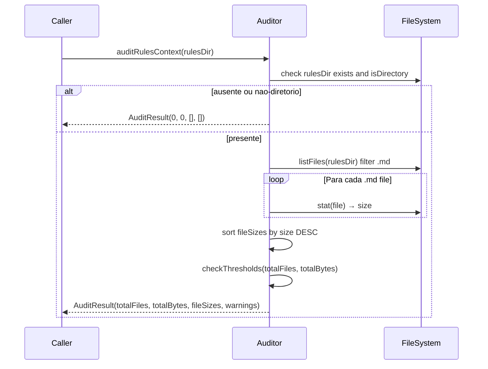

# Historia: ReadmeAssembler, Auditor e Tabelas de Resumo

**ID:** story-0006-0021

## 1. Dependencias

| Blocked By | Blocks |
| :--- | :--- |
| story-0006-0009 | story-0006-0027 |

## 2. Regras Transversais Aplicaveis

| ID | Titulo |
| :--- | :--- |
| RULE-001 | Paridade Byte-a-Byte |
| RULE-004 | Interface Assembler Uniforme |
| RULE-005 | Ordem de Execucao Pipeline |

## 3. Descricao

Como **Desenvolvedor Java**, eu quero portar `readme-assembler.ts` (136 linhas),
`readme-tables.ts` (259 linhas), `readme-utils.ts` (159 linhas) e `auditor.ts` (96 linhas) para
Java 21, garantindo que o README.md final e o auditor de regras funcionem com paridade byte-a-byte
em relacao a versao TypeScript.

ReadmeAssembler e o **ultimo assembler** do pipeline (RULE-005). Gera `.claude/README.md` com um
sumario executivo do projeto, escaneando todos os artefatos ja gerados pelos assemblers anteriores
para produzir tabelas dinamicas de contagem e mapeamento. Opera em dois modos: (1) **template mode**
quando `readme-template.md` existe em resources — substitui `{{PLACEHOLDER}}` tokens via
`String.replace()`; (2) **minimal mode** como fallback — gera README basico com informacoes
minimas. O assembler NAO usa `TemplateEngine` (usa `{{DOUBLE_BRACE}}` tokens substituidos por
`String.replace()`, nao pelo motor de templates Pebble).

ReadmeTables contem a logica de construcao de tabelas markdown e secoes do README: rules table
(com numero, arquivo e scope), skills table (com nome e descricao, excluindo knowledge packs),
agents table, knowledge packs table, hooks section, settings section, mapping table
(`.claude/` <-> `.github/` <-> `.codex/`), e generation summary (contagem por componente).
Extraido do readme-assembler para respeitar o limite de 250 linhas por classe.

ReadmeUtils contem funcoes utilitarias de contagem e classificacao: `countRules()`, `countSkills()`,
`countAgents()`, `countKnowledgePacks()`, `countHooks()`, `countSettings()`, `countGithubFiles()`,
`countGithubComponent()`, `countGithubSkills()`, `countCodexFiles()`, `countCodexAgentsFiles()`,
`isKnowledgePack()`, `extractRuleNumber()`, `extractRuleScope()`, `extractSkillDescription()`.

Auditor verifica consistencia dos artefatos gerados no diretorio `rules/`. Conta arquivos e bytes
totais, e emite warnings quando thresholds sao excedidos: mais de 10 rule files ou mais de 50KB
total. E read-only — nunca modifica arquivos.

### 3.1 ReadmeAssembler

- Metodo `generateReadme(config, outputDir, templatePath)`: substitui 12 `{{PLACEHOLDER}}` tokens:
  - `{{PROJECT_NAME}}`, `{{RULES_COUNT}}`, `{{SKILLS_COUNT}}`, `{{AGENTS_COUNT}}`
  - `{{RULES_TABLE}}`, `{{SKILLS_TABLE}}`, `{{AGENTS_TABLE}}`
  - `{{HOOKS_SECTION}}`, `{{KNOWLEDGE_PACKS_TABLE}}`, `{{SETTINGS_SECTION}}`
  - `{{MAPPING_TABLE}}`, `{{GENERATION_SUMMARY}}`
- Metodo `generateMinimalReadme(config)`: gera README basico com structure block e tips block
- Metodo `buildStructureBlock()`: arvore de diretorios `.claude/` em code block
- Metodo `buildTipsBlock(archStyle, ifaces)`: dicas de uso com architecture e interfaces
- Template: `resources/readme-template.md` (com `{{}}` tokens, NAO Nunjucks)
- Output: `.claude/README.md`

### 3.2 ReadmeTables

- `buildRulesTable(outputDir)`: scan `rules/`, extrai numero e scope, gera tabela markdown
- `buildSkillsTable(outputDir)`: scan `skills/`, exclui knowledge packs, gera tabela
- `buildAgentsTable(outputDir)`: scan `agents/`, gera tabela com nome e arquivo
- `buildKnowledgePacksTable(outputDir)`: scan `skills/`, filtra apenas knowledge packs
- `buildReadmeHooksSection(config)`: gera secao de hooks com comandos do stack (via `StackMapping`)
- `buildSettingsSection()`: conteudo estatico descrevendo settings.json e settings.local.json
- `buildMappingTable(outputDir)`: tabela de mapeamento `.claude/` <-> `.github/` <-> `.codex/` com total de artefatos `.github/`
- `buildGenerationSummary(outputDir, config)`: tabela de contagem por componente (15 linhas: Rules, Skills, Knowledge Packs, Agents, Hooks, Settings .claude + Instructions, Skills, Agents, Prompts, Hooks, MCP .github + AGENTS.md, Codex, Skills .agents) com versao do `ia-dev-env`

### 3.3 ReadmeUtils

- Funcoes de contagem: `countRules()`, `countSkills()`, `countAgents()`, `countKnowledgePacks()`, `countHooks()`, `countSettings()`, `countGithubFiles()`, `countGithubComponent()`, `countGithubSkills()`, `countCodexFiles()`, `countCodexAgentsFiles()`
- `isKnowledgePack(skillMdPath)`: verifica `user-invocable: false` ou `# Knowledge Pack` no conteudo
- `extractRuleNumber(filename)`: extrai digitos iniciais do nome do arquivo
- `extractRuleScope(filename)`: strip do numero e extensao, hifens → espacos
- `extractSkillDescription(skillMdPath)`: extrai valor de `description:` do frontmatter
- `countFilesRecursive(dir)`: walk recursivo contando arquivos (Node 18 / Java NIO compatible)

### 3.4 Auditor

- Constantes: `MAX_FILE_COUNT = 10`, `MAX_TOTAL_BYTES = 51_200` (50KB)
- Record `AuditResult(totalFiles, totalBytes, fileSizes, warnings)`
- Metodo `auditRulesContext(rulesDir)`: conta .md files, soma bytes, ordena por tamanho decrescente
- Emite warnings: "N rule files exceeds recommended maximum of 10", "NKB total rules exceeds recommended maximum of 50KB"
- Read-only: nunca modifica arquivos

### 3.5 Estrutura de Classes Java

```
src/main/java/com/iadevenv/assembler/
├── ReadmeAssembler.java    # implements Assembler
├── ReadmeTables.java       # static methods for table building
├── ReadmeUtils.java         # static counting/extraction utilities
└── Auditor.java             # AuditResult + auditRulesContext()
```

## 4. Definicoes de Qualidade Locais

### DoR Local (Definition of Ready)

- [ ] Interface `Assembler` implementada e disponivel (story-0006-0009)
- [ ] `StackMapping` com `getHookTemplateKey()` e `LANGUAGE_COMMANDS` (story-0006-0008)
- [ ] Todos os assemblers anteriores funcionais (ReadmeAssembler escaneia output deles)
- [ ] Template `readme-template.md` no classpath (story-0006-0004)
- [ ] `DEFAULT_FOUNDATION.version` disponivel nos modelos (story-0006-0002)

### DoD Local (Definition of Done)

- [ ] `ReadmeAssembler` gera README.md com 12 placeholders substituidos
- [ ] `ReadmeAssembler` fallback para minimal README quando template ausente
- [ ] `ReadmeTables` constroi todas as tabelas com contagens corretas
- [ ] `ReadmeUtils` conta rules, skills, agents, knowledge packs, hooks, settings corretamente
- [ ] `ReadmeUtils` isKnowledgePack() classifica corretamente
- [ ] `Auditor` conta files e bytes, emite warnings para thresholds excedidos
- [ ] Mapping table inclui `.codex/` e `.agents/` alem de `.claude/` e `.github/`
- [ ] Generation summary inclui 15 linhas de componentes com contagem correta
- [ ] Output identico ao golden file para kotlin-ktor profile
- [ ] Javadoc em classes e metodos publicos

### Global Definition of Done (DoD)

- **Cobertura:** ≥ 95% Line Coverage, ≥ 90% Branch Coverage (JaCoCo)
- **Testes Automatizados:** Unitarios (JUnit 5 + AssertJ), integracao, golden file
- **Relatorio de Cobertura:** JaCoCo HTML + XML
- **Documentacao:** Javadoc em classes publicas
- **Performance:** Geracao completa < 2s
- **TDD Compliance:** Test-first, refactoring explicito, TPP incremental

## 5. Contratos de Dados (Data Contract)

**ReadmeAssembler output:**

| Artefato | Caminho | Construcao |
| :--- | :--- | :--- |
| README.md | `.claude/README.md` | Template mode ({{}} replacement) ou minimal fallback |

**12 tokens do README template:**

| Token | Valor | Fonte |
| :--- | :--- | :--- |
| `{{PROJECT_NAME}}` | config.project.name | ProjectConfig |
| `{{RULES_COUNT}}` | contagem de .md em rules/ | countRules() |
| `{{SKILLS_COUNT}}` | contagem de SKILL.md em skills/ | countSkills() |
| `{{AGENTS_COUNT}}` | contagem de .md em agents/ | countAgents() |
| `{{RULES_TABLE}}` | tabela markdown de rules | buildRulesTable() |
| `{{SKILLS_TABLE}}` | tabela markdown de skills | buildSkillsTable() |
| `{{AGENTS_TABLE}}` | tabela markdown de agents | buildAgentsTable() |
| `{{HOOKS_SECTION}}` | secao de hooks | buildReadmeHooksSection() |
| `{{KNOWLEDGE_PACKS_TABLE}}` | tabela de knowledge packs | buildKnowledgePacksTable() |
| `{{SETTINGS_SECTION}}` | secao de settings | buildSettingsSection() |
| `{{MAPPING_TABLE}}` | mapeamento .claude/.github/.codex | buildMappingTable() |
| `{{GENERATION_SUMMARY}}` | resumo de geracao | buildGenerationSummary() |

**Secoes do README.md (template mode):**

| Secao | Descricao |
| :--- | :--- |
| Structure | Arvore .claude/ e .github/ |
| Rules | Tabela numbered com file e scope |
| Skills | Tabela com path e description (exclui knowledge packs) |
| Knowledge Packs | Tabela separada (user-invocable: false) |
| Agents | Tabela com file |
| Hooks | Secao com PostToolUse event e compile command |
| Settings | Descricao de settings.json e settings.local.json |
| Mapping | Tabela .claude/ <-> .github/ <-> .codex/ |
| Tips | Dicas de uso |
| Generation Summary | Tabela de contagem por componente |

**AuditResult record:**

| Campo | Tipo | Descricao |
| :--- | :--- | :--- |
| `totalFiles` | int | Numero de .md files no rules/ |
| `totalBytes` | long | Soma de bytes de todos os .md files |
| `fileSizes` | List<Pair<String, Long>> | Arquivo e tamanho, ordenado por tamanho desc |
| `warnings` | List<String> | Warnings de threshold excedido |

**ReadmeUtils assinaturas de contagem:**

| Metodo | Assinatura | Descricao |
| :--- | :--- | :--- |
| `countRules` | `(String outputDir): int` | .md em rules/ |
| `countSkills` | `(String outputDir): int` | SKILL.md em skills/ subdirs |
| `countAgents` | `(String outputDir): int` | .md em agents/ |
| `countKnowledgePacks` | `(String outputDir): int` | Skills com user-invocable: false |
| `countHooks` | `(String outputDir): int` | Entries em hooks/ |
| `countSettings` | `(String outputDir): int` | settings.json + settings.local.json |
| `countGithubFiles` | `(String githubDir): int` | Recursivo em .github/ |
| `countGithubComponent` | `(String githubDir, String component): int` | Files em .github/{component}/ |
| `countGithubSkills` | `(String githubDir): int` | SKILL.md em .github/skills/ subdirs |
| `countCodexFiles` | `(String codexDir): int` | Files em .codex/ |
| `countCodexAgentsFiles` | `(String agentsDir): int` | Recursivo em .agents/ |

## 6. Diagramas

### 6.1 Fluxo ReadmeAssembler



### 6.2 Fluxo Auditor



## 7. Criterios de Aceite (Gherkin)

```gherkin
Cenario: README.md contem tabela de rules com contagem correta
  DADO que o pipeline gerou 5 rule files em .claude/rules/
  E os arquivos sao: 01-project-identity.md, 02-domain.md, 03-coding-standards.md, 04-architecture-summary.md, 05-quality-gates.md
  QUANDO ReadmeAssembler.assemble() e executado
  ENTAO o README.md contem "| # | File | Scope |" como header da tabela
  E a tabela contem 5 linhas com numero, arquivo e scope
  E o scope de "01-project-identity.md" e "project identity"

Cenario: README.md contem tabela de skills com descricoes
  DADO que o pipeline gerou 14 skills em .claude/skills/ (incluindo knowledge packs)
  E cada skill tem SKILL.md com description no frontmatter
  QUANDO ReadmeAssembler.assemble() e executado
  ENTAO o README.md contem tabela de skills com colunas Skill, Path e Description
  E knowledge packs NAO aparecem na tabela de skills
  E knowledge packs aparecem em tabela separada

Cenario: README.md contem mapeamento .claude/ <-> .github/
  DADO que o pipeline gerou artefatos em .claude/, .github/, .codex/ e .agents/
  QUANDO ReadmeAssembler.assemble() e executado
  ENTAO o README.md contem tabela com colunas ".claude/", ".github/", ".codex/" e "Notes"
  E a tabela contem 9 linhas de mapeamento
  E o total de artefatos .github/ e exibido abaixo da tabela

Cenario: Auditor detecta regra sem referencia
  DADO que o diretorio rules/ contem 12 arquivos .md totalizando 60KB
  QUANDO auditRulesContext(rulesDir) e executado
  ENTAO AuditResult.totalFiles e 12
  E AuditResult.warnings contem "12 rule files exceeds recommended maximum of 10."
  E AuditResult.warnings contem mensagem sobre bytes excedendo 50KB
  E AuditResult.fileSizes esta ordenado por tamanho decrescente

Cenario: Tabelas formatadas com alinhamento correto
  DADO que buildRulesTable() e chamado com um diretorio contendo rules validas
  QUANDO a tabela markdown e gerada
  ENTAO o header usa pipes alinhados "|---|------|-------|"
  E cada linha de dados segue o mesmo formato de colunas
  E nenhuma linha excede 120 caracteres

Cenario: Output identico ao golden file para kotlin-ktor
  DADO que o ProjectConfig e carregado a partir do perfil bundled "kotlin-ktor"
  E todos os assemblers anteriores ja executaram e geraram seus artefatos
  QUANDO ReadmeAssembler.assemble() e executado
  ENTAO o README.md gerado e byte-a-byte identico ao golden file de referencia
  E a generation summary contem contagens corretas para todos os componentes
  E nenhuma diferenca de whitespace, line ending ou ordenacao e detectada
```

### 7.1 Scenario Ordering (TPP)

> Scenarios seguem TPP: tabela basica (rules com contagem) → tabela com filtragem (skills excluindo knowledge packs) → tabela de mapeamento (3 plataformas) → validacao de thresholds (auditor) → formato (alinhamento de tabelas) → paridade completa (golden file).

### 7.2 Mandatory Scenario Categories

- [x] Degenerate cases (template ausente → minimal README, diretorio rules vazio)
- [x] Happy path (README com 12 tokens, tabelas, generation summary)
- [x] Error paths (auditor com thresholds excedidos)
- [x] Boundary values (knowledge pack filtragem, golden file byte-a-byte, alinhamento de tabelas)

### 7.3 TDD Implementation Notes

**Outer loop (acceptance):** Golden file test para kotlin-ktor. ReadmeAssembler e o ultimo assembler, entao o test precisa de todos os artefatos ja gerados.

**Inner loop (unit):**
1. `countRules()` — testar com 0, 1, 5 rules
2. `countSkills()` — testar com skills normais e knowledge packs
3. `isKnowledgePack()` — testar com `user-invocable: false` e `# Knowledge Pack`
4. `extractRuleNumber()` — testar "01-name.md" → "01", "name.md" → ""
5. `extractRuleScope()` — testar "01-project-identity.md" → "project identity"
6. `extractSkillDescription()` — testar com e sem `description:` no frontmatter
7. `buildRulesTable()` — verificar formato markdown com header e rows
8. `buildSkillsTable()` — verificar exclusao de knowledge packs
9. `buildMappingTable()` — verificar 9 linhas de mapeamento + total .github/
10. `buildGenerationSummary()` — verificar 15 componentes com contagens
11. `generateMinimalReadme()` — verificar structure block e tips block
12. `auditRulesContext()` — testar com threshold excedido e dentro do limite
13. `auditRulesContext()` — verificar ordenacao de fileSizes por tamanho decrescente

## 8. Sub-tarefas

- [ ] [Dev] ReadmeUtils.java com countRules(), countSkills(), countAgents(), countKnowledgePacks(), countHooks(), countSettings(), countGithubFiles(), countGithubComponent(), countGithubSkills(), countCodexFiles(), countCodexAgentsFiles()
- [ ] [Dev] ReadmeUtils.java com isKnowledgePack(), extractRuleNumber(), extractRuleScope(), extractSkillDescription(), countFilesRecursive()
- [ ] [Dev] ReadmeTables.java com buildRulesTable(), buildSkillsTable(), buildAgentsTable(), buildKnowledgePacksTable()
- [ ] [Dev] ReadmeTables.java com buildReadmeHooksSection(), buildSettingsSection(), buildMappingTable(), buildGenerationSummary()
- [ ] [Dev] ReadmeAssembler.java com generateReadme() (12 token replacement) e generateMinimalReadme() (fallback)
- [ ] [Dev] ReadmeAssembler: buildStructureBlock(), buildTipsBlock()
- [ ] [Dev] Auditor.java com AuditResult record, auditRulesContext(), MAX_FILE_COUNT, MAX_TOTAL_BYTES
- [ ] [Test] Unitario: ReadmeUtils — countRules, countSkills, countAgents com diferentes quantidades
- [ ] [Test] Unitario: ReadmeUtils — isKnowledgePack com user-invocable: false e # Knowledge Pack
- [ ] [Test] Unitario: ReadmeUtils — extractRuleNumber, extractRuleScope, extractSkillDescription
- [ ] [Test] Unitario: ReadmeTables — buildRulesTable formato markdown correto
- [ ] [Test] Unitario: ReadmeTables — buildSkillsTable exclui knowledge packs
- [ ] [Test] Unitario: ReadmeTables — buildMappingTable com 9 linhas de mapeamento
- [ ] [Test] Unitario: ReadmeTables — buildGenerationSummary com 15 componentes
- [ ] [Test] Unitario: ReadmeAssembler — template mode com 12 tokens
- [ ] [Test] Unitario: ReadmeAssembler — minimal mode como fallback
- [ ] [Test] Unitario: Auditor — threshold dentro do limite (sem warnings)
- [ ] [Test] Unitario: Auditor — threshold excedido (com warnings)
- [ ] [Test] Unitario: Auditor — fileSizes ordenado por tamanho decrescente
- [ ] [Test] Golden file: comparacao byte-a-byte do output para kotlin-ktor profile
- [ ] [Doc] Javadoc em ReadmeAssembler, ReadmeTables, ReadmeUtils e Auditor
