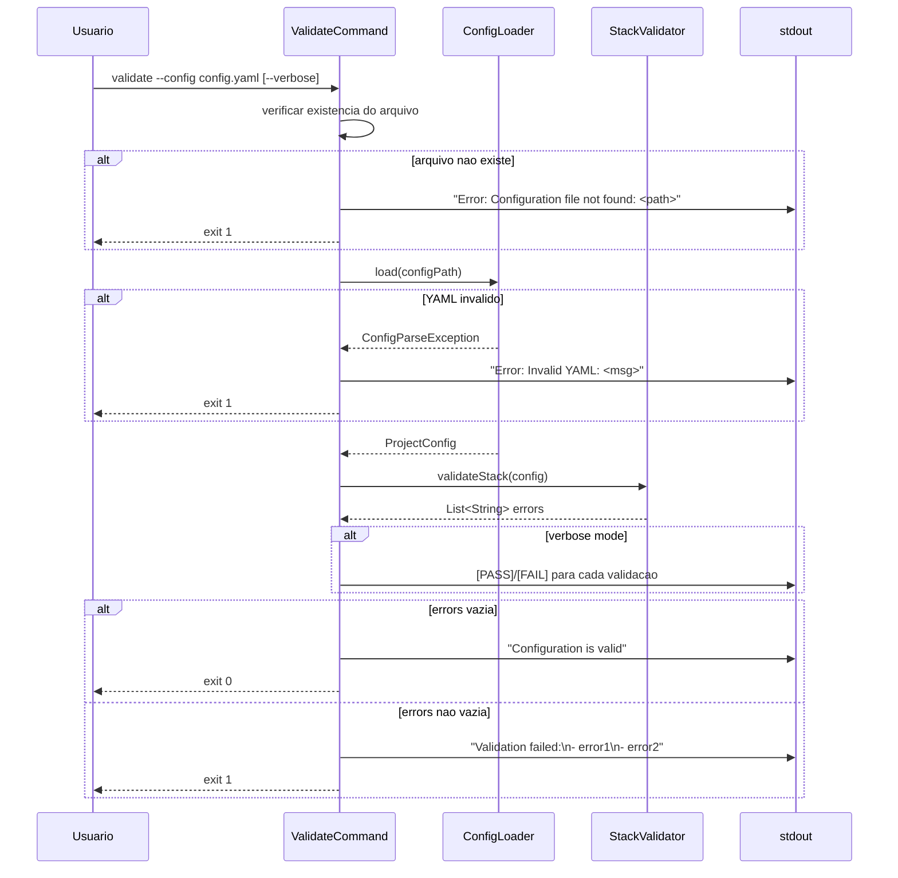
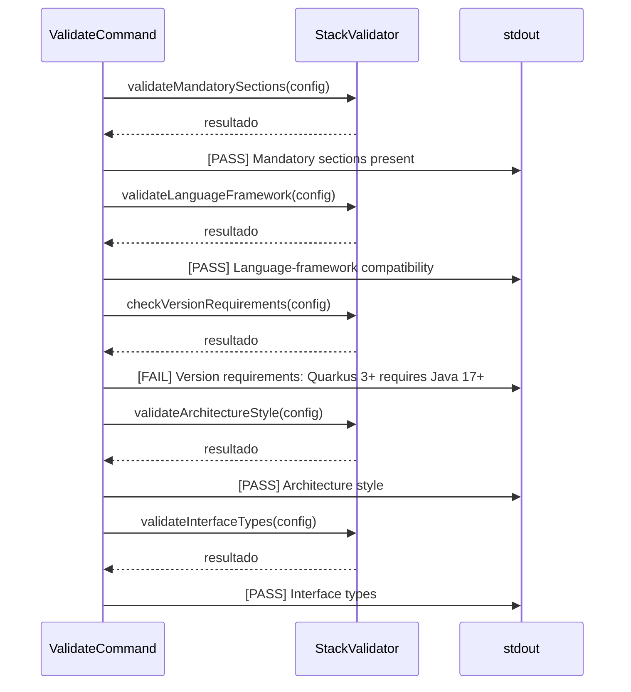

# Historia: Comando Validate

**ID:** story-0006-0022

## 1. Dependencias

| Blocked By | Blocks |
| :--- | :--- |
| story-0006-0001, story-0006-0005, story-0006-0008 | — |

## 2. Regras Transversais Aplicaveis

| ID | Titulo |
| :--- | :--- |
| RULE-003 | Factory Method fromMap() |
| RULE-007 | Zero Dependencia de Framework no Dominio |

## 3. Descricao

Como **Desenvolvedor Java**, eu quero implementar o comando `validate` completo do CLI, permitindo que o usuario valide um arquivo de configuracao YAML antes de gerar artefatos, recebendo feedback claro sobre erros encontrados ou confirmacao de que a configuracao e valida.

O comando `validate` e o ponto de entrada para verificacao de configuracoes sem efeitos colaterais. Recebe `--config <path>` (obrigatorio) e opcionalmente `--verbose`, le o arquivo YAML via `ConfigLoader` (story-0006-0005), executa todas as validacoes do `StackValidator` (story-0006-0008), e reporta sucesso ou lista todos os erros encontrados. Exit code 0 para config valido, 1 para invalido. Em modo verbose, exibe detalhes de cada validacao executada.

### 3.1 ValidateCommand (Picocli)

- Anotado com `@Command(name = "validate")`
- Opcao `-c`/`--config` (path do YAML, obrigatorio)
- Opcao `-v`/`--verbose` (boolean, default false)
- Metodo `call()` implementa o fluxo completo: load → validate → report
- Retorna exit code 0 (valido) ou 1 (invalido ou erro de I/O)

### 3.2 Fluxo de Validacao

1. Verificar que o arquivo `--config` existe e e legivel
2. Carregar YAML via `ConfigLoader.load(path)` → `ProjectConfig`
3. Executar `StackValidator.validateStack(config)` → `List<String>` erros
4. Executar validacoes adicionais: secoes obrigatorias presentes, tipos de interface validos, compatibilidade linguagem-framework, requisitos de versao, estilos de arquitetura
5. Se lista de erros vazia → imprimir "Configuration is valid" e retornar 0
6. Se lista nao vazia → imprimir "Validation failed:" seguido de cada erro prefixado com "- " e retornar 1

### 3.3 Verbose Mode

- Quando `--verbose` ativo, cada regra de validacao exibe seu resultado
- Formato: `[PASS] <nome da validacao>` ou `[FAIL] <nome da validacao>: <motivo>`
- Validacoes reportadas: mandatory sections, language-framework compatibility, version requirements, architecture style, interface types
- Verbose output vai para stdout antes da mensagem final de sucesso/falha

### 3.4 Tratamento de Erros

- Arquivo inexistente: imprimir "Error: Configuration file not found: <path>" e retornar exit 1
- Arquivo com YAML invalido (parse error): imprimir "Error: Invalid YAML: <mensagem>" e retornar exit 1
- Excecoes inesperadas: imprimir "Error: <mensagem>" e retornar exit 1
- NUNCA imprimir stack traces para o usuario (apenas em modo verbose para debug)

## 4. Definicoes de Qualidade Locais

### DoR Local (Definition of Ready)

- [ ] CLI bootstrap funcional com Picocli (story-0006-0001 concluida)
- [ ] ConfigLoader funcional para carregar YAML (story-0006-0005 concluida)
- [ ] StackValidator com todas as validacoes implementadas (story-0006-0008 concluida)
- [ ] Arquivos YAML de teste disponiveis (validos e invalidos)

### DoD Local (Definition of Done)

- [ ] `java -jar ia-dev-env.jar validate --config valid.yaml` retorna exit 0 e "Configuration is valid"
- [ ] `java -jar ia-dev-env.jar validate --config invalid.yaml` retorna exit 1 e lista erros
- [ ] `java -jar ia-dev-env.jar validate --config missing.yaml` retorna exit 1 e mensagem de arquivo nao encontrado
- [ ] `--verbose` exibe detalhes de cada validacao (PASS/FAIL)
- [ ] Sem stack traces visíveis ao usuario em modo normal
- [ ] Testes unitarios para cada cenario de validacao
- [ ] Testes de integracao com configs reais dos 8 perfis bundled

### Global Definition of Done (DoD)

- **Cobertura:** >= 95% Line Coverage, >= 90% Branch Coverage (JaCoCo)
- **Testes Automatizados:** Unitarios (JUnit 5 + AssertJ), integracao, golden file
- **Relatorio de Cobertura:** JaCoCo HTML + XML
- **Documentacao:** Javadoc em classes publicas
- **Performance:** Geracao completa < 2s
- **TDD Compliance:** Test-first, refactoring explicito, TPP incremental

## 5. Contratos de Dados (Data Contract)

**CLI Input:**

| Opcao | Curta | Tipo | Default | Obrigatorio |
| :--- | :--- | :--- | :--- | :--- |
| `--config` | `-c` | String (path) | — | M |
| `--verbose` | `-v` | boolean | false | O |

**Output — Sucesso (exit 0):**

```
Configuration is valid
```

**Output — Falha (exit 1):**

```
Validation failed:
- error message 1
- error message 2
```

**Output — Verbose (PASS):**

```
[PASS] Mandatory sections present
[PASS] Language-framework compatibility
[PASS] Version requirements
[PASS] Architecture style
[PASS] Interface types
Configuration is valid
```

**Output — Verbose (FAIL):**

```
[PASS] Mandatory sections present
[FAIL] Language-framework compatibility: spring-boot requires java, but python was configured
[PASS] Version requirements
[PASS] Architecture style
[PASS] Interface types
Validation failed:
- spring-boot requires java, but python was configured
```

**Output — Arquivo inexistente (exit 1):**

```
Error: Configuration file not found: /path/to/missing.yaml
```

## 6. Diagramas

### 6.1 Fluxo de Execucao do Comando Validate



### 6.2 Verbose Mode — Detalhamento de Validacoes



## 7. Criterios de Aceite (Gherkin)

```gherkin
Cenario: Config valido retorna exit 0 e mensagem de sucesso
  DADO que existe um arquivo YAML com configuracao valida (java-quarkus completo)
  QUANDO o usuario executa "validate --config valid.yaml"
  ENTAO a saida contem "Configuration is valid"
  E o exit code e 0

Cenario: Config com secao obrigatoria ausente lista erro especifico
  DADO que existe um arquivo YAML sem a secao "language" (obrigatoria)
  QUANDO o usuario executa "validate --config missing-language.yaml"
  ENTAO a saida contem "Validation failed:"
  E a saida contem "- Missing required section: language"
  E o exit code e 1

Cenario: Config com framework incompativel lista erro
  DADO que existe um arquivo YAML com language=python e framework=spring-boot
  QUANDO o usuario executa "validate --config incompatible.yaml"
  ENTAO a saida contem "Validation failed:"
  E a saida contem mensagem indicando que spring-boot requer java
  E o exit code e 1

Cenario: Config com Java 11 + Quarkus 3 lista erro de versao
  DADO que existe um arquivo YAML com language=java, version=11, framework=quarkus, frameworkVersion=3.0
  QUANDO o usuario executa "validate --config java11-quarkus3.yaml"
  ENTAO a saida contem "Validation failed:"
  E a saida contem mensagem indicando que Quarkus 3+ requer Java 17+
  E o exit code e 1

Cenario: Arquivo YAML inexistente retorna exit 1
  DADO que o arquivo "/tmp/nonexistent.yaml" nao existe
  QUANDO o usuario executa "validate --config /tmp/nonexistent.yaml"
  ENTAO a saida contem "Error: Configuration file not found:"
  E o exit code e 1

Cenario: Modo verbose exibe detalhes de cada validacao
  DADO que existe um arquivo YAML com configuracao valida (java-quarkus completo)
  QUANDO o usuario executa "validate --config valid.yaml --verbose"
  ENTAO a saida contem "[PASS] Mandatory sections present"
  E a saida contem "[PASS] Language-framework compatibility"
  E a saida contem "[PASS] Version requirements"
  E a saida contem "[PASS] Architecture style"
  E a saida contem "[PASS] Interface types"
  E a saida contem "Configuration is valid"
  E o exit code e 0
```

### 7.1 Scenario Ordering (TPP)

> Scenarios seguem TPP: caso mais simples (config valido → sucesso) → erro por secao ausente (constante de validacao) → erro por incompatibilidade (regra condicional) → erro por versao (regra condicional mais complexa) → erro de I/O (arquivo inexistente) → verbose mode (transformacao de output mais complexa).

### 7.2 Mandatory Scenario Categories

- [x] Degenerate cases (arquivo inexistente)
- [x] Happy path (config valido retorna exit 0)
- [x] Error paths (secao ausente, framework incompativel, versao invalida, arquivo inexistente)
- [x] Boundary values (verbose mode com todas as validacoes PASS)

### 7.3 TDD Implementation Notes

**Outer loop (acceptance):** Testar ValidateCommand end-to-end via Picocli `CommandLine.execute()` capturando stdout e exit code. Criar arquivos YAML temporarios para cada cenario.

**Inner loop (unit):**
1. ValidateCommand com config valido — caso mais simples (exit 0)
2. ValidateCommand com arquivo inexistente — erro de I/O
3. ValidateCommand com config invalido (secao ausente) — delegacao ao StackValidator
4. ValidateCommand com config incompativel (language/framework) — delegacao ao StackValidator
5. ValidateCommand com erro de versao — delegacao ao StackValidator
6. ValidateCommand verbose mode — formatacao de output PASS/FAIL

## 8. Sub-tarefas

- [ ] [Dev] ValidateCommand.java completo com Picocli `@Command`, opcoes `--config` e `--verbose`, metodo `call()` com fluxo load → validate → report
- [ ] [Dev] Formatacao de output de validacao: mensagem de sucesso, lista de erros formatada, mensagem de arquivo nao encontrado
- [ ] [Dev] Verbose mode logging: formato `[PASS]/[FAIL]` para cada regra de validacao executada
- [ ] [Dev] Tratamento de excecoes: ConfigParseException, ConfigValidationException, IOException — mapeados para mensagens user-friendly
- [ ] [Test] Unitario: ValidateCommand com config valido retorna exit 0 e "Configuration is valid"
- [ ] [Test] Unitario: ValidateCommand com arquivo inexistente retorna exit 1 e mensagem de erro
- [ ] [Test] Unitario: ValidateCommand com secao obrigatoria ausente retorna erros formatados
- [ ] [Test] Unitario: ValidateCommand com framework incompativel retorna erro especifico
- [ ] [Test] Unitario: ValidateCommand com erro de versao (Java 11 + Quarkus 3) retorna erro especifico
- [ ] [Test] Unitario: ValidateCommand verbose mode exibe PASS/FAIL para cada validacao
- [ ] [Test] Integracao: validate com configs reais dos 8 perfis bundled (todos devem retornar exit 0)
- [ ] [Test] Integracao: validate com configs invalidas (secao ausente, incompatibilidade, versao)
- [ ] [Doc] Javadoc em ValidateCommand com descricao do comando, opcoes e exemplos de uso
