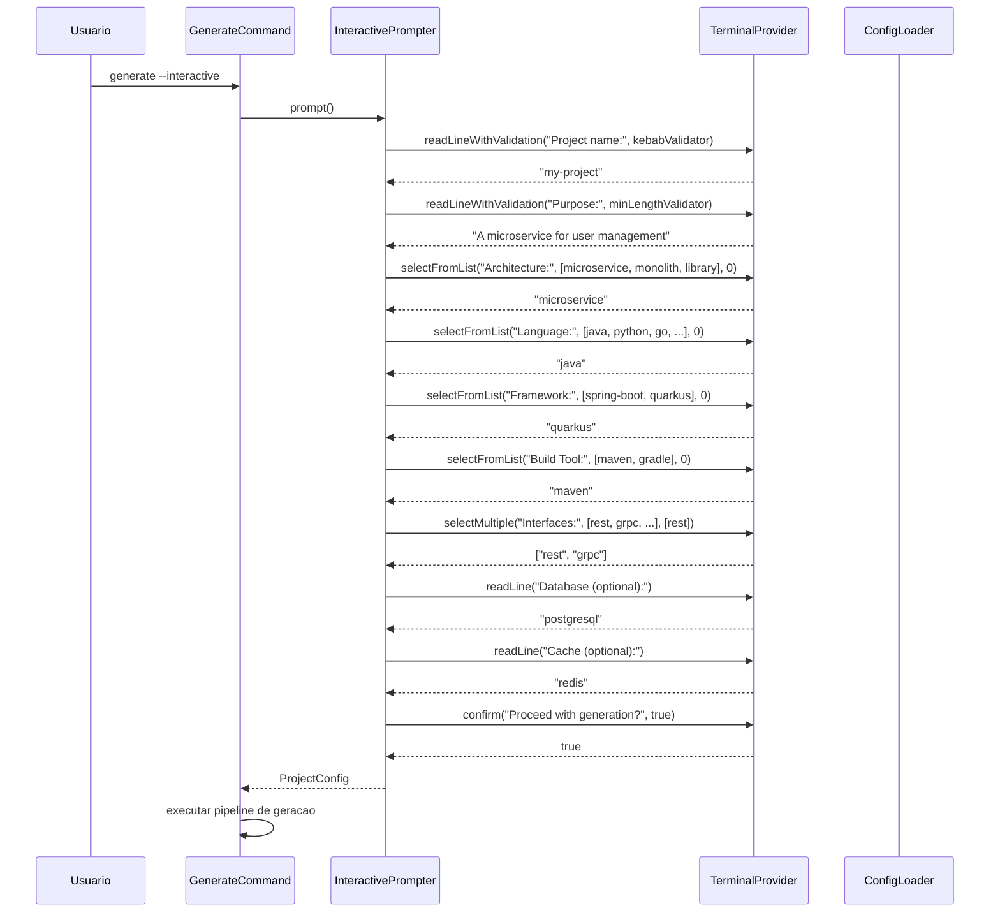
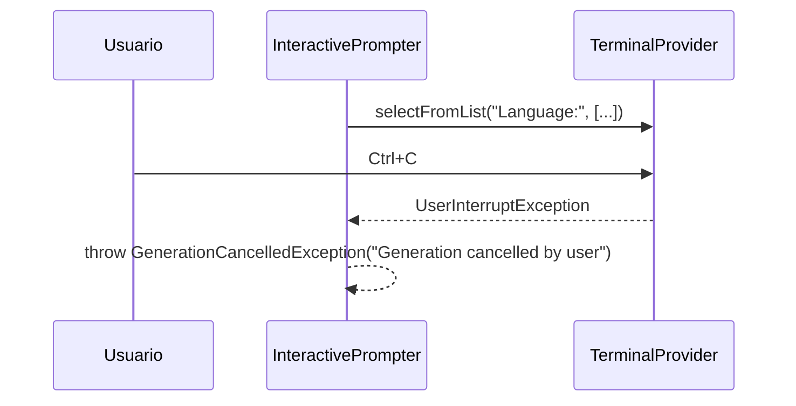

# Historia: Modo Interativo (JLine)

**ID:** story-0006-0023

## 1. Dependencias

| Blocked By | Blocks |
| :--- | :--- |
| story-0006-0001, story-0006-0005 | — |

## 2. Regras Transversais Aplicaveis

| ID | Titulo |
| :--- | :--- |
| RULE-003 | Factory Method fromMap() |
| RULE-009 | Compatibilidade Cross-Platform |

## 3. Descricao

Como **Desenvolvedor Java**, eu quero um modo interativo que guie o usuario por prompts sequenciais para configurar um projeto, equivalente ao Inquirer.js da versao TypeScript, permitindo que usuarios sem arquivo YAML pre-existente gerem artefatos de forma assistida.

Quando o usuario executa `ia-dev-env generate --interactive`, o sistema apresenta prompts sequenciais usando JLine 3.x para configurar o projeto. O resultado e um `ProjectConfig` equivalente ao que seria carregado de um arquivo YAML, que e entao passado ao pipeline de geracao normalmente.

### 3.1 InteractivePrompter

Classe principal responsavel por orquestrar o fluxo de prompts. Metodo `prompt()` retorna `ProjectConfig`. Depende de uma abstracao `TerminalProvider` para facilitar testes (mock do terminal JLine).

### 3.2 Fluxo de Prompts

1. **Project Name** — text input com validacao kebab-case (`^[a-z][a-z0-9-]*[a-z0-9]$`), minimo 3 caracteres
2. **Purpose** — text input livre (descricao do projeto), obrigatorio, minimo 10 caracteres
3. **Architecture Style** — list selection: `microservice`, `monolith`, `library` (default: `microservice`)
4. **Language** — list selection: `java`, `python`, `go`, `kotlin`, `typescript`, `rust` (default: `java`)
5. **Framework** — list selection filtrada pela linguagem selecionada:
   - java: `spring-boot`, `quarkus`
   - python: `fastapi`, `click-cli`
   - go: `gin`
   - kotlin: `ktor`
   - typescript: `nestjs`
   - rust: `axum`
6. **Build Tool** — list selection filtrada pela linguagem:
   - java: `maven`, `gradle`
   - python: `pip`
   - go: `go`
   - kotlin: `gradle`
   - typescript: `npm`
   - rust: `cargo`
7. **Interfaces** — checkbox multi-select: `rest`, `grpc`, `graphql`, `cli`, `events` (default: `rest` pre-selecionado)
8. **Database** — optional text input (ex: `postgresql`, `mongodb`, vazio = nenhum)
9. **Cache** — optional text input (ex: `redis`, vazio = nenhum)
10. **Confirmation** — resumo formatado + confirmacao yes/no. Se "no", volta ao inicio ou aborta.

### 3.3 Filtragem de Frameworks por Linguagem

O prompt de framework DEVE mostrar apenas frameworks compativeis com a linguagem selecionada no passo 4. Se a linguagem tiver apenas um framework disponivel, esse framework e pre-selecionado automaticamente e o prompt pode ser pulado (exibindo apenas uma confirmacao).

### 3.4 Validacao Inline

- **Project name**: rejeitar nomes que nao seguem kebab-case, exibir mensagem "Project name must be kebab-case (e.g., my-project)" e re-prompt
- **Purpose**: rejeitar vazio ou menos de 10 caracteres, exibir mensagem e re-prompt
- **Interfaces**: ao menos uma interface deve ser selecionada

### 3.5 Resumo de Confirmacao

Antes de confirmar, exibir resumo formatado:

```
Project Configuration Summary:
  Name:          my-project
  Purpose:       A microservice for user management
  Architecture:  microservice
  Language:       java 21
  Framework:      quarkus
  Build Tool:     maven
  Interfaces:     rest, grpc
  Database:       postgresql
  Cache:          redis

Proceed with generation? [Y/n]
```

### 3.6 Cancelamento

- Se o usuario pressiona Ctrl+C em qualquer prompt, o processo aborta com exit 1 e mensagem "Generation cancelled by user"
- Se o usuario responde "no" na confirmacao final, o processo aborta com exit 1 e mensagem "Generation cancelled"
- Em ambos os casos, nenhum arquivo e gerado

### 3.7 Abstracao para Testabilidade

- `TerminalProvider` interface com metodos: `readLine(prompt)`, `selectFromList(prompt, options, defaultIndex)`, `selectMultiple(prompt, options, defaults)`, `confirm(prompt, default)`
- `JLineTerminalProvider` — implementacao real usando JLine 3.x `LineReader`
- `MockTerminalProvider` — implementacao de teste que retorna respostas pre-configuradas

## 4. Definicoes de Qualidade Locais

### DoR Local (Definition of Ready)

- [ ] CLI bootstrap funcional com Picocli (story-0006-0001 concluida)
- [ ] ConfigLoader funcional para carregar YAML (story-0006-0005 concluida)
- [ ] JLine 3.x adicionado como dependencia no pom.xml (story-0006-0001)
- [ ] Combinacoes language/framework mapeadas (referencia: StackMapping do story-0006-0008)
- [ ] API do JLine 3 LineReader estudada

### DoD Local (Definition of Done)

- [ ] `generate --interactive` apresenta todos os prompts na sequencia correta
- [ ] Selecao de linguagem filtra frameworks disponiveis corretamente
- [ ] Validacao inline de kebab-case funciona com re-prompt
- [ ] Resumo de confirmacao exibe todos os campos antes de prosseguir
- [ ] Cancelamento (Ctrl+C ou "no") aborta sem gerar arquivos
- [ ] `ProjectConfig` gerado e identico ao que seria carregado de YAML equivalente
- [ ] Testes unitarios com MockTerminalProvider cobrem todos os fluxos
- [ ] Testes de integracao com input simulado validam fluxo completo

### Global Definition of Done (DoD)

- **Cobertura:** >= 95% Line Coverage, >= 90% Branch Coverage (JaCoCo)
- **Testes Automatizados:** Unitarios (JUnit 5 + AssertJ), integracao, golden file
- **Relatorio de Cobertura:** JaCoCo HTML + XML
- **Documentacao:** Javadoc em classes publicas
- **Performance:** Geracao completa < 2s
- **TDD Compliance:** Test-first, refactoring explicito, TPP incremental

## 5. Contratos de Dados (Data Contract)

**InteractivePrompter:**

| Metodo | Input | Output | Descricao |
| :--- | :--- | :--- | :--- |
| `prompt()` | — | `ProjectConfig` | Executa fluxo completo de prompts e retorna config |

**TerminalProvider (interface):**

| Metodo | Input | Output | Descricao |
| :--- | :--- | :--- | :--- |
| `readLine(prompt: String)` | prompt text | String | Leitura de texto livre |
| `readLineWithValidation(prompt: String, validator: Predicate<String>, errorMsg: String)` | prompt, validador, msg | String | Leitura com validacao e re-prompt |
| `selectFromList(prompt: String, options: List<String>, defaultIndex: int)` | prompt, opcoes, default | String | Selecao de item em lista |
| `selectMultiple(prompt: String, options: List<String>, defaults: List<String>)` | prompt, opcoes, defaults | List\<String\> | Multi-select com checkboxes |
| `confirm(prompt: String, defaultValue: boolean)` | prompt, default | boolean | Confirmacao yes/no |

**Mapeamento Language → Frameworks:**

| Language | Frameworks Disponiveis |
| :--- | :--- |
| java | spring-boot, quarkus |
| python | fastapi, click-cli |
| go | gin |
| kotlin | ktor |
| typescript | nestjs |
| rust | axum |

**Mapeamento Language → Build Tools:**

| Language | Build Tools Disponiveis |
| :--- | :--- |
| java | maven, gradle |
| python | pip |
| go | go |
| kotlin | gradle |
| typescript | npm |
| rust | cargo |

## 6. Diagramas

### 6.1 Fluxo Completo do Modo Interativo



### 6.2 Fluxo de Cancelamento



## 7. Criterios de Aceite (Gherkin)

```gherkin
Cenario: Fluxo completo gera ProjectConfig valido
  DADO que o usuario inicia o modo interativo
  QUANDO o usuario responde todos os prompts com valores validos
  E confirma a geracao na tela de resumo
  ENTAO o ProjectConfig resultante contem todos os campos preenchidos corretamente
  E o ProjectConfig e equivalente ao que seria carregado de um YAML com os mesmos valores

Cenario: Selecao de linguagem filtra frameworks disponiveis
  DADO que o usuario inicia o modo interativo
  QUANDO o usuario seleciona "python" como linguagem
  ENTAO o prompt de framework exibe apenas "fastapi" e "click-cli"
  E NAO exibe "spring-boot", "quarkus", "nestjs", "gin", "ktor", "axum"

Cenario: Usuario cancela no meio retorna sem gerar
  DADO que o usuario inicia o modo interativo
  QUANDO o usuario pressiona Ctrl+C durante qualquer prompt
  ENTAO o processo retorna exit code 1
  E a mensagem "Generation cancelled by user" e exibida
  E nenhum arquivo e gerado

Cenario: Defaults razoaveis pre-selecionados
  DADO que o usuario inicia o modo interativo
  QUANDO os prompts de selecao sao exibidos
  ENTAO architecture tem "microservice" como default
  E language tem "java" como default
  E interfaces tem "rest" pre-selecionado
  E confirmation tem "yes" como default

Cenario: Validacao inline de nome do projeto (kebab-case)
  DADO que o usuario inicia o modo interativo
  QUANDO o usuario digita "MyProject" como nome do projeto
  ENTAO a mensagem "Project name must be kebab-case (e.g., my-project)" e exibida
  E o prompt e repetido
  QUANDO o usuario digita "my-project"
  ENTAO o nome e aceito e o fluxo prossegue

Cenario: Confirmacao final mostra resumo antes de prosseguir
  DADO que o usuario respondeu todos os prompts com valores validos
  QUANDO a tela de confirmacao e exibida
  ENTAO o resumo mostra nome, proposito, arquitetura, linguagem, framework, build tool, interfaces, database e cache
  E o prompt "Proceed with generation? [Y/n]" e exibido
  QUANDO o usuario responde "n"
  ENTAO o processo retorna exit code 1
  E a mensagem "Generation cancelled" e exibida
```

### 7.1 Scenario Ordering (TPP)

> Scenarios seguem TPP: caso mais simples (fluxo completo happy path) → filtragem condicional (language filtra frameworks) → cancelamento (interrupao de fluxo) → defaults (constantes pre-selecionadas) → validacao inline (re-prompt) → confirmacao com resumo (transformacao de output complexa).

### 7.2 Mandatory Scenario Categories

- [x] Degenerate cases (cancelamento no meio, confirmacao "no")
- [x] Happy path (fluxo completo gera ProjectConfig valido)
- [x] Error paths (validacao inline de kebab-case, cancelamento Ctrl+C)
- [x] Boundary values (defaults pre-selecionados, filtragem de frameworks por linguagem)

### 7.3 TDD Implementation Notes

**Outer loop (acceptance):** Testar InteractivePrompter com MockTerminalProvider que retorna respostas pre-configuradas. Verificar que o ProjectConfig gerado contem todos os campos corretos.

**Inner loop (unit):**
1. `TerminalProvider` interface — definir contrato
2. `MockTerminalProvider` — implementar para testes com respostas pre-configuradas
3. `InteractivePrompter` com prompt unico (project name) — caso mais simples
4. Adicionar validacao kebab-case — re-prompt
5. Adicionar list selection (language) — single select
6. Adicionar filtragem (framework por language) — condicional
7. Adicionar multi-select (interfaces) — checkbox
8. Adicionar confirmacao com resumo — formatacao e decisao
9. Fluxo completo — composicao de todos os prompts
10. `JLineTerminalProvider` — implementacao real (testada manualmente ou com process pipe)

## 8. Sub-tarefas

- [ ] [Dev] `TerminalProvider` interface com metodos readLine, readLineWithValidation, selectFromList, selectMultiple, confirm
- [ ] [Dev] `JLineTerminalProvider` implementacao real usando JLine 3.x LineReader e Terminal
- [ ] [Dev] `MockTerminalProvider` implementacao de teste com respostas pre-configuradas via builder
- [ ] [Dev] `InteractivePrompter.java` com metodo `prompt()` orquestrando fluxo completo de 10 passos
- [ ] [Dev] List selection prompts com navegacao por setas e selecao por Enter
- [ ] [Dev] Checkbox multi-select prompts com toggle por espaco e confirmacao por Enter
- [ ] [Dev] Text input prompts com validacao inline (kebab-case, min length) e re-prompt
- [ ] [Dev] Confirmation prompt com resumo formatado de todos os campos
- [ ] [Dev] Filtragem de frameworks e build tools por linguagem selecionada
- [ ] [Dev] Tratamento de Ctrl+C (UserInterruptException) em qualquer prompt
- [ ] [Test] Unitario: InteractivePrompter fluxo completo com MockTerminalProvider
- [ ] [Test] Unitario: Filtragem de frameworks por linguagem (cada linguagem testada)
- [ ] [Test] Unitario: Validacao kebab-case aceita/rejeita corretamente
- [ ] [Test] Unitario: Cancelamento gera exit 1 e mensagem
- [ ] [Test] Unitario: Confirmacao "no" aborta sem gerar
- [ ] [Test] Unitario: Defaults pre-selecionados corretos
- [ ] [Test] Integracao: fluxo completo com input simulado gerando ProjectConfig valido
- [ ] [Test] Integracao: ProjectConfig gerado e equivalente ao carregado de YAML
- [ ] [Doc] Javadoc em InteractivePrompter, TerminalProvider e JLineTerminalProvider
