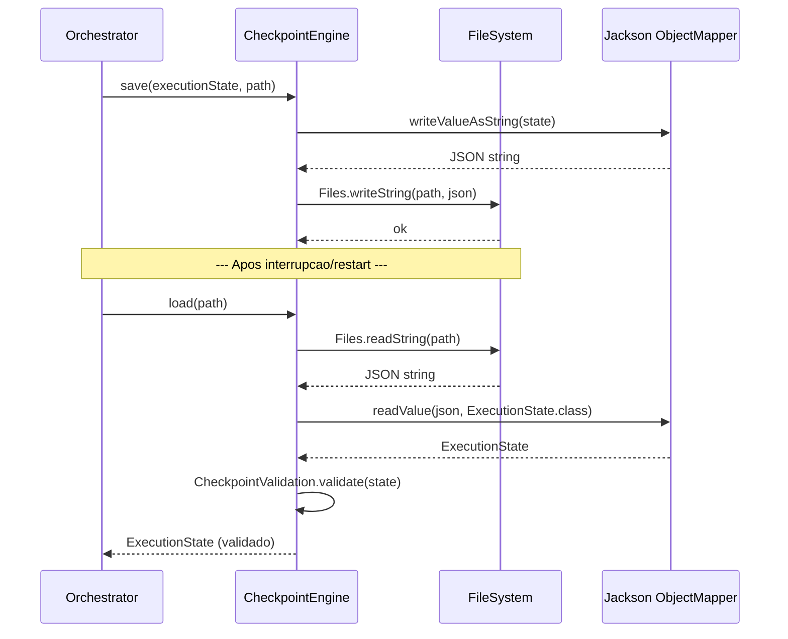
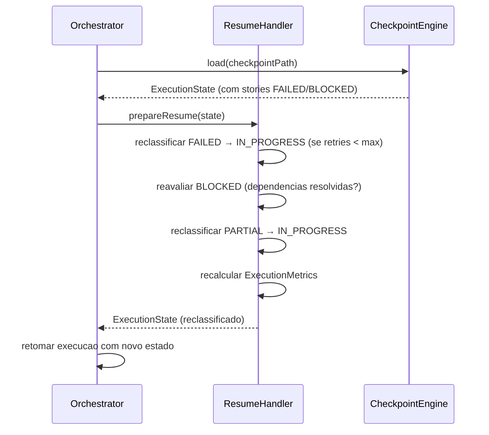
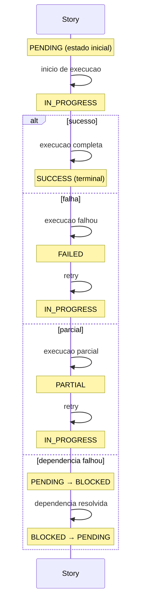

# Historia: Sistema de Checkpoint (Gerenciamento de Estado de Execucao)

**ID:** story-0006-0024

## 1. Dependencias

| Blocked By | Blocks |
| :--- | :--- |
| story-0006-0002, story-0006-0003 | story-0006-0026 |

## 2. Regras Transversais Aplicaveis

| ID | Titulo |
| :--- | :--- |
| RULE-003 | Factory Method fromMap() |
| RULE-007 | Zero Dependencia de Framework no Dominio |
| RULE-009 | Compatibilidade Cross-Platform |

## 3. Descricao

Como **Desenvolvedor Java**, eu quero portar o modulo `checkpoint/` completo para Java, permitindo salvar, carregar e atualizar o estado de execucao de epicos, de modo que execucoes interrompidas possam ser retomadas sem perder progresso.

O sistema de checkpoint persiste o estado de execucao de um epico em JSON, permitindo:
- Rastrear o status de cada story individualmente (PENDING, IN_PROGRESS, SUCCESS, FAILED, BLOCKED, PARTIAL)
- Salvar e carregar estado completo via JSON (Jackson)
- Retomar execucao apos falha, reclassificando stories e recalculando metricas
- Calcular metricas agregadas (stories completas, ETA, throughput)

### 3.1 StoryStatus Enum

Enum com 6 estados que representam o ciclo de vida de uma story durante execucao:

- `PENDING` — aguardando execucao (estado inicial)
- `IN_PROGRESS` — execucao em andamento
- `SUCCESS` — concluida com sucesso
- `FAILED` — falhou durante execucao
- `BLOCKED` — bloqueada por dependencia que falhou
- `PARTIAL` — parcialmente concluida (alguns sub-artefatos gerados)

Transicoes validas:
- PENDING → IN_PROGRESS (inicio de execucao)
- IN_PROGRESS → SUCCESS | FAILED | PARTIAL (resultado de execucao)
- FAILED → IN_PROGRESS (retry)
- PARTIAL → IN_PROGRESS (retry)
- PENDING → BLOCKED (dependencia falhou)
- BLOCKED → PENDING (dependencia resolvida)

### 3.2 StoryEntry

Record representando o estado individual de uma story:

- `status` (StoryStatus) — estado atual
- `commitSha` (String, nullable) — SHA do commit se concluida
- `phase` (int) — fase de execucao (0-based)
- `duration` (long) — duracao em milissegundos
- `retries` (int) — numero de tentativas
- `blockedBy` (List\<String\>) — IDs de stories que bloqueiam esta
- `summary` (String, nullable) — resumo da execucao
- `findingsCount` (int) — numero de achados (issues encontradas)

### 3.3 IntegrityGateEntry

Record representando o resultado de um gate de integridade:

- `gateName` (String) — nome do gate (ex: "compilation", "tests", "coverage")
- `passed` (boolean) — se o gate passou
- `message` (String, nullable) — mensagem de detalhe
- `timestamp` (Instant) — momento da verificacao

### 3.4 ExecutionMetrics

Record com metricas agregadas da execucao:

- `storiesCompleted` (int) — total de stories com status SUCCESS
- `storiesTotal` (int) — total de stories no epico
- `storiesFailed` (int) — total com status FAILED
- `storiesBlocked` (int) — total com status BLOCKED
- `estimatedRemainingMinutes` (double) — ETA baseado na media de duracoes
- `elapsedMs` (long) — tempo total decorrido
- `averageStoryDurationMs` (double) — media de duracao das stories concluidas
- `storyDurations` (Map\<String, Long\>) — duracao individual por story ID
- `phaseDurations` (Map\<Integer, Long\>) — duracao agregada por fase

### 3.5 ExecutionState

Record principal representando o estado completo de uma execucao de epico:

- `epicId` (String) — ID do epico (ex: "EPIC-0006")
- `branch` (String) — branch Git de execucao
- `startedAt` (Instant) — timestamp de inicio
- `currentPhase` (int) — fase atual de execucao
- `mode` (ExecutionMode enum: FULL, PARTIAL, DRY_RUN) — modo de execucao
- `stories` (Map\<String, StoryEntry\>) — estado de cada story por ID
- `integrityGates` (Map\<String, IntegrityGateEntry\>) — resultados de gates
- `metrics` (ExecutionMetrics) — metricas agregadas

### 3.6 CheckpointEngine

Classe responsavel pelo CRUD de estado de execucao:

- `save(state: ExecutionState, path: Path)` — serializa para JSON via Jackson e escreve no path
- `load(path: Path): ExecutionState` — le JSON e desserializa para ExecutionState
- `updateStory(state: ExecutionState, storyId: String, entry: StoryEntry): ExecutionState` — retorna novo estado com story atualizada (imutabilidade)
- `updateMetrics(state: ExecutionState): ExecutionState` — recalcula metricas a partir do estado das stories

Usa Jackson ObjectMapper configurado com `JavaTimeModule` para serializar `Instant`. Formato JSON indentado para legibilidade.

### 3.7 CheckpointValidation

Valida o estado ao carregar:

- `epicId` nao pode ser null ou vazio
- `branch` nao pode ser null ou vazio
- `startedAt` nao pode ser null
- `stories` nao pode ser null (pode ser vazio)
- Status de stories devem ser valores validos do enum
- Retorna `List<String>` com erros de validacao

### 3.8 ResumeHandler

Logica para retomar execucao apos falha:

- `prepareResume(state: ExecutionState): ExecutionState` — reclassifica stories para retry
  - Stories FAILED com `retries < maxRetries` → IN_PROGRESS (tentativa de retry)
  - Stories BLOCKED cujas dependencias falharam → reavalia se dependencias foram resolvidas
  - Stories PARTIAL → IN_PROGRESS (retenta completar)
  - Recalcula metricas apos reclassificacao

## 4. Definicoes de Qualidade Locais

### DoR Local (Definition of Ready)

- [ ] Data classes de dominio implementadas (story-0006-0002 concluida)
- [ ] Hierarquia de excecoes implementada (story-0006-0003 concluida)
- [ ] Codigo TypeScript `checkpoint/` lido e compreendido
- [ ] Jackson Databind disponivel como dependencia (story-0006-0001)
- [ ] Formato JSON de checkpoint TypeScript documentado

### DoD Local (Definition of Done)

- [ ] StoryStatus enum com 6 valores e transicoes validadas
- [ ] StoryEntry, IntegrityGateEntry, ExecutionMetrics e ExecutionState implementados como records
- [ ] CheckpointEngine save/load faz round-trip JSON perfeito (serializa e desserializa sem perda)
- [ ] CheckpointEngine.updateStory retorna novo estado imutavel
- [ ] CheckpointValidation rejeita estados invalidos com mensagens claras
- [ ] ResumeHandler reclassifica stories corretamente apos falha
- [ ] Todas as classes no pacote `checkpoint` (RULE-007: zero imports de framework no dominio, exceto Jackson no CheckpointEngine que e adapter)
- [ ] Testes unitarios para cada componente com cobertura >= 95%

### Global Definition of Done (DoD)

- **Cobertura:** >= 95% Line Coverage, >= 90% Branch Coverage (JaCoCo)
- **Testes Automatizados:** Unitarios (JUnit 5 + AssertJ), integracao, golden file
- **Relatorio de Cobertura:** JaCoCo HTML + XML
- **Documentacao:** Javadoc em classes publicas
- **Performance:** Geracao completa < 2s
- **TDD Compliance:** Test-first, refactoring explicito, TPP incremental

## 5. Contratos de Dados (Data Contract)

**ExecutionState JSON Schema:**

```json
{
  "epicId": "EPIC-0006",
  "branch": "feat/epic-0006",
  "startedAt": "2026-03-19T10:00:00Z",
  "currentPhase": 2,
  "mode": "FULL",
  "stories": {
    "story-0006-0001": {
      "status": "SUCCESS",
      "commitSha": "abc123",
      "phase": 0,
      "duration": 120000,
      "retries": 0,
      "blockedBy": [],
      "summary": "Projeto Maven criado",
      "findingsCount": 0
    }
  },
  "integrityGates": {
    "compilation": {
      "gateName": "compilation",
      "passed": true,
      "message": null,
      "timestamp": "2026-03-19T10:05:00Z"
    }
  },
  "metrics": {
    "storiesCompleted": 5,
    "storiesTotal": 31,
    "storiesFailed": 1,
    "storiesBlocked": 2,
    "estimatedRemainingMinutes": 45.5,
    "elapsedMs": 600000,
    "averageStoryDurationMs": 120000.0,
    "storyDurations": { "story-0006-0001": 120000 },
    "phaseDurations": { "0": 240000, "1": 360000 }
  }
}
```

**StoryStatus Enum:**

| Valor | Descricao | Transicoes Permitidas |
| :--- | :--- | :--- |
| PENDING | Aguardando execucao | → IN_PROGRESS, → BLOCKED |
| IN_PROGRESS | Em execucao | → SUCCESS, → FAILED, → PARTIAL |
| SUCCESS | Concluida com sucesso | (terminal) |
| FAILED | Falhou | → IN_PROGRESS (retry) |
| BLOCKED | Bloqueada por dependencia | → PENDING (dependencia resolvida) |
| PARTIAL | Parcialmente concluida | → IN_PROGRESS (retry) |

**CheckpointEngine API:**

| Metodo | Input | Output | Descricao |
| :--- | :--- | :--- | :--- |
| `save(state, path)` | ExecutionState, Path | void | Serializa estado para JSON |
| `load(path)` | Path | ExecutionState | Desserializa JSON para estado |
| `updateStory(state, storyId, entry)` | ExecutionState, String, StoryEntry | ExecutionState | Retorna novo estado com story atualizada |
| `updateMetrics(state)` | ExecutionState | ExecutionState | Recalcula metricas agregadas |

## 6. Diagramas

### 6.1 Fluxo de Save/Load de Checkpoint



### 6.2 Fluxo de Resume apos Falha



### 6.3 Transicoes de StoryStatus



## 7. Criterios de Aceite (Gherkin)

```gherkin
Cenario: Save e load preservam estado completo (round-trip JSON)
  DADO que existe um ExecutionState com epicId "EPIC-0006", 3 stories e 1 integrity gate
  QUANDO CheckpointEngine.save() e invocado com um path temporario
  E CheckpointEngine.load() e invocado com o mesmo path
  ENTAO o ExecutionState carregado e identico ao original
  E todos os campos (epicId, branch, startedAt, stories, gates, metrics) estao preservados
  E os Instants estao com precisao de milissegundos

Cenario: Story transiciona PENDING para IN_PROGRESS para SUCCESS
  DADO que existe um ExecutionState com story "story-001" no status PENDING
  QUANDO updateStory e invocado mudando status para IN_PROGRESS
  ENTAO o novo estado contem story "story-001" com status IN_PROGRESS
  QUANDO updateStory e invocado mudando status para SUCCESS com commitSha "abc123"
  ENTAO o novo estado contem story "story-001" com status SUCCESS e commitSha "abc123"

Cenario: Story FAILED incrementa retries
  DADO que existe um ExecutionState com story "story-002" no status IN_PROGRESS com retries=0
  QUANDO updateStory e invocado mudando status para FAILED com retries=1
  ENTAO o novo estado contem story "story-002" com status FAILED e retries=1

Cenario: Story com dependencia FAILED fica BLOCKED
  DADO que existe um ExecutionState com story "story-003" que depende de "story-002"
  E story "story-002" tem status FAILED
  QUANDO a verificacao de dependencias e executada
  ENTAO story "story-003" e marcada como BLOCKED
  E blockedBy contem "story-002"

Cenario: ResumeHandler reclassifica stories apos retry
  DADO que existe um ExecutionState com story "story-002" FAILED (retries=1, maxRetries=3)
  E story "story-003" BLOCKED por "story-002"
  QUANDO ResumeHandler.prepareResume() e invocado
  ENTAO story "story-002" e reclassificada para IN_PROGRESS (retries mantido em 1)
  E story "story-003" permanece BLOCKED (dependencia ainda nao resolvida)

Cenario: ExecutionMetrics calcula estimatedRemainingMinutes
  DADO que existe um ExecutionState com 10 stories total, 4 SUCCESS com duracoes [60s, 120s, 90s, 130s]
  QUANDO updateMetrics e invocado
  ENTAO storiesCompleted e 4
  E storiesTotal e 10
  E averageStoryDurationMs e 100000 (media de 60+120+90+130 em ms)
  E estimatedRemainingMinutes e calculado como (6 * 100000) / 60000 = 10.0

Cenario: CheckpointValidation rejeita estado sem epicId
  DADO que existe um ExecutionState com epicId null
  QUANDO CheckpointValidation.validate() e invocado
  ENTAO a lista de erros contem "epicId is required"
  E o estado NAO e aceito pelo CheckpointEngine.load()
```

### 7.1 Scenario Ordering (TPP)

> Scenarios seguem TPP: caso mais simples (round-trip JSON) → transicao de estado linear (PENDING → SUCCESS) → incremento de campo (retries) → logica condicional (dependencia FAILED → BLOCKED) → logica de reclassificacao (ResumeHandler) → calculo numerico (metricas com ETA) → validacao negativa (estado invalido).

### 7.2 Mandatory Scenario Categories

- [x] Degenerate cases (estado sem epicId — validacao)
- [x] Happy path (round-trip JSON, transicao PENDING → SUCCESS)
- [x] Error paths (story FAILED, CheckpointValidation rejeita estado invalido)
- [x] Boundary values (metricas calculadas com duracoes, reclassificacao de BLOCKED)

### 7.3 TDD Implementation Notes

**Outer loop (acceptance):** Testar round-trip JSON completo: criar ExecutionState → save → load → comparar. Usar arquivos temporarios (`@TempDir` do JUnit 5).

**Inner loop (unit):**
1. `StoryStatus` enum — valores e toString
2. `StoryEntry` record — criacao e campos
3. `ExecutionState` record — criacao com todos os campos
4. `CheckpointEngine.save()` — serializa JSON legivel
5. `CheckpointEngine.load()` — desserializa JSON
6. Round-trip (save + load) — verificar igualdade
7. `CheckpointEngine.updateStory()` — imutabilidade (novo estado, antigo inalterado)
8. `CheckpointValidation` — rejeitar epicId null/vazio
9. `ExecutionMetrics` calculo — ETA e medias
10. `ResumeHandler` — reclassificacao de FAILED/BLOCKED/PARTIAL

## 8. Sub-tarefas

- [ ] [Dev] `StoryStatus` enum com 6 valores (PENDING, IN_PROGRESS, SUCCESS, FAILED, BLOCKED, PARTIAL)
- [ ] [Dev] `ExecutionMode` enum com 3 valores (FULL, PARTIAL, DRY_RUN)
- [ ] [Dev] `StoryEntry` record com campos status, commitSha, phase, duration, retries, blockedBy, summary, findingsCount
- [ ] [Dev] `IntegrityGateEntry` record com campos gateName, passed, message, timestamp
- [ ] [Dev] `ExecutionMetrics` record com campos storiesCompleted, storiesTotal, storiesFailed, storiesBlocked, estimatedRemainingMinutes, elapsedMs, averageStoryDurationMs, storyDurations, phaseDurations
- [ ] [Dev] `ExecutionState` record com campos epicId, branch, startedAt, currentPhase, mode, stories, integrityGates, metrics
- [ ] [Dev] `CheckpointEngine` com save(state, path), load(path), updateStory(state, storyId, entry), updateMetrics(state)
- [ ] [Dev] Jackson ObjectMapper configurado com JavaTimeModule, indentacao, e tratamento de null
- [ ] [Dev] `CheckpointValidation` com validate(state): List\<String\> erros
- [ ] [Dev] `ResumeHandler` com prepareResume(state): ExecutionState — reclassificacao de FAILED, BLOCKED, PARTIAL
- [ ] [Test] Unitario: round-trip JSON (save + load) preserva estado completo
- [ ] [Test] Unitario: transicoes de estado PENDING → IN_PROGRESS → SUCCESS
- [ ] [Test] Unitario: FAILED incrementa retries
- [ ] [Test] Unitario: dependencia FAILED resulta em BLOCKED
- [ ] [Test] Unitario: ResumeHandler reclassifica stories corretamente
- [ ] [Test] Unitario: ExecutionMetrics calcula ETA e medias corretamente
- [ ] [Test] Unitario: CheckpointValidation rejeita estado sem epicId
- [ ] [Test] Unitario: CheckpointValidation rejeita estado sem branch
- [ ] [Test] Unitario: updateStory retorna novo estado (imutabilidade — original inalterado)
- [ ] [Doc] Javadoc em StoryStatus, StoryEntry, ExecutionState, CheckpointEngine, ResumeHandler
