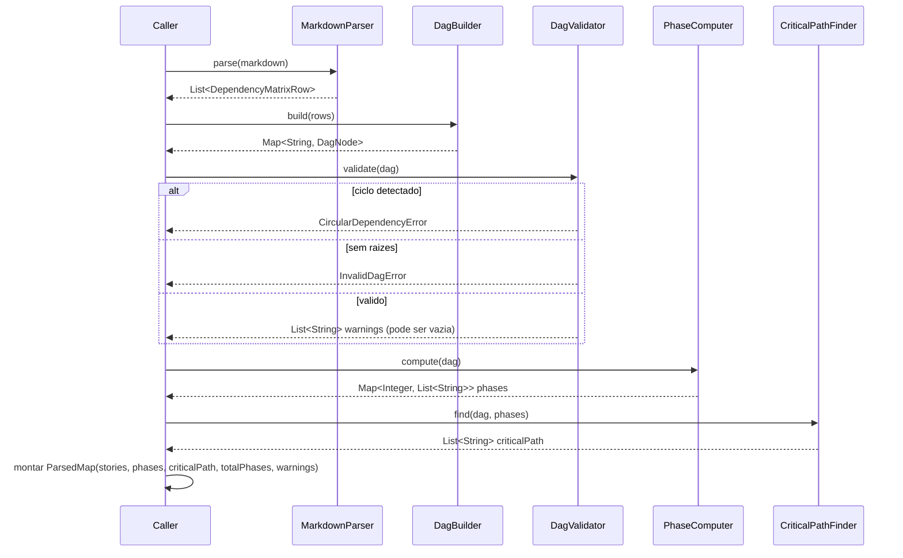
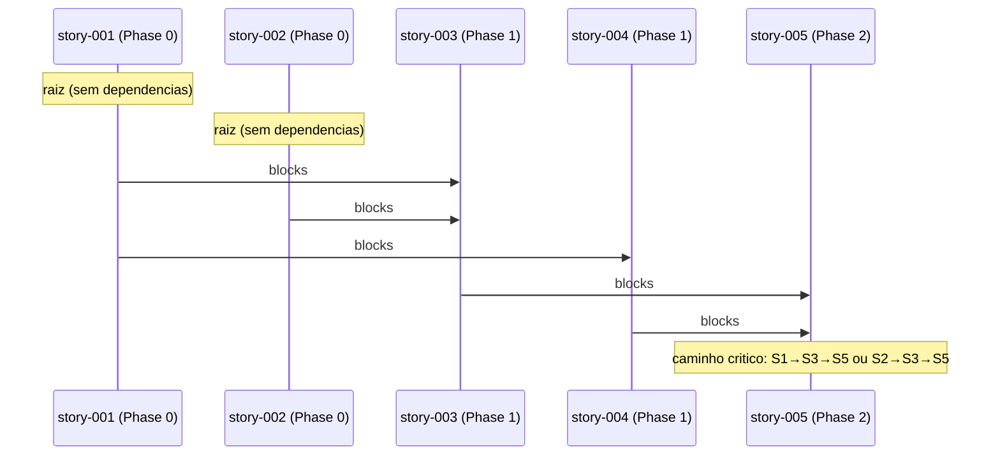

# Historia: Parser de Implementation Map (DAG, Fases e Caminho Critico)

**ID:** story-0006-0025

## 1. Dependencias

| Blocked By | Blocks |
| :--- | :--- |
| story-0006-0002, story-0006-0003 | — |

## 2. Regras Transversais Aplicaveis

| ID | Titulo |
| :--- | :--- |
| RULE-003 | Factory Method fromMap() |
| RULE-007 | Zero Dependencia de Framework no Dominio |

## 3. Descricao

Como **Desenvolvedor Java**, eu quero portar o modulo `domain/implementation-map/` completo para Java, permitindo parsear tabelas Markdown de dependencias, construir DAGs, validar integridade, computar fases de execucao e encontrar o caminho critico, habilitando a execucao ordenada de stories em epicos.

O modulo de Implementation Map e responsavel por transformar a tabela Markdown de dependencias de um epico (como a secao 5 do EPIC-0006) em uma estrutura computavel: um DAG (Directed Acyclic Graph) que define a ordem de execucao. A partir do DAG, calcula fases (niveis de paralelismo), caminho critico (cadeia mais longa), e filtra stories executaveis.

### 3.1 MarkdownParser

Parseia tabelas Markdown no formato de dependency matrix. Extrai rows com campos: storyId, title, blockedBy (lista de IDs). O parser identifica o header da tabela e extrai dados de cada linha.

Formato de entrada esperado:
```markdown
| ID | Titulo | Dependencias (Blocked By) |
| :--- | :--- | :--- |
| story-0006-0001 | Projeto Maven | — |
| story-0006-0005 | Carregador YAML | story-0006-0002, story-0006-0003 |
```

### 3.2 DependencyMatrixRow

Record representando uma linha da tabela:
- `storyId` (String) — ID da story
- `title` (String) — titulo da story
- `blockedBy` (List\<String\>) — lista de IDs que bloqueiam esta story (vazia se raiz)

### 3.3 DagBuilder

Constroi o grafo direcionado aciclico a partir das rows:
- Cria um `DagNode` para cada row
- Preenche `blockedBy` (dependencias de entrada) e `blocks` (dependencias de saida)
- Resolve referencias entre nodes (A blockedBy B implica B blocks A)

### 3.4 DagNode

Record representando um node no DAG:
- `storyId` (String) — ID da story
- `title` (String) — titulo
- `blockedBy` (List\<String\>) — IDs dos quais depende
- `blocks` (List\<String\>) — IDs que dependem deste
- `phase` (int) — fase de execucao calculada (-1 se nao calculada)
- `isOnCriticalPath` (boolean) — se esta no caminho critico

### 3.5 DagValidator

Valida integridade do DAG:

- **Simetria de dependencias**: se A declara blockedBy B, entao B deve existir no DAG. Se B declara blockedBy A, assimetria deve ser reportada como warning.
- **Deteccao de ciclos**: usa DFS (Depth-First Search) com coloracao (WHITE, GRAY, BLACK) para detectar ciclos. Se ciclo encontrado, retorna lista de IDs envolvidos.
- **Verificacao de raizes**: ao menos um node deve ter `blockedBy` vazio (raiz). Se nao houver raizes, o DAG e invalido.
- **Verificacao de referencias**: IDs referenciados em `blockedBy` devem existir como nodes.

### 3.6 PhaseComputer

Calcula fases de execucao (niveis topologicos):

- **Phase 0**: nodes sem dependencias (raizes)
- **Phase N**: nodes cujas dependencias estao todas em fases < N
- Algoritmo: topological sort por camadas (Kahn's algorithm adaptado)
- O resultado e `Map<Integer, List<String>>` mapeando fase → lista de story IDs

### 3.7 CriticalPathFinder

Encontra o caminho critico (cadeia mais longa de dependencias):

- Usa o DAG com fases calculadas
- O caminho critico e a sequencia de nodes que determina o comprimento minimo de execucao
- Algoritmo: longest path in DAG via dynamic programming
- Retorna `List<String>` ordenada da raiz ao leaf mais profundo

### 3.8 ExecutableStories e PartialExecution

- `ExecutableStories.filter(dag, completedStories)` — retorna stories cujas dependencias estao todas em `completedStories` (prontas para execucao)
- `PartialExecution` — suporta 3 modos:
  - `BY_PHASE(phaseNumber)` — executa apenas stories de uma fase especifica
  - `BY_STORY(storyIds)` — executa apenas stories listadas (com validacao de dependencias)
  - `FULL` — executa todas as stories

### 3.9 ParsedMap (Facade)

Record consolidado retornado pelo pipeline completo:

- `stories` (Map\<String, DagNode\>) — todos os nodes por ID
- `phases` (Map\<Integer, List\<String\>\>) — stories agrupadas por fase
- `criticalPath` (List\<String\>) — caminho critico
- `totalPhases` (int) — numero total de fases
- `warnings` (List\<String\>) — avisos de validacao (nao bloqueantes)

### 3.10 Custom Errors

- `CircularDependencyError` — lancado quando ciclo detectado. Mensagem inclui IDs do ciclo.
- `InvalidDagError` — lancado para DAG estruturalmente invalido (sem raizes, referencia inexistente).
- `MapParseError` — lancado para erros de parse do Markdown (formato invalido, tabela ausente).

## 4. Definicoes de Qualidade Locais

### DoR Local (Definition of Ready)

- [ ] Data classes de dominio implementadas (story-0006-0002 concluida)
- [ ] Hierarquia de excecoes implementada (story-0006-0003 concluida)
- [ ] Codigo TypeScript `domain/implementation-map/` lido e compreendido
- [ ] Formato da tabela Markdown de dependency matrix documentado
- [ ] Algoritmos de DAG (topological sort, cycle detection, longest path) estudados

### DoD Local (Definition of Done)

- [ ] MarkdownParser extrai rows corretamente de tabelas Markdown
- [ ] DagBuilder constroi DAG com blockedBy e blocks simetricos
- [ ] DagValidator detecta ciclos, assimetrias, raizes ausentes e referencias invalidas
- [ ] PhaseComputer calcula fases corretas para DAGs de ate 31 stories
- [ ] CriticalPathFinder encontra caminho critico correto
- [ ] ExecutableStories filtra stories executaveis com base em dependencias concluidas
- [ ] PartialExecution suporta 3 modos de execucao
- [ ] ParsedMap consolida resultado completo do pipeline
- [ ] Custom errors com mensagens claras incluindo IDs envolvidos
- [ ] Nenhuma classe importa frameworks externos (RULE-007)
- [ ] Testes unitarios para cada componente individualmente
- [ ] Teste de integracao: parse → build → validate → compute → find (pipeline completo)

### Global Definition of Done (DoD)

- **Cobertura:** >= 95% Line Coverage, >= 90% Branch Coverage (JaCoCo)
- **Testes Automatizados:** Unitarios (JUnit 5 + AssertJ), integracao, golden file
- **Relatorio de Cobertura:** JaCoCo HTML + XML
- **Documentacao:** Javadoc em classes publicas
- **Performance:** Geracao completa < 2s
- **TDD Compliance:** Test-first, refactoring explicito, TPP incremental

## 5. Contratos de Dados (Data Contract)

**MarkdownParser:**

| Metodo | Input | Output | Descricao |
| :--- | :--- | :--- | :--- |
| `parse(markdown: String)` | Markdown string com tabela | List\<DependencyMatrixRow\> | Extrai rows da tabela |

**DagBuilder:**

| Metodo | Input | Output | Descricao |
| :--- | :--- | :--- | :--- |
| `build(rows: List<DependencyMatrixRow>)` | Lista de rows | Map\<String, DagNode\> | Constroi DAG |

**DagValidator:**

| Metodo | Input | Output | Descricao |
| :--- | :--- | :--- | :--- |
| `validate(dag: Map<String, DagNode>)` | DAG construido | List\<String\> errors | Lista de erros (vazia = valido) |

**PhaseComputer:**

| Metodo | Input | Output | Descricao |
| :--- | :--- | :--- | :--- |
| `compute(dag: Map<String, DagNode>)` | DAG validado | Map\<Integer, List\<String\>\> | Fases calculadas |

**CriticalPathFinder:**

| Metodo | Input | Output | Descricao |
| :--- | :--- | :--- | :--- |
| `find(dag: Map<String, DagNode>, phases: Map<Integer, List<String>>)` | DAG + fases | List\<String\> | Caminho critico |

**ParsedMap:**

| Campo | Tipo | Descricao |
| :--- | :--- | :--- |
| `stories` | Map\<String, DagNode\> | Todos os nodes por ID |
| `phases` | Map\<Integer, List\<String\>\> | Stories por fase |
| `criticalPath` | List\<String\> | Cadeia mais longa |
| `totalPhases` | int | Numero de fases |
| `warnings` | List\<String\> | Avisos nao-bloqueantes |

**DependencyMatrixRow:**

| Campo | Tipo | Descricao |
| :--- | :--- | :--- |
| `storyId` | String | ID da story |
| `title` | String | Titulo |
| `blockedBy` | List\<String\> | IDs de dependencias (vazia se raiz) |

## 6. Diagramas

### 6.1 Pipeline Completo: Markdown → ParsedMap



### 6.2 Exemplo de DAG com 5 Stories



## 7. Criterios de Aceite (Gherkin)

```gherkin
Cenario: Parse markdown table com 5 stories
  DADO que existe uma string Markdown com tabela contendo 5 stories
  E 2 stories sao raizes (blockedBy = "—") e 3 tem dependencias
  QUANDO MarkdownParser.parse() e invocado
  ENTAO a lista retornada contem exatamente 5 DependencyMatrixRows
  E as 2 raizes tem blockedBy vazio
  E as 3 dependentes tem blockedBy preenchido com IDs corretos

Cenario: Build DAG com dependencias corretas
  DADO que existem 5 DependencyMatrixRows com dependencias validas
  QUANDO DagBuilder.build() e invocado
  ENTAO o DAG resultante contem 5 DagNodes
  E cada node tem blockedBy e blocks consistentes
  E se story-003 blockedBy story-001, entao story-001 blocks contem story-003

Cenario: Detecta dependencia circular A→B→C→A
  DADO que existem 3 rows onde A depende de C, B depende de A, e C depende de B
  QUANDO DagValidator.validate() e invocado
  ENTAO CircularDependencyError e lancado
  E a mensagem contem os IDs A, B e C

Cenario: Detecta assimetria (A blocks B mas B nao lista A)
  DADO que existem rows onde story-002 declara blockedBy story-001
  MAS story-001 NAO existe na tabela
  QUANDO DagValidator.validate() e invocado
  ENTAO a lista de erros contem mensagem sobre referencia inexistente "story-001"

Cenario: Computa fases corretamente (Phase 0 = raizes)
  DADO que existe um DAG valido com 5 stories: 2 raizes, 2 dependem das raizes, 1 depende das 2 intermediarias
  QUANDO PhaseComputer.compute() e invocado
  ENTAO Phase 0 contem as 2 raizes
  E Phase 1 contem as 2 intermediarias
  E Phase 2 contem a story final
  E totalPhases e 3

Cenario: Encontra caminho critico
  DADO que existe um DAG com fases calculadas
  E a cadeia mais longa e story-001 → story-003 → story-005 (3 niveis)
  QUANDO CriticalPathFinder.find() e invocado
  ENTAO o caminho critico contem ["story-001", "story-003", "story-005"]
  E os DagNodes no caminho tem isOnCriticalPath = true

Cenario: Partial execution por fase
  DADO que existe um ParsedMap com 3 fases
  QUANDO PartialExecution.BY_PHASE(1) e aplicado
  ENTAO apenas stories da Phase 1 sao retornadas como executaveis
  E stories de Phase 0 e Phase 2 NAO sao incluidas

Cenario: DAG sem raizes lanca erro
  DADO que existem 3 rows onde todas tem dependencias mutuas (nenhuma raiz)
  MAS nao formam ciclo direto (A depende de B, B depende de C, C depende de A — este e ciclo)
  QUANDO DagValidator.validate() e invocado
  ENTAO um erro e reportado (CircularDependencyError ou InvalidDagError)
  E a mensagem indica que o DAG nao possui raizes ou contem ciclo
```

### 7.1 Scenario Ordering (TPP)

> Scenarios seguem TPP: parse simples (Markdown → rows) → construcao de grafo (rows → DAG) → deteccao de ciclo (erro estrutural) → deteccao de assimetria (erro de referencia) → computacao de fases (algoritmo de niveis) → caminho critico (longest path) → partial execution (filtragem) → DAG invalido sem raizes (caso degenerado).

### 7.2 Mandatory Scenario Categories

- [x] Degenerate cases (DAG sem raizes, dependencia circular)
- [x] Happy path (parse 5 stories, build DAG, compute fases, find caminho critico)
- [x] Error paths (ciclo A→B→C→A, referencia inexistente, sem raizes)
- [x] Boundary values (partial execution por fase, assimetria de dependencias)

### 7.3 TDD Implementation Notes

**Outer loop (acceptance):** Testar pipeline completo parse → build → validate → compute → find com Markdown real de 5+ stories. Verificar que ParsedMap contem dados corretos.

**Inner loop (unit):**
1. `DependencyMatrixRow` record — criacao e campos
2. `MarkdownParser.parse()` — tabela simples com 2 rows (1 raiz, 1 dependente)
3. `DagBuilder.build()` — 2 nodes com relacao blockedBy/blocks
4. `DagValidator` — DAG valido (lista vazia de erros)
5. `DagValidator` — ciclo detectado (3 nodes circulares)
6. `DagValidator` — referencia inexistente
7. `PhaseComputer` — DAG linear (A→B→C, 3 fases de 1 story cada)
8. `PhaseComputer` — DAG com paralelismo (2 raizes, 1 dependente)
9. `CriticalPathFinder` — caminho critico em DAG com branches
10. `ExecutableStories` — filtrar por completed
11. `PartialExecution` — BY_PHASE, BY_STORY, FULL
12. Pipeline completo (integracao) com 5+ stories

## 8. Sub-tarefas

- [ ] [Dev] `DependencyMatrixRow` record com storyId, title, blockedBy
- [ ] [Dev] `DagNode` record com storyId, title, blockedBy, blocks, phase, isOnCriticalPath
- [ ] [Dev] `MarkdownParser` com parse(markdown): List\<DependencyMatrixRow\> — regex para extrair rows de tabela Markdown
- [ ] [Dev] `DagBuilder` com build(rows): Map\<String, DagNode\> — construcao de grafo com resolucao bidirecional
- [ ] [Dev] `DagValidator` com validate(dag): List\<String\> — deteccao de ciclos (DFS), simetria, raizes, referencias
- [ ] [Dev] `PhaseComputer` com compute(dag): Map\<Integer, List\<String\>\> — topological sort por camadas
- [ ] [Dev] `CriticalPathFinder` com find(dag, phases): List\<String\> — longest path via dynamic programming
- [ ] [Dev] `ExecutableStories` com filter(dag, completedStories): List\<String\> — stories prontas para execucao
- [ ] [Dev] `PartialExecution` com modos BY_PHASE, BY_STORY, FULL
- [ ] [Dev] `ParsedMap` record facade consolidando stories, phases, criticalPath, totalPhases, warnings
- [ ] [Dev] Custom errors: `CircularDependencyError`, `InvalidDagError`, `MapParseError` com mensagens contextuais
- [ ] [Test] Unitario: MarkdownParser com tabela valida de 5 stories
- [ ] [Test] Unitario: MarkdownParser com tabela mal formatada (MapParseError)
- [ ] [Test] Unitario: DagBuilder com dependencias validas (blockedBy/blocks simetricos)
- [ ] [Test] Unitario: DagValidator detecta ciclo A→B→C→A
- [ ] [Test] Unitario: DagValidator detecta referencia inexistente
- [ ] [Test] Unitario: DagValidator aceita DAG valido sem erros
- [ ] [Test] Unitario: PhaseComputer com DAG de 3 fases
- [ ] [Test] Unitario: CriticalPathFinder com DAG de 5 stories
- [ ] [Test] Unitario: ExecutableStories filtra corretamente
- [ ] [Test] Unitario: PartialExecution BY_PHASE retorna apenas fase selecionada
- [ ] [Test] Integracao: pipeline completo parse → build → validate → compute → find
- [ ] [Doc] Javadoc em MarkdownParser, DagBuilder, DagValidator, PhaseComputer, CriticalPathFinder, ParsedMap
