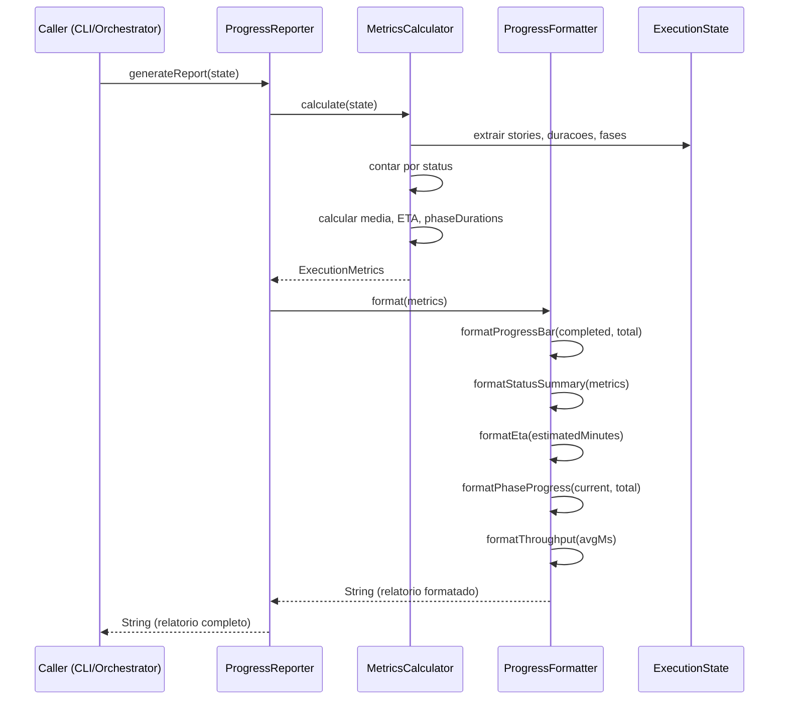
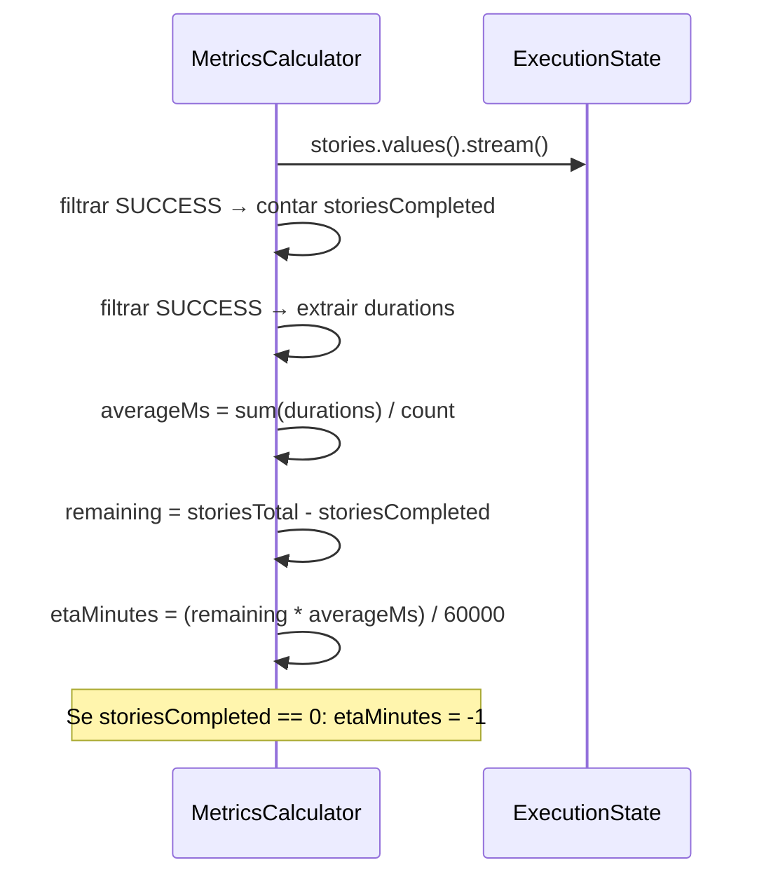

# Historia: Relatorios de Progresso (Metricas e Formatacao)

**ID:** story-0006-0026

## 1. Dependencias

| Blocked By | Blocks |
| :--- | :--- |
| story-0006-0024 | — |

## 2. Regras Transversais Aplicaveis

| ID | Titulo |
| :--- | :--- |
| RULE-007 | Zero Dependencia de Framework no Dominio |

## 3. Descricao

Como **Desenvolvedor Java**, eu quero portar o modulo `progress/` para Java, permitindo calcular metricas de execucao, formatar relatorios de progresso em texto legivel e gerar relatorios consolidados, de modo que o usuario acompanhe o andamento de execucoes de epicos em tempo real.

O modulo de progresso opera sobre o `ExecutionState` (story-0006-0024) e transforma dados brutos de execucao em metricas computadas e texto formatado para exibicao no terminal.

### 3.1 MetricsCalculator

Calcula metricas agregadas a partir do `ExecutionState`:

- **storiesCompleted**: contagem de stories com status SUCCESS
- **storiesTotal**: total de stories no epico
- **storiesFailed**: contagem com status FAILED
- **storiesBlocked**: contagem com status BLOCKED
- **elapsedMs**: diferenca entre agora e `startedAt` (em milissegundos)
- **averageStoryDurationMs**: media de `duration` das stories com status SUCCESS. Se nenhuma story concluida, retorna 0.0
- **estimatedRemainingMinutes**: `(storiesTotal - storiesCompleted) * averageStoryDurationMs / 60000`. Se nenhuma story concluida, retorna -1 (indeterminado)
- **storyDurations**: mapa de storyId → duration para stories com duration > 0
- **phaseDurations**: mapa de fase → soma das duracoes das stories naquela fase

O calculo e puro (sem efeitos colaterais) e retorna um novo `ExecutionMetrics`.

### 3.2 ProgressFormatter

Formata metricas em texto legivel para exibicao no terminal:

- **Barra de progresso**: `[████████░░░░░░░░░░░░] 5/10 (50%)`
  - Largura fixa de 20 caracteres
  - Caracteres: `█` para preenchido, `░` para vazio
- **Status summary**: `SUCCESS: 5 | FAILED: 1 | BLOCKED: 2 | PENDING: 2`
- **ETA**: `Estimated remaining: 10.5 min` ou `Estimated remaining: unknown` se indeterminado
- **Phase progress**: `Phase 2/5 in progress`
- **Throughput**: `Average: 2.0 min/story`

Todos os metodos sao estaticos e retornam String. Nao manteem estado.

### 3.3 ProgressReporter

Gera relatorio de progresso consolidado combinando MetricsCalculator e ProgressFormatter:

- `generateReport(state: ExecutionState): String` — calcula metricas e formata relatorio completo
- O relatorio inclui: barra de progresso, status summary, ETA, phase progress, lista de stories por status
- Formato:

```
=== Epic Execution Progress ===
[████████░░░░░░░░░░░░] 5/10 (50%)
SUCCESS: 5 | FAILED: 1 | BLOCKED: 2 | PENDING: 2
Phase 2/5 in progress
Estimated remaining: 10.5 min
Average: 2.0 min/story

Stories by status:
  SUCCESS: story-001, story-002, story-003, story-004, story-005
  FAILED: story-006
  BLOCKED: story-007, story-008
  PENDING: story-009, story-010
```

### 3.4 Casos Especiais

- **Estado vazio** (0 stories): metricas zeradas, barra de progresso vazia, ETA "unknown"
- **Todas as stories concluidas**: barra cheia, ETA "0.0 min", status summary sem FAILED/BLOCKED/PENDING
- **Nenhuma story concluida**: barra vazia, ETA "unknown", averageStoryDurationMs = 0
- **Apenas stories FAILED**: progresso 0%, ETA "unknown"

## 4. Definicoes de Qualidade Locais

### DoR Local (Definition of Ready)

- [ ] Sistema de checkpoint implementado (story-0006-0024 concluida)
- [ ] ExecutionState, StoryEntry, ExecutionMetrics disponiveis
- [ ] Codigo TypeScript `progress/` lido e compreendido
- [ ] Formato de relatorio do TypeScript documentado para paridade

### DoD Local (Definition of Done)

- [ ] MetricsCalculator calcula todas as metricas corretamente a partir do ExecutionState
- [ ] ProgressFormatter formata barra de progresso, status, ETA e throughput
- [ ] ProgressReporter gera relatorio consolidado legivel
- [ ] Casos especiais tratados: estado vazio, todas concluidas, nenhuma concluida
- [ ] ETA calculado com base na media de duracoes das stories concluidas
- [ ] Metricas puras (sem side effects, retorna novo objeto)
- [ ] Testes unitarios para cada componente com cobertura >= 95%

### Global Definition of Done (DoD)

- **Cobertura:** >= 95% Line Coverage, >= 90% Branch Coverage (JaCoCo)
- **Testes Automatizados:** Unitarios (JUnit 5 + AssertJ), integracao, golden file
- **Relatorio de Cobertura:** JaCoCo HTML + XML
- **Documentacao:** Javadoc em classes publicas
- **Performance:** Geracao completa < 2s
- **TDD Compliance:** Test-first, refactoring explicito, TPP incremental

## 5. Contratos de Dados (Data Contract)

**MetricsCalculator:**

| Metodo | Input | Output | Descricao |
| :--- | :--- | :--- | :--- |
| `calculate(state: ExecutionState)` | ExecutionState | ExecutionMetrics | Calcula metricas agregadas |

**ProgressFormatter:**

| Metodo | Input | Output | Descricao |
| :--- | :--- | :--- | :--- |
| `formatProgressBar(completed: int, total: int)` | contagens | String | Barra de progresso |
| `formatStatusSummary(metrics: ExecutionMetrics)` | metricas | String | Resumo por status |
| `formatEta(estimatedMinutes: double)` | minutos | String | ETA formatado |
| `formatPhaseProgress(currentPhase: int, totalPhases: int)` | fases | String | Fase atual |
| `formatThroughput(avgMs: double)` | media em ms | String | Throughput formatado |
| `format(metrics: ExecutionMetrics)` | metricas | String | Relatorio formatado completo |

**ProgressReporter:**

| Metodo | Input | Output | Descricao |
| :--- | :--- | :--- | :--- |
| `generateReport(state: ExecutionState)` | ExecutionState | String | Relatorio consolidado |

**ExecutionMetrics (referencia de story-0006-0024):**

| Campo | Tipo | Descricao |
| :--- | :--- | :--- |
| `storiesCompleted` | int | Total com SUCCESS |
| `storiesTotal` | int | Total de stories |
| `storiesFailed` | int | Total com FAILED |
| `storiesBlocked` | int | Total com BLOCKED |
| `estimatedRemainingMinutes` | double | ETA (-1 se indeterminado) |
| `elapsedMs` | long | Tempo decorrido total |
| `averageStoryDurationMs` | double | Media de duracao (0 se nenhuma concluida) |
| `storyDurations` | Map\<String, Long\> | Duracao por story |
| `phaseDurations` | Map\<Integer, Long\> | Duracao agregada por fase |

## 6. Diagramas

### 6.1 Fluxo de Geracao de Relatorio



### 6.2 Calculo de ETA



## 7. Criterios de Aceite (Gherkin)

```gherkin
Cenario: Calcula ETA com base em media de duracoes
  DADO que existe um ExecutionState com 10 stories total
  E 4 stories SUCCESS com duracoes [60000ms, 120000ms, 90000ms, 130000ms]
  E 6 stories PENDING
  QUANDO MetricsCalculator.calculate() e invocado
  ENTAO averageStoryDurationMs e 100000 (media de 60000+120000+90000+130000 / 4)
  E estimatedRemainingMinutes e 10.0 ((6 * 100000) / 60000)

Cenario: Formata progresso como "5/10 stories (50%)"
  DADO que ExecutionMetrics tem storiesCompleted=5 e storiesTotal=10
  QUANDO ProgressFormatter.formatProgressBar(5, 10) e invocado
  ENTAO o resultado contem "[██████████░░░░░░░░░░] 5/10 (50%)"
  E a barra tem exatamente 10 caracteres preenchidos e 10 vazios

Cenario: Report inclui stories por status
  DADO que existe um ExecutionState com stories em diferentes status
  E 3 stories SUCCESS, 1 FAILED, 2 BLOCKED, 4 PENDING
  QUANDO ProgressReporter.generateReport() e invocado
  ENTAO o relatorio contem "SUCCESS: 3 | FAILED: 1 | BLOCKED: 2 | PENDING: 4"
  E a secao "Stories by status:" lista IDs agrupados por status

Cenario: Metricas zeradas para estado vazio
  DADO que existe um ExecutionState com 0 stories (map vazio)
  QUANDO MetricsCalculator.calculate() e invocado
  ENTAO storiesCompleted e 0
  E storiesTotal e 0
  E averageStoryDurationMs e 0.0
  E estimatedRemainingMinutes e -1 (indeterminado)
  E storyDurations e um mapa vazio
  E phaseDurations e um mapa vazio

Cenario: phaseDurations agrega duracoes de stories por fase
  DADO que existe um ExecutionState com stories em 3 fases
  E Phase 0: story-001 (60000ms), story-002 (80000ms)
  E Phase 1: story-003 (120000ms)
  E Phase 2: story-004 (90000ms), story-005 (110000ms)
  QUANDO MetricsCalculator.calculate() e invocado
  ENTAO phaseDurations contem {0: 140000, 1: 120000, 2: 200000}
```

### 7.1 Scenario Ordering (TPP)

> Scenarios seguem TPP: caso numerico simples (ETA com media) → formatacao de string (barra de progresso) → composicao de report (stories por status) → caso degenerado (estado vazio, metricas zeradas) → agregacao por fase (phaseDurations).

### 7.2 Mandatory Scenario Categories

- [x] Degenerate cases (estado vazio com 0 stories)
- [x] Happy path (calcula ETA, formata progresso, gera report)
- [x] Error paths (ETA indeterminado quando nenhuma story concluida)
- [x] Boundary values (phaseDurations agrega corretamente, barra de progresso em 50%)

### 7.3 TDD Implementation Notes

**Outer loop (acceptance):** Testar ProgressReporter.generateReport() com ExecutionState completo e verificar que o relatorio contem todas as secoes esperadas.

**Inner loop (unit):**
1. `MetricsCalculator` — estado vazio (caso mais simples, metricas zeradas)
2. `MetricsCalculator` — 1 story SUCCESS (averageMs = duration, ETA calculado)
3. `MetricsCalculator` — 4 stories SUCCESS (media correta, ETA correto)
4. `MetricsCalculator` — phaseDurations com multiplas fases
5. `ProgressFormatter.formatProgressBar()` — 0/10, 5/10, 10/10
6. `ProgressFormatter.formatStatusSummary()` — todas as combinacoes de status
7. `ProgressFormatter.formatEta()` — valor positivo, -1 (indeterminado)
8. `ProgressFormatter.formatThroughput()` — valor positivo, 0
9. `ProgressReporter.generateReport()` — integracao MetricsCalculator + ProgressFormatter

## 8. Sub-tarefas

- [ ] [Dev] `MetricsCalculator.java` com metodo calculate(ExecutionState): ExecutionMetrics — contagens por status, media de duracoes, ETA, storyDurations, phaseDurations
- [ ] [Dev] `ProgressFormatter.java` com metodos estaticos: formatProgressBar, formatStatusSummary, formatEta, formatPhaseProgress, formatThroughput, format
- [ ] [Dev] `ProgressReporter.java` com metodo generateReport(ExecutionState): String — combina MetricsCalculator e ProgressFormatter
- [ ] [Dev] Tratamento de casos especiais: estado vazio, 0 stories concluidas (ETA = -1), todas concluidas (ETA = 0)
- [ ] [Test] Unitario: MetricsCalculator com estado vazio retorna metricas zeradas
- [ ] [Test] Unitario: MetricsCalculator calcula ETA corretamente com 4 stories SUCCESS
- [ ] [Test] Unitario: MetricsCalculator calcula phaseDurations agregando por fase
- [ ] [Test] Unitario: MetricsCalculator retorna ETA -1 quando nenhuma story concluida
- [ ] [Test] Unitario: ProgressFormatter.formatProgressBar com 0%, 50%, 100%
- [ ] [Test] Unitario: ProgressFormatter.formatStatusSummary com todas as combinacoes
- [ ] [Test] Unitario: ProgressFormatter.formatEta com valor positivo e indeterminado
- [ ] [Test] Unitario: ProgressFormatter.formatThroughput com valor positivo e zero
- [ ] [Test] Unitario: ProgressReporter.generateReport gera relatorio completo com todas as secoes
- [ ] [Test] Unitario: ProgressReporter.generateReport com estado vazio gera relatorio com metricas zeradas
- [ ] [Doc] Javadoc em MetricsCalculator, ProgressFormatter e ProgressReporter
