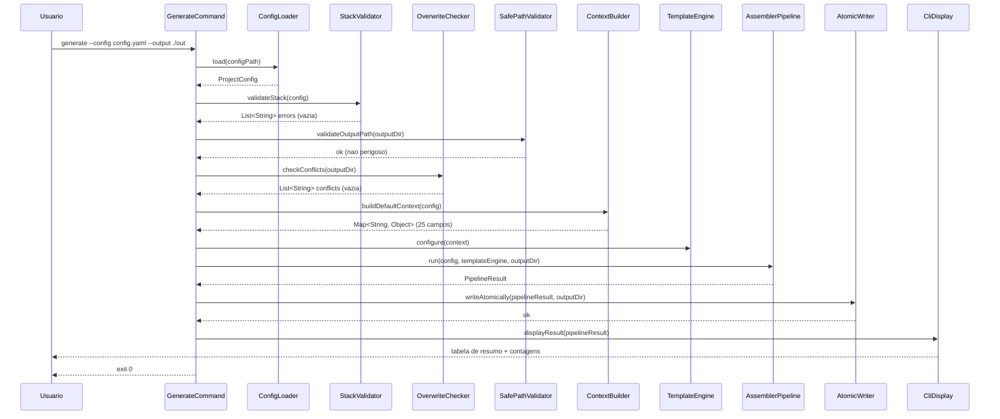
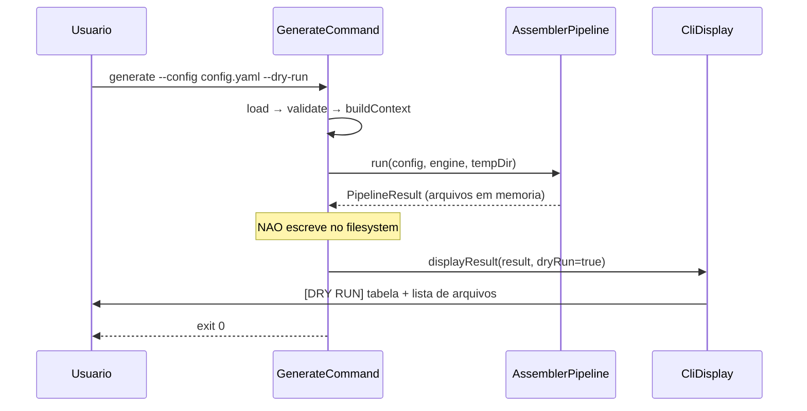
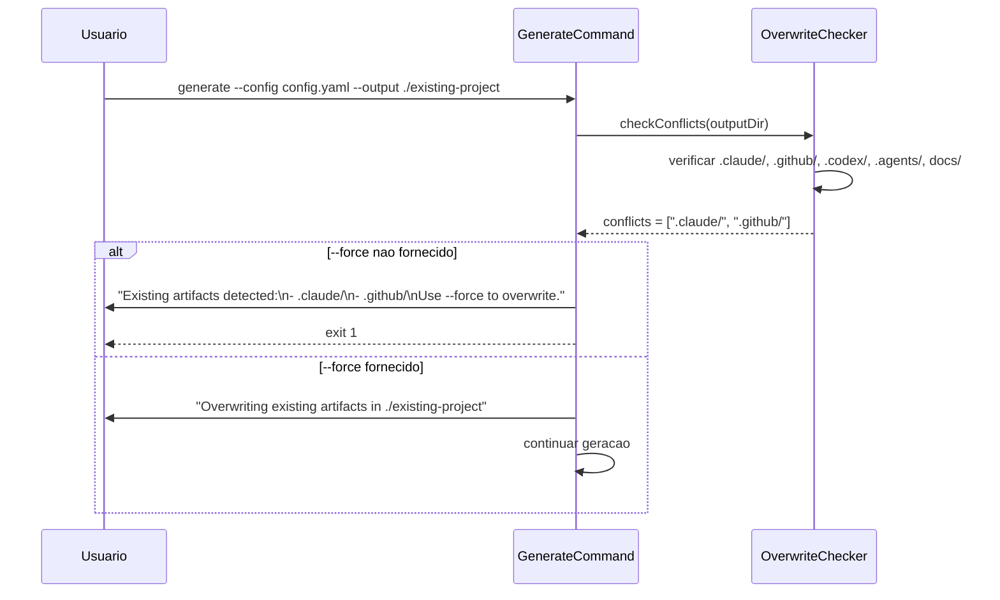

# Historia: Comando Generate End-to-End e CLI Display

**ID:** story-0006-0027

## 1. Dependencias

| Blocked By | Blocks |
| :--- | :--- |
| story-0006-0001, story-0006-0005, story-0006-0008, story-0006-0009, story-0006-0010, story-0006-0011, story-0006-0012, story-0006-0013, story-0006-0014, story-0006-0015, story-0006-0016, story-0006-0017, story-0006-0018, story-0006-0019, story-0006-0020, story-0006-0021 | story-0006-0028, story-0006-0029, story-0006-0030 |

## 2. Regras Transversais Aplicaveis

| ID | Titulo |
| :--- | :--- |
| RULE-001 | Paridade Byte-a-Byte |
| RULE-005 | Ordem de Execucao Pipeline |
| RULE-008 | Output Atomico |
| RULE-011 | Rejeicao de Caminhos Perigosos |
| RULE-012 | Deteccao de Overwrite |

## 3. Descricao

Como **Desenvolvedor Java**, eu quero integrar todos os componentes no comando `generate` end-to-end, de modo que a CLI Java produza output completo identico ao TypeScript, com suporte a todos os flags (--dry-run, --force, --verbose, --output-dir), exibicao formatada de resultados e tratamento robusto de erros.

Esta e a historia de integracao final do comando `generate`. Conecta todas as pecas: carregamento de config (YAML ou interactive), validacao, verificacao de overwrite, construcao do TemplateEngine com contexto, execucao do AssemblerPipeline com 23 assemblers na ordem fixa (RULE-005), escrita atomica de output (RULE-008), e exibicao formatada do resultado via CliDisplay.

### 3.1 GenerateCommand (Implementacao Completa)

O `GenerateCommand.call()` implementa o fluxo completo:

1. **Parse options**: ler --config, --interactive, --output-dir, --resources-dir, --verbose, --dry-run, --force
2. **Load config**: se --config, carregar via ConfigLoader; se --interactive, usar InteractivePrompter; se --stack, carregar perfil bundled
3. **Validate**: executar StackValidator.validateStack(config). Se erros, exibir e retornar exit 1
4. **Check overwrite**: verificar existencia de .claude/, .github/, .codex/, .agents/, docs/ no output-dir. Se existirem e --force nao fornecido, abortar com lista de conflitos (RULE-012)
5. **Reject dangerous paths**: verificar que output-dir nao e home, root ou diretorio de sistema (RULE-011)
6. **Build context**: criar TemplateEngine com ContextBuilder.buildDefaultContext(config) — 25 campos (RULE-010)
7. **Run pipeline**: executar AssemblerPipeline.run() com 23 assemblers na ordem fixa (RULE-005)
8. **Write output**: se nao --dry-run, escrever atomicamente (RULE-008). Se --dry-run, apenas listar arquivos
9. **Display result**: usar CliDisplay para formatar e exibir resultado

### 3.2 CliDisplay

Classe responsavel pela formatacao do resultado do pipeline para o terminal:

- **classifyFiles(paths: List\<String\>)**: classifica arquivos por tipo baseado no path:
  - `.claude/rules/` → "Rules"
  - `.claude/skills/` → "Skills"
  - `.claude/agents/` → "Agents"
  - `.claude/hooks/` → "Hooks"
  - `.claude/settings` → "Settings"
  - `.github/instructions/` → "GitHub Instructions"
  - `.github/skills/` → "GitHub Skills"
  - `.github/agents/` → "GitHub Agents"
  - `.github/hooks/` → "GitHub Hooks"
  - `.github/prompts/` → "GitHub Prompts"
  - `.github/copilot-*` → "GitHub Config"
  - `.codex/` → "Codex"
  - `.agents/` → "Agents MD"
  - `docs/` → "Documentation"
  - `CLAUDE.md`, `README.md` → "Root Files"
  - Outros → "Other"

- **formatSummaryTable(classified: Map\<String, List\<String\>\>)**: gera tabela formatada:
  ```
  Category              Count
  ─────────────────────────────
  Rules                     5
  Skills                   14
  Agents                    8
  ...
  ─────────────────────────────
  Total                    52
  ```

- **displayResult(result: PipelineResult)**: exibe resultado completo:
  - Tabela de resumo
  - Warnings (se houver)
  - Diretorio de output
  - Tempo de execucao

### 3.3 Dry-Run Mode

Quando `--dry-run` ativo:
- Pipeline e executado normalmente para determinar quais arquivos seriam gerados
- Nenhum arquivo e escrito no filesystem
- Output exibe "[DRY RUN]" no header
- Lista todos os arquivos que seriam gerados com seus paths relativos
- Exibe tabela de resumo com contagens

### 3.4 Force Mode

Quando `--force` ativo:
- Pula verificacao de overwrite (RULE-012)
- Sobrescreve artefatos existentes sem perguntar
- Exibe warning: "Overwriting existing artifacts in <path>"

### 3.5 Verbose Mode

Quando `--verbose` ativo:
- Exibe nome de cada assembler antes da execucao: "Running RulesAssembler..."
- Exibe tempo de cada assembler apos execucao: "RulesAssembler completed in 15ms (5 files)"
- Exibe contexto de template (25 campos) resumido
- Exibe warnings de validacao detalhados

### 3.6 Performance

- Pipeline completo DEVE executar em < 2s para qualquer perfil bundled
- Tempo medido do inicio do `call()` ate retorno do exit code
- Se exceder 2s, nao e erro mas deve ser reportado em verbose mode

### 3.7 Exit Codes

| Exit Code | Significado |
| :--- | :--- |
| 0 | Geracao concluida com sucesso |
| 1 | Erro de validacao, overwrite sem --force, ou caminho perigoso |
| 2 | Erro de execucao (IOException, template error, etc.) |

## 4. Definicoes de Qualidade Locais

### DoR Local (Definition of Ready)

- [ ] CLI bootstrap funcional (story-0006-0001)
- [ ] ConfigLoader funcional (story-0006-0005)
- [ ] StackValidator e StackResolver implementados (story-0006-0008)
- [ ] Interface Assembler e AssemblerPipeline implementados (story-0006-0009)
- [ ] Todos os 23 assemblers implementados (stories 0010-0021)
- [ ] TemplateEngine com Pebble funcional (story-0006-0006)
- [ ] Utilitarios de I/O e output atomico (story-0006-0007)
- [ ] Golden files do TypeScript disponiveis para comparacao

### DoD Local (Definition of Done)

- [ ] `generate --config java-quarkus.yaml` gera todos os arquivos corretamente
- [ ] `--dry-run` lista arquivos sem escrever
- [ ] `--force` sobrescreve artefatos existentes
- [ ] Sem `--force`, aborta ao detectar artefatos existentes
- [ ] `--verbose` exibe log detalhado de cada assembler
- [ ] CliDisplay exibe tabela de resumo com contagens por categoria
- [ ] Caminhos perigosos (home, root, /usr, /etc) sao rejeitados
- [ ] Pipeline completo executa em < 2s para java-quarkus
- [ ] Exit codes corretos (0 sucesso, 1 validacao, 2 execucao)
- [ ] Testes de integracao para cada flag e cenario de erro

### Global Definition of Done (DoD)

- **Cobertura:** >= 95% Line Coverage, >= 90% Branch Coverage (JaCoCo)
- **Testes Automatizados:** Unitarios (JUnit 5 + AssertJ), integracao, golden file
- **Relatorio de Cobertura:** JaCoCo HTML + XML
- **Documentacao:** Javadoc em classes publicas
- **Performance:** Geracao completa < 2s
- **TDD Compliance:** Test-first, refactoring explicito, TPP incremental

## 5. Contratos de Dados (Data Contract)

**GenerateCommand CLI Options:**

| Opcao | Curta | Tipo | Default | Obrigatorio |
| :--- | :--- | :--- | :--- | :--- |
| `--config` | `-c` | String (path) | — | Condicional (exclusivo com -i e -s) |
| `--interactive` | `-i` | boolean | false | Condicional (exclusivo com -c e -s) |
| `--stack` | `-s` | String | — | Condicional (exclusivo com -c e -i) |
| `--output` | `-o` | String (path) | `.` | O |
| `--resources-dir` | — | String (path) | classpath | O |
| `--verbose` | `-v` | boolean | false | O |
| `--dry-run` | — | boolean | false | O |
| `--force` | `-f` | boolean | false | O |

**GenerateCommand.call() Flow:**

| Step | Input | Output | Guard |
| :--- | :--- | :--- | :--- |
| parseOptions | CLI args | Options object | — |
| loadConfig | --config/--interactive/--stack | ProjectConfig | Mutual exclusivity |
| validate | ProjectConfig | List\<String\> errors | Exit 1 if errors |
| checkOverwrite | output-dir | List\<String\> conflicts | Exit 1 if conflicts and no --force |
| rejectDangerousPaths | output-dir | — | Exit 1 if dangerous |
| buildContext | ProjectConfig | Map\<String, Object\> (25 campos) | — |
| runPipeline | context, TemplateEngine, output-dir | PipelineResult | — |
| writeOutput | PipelineResult, output-dir | — | Skip if --dry-run |
| displayResult | PipelineResult | stdout | — |

**CliDisplay API:**

| Metodo | Input | Output | Descricao |
| :--- | :--- | :--- | :--- |
| `classifyFiles(paths)` | List\<String\> | Map\<String, List\<String\>\> | Classifica por categoria |
| `formatSummaryTable(classified)` | Map | String | Tabela formatada |
| `displayResult(result)` | PipelineResult | void (stdout) | Exibe resultado completo |

**Categorias de Classificacao:**

| Prefixo de Path | Categoria |
| :--- | :--- |
| `.claude/rules/` | Rules |
| `.claude/skills/` | Skills |
| `.claude/agents/` | Agents |
| `.claude/hooks/` | Hooks |
| `.claude/settings` | Settings |
| `.github/instructions/` | GitHub Instructions |
| `.github/skills/` | GitHub Skills |
| `.github/agents/` | GitHub Agents |
| `.github/hooks/` | GitHub Hooks |
| `.github/prompts/` | GitHub Prompts |
| `.github/copilot-*` | GitHub Config |
| `.codex/` | Codex |
| `.agents/` | Agents MD |
| `docs/` | Documentation |
| `CLAUDE.md`, `README.md` | Root Files |

## 6. Diagramas

### 6.1 Fluxo Completo do GenerateCommand



### 6.2 Fluxo de Dry-Run



### 6.3 Fluxo de Overwrite Detection



## 7. Criterios de Aceite (Gherkin)

```gherkin
Cenario: Generate com config valida produz arquivos corretos
  DADO que existe um arquivo YAML valido com configuracao java-quarkus completa
  E o diretorio de output esta vazio
  QUANDO o usuario executa "generate --config java-quarkus.yaml --output /tmp/test-output"
  ENTAO os arquivos sao gerados no diretorio de output
  E a estrutura inclui .claude/ com rules, skills, agents, hooks, settings
  E a estrutura inclui .github/ com instructions, skills, agents, hooks, prompts
  E CLAUDE.md e gerado na raiz do output
  E o exit code e 0

Cenario: --dry-run lista arquivos sem escrever
  DADO que existe um arquivo YAML valido com configuracao java-quarkus completa
  QUANDO o usuario executa "generate --config java-quarkus.yaml --dry-run"
  ENTAO a saida contem "[DRY RUN]"
  E a saida lista todos os arquivos que seriam gerados
  E a tabela de resumo mostra contagens por categoria
  E NENHUM arquivo e escrito no filesystem
  E o exit code e 0

Cenario: --force sobrescreve artefatos existentes
  DADO que o diretorio de output ja contem .claude/ e .github/
  E existe um arquivo YAML valido
  QUANDO o usuario executa "generate --config config.yaml --output ./existing --force"
  ENTAO a saida contem "Overwriting existing artifacts"
  E os arquivos sao gerados sobrescrevendo os existentes
  E o exit code e 0

Cenario: Sem --force aborta com conflitos
  DADO que o diretorio de output ja contem .claude/ e .github/
  E existe um arquivo YAML valido
  QUANDO o usuario executa "generate --config config.yaml --output ./existing"
  ENTAO a saida contem "Existing artifacts detected"
  E a saida lista ".claude/" e ".github/" como conflitos
  E a saida sugere usar "--force"
  E NENHUM arquivo e gerado
  E o exit code e 1

Cenario: --verbose exibe log detalhado
  DADO que existe um arquivo YAML valido
  QUANDO o usuario executa "generate --config config.yaml --verbose"
  ENTAO a saida contem "Running RulesAssembler..."
  E a saida contem "completed in" com tempo em milissegundos
  E a saida mostra o nome de cada assembler executado
  E o exit code e 0

Cenario: Display mostra tabela com contagens por categoria
  DADO que o pipeline gerou 52 arquivos em multiplas categorias
  QUANDO CliDisplay.displayResult() e invocado
  ENTAO a tabela mostra categorias como "Rules", "Skills", "Agents", "GitHub Instructions"
  E cada categoria mostra a contagem de arquivos
  E o total e exibido no final

Cenario: Pipeline completo executa em menos de 2 segundos para java-quarkus
  DADO que existe um arquivo YAML com configuracao java-quarkus completa
  QUANDO o usuario executa "generate --config java-quarkus.yaml --output /tmp/perf-test"
  ENTAO a execucao completa em menos de 2000 milissegundos
  E todos os arquivos sao gerados corretamente
  E o exit code e 0

Cenario: Exit code 0 para sucesso e 1 para erro
  DADO que existe um arquivo YAML com configuracao invalida (secao language ausente)
  QUANDO o usuario executa "generate --config invalid.yaml"
  ENTAO o exit code e 1
  E a saida contem mensagem de erro de validacao
  DADO que existe um arquivo YAML valido
  QUANDO o usuario executa "generate --config valid.yaml --output /tmp/test"
  ENTAO o exit code e 0
```

### 7.1 Scenario Ordering (TPP)

> Scenarios seguem TPP: caso mais simples (generate com config valida) → dry-run (sem escrita) → force (sobrescrita) → conflito sem force (abort) → verbose (output detalhado) → display (formatacao de tabela) → performance (< 2s) → exit codes (validacao de comportamento geral).

### 7.2 Mandatory Scenario Categories

- [x] Degenerate cases (config invalida, conflito sem force)
- [x] Happy path (generate com config valida, --force, --dry-run)
- [x] Error paths (conflito sem --force, exit code 1 para validacao)
- [x] Boundary values (performance < 2s, display com 52 arquivos, verbose com todos os assemblers)

### 7.3 TDD Implementation Notes

**Outer loop (acceptance):** Testar GenerateCommand end-to-end via Picocli `CommandLine.execute()` com configs reais. Verificar arquivos gerados em diretorio temporario (`@TempDir`). Medir tempo de execucao para performance.

**Inner loop (unit):**
1. `GenerateCommand` com config valida — fluxo minimo (load → validate → pipeline → display)
2. `CliDisplay.classifyFiles()` — classificacao por path prefix
3. `CliDisplay.formatSummaryTable()` — tabela formatada com contagens
4. Dry-run mode — pipeline executa mas nao escreve
5. Overwrite detection — conflitos detectados e reportados
6. Force mode — pula overwrite check
7. Verbose mode — output detalhado de cada assembler
8. Dangerous path rejection — home, root, /usr rejeitados
9. Exit codes — 0 para sucesso, 1 para validacao, 2 para execucao
10. Integracao completa com java-quarkus config (end-to-end)

## 8. Sub-tarefas

- [ ] [Dev] `GenerateCommand.java` completo — implementar `call()` com fluxo loadConfig → validate → checkOverwrite → rejectDangerousPaths → buildContext → runPipeline → writeOutput → displayResult
- [ ] [Dev] Wire config loading: --config (ConfigLoader), --interactive (InteractivePrompter), --stack (bundled profile)
- [ ] [Dev] Wire validate: StackValidator.validateStack() com formatacao de erros para stdout
- [ ] [Dev] Wire overwrite detection: verificar .claude/, .github/, .codex/, .agents/, docs/ no output-dir (RULE-012)
- [ ] [Dev] Wire dangerous path rejection: home, root, /usr, /etc, /var, /bin, /sbin (RULE-011)
- [ ] [Dev] Wire pipeline: ContextBuilder → TemplateEngine → AssemblerPipeline com 23 assemblers na ordem RULE-005
- [ ] [Dev] Wire atomic write: output via diretorio temporario + Files.move() (RULE-008)
- [ ] [Dev] `CliDisplay.java` com classifyFiles(), formatSummaryTable(), displayResult()
- [ ] [Dev] Dry-run mode: executar pipeline sem escrever, prefixar output com "[DRY RUN]"
- [ ] [Dev] Force mode: skip overwrite check, exibir warning de sobrescrita
- [ ] [Dev] Verbose mode: log de cada assembler com nome e tempo de execucao
- [ ] [Test] Integracao: generate com java-quarkus config gera arquivos corretos em @TempDir
- [ ] [Test] Integracao: generate com typescript-nestjs config (segundo perfil para confirmar generalidade)
- [ ] [Test] Integracao: dry-run lista arquivos sem escrever
- [ ] [Test] Integracao: force mode sobrescreve artefatos existentes
- [ ] [Test] Integracao: conflito sem force aborta com exit 1 e lista conflitos
- [ ] [Test] Integracao: caminho perigoso (home dir) rejeitado com exit 1
- [ ] [Test] Integracao: config invalida retorna exit 1
- [ ] [Test] Unitario: CliDisplay.classifyFiles classifica paths corretamente
- [ ] [Test] Unitario: CliDisplay.formatSummaryTable gera tabela com contagens
- [ ] [Test] Performance: pipeline completo < 2s para java-quarkus
- [ ] [Doc] Javadoc em GenerateCommand e CliDisplay
