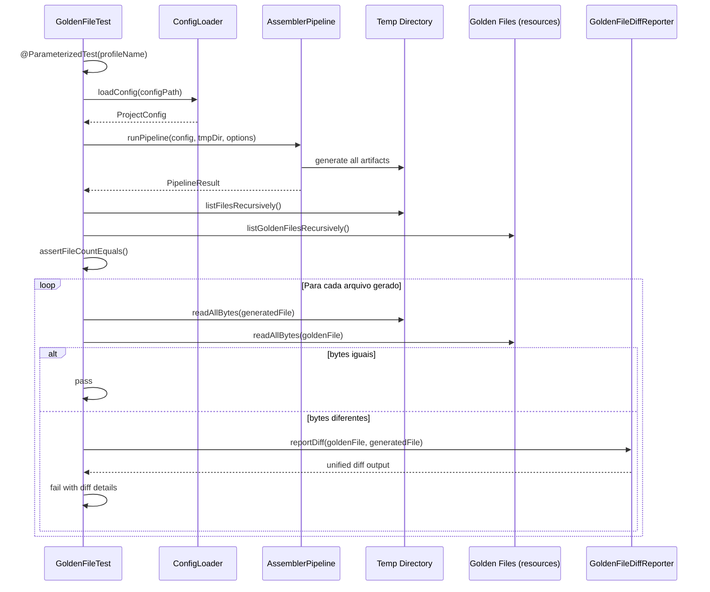
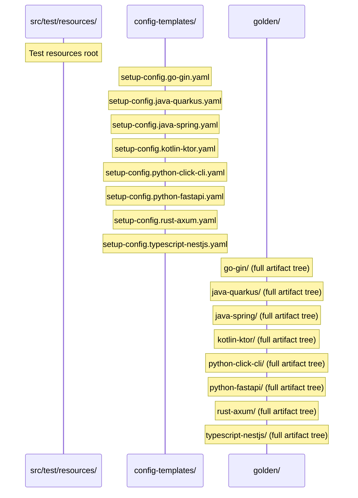

# Historia: Testes Golden File — Paridade Byte-a-Byte (8 Perfis)

**ID:** story-0006-0028

## 1. Dependencias

| Blocked By | Blocks |
| :--- | :--- |
| story-0006-0027 | story-0006-0031 |

## 2. Regras Transversais Aplicaveis

| ID | Titulo |
| :--- | :--- |
| RULE-001 | Paridade Byte-a-Byte |
| RULE-002 | Formatacao Python-Bool |
| RULE-006 | Cobertura JaCoCo |
| RULE-009 | Compatibilidade Cross-Platform |
| RULE-010 | Contexto de Template 25 Campos |

## 3. Descricao

Como **Desenvolvedor Java**, eu quero criar uma suite de testes golden file que valide paridade byte-a-byte entre o output do Java e os golden files do TypeScript para todos os 8 perfis bundled, garantindo que a versao Java produza resultados identicos a versao TypeScript original.

Esta historia e a validacao definitiva da migracao: se todos os 8 perfis passam na comparacao byte-a-byte, a paridade funcional esta garantida. Os golden files sao copiados do projeto TypeScript (`tests/golden/`) para `src/test/resources/golden/` do projeto Java. Para cada perfil, o pipeline completo e executado e cada arquivo gerado e comparado com seu golden file correspondente.

### 3.1 Copia dos Golden Files

Copiar a arvore completa de golden files do projeto TypeScript para os test resources do projeto Java:

- **Origem:** `tests/golden/{profile-name}/` (projeto TypeScript)
- **Destino:** `src/test/resources/golden/{profile-name}/` (projeto Java)
- Os 8 perfis: `go-gin`, `java-quarkus`, `java-spring`, `kotlin-ktor`, `python-click-cli`, `python-fastapi`, `rust-axum`, `typescript-nestjs`
- Manter a estrutura de diretorios identica (`.claude/`, `.github/`, `.codex/`, `.agents/`, `docs/`)
- Preservar line endings (LF) e encoding (UTF-8) durante a copia

### 3.2 Copia dos Config Templates

Copiar os config templates correspondentes para uso nos testes:

- **Origem:** `resources/config-templates/setup-config.{profile}.yaml`
- **Destino:** `src/test/resources/config-templates/setup-config.{profile}.yaml`
- Cada config template alimenta o pipeline para gerar o output que sera comparado com o golden

### 3.3 GoldenFileTest — Testes Parametrizados

Implementar `GoldenFileTest.java` usando `@ParameterizedTest` do JUnit 5:

- Parametrizar com `@MethodSource` ou `@CsvSource` contendo os 8 nomes de perfil
- Para cada perfil:
  1. Carregar o config YAML correspondente de `src/test/resources/config-templates/`
  2. Executar o pipeline completo (`AssemblerPipeline.runPipeline()`) em diretorio temporario
  3. Listar todos os arquivos gerados recursivamente
  4. Para cada arquivo gerado, localizar o golden file correspondente
  5. Comparar byte-a-byte usando `Files.readAllBytes()` e `assertThat().isEqualTo()`
  6. Se houver diferenca, invocar o diff reporter para exibir detalhes

### 3.4 Diff Reporter para Diferencas Detalhadas

Implementar utilitario `GoldenFileDiffReporter` que, em caso de diferenca:

- Mostra o caminho do arquivo que divergiu
- Exibe diff linha-a-linha no estilo unified diff (contexto de 3 linhas)
- Indica numero da linha, conteudo esperado (golden) e conteudo obtido (gerado)
- Destaca diferencas de whitespace e line endings invisiveis (ex: `\r\n` vs `\n`, trailing spaces)
- Limita o output a no maximo 50 linhas de diff por arquivo para nao poluir o log de teste

### 3.5 Validacao de Completude

Alem da comparacao byte-a-byte, verificar:

- Numero de arquivos gerados == numero de golden files (nenhum arquivo faltando ou sobrando)
- Estrutura de diretorios identica (mesmos subdiretorios)
- Nenhum arquivo extra gerado que nao exista no golden

### 3.6 Tratamento de Diferencas Legitimas

Se houver diferencas legitimas entre Java e TypeScript (ex: ordenacao de propriedades JSON, precisao de numeros float, formatacao de timestamps):

- Documentar cada diferenca como ADR em `docs/adr/`
- Justificar por que a diferenca e aceitavel
- Ajustar os golden files do Java para refletir o output correto da versao Java
- Manter os golden files originais do TypeScript como referencia separada se necessario

## 4. Definicoes de Qualidade Locais

### DoR Local (Definition of Ready)

- [ ] Comando `generate` end-to-end funcional (story-0006-0027 concluida)
- [ ] Pipeline completo executando todos os 23 assemblers para qualquer perfil
- [ ] Golden files do TypeScript disponiveis em `tests/golden/` (8 perfis)
- [ ] Config templates disponiveis em `resources/config-templates/` (8 perfis)
- [ ] Motor de templates Pebble renderizando com paridade (RULE-002 Python-Bool)

### DoD Local (Definition of Done)

- [ ] Golden files copiados para `src/test/resources/golden/` (8 perfis completos)
- [ ] Config templates copiados para `src/test/resources/config-templates/` (8 configs)
- [ ] `GoldenFileTest.java` parametrizado executa para os 8 perfis
- [ ] Todos os 8 perfis passam na comparacao byte-a-byte (zero diferencas)
- [ ] `GoldenFileDiffReporter` exibe diff detalhado em caso de falha
- [ ] Validacao de completude (numero de arquivos e estrutura de diretorios)
- [ ] Diferencas legitimas documentadas como ADR (se houver)
- [ ] Testes executam em < 30s para todos os 8 perfis combinados
- [ ] Todos os metodos publicos possuem Javadoc

### Global Definition of Done (DoD)

- **Cobertura:** ≥ 95% Line Coverage, ≥ 90% Branch Coverage (JaCoCo)
- **Testes Automatizados:** Unitarios (JUnit 5 + AssertJ), integracao, golden file
- **Relatorio de Cobertura:** JaCoCo HTML + XML
- **Documentacao:** Javadoc em classes publicas
- **Performance:** Geracao completa < 2s
- **TDD Compliance:** Test-first, refactoring explicito, TPP incremental

## 5. Contratos de Dados (Data Contract)

**Golden files source (TypeScript project):**

| Recurso | Caminho Origem | Caminho Destino (Java test resources) |
| :--- | :--- | :--- |
| Golden files | `tests/golden/{profile-name}/` | `src/test/resources/golden/{profile-name}/` |
| Config templates | `resources/config-templates/setup-config.{profile}.yaml` | `src/test/resources/config-templates/setup-config.{profile}.yaml` |

**Perfis bundled:**

| # | Profile Name | Config File |
| :--- | :--- | :--- |
| 1 | `go-gin` | `setup-config.go-gin.yaml` |
| 2 | `java-quarkus` | `setup-config.java-quarkus.yaml` |
| 3 | `java-spring` | `setup-config.java-spring.yaml` |
| 4 | `kotlin-ktor` | `setup-config.kotlin-ktor.yaml` |
| 5 | `python-click-cli` | `setup-config.python-click-cli.yaml` |
| 6 | `python-fastapi` | `setup-config.python-fastapi.yaml` |
| 7 | `rust-axum` | `setup-config.rust-axum.yaml` |
| 8 | `typescript-nestjs` | `setup-config.typescript-nestjs.yaml` |

**GoldenFileTest parametrizacao:**

| Parametro | Tipo | Descricao |
| :--- | :--- | :--- |
| `profileName` | String | Nome do perfil (ex: `go-gin`) |
| `configPath` | Path | Caminho do config YAML no classpath |
| `goldenDir` | Path | Caminho do diretorio golden no classpath |

**Diff reporter output:**

| Campo | Formato | Descricao |
| :--- | :--- | :--- |
| `filePath` | String | Caminho relativo do arquivo divergente |
| `expectedLine` | String | Linha esperada (golden) |
| `actualLine` | String | Linha obtida (gerada) |
| `lineNumber` | int | Numero da linha divergente |
| `context` | String | 3 linhas de contexto antes/depois |

## 6. Diagramas

### 6.1 Fluxo de Execucao do Golden File Test



### 6.2 Estrutura de Diretorios de Test Resources



## 7. Criterios de Aceite (Gherkin)

```gherkin
Cenario: Perfil go-gin gera output identico ao golden file
  DADO que o config template "setup-config.go-gin.yaml" e carregado
  E os golden files para "go-gin" estao em src/test/resources/golden/go-gin/
  QUANDO o pipeline completo e executado com o config carregado
  ENTÃO cada arquivo gerado deve ser byte-a-byte identico ao golden file correspondente
  E o numero de arquivos gerados deve ser igual ao numero de golden files
  E nenhum arquivo extra deve existir no output

Cenario: Perfil java-quarkus gera output identico ao golden file
  DADO que o config template "setup-config.java-quarkus.yaml" e carregado
  E os golden files para "java-quarkus" estao em src/test/resources/golden/java-quarkus/
  QUANDO o pipeline completo e executado com o config carregado
  ENTÃO cada arquivo gerado deve ser byte-a-byte identico ao golden file correspondente
  E o numero de arquivos gerados deve ser igual ao numero de golden files
  E nenhum arquivo extra deve existir no output

Cenario: Perfil java-spring gera output identico ao golden file
  DADO que o config template "setup-config.java-spring.yaml" e carregado
  E os golden files para "java-spring" estao em src/test/resources/golden/java-spring/
  QUANDO o pipeline completo e executado com o config carregado
  ENTÃO cada arquivo gerado deve ser byte-a-byte identico ao golden file correspondente
  E o numero de arquivos gerados deve ser igual ao numero de golden files
  E nenhum arquivo extra deve existir no output

Cenario: Perfil kotlin-ktor gera output identico ao golden file
  DADO que o config template "setup-config.kotlin-ktor.yaml" e carregado
  E os golden files para "kotlin-ktor" estao em src/test/resources/golden/kotlin-ktor/
  QUANDO o pipeline completo e executado com o config carregado
  ENTÃO cada arquivo gerado deve ser byte-a-byte identico ao golden file correspondente
  E o numero de arquivos gerados deve ser igual ao numero de golden files
  E nenhum arquivo extra deve existir no output

Cenario: Perfil python-click-cli gera output identico ao golden file
  DADO que o config template "setup-config.python-click-cli.yaml" e carregado
  E os golden files para "python-click-cli" estao em src/test/resources/golden/python-click-cli/
  QUANDO o pipeline completo e executado com o config carregado
  ENTÃO cada arquivo gerado deve ser byte-a-byte identico ao golden file correspondente
  E o numero de arquivos gerados deve ser igual ao numero de golden files
  E nenhum arquivo extra deve existir no output

Cenario: Perfil python-fastapi gera output identico ao golden file
  DADO que o config template "setup-config.python-fastapi.yaml" e carregado
  E os golden files para "python-fastapi" estao em src/test/resources/golden/python-fastapi/
  QUANDO o pipeline completo e executado com o config carregado
  ENTÃO cada arquivo gerado deve ser byte-a-byte identico ao golden file correspondente
  E o numero de arquivos gerados deve ser igual ao numero de golden files
  E nenhum arquivo extra deve existir no output

Cenario: Perfil rust-axum gera output identico ao golden file
  DADO que o config template "setup-config.rust-axum.yaml" e carregado
  E os golden files para "rust-axum" estao em src/test/resources/golden/rust-axum/
  QUANDO o pipeline completo e executado com o config carregado
  ENTÃO cada arquivo gerado deve ser byte-a-byte identico ao golden file correspondente
  E o numero de arquivos gerados deve ser igual ao numero de golden files
  E nenhum arquivo extra deve existir no output

Cenario: Perfil typescript-nestjs gera output identico ao golden file
  DADO que o config template "setup-config.typescript-nestjs.yaml" e carregado
  E os golden files para "typescript-nestjs" estao em src/test/resources/golden/typescript-nestjs/
  QUANDO o pipeline completo e executado com o config carregado
  ENTÃO cada arquivo gerado deve ser byte-a-byte identico ao golden file correspondente
  E o numero de arquivos gerados deve ser igual ao numero de golden files
  E nenhum arquivo extra deve existir no output
```

### 7.1 Scenario Ordering (TPP)

> Scenarios seguem TPP por complexidade crescente dos perfis: go-gin (linguagem compilada simples) → java-quarkus (Java com framework complexo) → java-spring (segundo Java, confirma generalidade) → kotlin-ktor (JVM nao-Java) → python-click-cli (CLI sem framework web) → python-fastapi (Python com framework web) → rust-axum (linguagem com build system diferente) → typescript-nestjs (linguagem do projeto original, fecha o ciclo). Cada cenario e estruturalmente identico mas exercita combinacoes diferentes de language/framework/buildTool no pipeline.

### 7.2 Mandatory Scenario Categories

- [x] Degenerate cases (go-gin — perfil com menor complexidade de output)
- [x] Happy path (todos os 8 perfis gerando output identico ao golden)
- [x] Error paths (diferencas detectadas resultam em diff detalhado via reporter — coberto implicitamente pela assertiva de igualdade)
- [x] Boundary values (python-click-cli — perfil CLI sem framework web; todos os perfis validam completude de arquivos)

### 7.3 TDD Implementation Notes

**Outer loop (acceptance):** Cada cenario Gherkin mapeia diretamente para uma execucao parametrizada do `GoldenFileTest`. O teste de aceitacao e a propria comparacao byte-a-byte: se passa, a paridade esta garantida.

**Inner loop (unit):**
1. `GoldenFileDiffReporter` — teste com dois strings conhecidos, verificar que diff unificado e gerado corretamente
2. `GoldenFileDiffReporter` — teste com strings identicos, verificar que nenhum diff e reportado
3. `GoldenFileDiffReporter` — teste com diferenca de whitespace, verificar que diferenca invisivel e destacada
4. Validacao de completude — diretorio com arquivo extra deve falhar, diretorio com arquivo faltando deve falhar
5. Integracao com pipeline — executar pipeline para um perfil simples e verificar que PipelineResult.success e true antes de comparar

## 8. Sub-tarefas

- [ ] [Dev] Copiar golden files de `tests/golden/` para `src/test/resources/golden/` (8 perfis)
- [ ] [Dev] Copiar config templates de `resources/config-templates/` para `src/test/resources/config-templates/` (8 configs)
- [ ] [Dev] Implementar `GoldenFileTest.java` com `@ParameterizedTest` e `@MethodSource` para os 8 perfis
- [ ] [Dev] Implementar `GoldenFileDiffReporter.java` com diff unificado linha-a-linha
- [ ] [Dev] Implementar validacao de completude (contagem de arquivos e estrutura de diretorios)
- [ ] [Test] Executar golden file test para perfil go-gin e validar paridade
- [ ] [Test] Executar golden file test para perfil java-quarkus e validar paridade
- [ ] [Test] Executar golden file test para perfil java-spring e validar paridade
- [ ] [Test] Executar golden file test para perfil kotlin-ktor e validar paridade
- [ ] [Test] Executar golden file test para perfil python-click-cli e validar paridade
- [ ] [Test] Executar golden file test para perfil python-fastapi e validar paridade
- [ ] [Test] Executar golden file test para perfil rust-axum e validar paridade
- [ ] [Test] Executar golden file test para perfil typescript-nestjs e validar paridade
- [ ] [Test] Documentar diferencas legitimas como ADR (se houver)
- [ ] [Doc] Atualizar README com instrucoes de como executar golden file tests
- [ ] [Doc] Javadoc em GoldenFileTest e GoldenFileDiffReporter
