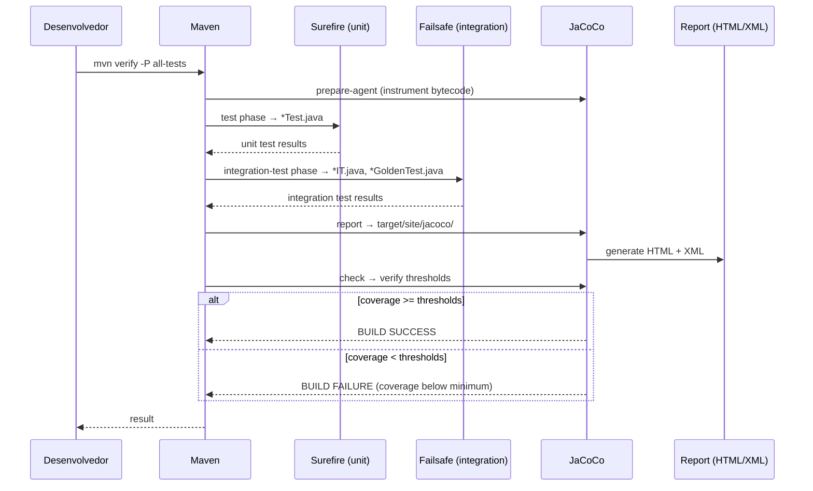
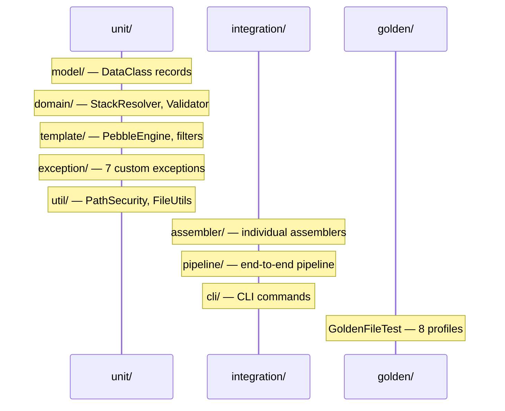

# Historia: Suite Completa de Testes e Cobertura JaCoCo

**ID:** story-0006-0029

## 1. Dependencias

| Blocked By | Blocks |
| :--- | :--- |
| story-0006-0027 | story-0006-0031 |

## 2. Regras Transversais Aplicaveis

| ID | Titulo |
| :--- | :--- |
| RULE-006 | Cobertura JaCoCo |
| RULE-007 | Zero Dependencia de Framework no Dominio |

## 3. Descricao

Como **Desenvolvedor Java**, eu quero consolidar e expandir a suite de testes para atingir os thresholds de cobertura exigidos (≥ 95% line, ≥ 90% branch) e configurar JaCoCo com enforcement automatico no Maven build, garantindo que a qualidade do codigo seja mantida ao longo de toda a evolucao do projeto.

Esta historia foca em tres eixos: (1) configuracao do JaCoCo Maven plugin com goals de instrumentacao, relatorio e verificacao; (2) organizacao dos testes em categorias claras com Surefire e Failsafe; (3) identificacao e fechamento de gaps de cobertura apos os testes das stories anteriores.

### 3.1 Configuracao do JaCoCo Maven Plugin

Configurar `jacoco-maven-plugin` no `pom.xml` com tres goals:

- **`prepare-agent`** — instrumenta o bytecode para coleta de cobertura (phase `initialize`)
- **`report`** — gera relatorio HTML e XML (phase `verify`)
- **`check`** — falha o build se cobertura ficar abaixo dos thresholds (phase `verify`)

Regras de verificacao (`check` goal):

```xml
<rule>
    <element>BUNDLE</element>
    <limits>
        <limit>
            <counter>LINE</counter>
            <value>COVEREDRATIO</value>
            <minimum>0.95</minimum>
        </limit>
        <limit>
            <counter>BRANCH</counter>
            <value>COVEREDRATIO</value>
            <minimum>0.90</minimum>
        </limit>
    </limits>
</rule>
```

Exclusoes de cobertura:
- `**/IaDevEnvApplication.class` — classe main com metodo `public static void main()` (dificil de testar unitariamente, coberto por testes de integracao CLI)
- Classes geradas (se houver) — ex: Picocli annotation processor outputs

### 3.2 Configuracao Maven Surefire e Failsafe

- **Maven Surefire Plugin** — executa testes unitarios (`*Test.java`, `*Tests.java`)
  - Configurar para rodar na phase `test`
  - Excluir testes de integracao (`*IT.java`, `*IntegrationTest.java`)
  - Excluir testes golden (`*GoldenTest.java`, `*GoldenFileTest.java`)

- **Maven Failsafe Plugin** — executa testes de integracao e golden
  - Configurar para rodar na phase `integration-test` e `verify`
  - Incluir `*IT.java`, `*IntegrationTest.java`, `*GoldenTest.java`, `*GoldenFileTest.java`
  - Fork mode para isolamento de classpath

### 3.3 Organizacao de Testes em Categorias

Reorganizar os testes em pacotes distintos:

```
src/test/java/com/iadevenv/
├── unit/           # Testes unitarios puros (sem I/O, sem filesystem)
│   ├── model/      # Data classes, records
│   ├── domain/     # StackResolver, StackValidator, mappings
│   ├── template/   # TemplateEngine, filtros
│   ├── exception/  # Excecoes customizadas
│   └── util/       # Utilitarios
├── integration/    # Testes de integracao (pipeline, filesystem, CLI)
│   ├── assembler/  # Assemblers individuais com filesystem real
│   ├── pipeline/   # Pipeline end-to-end
│   └── cli/        # Comandos CLI com execucao real
└── golden/         # Testes golden file (paridade byte-a-byte)
    └── GoldenFileTest.java
```

### 3.4 Maven Profiles para Execucao Seletiva

Definir profiles Maven para execucao granular:

- **`unit-tests`** (default ativo) — executa apenas Surefire (testes unitarios)
- **`integration-tests`** — executa apenas Failsafe (testes de integracao + golden)
- **`all-tests`** — executa Surefire + Failsafe (suite completa)

Uso:
- `mvn test` — apenas unitarios
- `mvn verify -P integration-tests` — apenas integracao
- `mvn verify -P all-tests` — suite completa com verificacao JaCoCo

### 3.5 Identificacao e Fechamento de Gaps

Apos executar a suite existente, analisar o relatorio JaCoCo para:

- Linhas nao cobertas — adicionar testes para paths nao exercitados
- Branches nao cobertos — adicionar testes para condicoes if/else, switch cases, ternarios
- Edge cases nao testados — valores nulos, listas vazias, strings em branco, limites numericos
- Paths de erro — excecoes lancadas mas nao testadas, catches sem verificacao

Foco em classes com menor cobertura:
- Assemblers com logica condicional complexa
- ConditionEvaluator com multiplas feature gates
- ConfigLoader com validacao de campos opcionais
- Utilitarios de I/O com tratamento de erros de filesystem

### 3.6 Relatorio de Cobertura

- Relatorio HTML gerado em `target/site/jacoco/index.html`
- Relatorio XML gerado em `target/site/jacoco/jacoco.xml`
- Ambos incluem cobertura por pacote, classe e metodo
- XML util para integracao com CI/CD e ferramentas de analise

## 4. Definicoes de Qualidade Locais

### DoR Local (Definition of Ready)

- [ ] Comando `generate` end-to-end funcional (story-0006-0027 concluida)
- [ ] Testes unitarios e de integracao das stories anteriores existentes
- [ ] JaCoCo ja configurado basicamente no pom.xml (story-0006-0001)
- [ ] Relatorio de cobertura inicial gerado para identificar gaps

### DoD Local (Definition of Done)

- [ ] `jacoco-maven-plugin` configurado com goals `prepare-agent`, `report` e `check`
- [ ] `check` goal falha build se line coverage < 95% ou branch coverage < 90%
- [ ] `maven-surefire-plugin` executa testes unitarios (`*Test.java`)
- [ ] `maven-failsafe-plugin` executa testes de integracao (`*IT.java`) e golden (`*GoldenTest.java`)
- [ ] Testes organizados em pacotes `unit/`, `integration/`, `golden/`
- [ ] Maven profiles `unit-tests`, `integration-tests`, `all-tests` funcionais
- [ ] Line coverage ≥ 95% verificado via `mvn verify`
- [ ] Branch coverage ≥ 90% verificado via `mvn verify`
- [ ] Relatorio HTML gerado em `target/site/jacoco/index.html`
- [ ] Relatorio XML gerado em `target/site/jacoco/jacoco.xml`
- [ ] Exclusao de `IaDevEnvApplication.class` nao afeta thresholds negativamente
- [ ] Todos os gaps de cobertura fechados com testes adicionais

### Global Definition of Done (DoD)

- **Cobertura:** ≥ 95% Line Coverage, ≥ 90% Branch Coverage (JaCoCo)
- **Testes Automatizados:** Unitarios (JUnit 5 + AssertJ), integracao, golden file
- **Relatorio de Cobertura:** JaCoCo HTML + XML
- **Documentacao:** Javadoc em classes publicas
- **Performance:** Geracao completa < 2s
- **TDD Compliance:** Test-first, refactoring explicito, TPP incremental

## 5. Contratos de Dados (Data Contract)

**JaCoCo check configuration:**

| Parametro | Valor | Descricao |
| :--- | :--- | :--- |
| `element` | BUNDLE | Nivel de verificacao (projeto inteiro) |
| `LINE.COVEREDRATIO` | 0.95 | Minimo 95% line coverage |
| `BRANCH.COVEREDRATIO` | 0.90 | Minimo 90% branch coverage |

**Exclusoes de cobertura:**

| Classe | Motivo |
| :--- | :--- |
| `**/IaDevEnvApplication.class` | Metodo main() — coberto por testes de integracao CLI |

**Maven profiles:**

| Profile | Plugin | Fase | Inclui |
| :--- | :--- | :--- | :--- |
| `unit-tests` (default) | Surefire | `test` | `*Test.java`, `*Tests.java` |
| `integration-tests` | Failsafe | `integration-test`, `verify` | `*IT.java`, `*IntegrationTest.java`, `*GoldenTest.java`, `*GoldenFileTest.java` |
| `all-tests` | Surefire + Failsafe | `test`, `integration-test`, `verify` | Todos os testes |

**Report output:**

| Artefato | Caminho | Formato |
| :--- | :--- | :--- |
| Relatorio HTML | `target/site/jacoco/index.html` | HTML navegavel |
| Relatorio XML | `target/site/jacoco/jacoco.xml` | XML para CI/CD |

**Surefire naming conventions:**

| Padrao | Categoria | Plugin |
| :--- | :--- | :--- |
| `*Test.java` | Unitario | Surefire |
| `*Tests.java` | Unitario | Surefire |
| `*IT.java` | Integracao | Failsafe |
| `*IntegrationTest.java` | Integracao | Failsafe |
| `*GoldenTest.java` | Golden file | Failsafe |
| `*GoldenFileTest.java` | Golden file | Failsafe |

## 6. Diagramas

### 6.1 Fluxo de Build com JaCoCo



### 6.2 Estrutura de Testes por Categoria



## 7. Criterios de Aceite (Gherkin)

```gherkin
Cenario: Build falha se line coverage esta abaixo de 95%
  DADO que o projeto possui testes que cobrem apenas 90% das linhas
  QUANDO "mvn verify" e executado
  ENTÃO o build deve falhar
  E a mensagem de erro deve indicar que line coverage (0.90) esta abaixo do minimo (0.95)

Cenario: Build falha se branch coverage esta abaixo de 90%
  DADO que o projeto possui testes que cobrem apenas 85% dos branches
  QUANDO "mvn verify" e executado
  ENTÃO o build deve falhar
  E a mensagem de erro deve indicar que branch coverage (0.85) esta abaixo do minimo (0.90)

Cenario: Build passa com cobertura adequada
  DADO que o projeto possui testes que cobrem ≥ 95% das linhas e ≥ 90% dos branches
  QUANDO "mvn verify -P all-tests" e executado
  ENTÃO o build deve passar com BUILD SUCCESS
  E nenhuma violacao de cobertura deve ser reportada

Cenario: Relatorio HTML gerado em target/site/jacoco/
  DADO que "mvn verify" e executado com sucesso
  QUANDO o relatorio de cobertura e gerado
  ENTÃO o arquivo "target/site/jacoco/index.html" deve existir
  E o arquivo "target/site/jacoco/jacoco.xml" deve existir
  E o HTML deve conter informacoes de cobertura por pacote e classe

Cenario: Testes de integracao executam com Maven Failsafe
  DADO que existem classes de teste nomeadas com sufixo "IT" ou "IntegrationTest"
  QUANDO "mvn verify -P integration-tests" e executado
  ENTÃO os testes de integracao devem ser executados pelo Failsafe plugin
  E os testes unitarios (*Test.java) NAO devem ser re-executados nesta fase
  E os testes golden (*GoldenFileTest.java) devem ser incluidos na execucao

Cenario: Exclusao de main class nao afeta thresholds
  DADO que "IaDevEnvApplication.class" esta excluida da analise de cobertura
  QUANDO "mvn verify" e executado
  ENTÃO a cobertura reportada NAO deve incluir a classe IaDevEnvApplication
  MAS os thresholds de 95% line e 90% branch devem ser calculados sobre as demais classes
  E a exclusao nao deve causar queda artificial dos thresholds
```

### 7.1 Scenario Ordering (TPP)

> Scenarios seguem TPP: caso de falha simples (line coverage abaixo) → segundo caso de falha (branch coverage abaixo) → happy path (build passa) → verificacao de artefato (relatorio gerado) → mecanismo interno (Failsafe executa integration tests) → edge case (exclusao de main class). Progride de validacao negativa para positiva, do simples ao complexo.

### 7.2 Mandatory Scenario Categories

- [x] Degenerate cases (cobertura insuficiente causa falha de build)
- [x] Happy path (build passa com cobertura adequada, relatorio gerado)
- [x] Error paths (line coverage < 95%, branch coverage < 90%)
- [x] Boundary values (exclusao de main class, separacao Surefire/Failsafe)

### 7.3 TDD Implementation Notes

**Outer loop (acceptance):** Testes de aceitacao verificam o comportamento do Maven build com diferentes niveis de cobertura. Na pratica, o proprio `mvn verify` e o teste de aceitacao: se passa, os thresholds estao sendo respeitados.

**Inner loop (unit):**
1. Configuracao do `pom.xml` — verificar que JaCoCo goals estao presentes e corretos
2. Surefire includes/excludes — verificar que `*Test.java` e incluido e `*IT.java` excluido
3. Failsafe includes — verificar que `*IT.java` e `*GoldenTest.java` sao incluidos
4. Maven profiles — verificar que `unit-tests`, `integration-tests` e `all-tests` ativam os plugins corretos
5. Gap closure — para cada gap identificado no relatorio, escrever teste que cobre o path ausente
6. Relatorio — verificar existencia de `index.html` e `jacoco.xml` apos `mvn verify`

## 8. Sub-tarefas

- [ ] [Dev] Configurar `jacoco-maven-plugin` no `pom.xml` com goals `prepare-agent`, `report` e `check`
- [ ] [Dev] Configurar regras de verificacao: BUNDLE line 0.95, branch 0.90
- [ ] [Dev] Configurar exclusoes: `**/IaDevEnvApplication.class`
- [ ] [Dev] Configurar `maven-surefire-plugin` para testes unitarios (`*Test.java`, excluir `*IT.java`)
- [ ] [Dev] Configurar `maven-failsafe-plugin` para testes de integracao (`*IT.java`, `*GoldenTest.java`)
- [ ] [Dev] Criar Maven profiles: `unit-tests`, `integration-tests`, `all-tests`
- [ ] [Dev] Reorganizar testes em pacotes `unit/`, `integration/`, `golden/`
- [ ] [Test] Executar `mvn verify` e analisar relatorio JaCoCo inicial
- [ ] [Test] Identificar gaps de line coverage e adicionar testes
- [ ] [Test] Identificar gaps de branch coverage e adicionar testes para condicoes nao cobertas
- [ ] [Test] Adicionar testes para edge cases: valores nulos, listas vazias, strings em branco
- [ ] [Test] Adicionar testes para paths de erro: excecoes lancadas em condicoes de borda
- [ ] [Test] Verificar que `mvn verify -P all-tests` passa com BUILD SUCCESS
- [ ] [Test] Verificar que `mvn test` executa apenas unitarios
- [ ] [Test] Verificar que `mvn verify -P integration-tests` executa apenas Failsafe
- [ ] [Doc] Documentar como executar testes por categoria no README
- [ ] [Doc] Documentar como interpretar o relatorio JaCoCo
