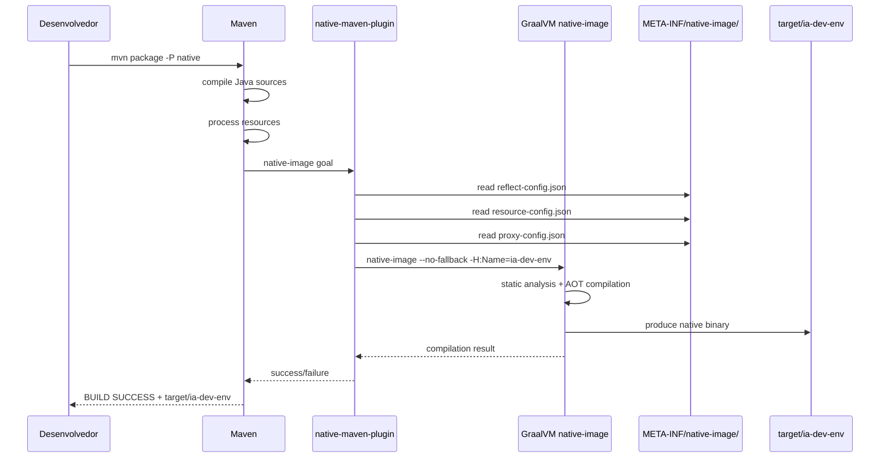
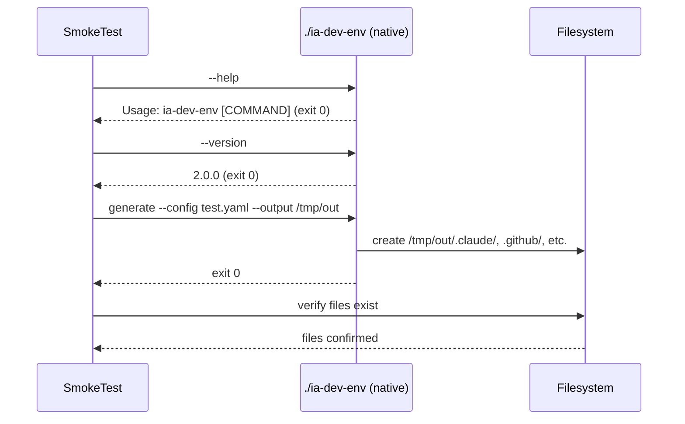

# Historia: Build Nativo GraalVM e Configuracao de Reflexao

**ID:** story-0006-0030

## 1. Dependencias

| Blocked By | Blocks |
| :--- | :--- |
| story-0006-0027 | — |

## 2. Regras Transversais Aplicaveis

| ID | Titulo |
| :--- | :--- |
| RULE-009 | Compatibilidade Cross-Platform |

## 3. Descricao

Como **Desenvolvedor Java**, eu quero configurar o build de native image via GraalVM para obter startup ultra-rapido (< 50ms), eliminando a necessidade de JVM instalada no ambiente do usuario e produzindo um binario nativo executavel diretamente.

Esta historia e **OPCIONAL** e pode ser implementada apos a release inicial do fat JAR. O binario nativo oferece vantagens significativas para uma CLI: startup instantaneo, menor consumo de memoria e distribuicao simplificada (binario unico sem dependencia de JVM). Porem, requer configuracao cuidadosa de reflexao, recursos e proxies para que as bibliotecas utilizadas funcionem corretamente no modo nativo.

### 3.1 Configuracao de Reflexao (reflect-config.json)

GraalVM native image faz analise estatica e remove codigo nao referenciado diretamente. Bibliotecas que usam reflexao precisam de configuracao explicita:

**SnakeYAML:**
- Registro de todas as classes de modelo (`ProjectConfig`, `IdentityConfig`, `StackConfig`, etc.) para desserializacao via reflexao
- Construtores sem argumentos e setters devem ser registrados
- Classes `java.util.LinkedHashMap`, `java.util.ArrayList` para colecoes genericas

**Jackson (JSON):**
- Registro de classes usadas para serializacao/desserializacao JSON (se houver)
- Anotacoes `@JsonProperty` e `@JsonCreator` precisam de reflexao

**Picocli:**
- Registro de todas as classes de comando (`IaDevEnvApplication`, `GenerateCommand`, `ValidateCommand`)
- Anotacoes `@Command`, `@Option`, `@Parameters` usam reflexao para parsing
- Picocli oferece suporte nativo a GraalVM via `picocli-codegen` — avaliar uso do annotation processor

**SLF4J/Logback:**
- Registro de classes de configuracao do Logback
- Service providers de SLF4J

### 3.2 Configuracao de Recursos (resource-config.json)

Registrar todos os recursos que devem ser incluidos no native image:

- Templates Pebble: `templates/**/*.peb`, `templates/**/*.md`, `templates/**/*.yaml`
- Config templates bundled: `config-templates/*.yaml`
- Arquivos de configuracao: `logback.xml`, `application.properties` (se houver)
- Pebble internal resources
- Pattern: `{"pattern": "templates/.*"}`, `{"pattern": "config-templates/.*"}`

### 3.3 Configuracao de Proxies (proxy-config.json)

Pebble template engine pode usar proxies dinâmicos internamente:

- Identificar interfaces que Pebble cria proxies para (ex: extensoes, filtros, funcoes)
- Registrar no `proxy-config.json` se necessario
- Testar extensivamente — proxies sao a principal causa de falha em native image com template engines

### 3.4 Native Maven Plugin

Configurar `native-maven-plugin` (org.graalvm.buildtools) no `pom.xml`:

- Profile `native` ativado com `-P native`
- Configurar `imageName` como `ia-dev-env`
- Configurar `mainClass` como `com.iadevenv.cli.IaDevEnvApplication`
- Opcoes de build: `--no-fallback` (falha se nao conseguir compilar nativamente), `--enable-url-protocols=http,https` (se necessario), `-H:+ReportExceptionStackTraces`
- Output: `target/ia-dev-env` (binario nativo sem extensao no Linux/macOS)

### 3.5 Smoke Tests para Native Image

Testes minimos que validam o funcionamento do binario nativo:

1. `./ia-dev-env --help` — deve exibir usage e sair com codigo 0
2. `./ia-dev-env --version` — deve exibir "2.0.0" e sair com codigo 0
3. `./ia-dev-env generate --config test-config.yaml --output /tmp/test-output` — deve gerar arquivos corretamente
4. Medir startup time e validar < 50ms (usando `time` ou instrumentacao)

### 3.6 Limitacoes Conhecidas do Native Image

Documentar limitacoes que podem afetar funcionalidade:

- **JLine (modo interativo):** Terminal handling pode nao funcionar perfeitamente no native image; modo interativo pode requerer fallback para input simples
- **Dynamic class loading:** Qualquer uso de `Class.forName()` precisa de configuracao explicita
- **Reflection-heavy libraries:** Se alguma biblioteca usar reflexao nao configurada, falha em runtime com `ClassNotFoundException` ou `NoSuchMethodException`
- **Build time:** Compilacao nativa leva 2-5 minutos vs 10s para JAR — documentar para CI/CD
- **Platform-specific:** Binario gerado e especifico para SO/arch (precisa compilar separadamente para Linux, macOS, Windows)

## 4. Definicoes de Qualidade Locais

### DoR Local (Definition of Ready)

- [ ] Comando `generate` end-to-end funcional (story-0006-0027 concluida)
- [ ] Fat JAR funcional com todas as dependencias (story-0006-0001)
- [ ] GraalVM 21 instalado e disponivel no PATH (`native-image` acessivel)
- [ ] Documentacao de GraalVM native image consultada para cada biblioteca utilizada
- [ ] Picocli GraalVM support avaliado (`picocli-codegen` annotation processor)

### DoD Local (Definition of Done)

- [ ] `reflect-config.json` criado com registro de SnakeYAML, Jackson, Picocli e modelo de dominio
- [ ] `resource-config.json` criado com registro de todos os templates e config-templates
- [ ] `proxy-config.json` criado com registro de proxies para Pebble (se necessario)
- [ ] `native-maven-plugin` configurado no `pom.xml` com profile `native`
- [ ] `mvn package -P native` compila native image sem erros
- [ ] `./target/ia-dev-env --help` exibe usage e sai com codigo 0
- [ ] `./target/ia-dev-env --version` exibe "2.0.0"
- [ ] `./target/ia-dev-env generate` com config simples produz arquivos esperados
- [ ] Startup time < 50ms medido e documentado
- [ ] Limitacoes documentadas (JLine, build time, platform-specific)
- [ ] Todos os metodos publicos possuem Javadoc

### Global Definition of Done (DoD)

- **Cobertura:** ≥ 95% Line Coverage, ≥ 90% Branch Coverage (JaCoCo)
- **Testes Automatizados:** Unitarios (JUnit 5 + AssertJ), integracao, golden file
- **Relatorio de Cobertura:** JaCoCo HTML + XML
- **Documentacao:** Javadoc em classes publicas
- **Performance:** Geracao completa < 2s
- **TDD Compliance:** Test-first, refactoring explicito, TPP incremental

## 5. Contratos de Dados (Data Contract)

**Native image config files:**

| Arquivo | Caminho | Descricao |
| :--- | :--- | :--- |
| `reflect-config.json` | `src/main/resources/META-INF/native-image/reflect-config.json` | Classes que usam reflexao |
| `resource-config.json` | `src/main/resources/META-INF/native-image/resource-config.json` | Recursos incluidos no binario |
| `proxy-config.json` | `src/main/resources/META-INF/native-image/proxy-config.json` | Proxies dinamicos |

**reflect-config.json — entradas principais:**

| Biblioteca | Classes | Motivo |
| :--- | :--- | :--- |
| SnakeYAML | `ProjectConfig`, `IdentityConfig`, `StackConfig`, todas as 17 data classes | Desserializacao YAML via reflexao |
| Jackson | Classes de modelo (se usadas para JSON) | Serializacao/desserializacao JSON |
| Picocli | `IaDevEnvApplication`, `GenerateCommand`, `ValidateCommand` | Parsing de anotacoes de comando |
| SLF4J/Logback | Classes de configuracao do logger | Service provider loading |
| JDK | `java.util.LinkedHashMap`, `java.util.ArrayList`, `java.util.HashMap` | Colecoes genericas em YAML |

**resource-config.json — patterns:**

| Pattern | Descricao |
| :--- | :--- |
| `templates/.*` | Todos os templates Pebble |
| `config-templates/.*` | Config templates bundled |
| `logback.xml` | Configuracao de logging |

**Maven profile `native`:**

| Parametro | Valor |
| :--- | :--- |
| Plugin | `org.graalvm.buildtools:native-maven-plugin` |
| `imageName` | `ia-dev-env` |
| `mainClass` | `com.iadevenv.cli.IaDevEnvApplication` |
| `buildArgs` | `--no-fallback` |
| Output | `target/ia-dev-env` |

**Smoke test expectations:**

| Comando | Exit Code | Output Esperado |
| :--- | :--- | :--- |
| `./ia-dev-env --help` | 0 | Contem "Usage: ia-dev-env" |
| `./ia-dev-env --version` | 0 | Contem "2.0.0" |
| `./ia-dev-env generate --config test.yaml --output /tmp/out` | 0 | Arquivos gerados em /tmp/out |

## 6. Diagramas

### 6.1 Fluxo de Build Nativo



### 6.2 Fluxo de Smoke Test



## 7. Criterios de Aceite (Gherkin)

```gherkin
Cenario: Native image compila sem erros
  DADO que GraalVM 21 esta instalado e native-image esta no PATH
  E o projeto possui reflect-config.json, resource-config.json e proxy-config.json configurados
  QUANDO "mvn package -P native" e executado
  ENTÃO o build deve completar com BUILD SUCCESS
  E o binario "target/ia-dev-env" deve existir
  E o binario deve ter permissao de execucao

Cenario: Binario nativo exibe help corretamente
  DADO que o binario nativo "target/ia-dev-env" foi compilado com sucesso
  QUANDO "./target/ia-dev-env --help" e executado
  ENTÃO a saida deve conter "Usage: ia-dev-env"
  E a saida deve listar os subcomandos "generate" e "validate"
  E o exit code deve ser 0

Cenario: Binario nativo exibe versao corretamente
  DADO que o binario nativo "target/ia-dev-env" foi compilado com sucesso
  QUANDO "./target/ia-dev-env --version" e executado
  ENTÃO a saida deve conter "2.0.0"
  E o exit code deve ser 0

Cenario: Binario nativo gera artefatos com config simples
  DADO que o binario nativo "target/ia-dev-env" foi compilado com sucesso
  E existe um arquivo de configuracao "test-config.yaml" valido para o perfil java-quarkus
  QUANDO "./target/ia-dev-env generate --config test-config.yaml --output /tmp/native-test" e executado
  ENTÃO o exit code deve ser 0
  E o diretorio "/tmp/native-test/.claude/" deve existir com artefatos gerados
  E o diretorio "/tmp/native-test/.github/" deve existir com artefatos gerados
  E os arquivos gerados devem ter conteudo identico ao gerado pelo fat JAR

Cenario: Startup time do binario nativo e inferior a 50ms
  DADO que o binario nativo "target/ia-dev-env" foi compilado com sucesso
  QUANDO o tempo de execucao de "./target/ia-dev-env --version" e medido
  ENTÃO o tempo total de execucao (startup + processing) deve ser inferior a 50ms
  E a medicao deve ser feita com pelo menos 5 execucoes para eliminar variacao
```

### 7.1 Scenario Ordering (TPP)

> Scenarios seguem TPP: pre-condicao (compilacao sem erros) → caso constante (--help exibe usage) → segundo constante (--version exibe versao) → caso funcional (generate produz arquivos) → benchmark (startup < 50ms). Progride de verificacao de existencia do binario ate validacao de performance.

### 7.2 Mandatory Scenario Categories

- [x] Degenerate cases (compilacao sem erros — verifica que configs de reflexao estao corretos)
- [x] Happy path (--help, --version, generate com config simples)
- [x] Error paths (falha de compilacao por config ausente — coberto implicitamente pelo cenario 1)
- [x] Boundary values (startup time < 50ms — limiar de performance)

### 7.3 TDD Implementation Notes

**Outer loop (acceptance):** Smoke tests sao o loop externo — executam o binario nativo como processo externo e verificam stdout, stderr e exit code. Estes testes so podem executar apos compilacao nativa bem-sucedida.

**Inner loop (unit):**
1. `reflect-config.json` — validar que todas as 17 data classes estao registradas (teste de parsing JSON)
2. `resource-config.json` — validar que patterns cobrem todos os templates (verificar contra listagem do classpath)
3. `proxy-config.json` — validar estrutura JSON (se necessario)
4. Smoke test `--help` — processo externo, verificar stdout contem "Usage"
5. Smoke test `--version` — processo externo, verificar stdout contem "2.0.0"
6. Smoke test `generate` — processo externo, verificar que arquivos foram criados

**Nota:** Testes de native image sao intrinsecamente testes de integracao/smoke. Nao ha testes unitarios puros para configs JSON — a validacao real ocorre durante a compilacao nativa.

## 8. Sub-tarefas

- [ ] [Dev] Criar `reflect-config.json` com registros para SnakeYAML (17 data classes), Jackson, Picocli (3 commands), SLF4J/Logback
- [ ] [Dev] Criar `resource-config.json` com patterns para templates e config-templates
- [ ] [Dev] Criar `proxy-config.json` para proxies do Pebble (se necessario)
- [ ] [Dev] Configurar `native-maven-plugin` no `pom.xml` com profile `native`
- [ ] [Dev] Configurar opcoes de build: `--no-fallback`, `imageName=ia-dev-env`, `mainClass`
- [ ] [Dev] Avaliar e integrar `picocli-codegen` annotation processor para GraalVM
- [ ] [Test] Smoke test: `./ia-dev-env --help` exibe usage e exit code 0
- [ ] [Test] Smoke test: `./ia-dev-env --version` exibe "2.0.0" e exit code 0
- [ ] [Test] Smoke test: `./ia-dev-env generate --config test.yaml` produz arquivos esperados
- [ ] [Test] Benchmark: medir startup time e validar < 50ms (media de 5 execucoes)
- [ ] [Test] Comparar output do native image com output do fat JAR (paridade)
- [ ] [Doc] Documentar build nativo: pre-requisitos (GraalVM 21), como compilar, tempo de build
- [ ] [Doc] Documentar limitacoes conhecidas: JLine, platform-specific, build time
