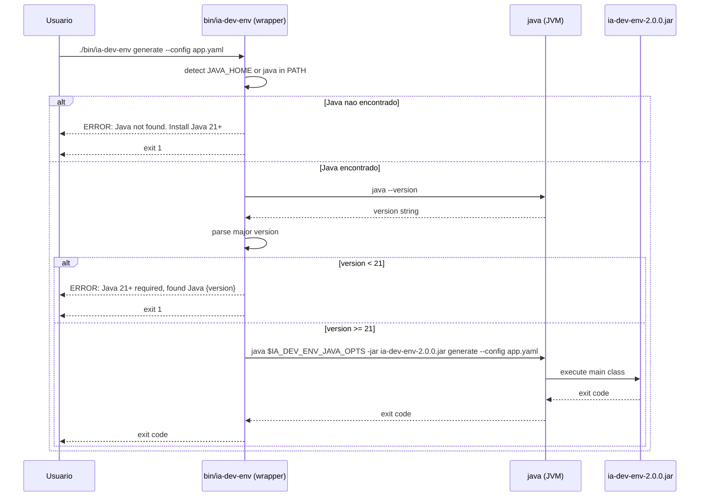
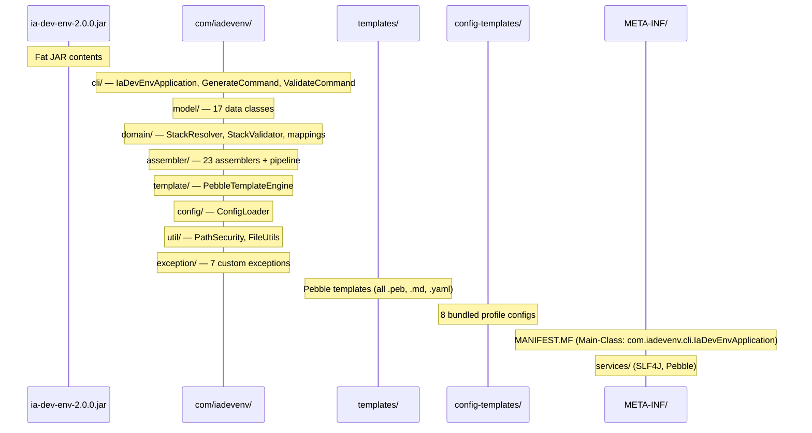

# Historia: Empacotamento Fat JAR e Documentacao de Distribuicao

**ID:** story-0006-0031

## 1. Dependencias

| Blocked By | Blocks |
| :--- | :--- |
| story-0006-0028, story-0006-0029 | — |

## 2. Regras Transversais Aplicaveis

| ID | Titulo |
| :--- | :--- |
| RULE-001 | Paridade Byte-a-Byte |
| RULE-006 | Cobertura JaCoCo |
| RULE-009 | Compatibilidade Cross-Platform |

## 3. Descricao

Como **Desenvolvedor Java**, eu quero finalizar o empacotamento para distribuicao e criar documentacao completa de uso, garantindo que a versao Java do `ia-dev-env` seja facilmente instalavel, executavel e mantida por qualquer desenvolvedor.

Esta historia e a etapa final da migracao: validar que o fat JAR funciona como produto acabado, criar um wrapper script para facilitar a execucao, e documentar todo o processo de instalacao, uso e contribuicao. Ao final desta historia, a versao Java 2.0.0 esta pronta para release.

### 3.1 Validacao do Fat JAR (maven-shade-plugin)

Validar extensivamente que o fat JAR gerado pelo `maven-shade-plugin` funciona corretamente:

- `java -jar ia-dev-env-2.0.0.jar --help` — exibe usage com subcomandos
- `java -jar ia-dev-env-2.0.0.jar --version` — exibe "2.0.0"
- `java -jar ia-dev-env-2.0.0.jar generate --config <config>.yaml --output <dir>` — gera output completo
- `java -jar ia-dev-env-2.0.0.jar validate --config <config>.yaml` — valida config e retorna 0
- `java -jar ia-dev-env-2.0.0.jar generate --dry-run --config <config>.yaml` — simula sem escrever
- `java -jar ia-dev-env-2.0.0.jar generate --force --config <config>.yaml --output <dir>` — sobrescreve existentes

Verificar que todos os resources estao incluidos no JAR:
- Templates Pebble (`templates/`)
- Config templates bundled (`config-templates/`)
- Logback config (`logback.xml`)
- META-INF/services para service loaders
- META-INF/MANIFEST.MF com Main-Class correto

### 3.2 Wrapper Script (bin/ia-dev-env)

Criar script bash `bin/ia-dev-env` que simplifica a execucao:

```bash
#!/usr/bin/env bash
# Wrapper script for ia-dev-env CLI
# Detects Java 21+ and executes the fat JAR
```

Funcionalidades do wrapper:
- Detectar `JAVA_HOME` e `java` no PATH
- Verificar versao do Java (requer >= 21)
- Se versao < 21, exibir mensagem de erro clara e abortar com exit code 1
- Se Java nao encontrado, sugerir instalacao (SDKMAN, Homebrew, download manual)
- Resolver caminho do JAR relativo ao script
- Encaminhar todos os argumentos para `java -jar <jar-path> "$@"`
- Suportar variavel de ambiente `IA_DEV_ENV_JAVA_OPTS` para opcoes JVM extras

### 3.3 Validacao com Todos os Perfis

Executar o fat JAR com cada um dos 8 perfis bundled para confirmar que o produto final funciona end-to-end:

- Usar os config templates de `resources/config-templates/`
- Gerar output em diretorio temporario
- Verificar que a estrutura de output e completa (`.claude/`, `.github/`, `.codex/`, `.agents/`, `docs/`, `CLAUDE.md`)
- Verificar que nenhum erro ocorre durante a geracao

### 3.4 Documentacao README.md

Criar/atualizar `README.md` do projeto Java com secoes:

- **Visao Geral** — O que e o ia-dev-env, objetivo da versao 2.0.0 (Java)
- **Instalacao** — Download do JAR, wrapper script, pre-requisito Java 21
- **Quick Start** — Exemplo minimo de uso com perfil bundled
- **Configuracao** — Estrutura do YAML, campos obrigatorios/opcionais, referencia completa
- **Perfis Bundled** — Lista dos 8 perfis com descricao de cada um
- **Uso Avancado** — `--dry-run`, `--force`, `--verbose`, modo interativo
- **Building from Source** — `mvn clean package`, executar testes, gerar native image
- **Contributing** — Como contribuir, padrao de commits, PR process

### 3.5 CHANGELOG.md

Criar entrada de changelog para a versao 2.0.0:

- Migrado de Node.js/TypeScript para Java 21
- Paridade byte-a-byte com versao TypeScript para todos os 8 perfis
- CLI via Picocli (generate, validate, modo interativo)
- Template engine Pebble com compatibilidade Jinja2/Nunjucks
- Fat JAR com todas as dependencias
- Optional: native image via GraalVM

### 3.6 Release Checklist

Documentar checklist de release:

- [ ] Todos os testes passando (`mvn verify -P all-tests`)
- [ ] Cobertura >= 95% line, >= 90% branch
- [ ] Golden file tests passando para todos os 8 perfis
- [ ] Fat JAR funcional para todos os comandos
- [ ] Wrapper script testado em macOS e Linux
- [ ] README.md completo e revisado
- [ ] CHANGELOG.md atualizado
- [ ] Version tag criada (v2.0.0)
- [ ] JAR publicado como release asset no GitHub

## 4. Definicoes de Qualidade Locais

### DoR Local (Definition of Ready)

- [ ] Golden file tests passando para todos os 8 perfis (story-0006-0028 concluida)
- [ ] Suite de testes com cobertura adequada (story-0006-0029 concluida)
- [ ] Fat JAR sendo gerado pelo maven-shade-plugin (story-0006-0001)
- [ ] Todos os 23 assemblers implementados e testados
- [ ] Pipeline end-to-end funcional (story-0006-0027)

### DoD Local (Definition of Done)

- [ ] Fat JAR executa `--help`, `--version`, `generate`, `validate` sem erros
- [ ] Fat JAR contem todos os resources (templates, config-templates, logback.xml)
- [ ] Fat JAR contem MANIFEST.MF com Main-Class correto
- [ ] Wrapper script `bin/ia-dev-env` detecta Java < 21 e aborta com mensagem clara
- [ ] Wrapper script executa o JAR corretamente com argumentos encaminhados
- [ ] Fat JAR gera output completo para todos os 8 perfis bundled
- [ ] README.md completo com todas as secoes documentadas
- [ ] CHANGELOG.md com entrada da versao 2.0.0
- [ ] Release checklist documentada e verificada
- [ ] Todos os metodos publicos possuem Javadoc

### Global Definition of Done (DoD)

- **Cobertura:** ≥ 95% Line Coverage, ≥ 90% Branch Coverage (JaCoCo)
- **Testes Automatizados:** Unitarios (JUnit 5 + AssertJ), integracao, golden file
- **Relatorio de Cobertura:** JaCoCo HTML + XML
- **Documentacao:** Javadoc em classes publicas
- **Performance:** Geracao completa < 2s
- **TDD Compliance:** Test-first, refactoring explicito, TPP incremental

## 5. Contratos de Dados (Data Contract)

**Fat JAR:**

| Atributo | Valor |
| :--- | :--- |
| Artifact | `target/ia-dev-env-2.0.0.jar` |
| Main-Class | `com.iadevenv.cli.IaDevEnvApplication` |
| Bundled dependencies | Picocli, Pebble, SnakeYAML, Jackson, JLine, SLF4J, Logback |
| Bundled resources | `templates/`, `config-templates/`, `logback.xml` |
| Execution | `java -jar ia-dev-env-2.0.0.jar [command] [options]` |

**Wrapper script (bin/ia-dev-env):**

| Atributo | Valor |
| :--- | :--- |
| Caminho | `bin/ia-dev-env` |
| Linguagem | Bash |
| Pre-requisito | Java >= 21 |
| Variavel de ambiente | `IA_DEV_ENV_JAVA_OPTS` (opcoes JVM extras) |
| Exit codes | 0 (sucesso), 1 (Java nao encontrado ou versao < 21), outros (delegados ao JAR) |

**CLI commands validados:**

| Comando | Exit Code | Validacao |
| :--- | :--- | :--- |
| `--help` | 0 | Contem "Usage: ia-dev-env", lista "generate" e "validate" |
| `--version` | 0 | Contem "2.0.0" |
| `generate --config <yaml> --output <dir>` | 0 | Gera artefatos completos |
| `generate --dry-run --config <yaml>` | 0 | Nao escreve arquivos, exibe lista |
| `validate --config <yaml>` | 0 | Config valido retorna sucesso |
| `generate --force --config <yaml> --output <dir>` | 0 | Sobrescreve artefatos existentes |

**README.md sections:**

| Secao | Conteudo Principal |
| :--- | :--- |
| Visao Geral | O que e, versao 2.0.0, Java 21 |
| Instalacao | Download JAR, wrapper script, Java 21 requirement |
| Quick Start | Exemplo com perfil bundled |
| Configuracao | Estrutura YAML, campos, defaults |
| Perfis Bundled | 8 perfis: go-gin, java-quarkus, java-spring, kotlin-ktor, python-click-cli, python-fastapi, rust-axum, typescript-nestjs |
| Uso Avancado | --dry-run, --force, --verbose, interativo |
| Building from Source | mvn package, testes, native image |
| Contributing | Commits, PRs, code style |

## 6. Diagramas

### 6.1 Fluxo do Wrapper Script



### 6.2 Conteudo do Fat JAR



## 7. Criterios de Aceite (Gherkin)

```gherkin
Cenario: Fat JAR exibe help com subcomandos
  DADO que o fat JAR "target/ia-dev-env-2.0.0.jar" foi construido com "mvn package"
  QUANDO "java -jar target/ia-dev-env-2.0.0.jar --help" e executado
  ENTÃO a saida deve conter "Usage: ia-dev-env"
  E a saida deve listar os subcomandos "generate" e "validate"
  E o exit code deve ser 0

Cenario: Fat JAR gera output completo com perfil java-quarkus
  DADO que o fat JAR "target/ia-dev-env-2.0.0.jar" foi construido com "mvn package"
  E existe o config template "setup-config.java-quarkus.yaml" no classpath do JAR
  QUANDO "java -jar target/ia-dev-env-2.0.0.jar generate --config setup-config.java-quarkus.yaml --output /tmp/jar-test" e executado
  ENTÃO o exit code deve ser 0
  E o diretorio "/tmp/jar-test/.claude/" deve existir com rules, skills, agents
  E o diretorio "/tmp/jar-test/.github/" deve existir com instructions, skills, agents, prompts
  E o arquivo "/tmp/jar-test/CLAUDE.md" deve existir
  E o output deve ser identico ao gerado pelos golden file tests

Cenario: Fat JAR valida config valida e retorna sucesso
  DADO que o fat JAR "target/ia-dev-env-2.0.0.jar" foi construido com "mvn package"
  E existe um arquivo de configuracao YAML valido
  QUANDO "java -jar target/ia-dev-env-2.0.0.jar validate --config config.yaml" e executado
  ENTÃO o exit code deve ser 0
  E a saida deve indicar que a configuracao e valida

Cenario: Wrapper script detecta Java inferior a 21 e aborta
  DADO que o wrapper script "bin/ia-dev-env" existe e tem permissao de execucao
  E o Java disponivel no PATH e versao 17
  QUANDO "./bin/ia-dev-env --help" e executado
  ENTÃO a saida de erro deve conter mensagem indicando que Java 21+ e necessario
  E a saida de erro deve exibir a versao do Java encontrada
  E o exit code deve ser 1

Cenario: Wrapper script executa JAR corretamente com argumentos
  DADO que o wrapper script "bin/ia-dev-env" existe e tem permissao de execucao
  E Java 21+ esta disponivel no PATH
  E o fat JAR esta no caminho esperado relativo ao wrapper
  QUANDO "./bin/ia-dev-env --version" e executado
  ENTÃO a saida deve conter "2.0.0"
  E o exit code deve ser 0

Cenario: Fat JAR contem todos os resources necessarios
  DADO que o fat JAR "target/ia-dev-env-2.0.0.jar" foi construido com "mvn package"
  QUANDO o conteudo do JAR e inspecionado (jar tf)
  ENTÃO deve conter entradas no diretorio "templates/"
  E deve conter entradas no diretorio "config-templates/"
  E deve conter "META-INF/MANIFEST.MF"
  E o MANIFEST.MF deve declarar "Main-Class: com.iadevenv.cli.IaDevEnvApplication"
  E deve conter "logback.xml"
```

### 7.1 Scenario Ordering (TPP)

> Scenarios seguem TPP: caso mais simples (--help exibe usage) → caso funcional completo (generate com java-quarkus) → segunda funcao (validate retorna sucesso) → wrapper com erro (Java < 21 aborta) → wrapper com sucesso (executa JAR) → verificacao de conteudo (JAR contem resources). Progride de validacao CLI basica, passa por funcionalidade end-to-end, valida wrapper script, e termina com inspecao do artefato.

### 7.2 Mandatory Scenario Categories

- [x] Degenerate cases (fat JAR --help — caso minimo de execucao)
- [x] Happy path (generate com perfil completo, validate com config valida, wrapper com Java 21)
- [x] Error paths (wrapper detecta Java < 21 e aborta)
- [x] Boundary values (FAT JAR contem todos os resources, MANIFEST com Main-Class correto)

### 7.3 TDD Implementation Notes

**Outer loop (acceptance):** Testes de aceitacao executam o fat JAR como processo externo (`ProcessBuilder`) e verificam stdout, stderr e exit code. O wrapper script e testado de forma similar, com mock de versao Java quando necessario.

**Inner loop (unit):**
1. Wrapper script — testar com `JAVA_HOME` apontando para Java 17 (deve falhar), Java 21 (deve passar)
2. Wrapper script — testar sem Java no PATH (deve falhar com mensagem de instalacao)
3. FAT JAR contents — `jar tf` para verificar presenca de templates, config-templates, MANIFEST.MF
4. MANIFEST.MF — verificar `Main-Class` correto
5. End-to-end com cada perfil — executar `java -jar` com cada um dos 8 configs e verificar exit code 0
6. Dry-run — executar com `--dry-run` e verificar que nenhum arquivo e escrito
7. Force — executar com `--force` sobre output existente e verificar que sobrescreve

## 8. Sub-tarefas

- [ ] [Dev] Validar configuracao do `maven-shade-plugin` (Main-Class, resource inclusion, service transformer)
- [ ] [Dev] Implementar wrapper script `bin/ia-dev-env` com deteccao de Java 21+
- [ ] [Dev] Wrapper script: suporte a `IA_DEV_ENV_JAVA_OPTS` para opcoes JVM extras
- [ ] [Dev] Wrapper script: resolucao de caminho do JAR relativo ao script
- [ ] [Test] Integracao: `java -jar fat.jar --help` exibe usage
- [ ] [Test] Integracao: `java -jar fat.jar --version` exibe "2.0.0"
- [ ] [Test] Integracao: `java -jar fat.jar generate` com cada um dos 8 perfis produz output completo
- [ ] [Test] Integracao: `java -jar fat.jar validate` com config valida retorna 0
- [ ] [Test] Integracao: `java -jar fat.jar generate --dry-run` nao escreve arquivos
- [ ] [Test] Integracao: `java -jar fat.jar generate --force` sobrescreve existentes
- [ ] [Test] Integracao: wrapper script aborta com Java < 21
- [ ] [Test] Integracao: wrapper script executa JAR com Java 21+
- [ ] [Test] Verificar que `jar tf` mostra templates/, config-templates/, MANIFEST.MF, logback.xml
- [ ] [Doc] README.md: Installation, Quick Start, Configuration, Bundled Profiles, Building from Source, Contributing
- [ ] [Doc] CHANGELOG.md: entrada da versao 2.0.0
- [ ] [Doc] Release checklist documentada
- [ ] [Doc] Javadoc em classes publicas modificadas
