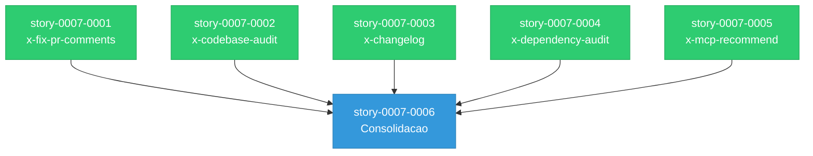

# Mapa de Implementacao — Skills Evolution (EPIC-0007)

**Gerado a partir das dependencias BlockedBy/Blocks de cada historia do EPIC-0007.**

---

## 1. Matriz de Dependencias

| Story | Titulo | Blocked By | Blocks | Status |
| :--- | :--- | :--- | :--- | :--- |
| story-0007-0001 | Skill x-fix-pr-comments | — | story-0007-0006 | Concluido |
| story-0007-0002 | Skill x-codebase-audit | — | story-0007-0006 | Concluido |
| story-0007-0003 | Skill x-changelog | — | story-0007-0006 | Concluido |
| story-0007-0004 | Skill x-dependency-audit | — | story-0007-0006 | Concluido |
| story-0007-0005 | Skill x-mcp-recommend | — | story-0007-0006 | Concluido |
| story-0007-0006 | Consolidacao: Assembler, Golden Files e Testes | story-0007-0001, story-0007-0002, story-0007-0003, story-0007-0004, story-0007-0005 | — | Concluido |

---

## 2. Fases de Implementacao

> As historias sao agrupadas em fases. Dentro de cada fase, as historias podem ser implementadas **em paralelo**. Uma fase so pode iniciar quando todas as dependencias das fases anteriores estiverem concluidas.

```
╔══════════════════════════════════════════════════════════════════════════════════════════════════╗
║                             FASE 0 — Skills Templates (5 paralelas)                            ║
║                                                                                                ║
║   ┌──────────────────┐  ┌──────────────────┐  ┌──────────────────┐                             ║
║   │  story-0007-0001 │  │  story-0007-0002 │  │  story-0007-0003 │                             ║
║   │  x-fix-pr-       │  │  x-codebase-     │  │  x-changelog     │                             ║
║   │  comments        │  │  audit           │  │                  │                             ║
║   └────────┬─────────┘  └────────┬─────────┘  └────────┬─────────┘                             ║
║                                                                                                ║
║   ┌──────────────────┐  ┌──────────────────┐                                                   ║
║   │  story-0007-0004 │  │  story-0007-0005 │                                                   ║
║   │  x-dependency-   │  │  x-mcp-recommend │                                                   ║
║   │  audit           │  │                  │                                                   ║
║   └────────┬─────────┘  └────────┬─────────┘                                                   ║
╚════════════╪═════════════════════╪═══════════════════════════════════════════════════════════════╝
             │                     │
             ▼                     ▼
╔══════════════════════════════════════════════════════════════════════════════════════════════════╗
║                       FASE 1 — Consolidacao (1 historia, sequencial)                           ║
║                                                                                                ║
║   ┌──────────────────────────────────────────────────────────────┐                              ║
║   │  story-0007-0006                                             │                              ║
║   │  Consolidacao: Assembler Registration, Tests, Golden Files   │                              ║
║   │  (← 0001, 0002, 0003, 0004, 0005)                           │                              ║
║   └──────────────────────────────────────────────────────────────┘                              ║
╚══════════════════════════════════════════════════════════════════════════════════════════════════╝
```

---

## 3. Caminho Critico

> O caminho critico e a sequencia mais longa de dependencias.

```
story-0007-0001 ──→ story-0007-0006
  (x-fix-pr-comments)   (Consolidacao)
       Fase 0                Fase 1
```

**2 fases no caminho critico. Qualquer uma das 5 skills (0001-0005) esta no caminho critico, pois story-0007-0006 depende de TODAS.**

---

## 4. Grafo de Dependencias (Mermaid)



---

## 5. Resumo por Fase

| Fase | Historias | Camada | Paralelismo | Pre-requisito |
| :--- | :--- | :--- | :--- | :--- |
| 0 | 0001, 0002, 0003, 0004, 0005 | Skills Templates | 5 paralelas | — |
| 1 | 0006 | Consolidacao | 1 (sequencial) | Fase 0 concluida |

**Total: 6 historias em 2 fases.**

---

## 6. Detalhamento por Fase

### Fase 0 — Skills Templates

| Story | Escopo Principal | Artefatos Chave |
| :--- | :--- | :--- |
| story-0007-0001 | Template x-fix-pr-comments (Claude Code + GitHub Copilot) | `skills-templates/core/x-fix-pr-comments/SKILL.md`, `github-skills-templates/git-troubleshooting/x-fix-pr-comments.md` |
| story-0007-0002 | Template x-codebase-audit (Claude Code + GitHub Copilot) | `skills-templates/core/x-codebase-audit/SKILL.md`, `github-skills-templates/review/x-codebase-audit.md` |
| story-0007-0003 | Template x-changelog (Claude Code + GitHub Copilot) | `skills-templates/core/x-changelog/SKILL.md`, `github-skills-templates/git-troubleshooting/x-changelog.md` |
| story-0007-0004 | Template x-dependency-audit (Claude Code + GitHub Copilot) | `skills-templates/core/x-dependency-audit/SKILL.md`, `github-skills-templates/review/x-dependency-audit.md` |
| story-0007-0005 | Template x-mcp-recommend (Claude Code + GitHub Copilot) | `skills-templates/core/x-mcp-recommend/SKILL.md`, `github-skills-templates/dev/x-mcp-recommend.md` |

**Entregas da Fase 0:**

- 5 templates SKILL.md para Claude Code (auto-discovered pelo SkillsAssembler)
- 5 templates .md para GitHub Copilot (registrados no GithubSkillsAssembler na Fase 1)
- Cada template e auto-contido e usa apenas placeholders estabelecidos

### Fase 1 — Consolidacao

| Story | Escopo Principal | Artefatos Chave |
| :--- | :--- | :--- |
| story-0007-0006 | Registro no assembler, testes, golden files | GithubSkillsAssembler.java, GithubSkillsAssemblerTest.java, golden files (8 perfis) |

**Entregas da Fase 1:**

- GithubSkillsAssembler com 5 novas skills registradas em SKILL_GROUPS
- Testes de tamanho de grupo atualizados (git-troubleshooting: 4, review: 8, dev: 8)
- Golden files regenerados e validados byte-a-byte para todos os 8 perfis
- `mvn test` passando com 100% dos testes

---

## 7. Observacoes Estrategicas

### Simplicidade do Grafo

Este epico tem a estrutura de dependencias mais simples possivel: fan-out (5 paralelas) seguido de fan-in (1 consolidacao). Nao ha dependencias cruzadas entre as 5 skills, permitindo implementacao totalmente paralela na Fase 0.

### Risco Principal

O unico risco significativo e a regeneracao de golden files (story-0007-0006). Se os templates nao usarem os placeholders corretos ou tiverem formatacao inconsistente, os golden files nao vao bater. Mitigacao: validar cada template individualmente antes da consolidacao.

### Impacto no SkillsAssembler (Claude Code)

O `SkillsAssembler` NAO precisa de alteracoes — ele usa auto-discovery de `skills-templates/core/`. Adicionar novos diretorios com SKILL.md e suficiente. Apenas o `GithubSkillsAssembler` precisa de registro explicito no mapa `SKILL_GROUPS`.
