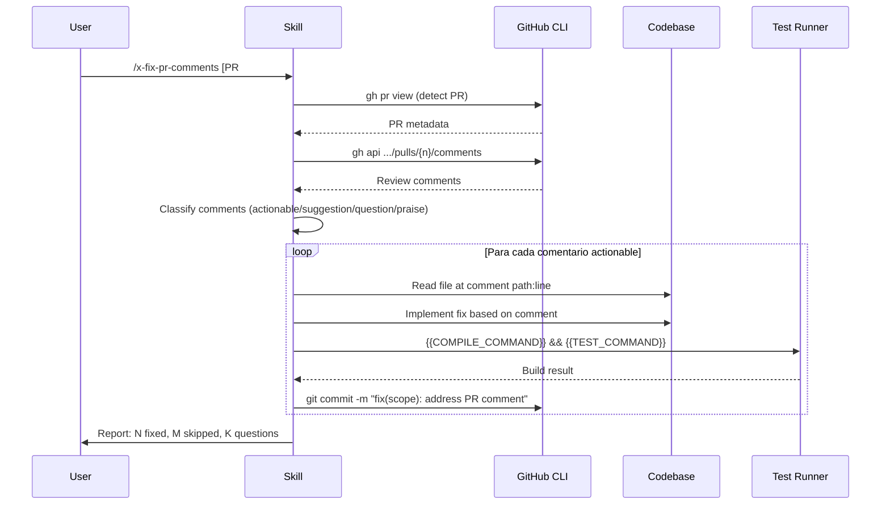

# Historia: Skill x-fix-pr-comments (Claude Code + GitHub Copilot)

**ID:** story-0007-0001

## 1. Dependencias

| Blocked By | Blocks |
| :--- | :--- |
| — | story-0007-0006 |

## 2. Regras Transversais Aplicaveis

| ID | Titulo |
| :--- | :--- |
| RULE-001 | Dual Copy Consistency |
| RULE-002 | Source of Truth e resources/ |
| RULE-004 | Skill Autonomy |
| RULE-005 | Placeholder Tokens |

## 3. Descricao

Como **Desenvolvedor de Skills**, eu quero criar o template da skill `x-fix-pr-comments` para que
projetos gerados pelo `ia-dev-env` tenham uma skill que le comentarios de review de PR e implementa
correcoes automaticamente.

A skill pertence ao grupo `git-troubleshooting` e gera dois artefatos:
1. Claude Code: `skills-templates/core/x-fix-pr-comments/SKILL.md`
2. GitHub Copilot: `github-skills-templates/git-troubleshooting/x-fix-pr-comments.md`

### 3.1 Comportamento da Skill

- **Input:** Numero do PR (argumento) ou auto-deteccao a partir da branch atual
- **Fluxo:**
  1. Detectar PR (argumento, branch ou `gh pr view`)
  2. Buscar comentarios via `gh api repos/{owner}/{repo}/pulls/{number}/comments`
  3. Classificar cada comentario (actionable / suggestion / question / praise / resolved)
  4. Para cada actionable: implementar a correcao seguindo o feedback
  5. Compilar e testar apos cada correcao
  6. Commitar com `fix(scope): address PR review comment — {summary}`
  7. Gerar relatorio de acoes tomadas
- **Padrao de referencia:** `x-review-pr` (deteccao de contexto PR)
- **Output:** Codigo corrigido + commits + relatorio

### 3.2 Artefatos

| Artefato | Caminho |
| :--- | :--- |
| Claude Code SKILL.md | `java/src/main/resources/skills-templates/core/x-fix-pr-comments/SKILL.md` |
| GitHub Copilot template | `java/src/main/resources/github-skills-templates/git-troubleshooting/x-fix-pr-comments.md` |

## 4. Definicoes de Qualidade Locais

### DoR Local (Definition of Ready)

- [ ] Skills existentes `x-review-pr` e `x-git-push` revisadas como referencia de formato
- [ ] Placeholders disponiveis documentados (ContextBuilder)
- [ ] Formato de frontmatter definido para ambas as plataformas

### DoD Local (Definition of Done)

- [ ] Template Claude Code criado com frontmatter completo (`name`, `description`, `allowed-tools`, `argument-hint`)
- [ ] Template GitHub Copilot criado com frontmatter (`name`, `description`)
- [ ] Ambos templates usam apenas placeholders estabelecidos (RULE-005)
- [ ] Skill auto-contida — agente consegue executar lendo apenas o SKILL.md (RULE-004)
- [ ] Workflow completo documentado: detect PR -> fetch comments -> classify -> fix -> test -> commit -> report

### Global Definition of Done (DoD)

- **Cobertura:** >= 95% Line Coverage, >= 90% Branch Coverage (JaCoCo)
- **Testes Automatizados:** Golden file (paridade byte-a-byte apos story-0007-0006)
- **TDD Compliance:** Test-first, refactoring explicito

## 5. Diagramas

### 5.1 Fluxo da Skill x-fix-pr-comments



## 6. Criterios de Aceite (Gherkin)

```gherkin
Cenario: Template Claude Code criado com frontmatter valido
  DADO que o diretorio skills-templates/core/x-fix-pr-comments/ NAO existe
  QUANDO o template SKILL.md e criado
  ENTAO o arquivo contem frontmatter YAML com name, description, allowed-tools, argument-hint
  E o body contem workflow completo (detect, fetch, classify, fix, test, commit, report)
  E todos os placeholders usados sao do conjunto estabelecido ({{PROJECT_NAME}}, {{LANGUAGE}}, etc.)

Cenario: Template GitHub Copilot criado com frontmatter valido
  DADO que o arquivo github-skills-templates/git-troubleshooting/x-fix-pr-comments.md NAO existe
  QUANDO o template e criado
  ENTAO o arquivo contem frontmatter YAML com name e description
  E o body e funcionalmente equivalente ao template Claude Code
  E o frontmatter NAO contem allowed-tools (especifico do Claude Code)

Cenario: Skill e auto-contida
  DADO que um agente IA tem acesso apenas ao SKILL.md
  QUANDO o agente le o conteudo
  ENTAO encontra instrucoes suficientes para executar cada passo do workflow
  E encontra comandos especificos (gh api, git commit)
  E encontra formato de classificacao de comentarios
  E encontra formato de output (relatorio)

Cenario: Placeholders sao do conjunto estabelecido
  DADO que o template usa tokens entre {{ e }}
  QUANDO todos os tokens sao extraidos
  ENTAO cada token pertence ao conjunto: PROJECT_NAME, LANGUAGE, LANGUAGE_VERSION, BUILD_TOOL, FRAMEWORK, COMPILE_COMMAND, TEST_COMMAND
  E nenhum token novo e introduzido

Cenario: Paridade entre Claude Code e GitHub Copilot
  DADO que ambos os templates existem
  QUANDO o conteudo tecnico (excluindo frontmatter) e comparado
  ENTAO os workflows, comandos e formatos de output sao equivalentes
  E diferencas se limitam ao frontmatter especifico de cada plataforma
```

### 6.1 Scenario Ordering (TPP)

> Scenarios seguem TPP: existencia basica (frontmatter) -> formato alternativo (GitHub) -> comportamento (autonomia) -> restricao (placeholders) -> integracao (paridade).

## 7. Sub-tarefas

- [ ] [Dev] Criar `skills-templates/core/x-fix-pr-comments/SKILL.md` com workflow completo
- [ ] [Dev] Criar `github-skills-templates/git-troubleshooting/x-fix-pr-comments.md` espelhando Claude Code
- [ ] [Test] Verificar frontmatter valido em ambos os templates
- [ ] [Test] Verificar que todos os placeholders sao do conjunto estabelecido
- [ ] [Doc] Documentar a skill no indice do EPIC
