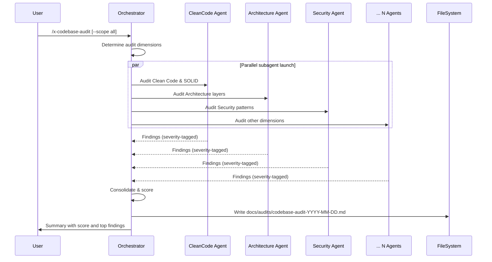

# Historia: Skill x-codebase-audit (Claude Code + GitHub Copilot)

**ID:** story-0007-0002

## 1. Dependencias

| Blocked By | Blocks |
| :--- | :--- |
| — | story-0007-0006 |

## 2. Regras Transversais Aplicaveis

| ID | Titulo |
| :--- | :--- |
| RULE-001 | Dual Copy Consistency |
| RULE-002 | Source of Truth e resources/ |
| RULE-004 | Skill Autonomy |
| RULE-005 | Placeholder Tokens |

## 3. Descricao

Como **Desenvolvedor de Skills**, eu quero criar o template da skill `x-codebase-audit` para que
projetos gerados pelo `ia-dev-env` tenham uma skill que executa auditoria completa do codebase
contra todos os padroes do projeto, similar a uma revisao de Tech Lead para o codebase inteiro.

A skill pertence ao grupo `review` e gera dois artefatos:
1. Claude Code: `skills-templates/core/x-codebase-audit/SKILL.md`
2. GitHub Copilot: `github-skills-templates/review/x-codebase-audit.md`

### 3.1 Comportamento da Skill

- **Input:** Escopo opcional (`--scope all|rules|patterns|architecture|cross-file`)
- **Fluxo:**
  1. Detectar escopo (argumento ou `all` por default)
  2. Lancar subagentes paralelos por dimensao de auditoria:
     - Clean Code & SOLID compliance
     - Architecture layer violations
     - Coding standards adherence
     - Test coverage & TDD compliance
     - Security patterns
     - Cross-file consistency
  3. Consolidar findings de todos os subagentes
  4. Categorizar por severidade (CRITICAL / MEDIUM / LOW / INFO)
  5. Gerar relatorio com score e recomendacoes
- **Padrao de referencia:** `x-review` (orquestracao paralela de subagentes) + `x-lib-audit-rules`
- **Output:** `docs/audits/codebase-audit-YYYY-MM-DD.md`

### 3.2 Artefatos

| Artefato | Caminho |
| :--- | :--- |
| Claude Code SKILL.md | `java/src/main/resources/skills-templates/core/x-codebase-audit/SKILL.md` |
| GitHub Copilot template | `java/src/main/resources/github-skills-templates/review/x-codebase-audit.md` |

## 4. Definicoes de Qualidade Locais

### DoR Local (Definition of Ready)

- [ ] Skill `x-review` revisada como referencia de orquestracao paralela
- [ ] Skill `x-lib-audit-rules` revisada como referencia de auditoria
- [ ] Dimensoes de auditoria definidas e mapeadas aos knowledge packs

### DoD Local (Definition of Done)

- [ ] Template Claude Code criado com frontmatter completo
- [ ] Template GitHub Copilot criado com frontmatter
- [ ] Workflow de orquestracao paralela documentado
- [ ] Dimensoes de auditoria listadas com checklists especificos
- [ ] Formato de relatorio de output definido com severidades
- [ ] Skill auto-contida (RULE-004)

### Global Definition of Done (DoD)

- **Cobertura:** >= 95% Line Coverage, >= 90% Branch Coverage (JaCoCo)
- **Testes Automatizados:** Golden file (paridade byte-a-byte apos story-0007-0006)
- **TDD Compliance:** Test-first, refactoring explicito

## 5. Diagramas

### 5.1 Fluxo da Skill x-codebase-audit



## 6. Criterios de Aceite (Gherkin)

```gherkin
Cenario: Template Claude Code criado com frontmatter valido
  DADO que o diretorio skills-templates/core/x-codebase-audit/ NAO existe
  QUANDO o template SKILL.md e criado
  ENTAO o arquivo contem frontmatter YAML com name, description, allowed-tools, argument-hint
  E o body contem workflow de orquestracao paralela
  E as dimensoes de auditoria estao listadas com checklists

Cenario: Template GitHub Copilot criado com frontmatter valido
  DADO que o arquivo github-skills-templates/review/x-codebase-audit.md NAO existe
  QUANDO o template e criado
  ENTAO o arquivo contem frontmatter YAML com name e description
  E o body e funcionalmente equivalente ao template Claude Code

Cenario: Dimensoes de auditoria cobertas
  DADO que a skill e executada com --scope all
  QUANDO o workflow e analisado
  ENTAO cobre: Clean Code, SOLID, Architecture, Coding Standards, Tests/TDD, Security, Cross-file
  E cada dimensao tem checklist especifico

Cenario: Formato de relatorio com severidades
  DADO que a skill gera um relatorio
  QUANDO o formato e analisado
  ENTAO contem secoes: Summary Score, CRITICAL findings, MEDIUM findings, LOW findings, INFO
  E cada finding tem: localizacao, descricao, recomendacao
  E o score e numerico (0-100)

Cenario: Placeholders sao do conjunto estabelecido
  DADO que o template usa tokens entre {{ e }}
  QUANDO todos os tokens sao extraidos
  ENTAO cada token pertence ao conjunto estabelecido
  E nenhum token novo e introduzido
```

### 6.1 Scenario Ordering (TPP)

> Scenarios seguem TPP: existencia basica -> formato alternativo -> comportamento (dimensoes) -> formato output (severidades) -> restricao (placeholders).

## 7. Sub-tarefas

- [ ] [Dev] Criar `skills-templates/core/x-codebase-audit/SKILL.md` com workflow paralelo
- [ ] [Dev] Criar `github-skills-templates/review/x-codebase-audit.md` espelhando Claude Code
- [ ] [Test] Verificar frontmatter valido em ambos os templates
- [ ] [Test] Verificar dimensoes de auditoria e formato de relatorio
- [ ] [Doc] Documentar a skill no indice do EPIC
