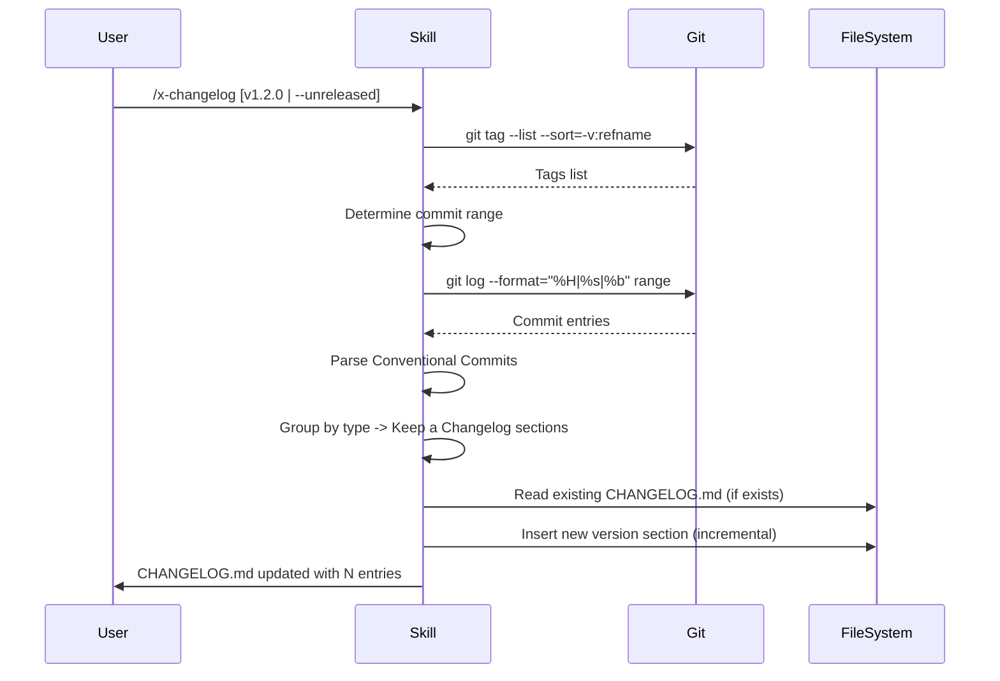

# Historia: Skill x-changelog (Claude Code + GitHub Copilot)

**ID:** story-0007-0003

## 1. Dependencias

| Blocked By | Blocks |
| :--- | :--- |
| — | story-0007-0006 |

## 2. Regras Transversais Aplicaveis

| ID | Titulo |
| :--- | :--- |
| RULE-001 | Dual Copy Consistency |
| RULE-002 | Source of Truth e resources/ |
| RULE-004 | Skill Autonomy |
| RULE-005 | Placeholder Tokens |

## 3. Descricao

Como **Desenvolvedor de Skills**, eu quero criar o template da skill `x-changelog` para que
projetos gerados pelo `ia-dev-env` tenham uma skill que gera ou atualiza `CHANGELOG.md`
automaticamente a partir do historico de Conventional Commits.

A skill pertence ao grupo `git-troubleshooting` e gera dois artefatos:
1. Claude Code: `skills-templates/core/x-changelog/SKILL.md`
2. GitHub Copilot: `github-skills-templates/git-troubleshooting/x-changelog.md`

### 3.1 Comportamento da Skill

- **Input:** Tag de versao (e.g., `v1.2.0`) ou `--unreleased`
- **Fluxo:**
  1. Determinar range de commits (tag anterior..HEAD ou tag anterior..tag atual)
  2. Parsear `git log --format="%H|%s|%b"` para Conventional Commits
  3. Agrupar por tipo: feat -> Added, fix -> Fixed, refactor -> Changed, perf -> Changed, docs -> Documentation, chore -> Maintenance
  4. Mapear para secoes Keep a Changelog (Added, Changed, Deprecated, Removed, Fixed, Security)
  5. Gerar ou atualizar CHANGELOG.md (insercao incremental, preservando entradas anteriores)
  6. Incluir links para commits/PRs quando disponíveis
- **Output:** `CHANGELOG.md` (atualizacao incremental)

### 3.2 Artefatos

| Artefato | Caminho |
| :--- | :--- |
| Claude Code SKILL.md | `java/src/main/resources/skills-templates/core/x-changelog/SKILL.md` |
| GitHub Copilot template | `java/src/main/resources/github-skills-templates/git-troubleshooting/x-changelog.md` |

## 4. Definicoes de Qualidade Locais

### DoR Local (Definition of Ready)

- [ ] Convencao de Conventional Commits documentada (referencia: x-git-push)
- [ ] Formato Keep a Changelog (https://keepachangelog.com) revisado
- [ ] Mapeamento tipo commit -> secao changelog definido

### DoD Local (Definition of Done)

- [ ] Template Claude Code criado com frontmatter completo
- [ ] Template GitHub Copilot criado com frontmatter
- [ ] Mapeamento completo de tipos Conventional Commits para secoes Keep a Changelog
- [ ] Fluxo de atualizacao incremental documentado (nao sobrescrever entradas anteriores)
- [ ] Formato de output CHANGELOG.md seguindo Keep a Changelog spec
- [ ] Skill auto-contida (RULE-004)

### Global Definition of Done (DoD)

- **Cobertura:** >= 95% Line Coverage, >= 90% Branch Coverage (JaCoCo)
- **Testes Automatizados:** Golden file (paridade byte-a-byte apos story-0007-0006)
- **TDD Compliance:** Test-first, refactoring explicito

## 5. Diagramas

### 5.1 Fluxo da Skill x-changelog



## 6. Criterios de Aceite (Gherkin)

```gherkin
Cenario: Template Claude Code criado com frontmatter valido
  DADO que o diretorio skills-templates/core/x-changelog/ NAO existe
  QUANDO o template SKILL.md e criado
  ENTAO o arquivo contem frontmatter YAML com name, description, allowed-tools, argument-hint
  E o body contem mapeamento de Conventional Commits para Keep a Changelog

Cenario: Template GitHub Copilot criado com frontmatter valido
  DADO que o arquivo github-skills-templates/git-troubleshooting/x-changelog.md NAO existe
  QUANDO o template e criado
  ENTAO o arquivo contem frontmatter YAML com name e description
  E o body e funcionalmente equivalente ao template Claude Code

Cenario: Mapeamento de tipos completo
  DADO que o template define mapeamento de tipos
  QUANDO todos os tipos de Conventional Commits sao listados
  ENTAO feat mapeia para Added
  E fix mapeia para Fixed
  E refactor e perf mapeiam para Changed
  E tipos BREAKING CHANGE sao destacados

Cenario: Atualizacao incremental preserva historico
  DADO que o template documenta o fluxo de atualizacao
  QUANDO o workflow descreve atualizacao de CHANGELOG existente
  ENTAO instrui inserir nova versao no topo (apos header)
  E instrui preservar entradas de versoes anteriores
  E instrui manter formato Keep a Changelog consistente

Cenario: Placeholders sao do conjunto estabelecido
  DADO que o template usa tokens entre {{ e }}
  QUANDO todos os tokens sao extraidos
  ENTAO cada token pertence ao conjunto estabelecido
  E nenhum token novo e introduzido
```

### 6.1 Scenario Ordering (TPP)

> Scenarios seguem TPP: existencia basica -> formato alternativo -> comportamento (mapeamento) -> variacao (incremental) -> restricao (placeholders).

## 7. Sub-tarefas

- [ ] [Dev] Criar `skills-templates/core/x-changelog/SKILL.md` com workflow completo
- [ ] [Dev] Criar `github-skills-templates/git-troubleshooting/x-changelog.md` espelhando Claude Code
- [ ] [Test] Verificar mapeamento de tipos e formato de output
- [ ] [Test] Verificar placeholders do conjunto estabelecido
- [ ] [Doc] Documentar a skill no indice do EPIC
