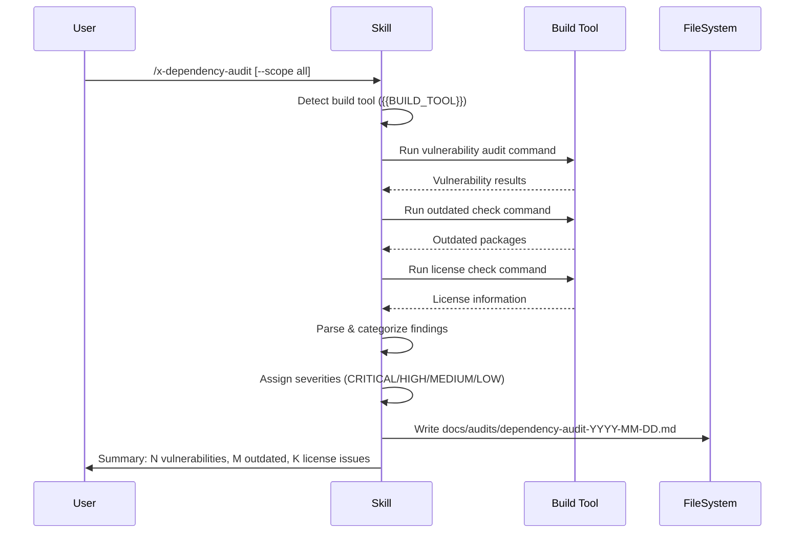

# Historia: Skill x-dependency-audit (Claude Code + GitHub Copilot)

**ID:** story-0007-0004

## 1. Dependencias

| Blocked By | Blocks |
| :--- | :--- |
| — | story-0007-0006 |

## 2. Regras Transversais Aplicaveis

| ID | Titulo |
| :--- | :--- |
| RULE-001 | Dual Copy Consistency |
| RULE-002 | Source of Truth e resources/ |
| RULE-004 | Skill Autonomy |
| RULE-005 | Placeholder Tokens |

## 3. Descricao

Como **Desenvolvedor de Skills**, eu quero criar o template da skill `x-dependency-audit` para que
projetos gerados pelo `ia-dev-env` tenham uma skill que verifica dependencias quanto a
vulnerabilidades, versoes desatualizadas e licencas.

A skill pertence ao grupo `review` e gera dois artefatos:
1. Claude Code: `skills-templates/core/x-dependency-audit/SKILL.md`
2. GitHub Copilot: `github-skills-templates/review/x-dependency-audit.md`

### 3.1 Comportamento da Skill

- **Input:** Escopo opcional (`--scope all|vulnerabilities|outdated|licenses`)
- **Fluxo:**
  1. Detectar build tool do projeto (via `{{BUILD_TOOL}}` placeholder)
  2. Executar comandos de auditoria especificos por linguagem:
     - npm: `npm audit`, `npm outdated`, `npx license-checker`
     - Maven: `mvn dependency:tree`, `mvn versions:display-dependency-updates`, `mvn org.sonatype.ossindex.maven:ossindex-maven-plugin:audit`
     - Gradle: `gradle dependencies`, `gradle dependencyUpdates`
     - Cargo: `cargo audit`, `cargo outdated`
     - pip: `pip-audit`, `pip list --outdated`
     - Go: `go list -m -u all`, `govulncheck ./...`
  3. Parsear resultados de cada comando
  4. Categorizar findings por severidade (CRITICAL / HIGH / MEDIUM / LOW)
  5. Gerar relatorio consolidado
- **Output:** `docs/audits/dependency-audit-YYYY-MM-DD.md`

### 3.2 Artefatos

| Artefato | Caminho |
| :--- | :--- |
| Claude Code SKILL.md | `java/src/main/resources/skills-templates/core/x-dependency-audit/SKILL.md` |
| GitHub Copilot template | `java/src/main/resources/github-skills-templates/review/x-dependency-audit.md` |

## 4. Definicoes de Qualidade Locais

### DoR Local (Definition of Ready)

- [ ] Comandos de auditoria por linguagem/build tool levantados
- [ ] Formato de relatorio de auditoria de dependencias definido
- [ ] Placeholders `{{BUILD_TOOL}}` e `{{LANGUAGE}}` verificados no ContextBuilder

### DoD Local (Definition of Done)

- [ ] Template Claude Code criado com frontmatter completo
- [ ] Template GitHub Copilot criado com frontmatter
- [ ] Tabela de comandos por build tool documentada
- [ ] Tres dimensoes cobertas: vulnerabilidades, versoes, licencas
- [ ] Formato de relatorio com severidades definido
- [ ] Skill auto-contida (RULE-004)

### Global Definition of Done (DoD)

- **Cobertura:** >= 95% Line Coverage, >= 90% Branch Coverage (JaCoCo)
- **Testes Automatizados:** Golden file (paridade byte-a-byte apos story-0007-0006)
- **TDD Compliance:** Test-first, refactoring explicito

## 5. Diagramas

### 5.1 Fluxo da Skill x-dependency-audit



## 6. Criterios de Aceite (Gherkin)

```gherkin
Cenario: Template Claude Code criado com frontmatter valido
  DADO que o diretorio skills-templates/core/x-dependency-audit/ NAO existe
  QUANDO o template SKILL.md e criado
  ENTAO o arquivo contem frontmatter YAML com name, description, allowed-tools, argument-hint
  E o body contem tabela de comandos por build tool

Cenario: Template GitHub Copilot criado com frontmatter valido
  DADO que o arquivo github-skills-templates/review/x-dependency-audit.md NAO existe
  QUANDO o template e criado
  ENTAO o arquivo contem frontmatter YAML com name e description
  E o body e funcionalmente equivalente ao template Claude Code

Cenario: Comandos por build tool documentados
  DADO que o template define comandos de auditoria
  QUANDO a tabela de comandos e analisada
  ENTAO cobre npm, Maven, Gradle, Cargo, pip, Go
  E cada entrada tem: comando de vulnerabilidade, comando de outdated, comando de licenca

Cenario: Tres dimensoes de auditoria cobertas
  DADO que o template define o escopo da auditoria
  QUANDO as dimensoes sao analisadas
  ENTAO cobre: vulnerabilidades (CVEs), versoes desatualizadas, licencas
  E cada dimensao tem formato de output especifico

Cenario: Placeholders sao do conjunto estabelecido
  DADO que o template usa tokens entre {{ e }}
  QUANDO todos os tokens sao extraidos
  ENTAO cada token pertence ao conjunto estabelecido
  E {{BUILD_TOOL}} e usado para selecao de comandos
```

### 6.1 Scenario Ordering (TPP)

> Scenarios seguem TPP: existencia basica -> formato alternativo -> comportamento (comandos) -> variacao (dimensoes) -> restricao (placeholders).

## 7. Sub-tarefas

- [ ] [Dev] Criar `skills-templates/core/x-dependency-audit/SKILL.md` com tabela de comandos
- [ ] [Dev] Criar `github-skills-templates/review/x-dependency-audit.md` espelhando Claude Code
- [ ] [Test] Verificar cobertura de build tools e dimensoes de auditoria
- [ ] [Test] Verificar placeholders do conjunto estabelecido
- [ ] [Doc] Documentar a skill no indice do EPIC
