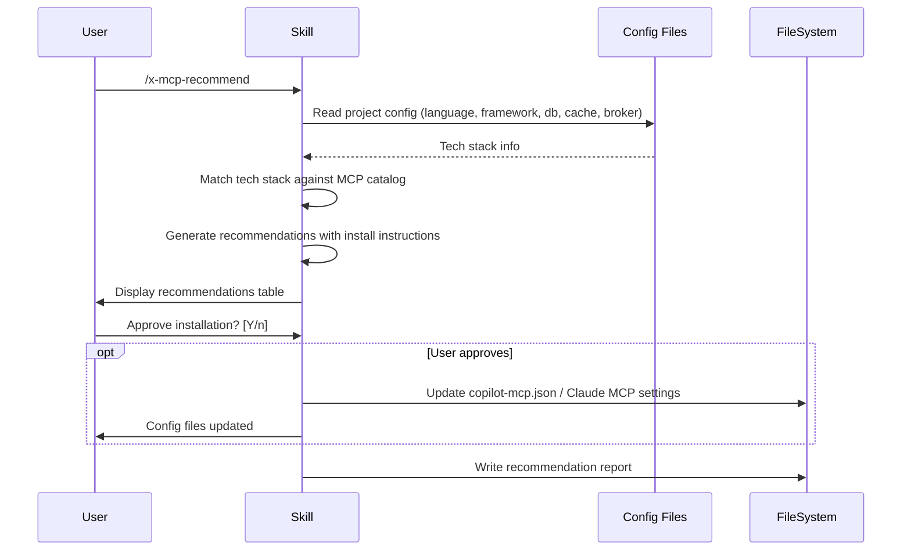

# Historia: Skill x-mcp-recommend (Claude Code + GitHub Copilot)

**ID:** story-0007-0005

## 1. Dependencias

| Blocked By | Blocks |
| :--- | :--- |
| — | story-0007-0006 |

## 2. Regras Transversais Aplicaveis

| ID | Titulo |
| :--- | :--- |
| RULE-001 | Dual Copy Consistency |
| RULE-002 | Source of Truth e resources/ |
| RULE-004 | Skill Autonomy |
| RULE-005 | Placeholder Tokens |

## 3. Descricao

Como **Desenvolvedor de Skills**, eu quero criar o template da skill `x-mcp-recommend` para que
projetos gerados pelo `ia-dev-env` tenham uma skill que analisa a tech stack do projeto e
recomenda MCP (Model Context Protocol) servers relevantes.

A skill pertence ao grupo `dev` e gera dois artefatos:
1. Claude Code: `skills-templates/core/x-mcp-recommend/SKILL.md`
2. GitHub Copilot: `github-skills-templates/dev/x-mcp-recommend.md`

### 3.1 Comportamento da Skill

- **Input:** Nenhum (auto-deteccao a partir da configuracao do projeto)
- **Fluxo:**
  1. Ler identidade do projeto (language, framework, database, cache, message broker)
  2. Consultar catalogo built-in de MCP servers
  3. Matching: tech stack -> MCP servers recomendados
  4. Gerar recomendacoes com instrucoes de instalacao
  5. Opcionalmente atualizar `copilot-mcp.json` ou configuracao Claude Code MCP
- **Catalogo MCP (built-in no SKILL.md):**
  - PostgreSQL -> `@modelcontextprotocol/server-postgres`
  - MySQL -> `mysql-mcp-server`
  - MongoDB -> `mongodb-mcp-server`
  - Redis -> `redis-mcp-server`
  - GitHub -> `@modelcontextprotocol/server-github`
  - Slack -> `@modelcontextprotocol/server-slack`
  - Filesystem -> `@modelcontextprotocol/server-filesystem`
  - Puppeteer -> `@modelcontextprotocol/server-puppeteer`
  - Docker -> `docker-mcp-server`
  - Kubernetes -> `kubernetes-mcp-server`
  - AWS -> `aws-mcp-server`
  - Sentry -> `sentry-mcp-server`
  - Linear -> `linear-mcp-server`
- **Output:** Relatorio de recomendacoes + opcional config file updates

### 3.2 Artefatos

| Artefato | Caminho |
| :--- | :--- |
| Claude Code SKILL.md | `java/src/main/resources/skills-templates/core/x-mcp-recommend/SKILL.md` |
| GitHub Copilot template | `java/src/main/resources/github-skills-templates/dev/x-mcp-recommend.md` |

## 4. Definicoes de Qualidade Locais

### DoR Local (Definition of Ready)

- [ ] Catalogo de MCP servers publicos levantado
- [ ] Mapeamento tech stack -> MCP server definido
- [ ] Formato de configuracao MCP para Claude Code e GitHub Copilot documentado

### DoD Local (Definition of Done)

- [ ] Template Claude Code criado com frontmatter completo
- [ ] Template GitHub Copilot criado com frontmatter
- [ ] Catalogo built-in com >= 10 MCP servers mapeados
- [ ] Instrucoes de instalacao por MCP server documentadas
- [ ] Fluxo de auto-deteccao de tech stack documentado
- [ ] Output inclui tanto relatorio quanto config snippets
- [ ] Skill auto-contida (RULE-004)

### Global Definition of Done (DoD)

- **Cobertura:** >= 95% Line Coverage, >= 90% Branch Coverage (JaCoCo)
- **Testes Automatizados:** Golden file (paridade byte-a-byte apos story-0007-0006)
- **TDD Compliance:** Test-first, refactoring explicito

## 5. Diagramas

### 5.1 Fluxo da Skill x-mcp-recommend



## 6. Criterios de Aceite (Gherkin)

```gherkin
Cenario: Template Claude Code criado com frontmatter valido
  DADO que o diretorio skills-templates/core/x-mcp-recommend/ NAO existe
  QUANDO o template SKILL.md e criado
  ENTAO o arquivo contem frontmatter YAML com name, description, allowed-tools, argument-hint
  E o body contem catalogo de MCP servers

Cenario: Template GitHub Copilot criado com frontmatter valido
  DADO que o arquivo github-skills-templates/dev/x-mcp-recommend.md NAO existe
  QUANDO o template e criado
  ENTAO o arquivo contem frontmatter YAML com name e description
  E o body e funcionalmente equivalente ao template Claude Code

Cenario: Catalogo MCP com cobertura minima
  DADO que o template define o catalogo de MCP servers
  QUANDO os servers sao contados
  ENTAO o catalogo contem >= 10 MCP servers
  E cobre categorias: database, messaging, DevOps, productivity

Cenario: Mapeamento tech stack para MCP servers
  DADO que o template define regras de matching
  QUANDO a tabela de mapeamento e analisada
  ENTAO PostgreSQL mapeia para server-postgres
  E Redis mapeia para redis-mcp-server
  E Kubernetes mapeia para kubernetes-mcp-server
  E cada mapeamento inclui instrucoes de instalacao

Cenario: Placeholders sao do conjunto estabelecido
  DADO que o template usa tokens entre {{ e }}
  QUANDO todos os tokens sao extraidos
  ENTAO cada token pertence ao conjunto estabelecido
  E {{PROJECT_NAME}} e usado no relatorio
```

### 6.1 Scenario Ordering (TPP)

> Scenarios seguem TPP: existencia basica -> formato alternativo -> comportamento (catalogo) -> variacao (mapeamento) -> restricao (placeholders).

## 7. Sub-tarefas

- [ ] [Dev] Criar `skills-templates/core/x-mcp-recommend/SKILL.md` com catalogo MCP
- [ ] [Dev] Criar `github-skills-templates/dev/x-mcp-recommend.md` espelhando Claude Code
- [ ] [Test] Verificar catalogo com >= 10 MCP servers
- [ ] [Test] Verificar placeholders do conjunto estabelecido
- [ ] [Doc] Documentar a skill no indice do EPIC
