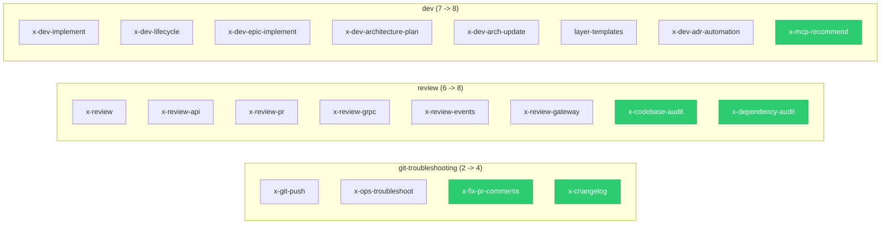

# Historia: Consolidacao — Assembler, Golden Files e Testes

**ID:** story-0007-0006

## 1. Dependencias

| Blocked By | Blocks |
| :--- | :--- |
| story-0007-0001, story-0007-0002, story-0007-0003, story-0007-0004, story-0007-0005 | — |

## 2. Regras Transversais Aplicaveis

| ID | Titulo |
| :--- | :--- |
| RULE-001 | Dual Copy Consistency |
| RULE-002 | Source of Truth e resources/ |
| RULE-003 | Backward Compatibility |

## 3. Descricao

Como **Desenvolvedor Java**, eu quero registrar as 5 novas skills no `GithubSkillsAssembler`,
atualizar os testes de tamanho de grupo e regenerar os golden files para os 8 perfis bundled,
garantindo que o pipeline completo funcione corretamente com as novas skills.

### 3.1 Alteracoes no GithubSkillsAssembler

Adicionar 5 skills ao mapa `SKILL_GROUPS`:

| Grupo | Skills Adicionadas | Tamanho Anterior | Tamanho Novo |
| :--- | :--- | :--- | :--- |
| `git-troubleshooting` | `x-fix-pr-comments`, `x-changelog` | 2 | 4 |
| `review` | `x-codebase-audit`, `x-dependency-audit` | 6 | 8 |
| `dev` | `x-mcp-recommend` | 7 | 8 |

### 3.2 Alteracoes nos Testes

Atualizar `GithubSkillsAssemblerTest`:
- `gitTroubleshootingGroupHasTwoSkills()` -> `gitTroubleshootingGroupHasFourSkills()` (2 -> 4)
- `reviewGroupHasSixSkills()` -> `reviewGroupHasEightSkills()` (6 -> 8)
- `devGroupHasSevenSkills()` -> `devGroupHasEightSkills()` (7 -> 8)

### 3.3 Golden Files

Regenerar golden files para os 8 perfis:
- go-gin
- java-quarkus
- java-spring
- kotlin-ktor
- python-click-cli
- python-fastapi
- rust-axum
- typescript-nestjs

### 3.4 Artefatos Modificados

| Artefato | Caminho | Tipo de Alteracao |
| :--- | :--- | :--- |
| GithubSkillsAssembler.java | `java/src/main/java/dev/iadev/assembler/GithubSkillsAssembler.java` | Adicionar 5 skills ao SKILL_GROUPS |
| GithubSkillsAssemblerTest.java | `java/src/test/java/dev/iadev/assembler/GithubSkillsAssemblerTest.java` | Atualizar assertions de tamanho |
| Golden files (8 perfis) | `java/src/test/resources/golden/` | Regenerar |

## 4. Definicoes de Qualidade Locais

### DoR Local (Definition of Ready)

- [ ] Todas as 5 stories de skills (0001-0005) concluidas
- [ ] 10 template files criados (5 Claude Code + 5 GitHub Copilot)
- [ ] Templates usam apenas placeholders estabelecidos

### DoD Local (Definition of Done)

- [ ] SKILL_GROUPS atualizado com 5 novas skills nos 3 grupos
- [ ] Testes de tamanho de grupo atualizados e passando
- [ ] Golden files regenerados para todos os 8 perfis
- [ ] `mvn test` passa com 100% dos testes
- [ ] Golden file byte-a-byte comparison passa
- [ ] Nenhuma skill existente removida ou alterada (RULE-003)

### Global Definition of Done (DoD)

- **Cobertura:** >= 95% Line Coverage, >= 90% Branch Coverage (JaCoCo)
- **Testes Automatizados:** Unitarios + golden file
- **TDD Compliance:** Test-first (atualizar teste antes do assembler)

## 5. Diagramas

### 5.1 Impacto no SKILL_GROUPS



## 6. Criterios de Aceite (Gherkin)

```gherkin
Cenario: SKILL_GROUPS atualizado com novas skills
  DADO que GithubSkillsAssembler.SKILL_GROUPS contem 8 grupos
  QUANDO as 5 novas skills sao adicionadas
  ENTAO git-troubleshooting contem 4 skills
  E review contem 8 skills
  E dev contem 8 skills
  E os demais grupos permanecem inalterados

Cenario: Testes de tamanho atualizados e passando
  DADO que GithubSkillsAssemblerTest tem assertions de tamanho por grupo
  QUANDO os testes sao executados
  ENTAO gitTroubleshootingGroupHasFourSkills() passa
  E reviewGroupHasEightSkills() passa
  E devGroupHasEightSkills() passa

Cenario: Golden files regenerados para todos os perfis
  DADO que os 8 perfis bundled existem
  QUANDO golden files sao regenerados
  ENTAO cada perfil contem as 5 novas skills nos diretorios esperados
  E comparacao byte-a-byte passa

Cenario: mvn test passa com todas as alteracoes
  DADO que assembler, testes e golden files estao atualizados
  QUANDO `mvn test` e executado
  ENTAO todos os testes passam
  E cobertura >= 95% line, >= 90% branch

Cenario: Backward compatibility mantida
  DADO que skills existentes NAO foram alteradas
  QUANDO o pipeline e executado
  ENTAO todas as skills anteriores continuam sendo geradas
  E nenhuma skill foi removida ou renomeada
```

### 6.1 Scenario Ordering (TPP)

> Scenarios seguem TPP: constante (SKILL_GROUPS) -> derivado (testes) -> integracao (golden files) -> validacao completa (mvn test) -> restricao (backward compat).

## 7. Sub-tarefas

- [ ] [Test] Atualizar assertions de tamanho em GithubSkillsAssemblerTest (test-first)
- [ ] [Dev] Adicionar 5 skills ao SKILL_GROUPS em GithubSkillsAssembler.java
- [ ] [Test] Executar testes unitarios e corrigir falhas
- [ ] [Dev] Regenerar golden files para os 8 perfis
- [ ] [Test] Executar `mvn test` e validar golden file byte-a-byte
- [ ] [Doc] Verificar contadores em README template (auto-gerados)
