# Mapa de Implementação — EPIC-0008: Correção de Dívida Técnica

**Épico:** [EPIC-0008](./epic-0008.md)
**Data:** 2026-03-20
**Total:** 30 histórias em 4 fases

---

## 1. Matriz de Dependências

| Story | Título | Blocked By | Blocks | Fase |
| :--- | :--- | :--- | :--- | :--- |
| story-0008-0001 | Extrair writeFile/readFile para CopyHelpers | — | 0006, 0013, 0014, 0015, 0016 | 0 |
| story-0008-0002 | Extrair listMdFilesSorted e deleteQuietly | — | — | 0 |
| story-0008-0003 | Criar JsonHelpers com escapeJson RFC 8259 | — | 0013, 0015 | 0 |
| story-0008-0004 | Unificar buildContext() e conversão booleana | — | 0013, 0014, 0016, 0017 | 0 |
| story-0008-0005 | Extrair record AssembleResult compartilhado | — | 0007 | 0 |
| story-0008-0006 | Eliminar return null com Optional | 0001 | 0017, 0024 | 1 |
| story-0008-0007 | Substituir System.err.println por warnings | 0005 | — | 1 |
| story-0008-0008 | Substituir concatenação por .formatted() | — | — | 0 |
| story-0008-0009 | Eliminar números e strings mágicas | — | — | 0 |
| story-0008-0010 | Eliminar parâmetros boolean flag | — | — | 0 |
| story-0008-0011 | Reduzir parâmetros com parameter objects | — | — | 0 |
| story-0008-0012 | Corrigir train wrecks | — | — | 0 |
| story-0008-0013 | Dividir CicdAssembler | 0001, 0003, 0004 | 0023, 0025 | 1 |
| story-0008-0014 | Dividir GithubInstructionsAssembler e RulesAssembler | 0001, 0004 | 0023, 0025 | 1 |
| story-0008-0015 | Dividir SettingsAssembler e ReadmeTables | 0001, 0003 | 0023, 0025 | 1 |
| story-0008-0016 | Dividir demais assemblers > 250 linhas | 0001, 0004 | 0023, 0025 | 1 |
| story-0008-0017 | Decompor métodos > 25 linhas — lote 1 | 0004, 0006 | 0018 | 2 |
| story-0008-0018 | Decompor métodos > 25 linhas — lote 2 | 0017 | — | 3 |
| story-0008-0019 | Extrair Jackson do domínio checkpoint | — | 0030 | 0 |
| story-0008-0020 | Corrigir I/O no domínio VersionResolver | — | 0030 | 0 |
| story-0008-0021 | Adicionar SafeConstructor no parsing YAML | — | — | 0 |
| story-0008-0022 | Adicionar constructor testável ao GithubMcpAssembler | — | — | 0 |
| story-0008-0023 | Padronizar nomes de métodos de teste | 0013, 0014, 0015, 0016 | — | 2 |
| story-0008-0024 | Fortalecer assertions fracas nos testes | 0006 | — | 2 |
| story-0008-0025 | Dividir arquivos de teste > 250 linhas | 0013, 0014, 0015, 0016 | — | 2 |
| story-0008-0026 | Mover classes test-only para src/test | — | — | 0 |
| story-0008-0027 | Consolidar pacote de exceções | — | — | 0 |
| story-0008-0028 | Hardening de segurança | — | — | 0 |
| story-0008-0029 | Corrigir nomes qualificados e cleanups | — | — | 0 |
| story-0008-0030 | Documentar desvios arquiteturais como ADR | 0019, 0020 | — | 1 |

> **Nota:** story-0008-0002 (listMdFilesSorted/deleteQuietly) não possui dependentes declarados no épico, mas pode ter dependência funcional implícita com stories 0014 e 0015 caso esses assemblers usem os utilitários extraídos. Verificar durante implementação.

---

## 2. Diagrama de Fases (ASCII)

```
╔══════════════════════════════════════════════════════════════════════════════════════╗
║  FASE 0 — Fundação (18 histórias paralelas)                                        ║
╠══════════════════════════════════════════════════════════════════════════════════════╣
║                                                                                      ║
║  ┌─────────────────┐ ┌─────────────────┐ ┌─────────────────┐ ┌─────────────────┐    ║
║  │ 0001             │ │ 0002             │ │ 0003             │ │ 0004             │    ║
║  │ CopyHelpers      │ │ listMd/delete    │ │ JsonHelpers      │ │ buildContext()   │    ║
║  └────────┬─────────┘ └─────────────────┘ └────────┬─────────┘ └────────┬─────────┘    ║
║           │                                         │                    │              ║
║  ┌─────────────────┐ ┌─────────────────┐ ┌─────────────────┐ ┌─────────────────┐    ║
║  │ 0005             │ │ 0008             │ │ 0009             │ │ 0010             │    ║
║  │ AssembleResult   │ │ .formatted()     │ │ magic numbers    │ │ boolean flags    │    ║
║  └────────┬─────────┘ └─────────────────┘ └─────────────────┘ └─────────────────┘    ║
║           │                                                                            ║
║  ┌─────────────────┐ ┌─────────────────┐ ┌─────────────────┐ ┌─────────────────┐    ║
║  │ 0011             │ │ 0012             │ │ 0019             │ │ 0020             │    ║
║  │ param objects    │ │ train wrecks     │ │ Jackson domain   │ │ I/O domain       │    ║
║  └─────────────────┘ └─────────────────┘ └────────┬─────────┘ └────────┬─────────┘    ║
║                                                    │                    │              ║
║  ┌─────────────────┐ ┌─────────────────┐ ┌─────────────────┐ ┌─────────────────┐    ║
║  │ 0021             │ │ 0022             │ │ 0026             │ │ 0027             │    ║
║  │ SafeConstructor  │ │ testable ctor    │ │ test-only move   │ │ exceptions pkg   │    ║
║  └─────────────────┘ └─────────────────┘ └─────────────────┘ └─────────────────┘    ║
║                                                                                      ║
║  ┌─────────────────┐ ┌─────────────────┐                                             ║
║  │ 0028             │ │ 0029             │                                             ║
║  │ security harden  │ │ qualified names  │                                             ║
║  └─────────────────┘ └─────────────────┘                                             ║
╚══════════════════════════════════════════════════════════════════════════════════════╝
           │                    │                    │                    │
           ▼                    ▼                    ▼                    ▼
╔══════════════════════════════════════════════════════════════════════════════════════╗
║  FASE 1 — Decomposição de Classes + Null Elimination (7 histórias paralelas)        ║
╠══════════════════════════════════════════════════════════════════════════════════════╣
║                                                                                      ║
║  ┌─────────────────┐ ┌─────────────────┐ ┌─────────────────┐ ┌─────────────────┐    ║
║  │ 0006             │ │ 0007             │ │ 0013             │ │ 0014             │    ║
║  │ Optional<T>      │ │ warn propagation │ │ split CicdAsm   │ │ split GhInstr    │    ║
║  └────────┬─────────┘ └─────────────────┘ └────────┬─────────┘ └────────┬─────────┘    ║
║           │                                         │                    │              ║
║  ┌─────────────────┐ ┌─────────────────┐ ┌─────────────────┐                          ║
║  │ 0015             │ │ 0016             │ │ 0030             │                          ║
║  │ split Settings   │ │ split remaining  │ │ ADR docs         │                          ║
║  └────────┬─────────┘ └────────┬─────────┘ └─────────────────┘                          ║
║           │                    │                                                        ║
╚══════════════════════════════════════════════════════════════════════════════════════╝
           │                    │                    │
           ▼                    ▼                    ▼
╔══════════════════════════════════════════════════════════════════════════════════════╗
║  FASE 2 — Decomposição de Métodos + Padronização de Testes (4 histórias paralelas)  ║
╠══════════════════════════════════════════════════════════════════════════════════════╣
║                                                                                      ║
║  ┌─────────────────┐ ┌─────────────────┐ ┌─────────────────┐ ┌─────────────────┐    ║
║  │ 0017             │ │ 0023             │ │ 0024             │ │ 0025             │    ║
║  │ methods lote 1   │ │ test naming      │ │ assertions       │ │ split test files │    ║
║  └────────┬─────────┘ └─────────────────┘ └─────────────────┘ └─────────────────┘    ║
║           │                                                                            ║
╚══════════════════════════════════════════════════════════════════════════════════════╝
           │
           ▼
╔══════════════════════════════════════════════════════════════════════════════════════╗
║  FASE 3 — Finalização (1 história)                                                   ║
╠══════════════════════════════════════════════════════════════════════════════════════╣
║                                                                                      ║
║  ┌─────────────────┐                                                                  ║
║  │ 0018             │                                                                  ║
║  │ methods lote 2   │                                                                  ║
║  └─────────────────┘                                                                  ║
║                                                                                      ║
╚══════════════════════════════════════════════════════════════════════════════════════╝
```

---

## 3. Caminho Crítico

```
story-0008-0001 (CopyHelpers) ──→ story-0008-0006 (Optional) ──→ story-0008-0017 (methods lote 1) ──→ story-0008-0018 (methods lote 2)
       Fase 0                            Fase 1            ←── story-0008-0004 (buildContext)
                                                                      Fase 0
       Fase 0                            Fase 1                      Fase 2                            Fase 3
```

**4 fases no caminho crítico, 4 histórias na cadeia mais longa** (story-0008-0001 → story-0008-0006 → story-0008-0017 → story-0008-0018).

story-0008-0004 (buildContext) converge em story-0008-0017, criando um ponto de convergência dupla: story-0008-0017 depende tanto de story-0008-0006 (via 0001) quanto diretamente de story-0008-0004. Qualquer atraso em 0001, 0004 ou 0006 impacta diretamente a entrega final.

---

## 4. Grafo de Dependências (Mermaid)

```mermaid
graph TD
    %% Fase 0 — Fundação
    S0008_0001["story-0008-0001<br/>CopyHelpers"]
    S0008_0002["story-0008-0002<br/>listMd/delete utils"]
    S0008_0003["story-0008-0003<br/>JsonHelpers"]
    S0008_0004["story-0008-0004<br/>buildContext()"]
    S0008_0005["story-0008-0005<br/>AssembleResult"]
    S0008_0008["story-0008-0008<br/>.formatted()"]
    S0008_0009["story-0008-0009<br/>magic numbers"]
    S0008_0010["story-0008-0010<br/>boolean flags"]
    S0008_0011["story-0008-0011<br/>param objects"]
    S0008_0012["story-0008-0012<br/>train wrecks"]
    S0008_0019["story-0008-0019<br/>Jackson domain"]
    S0008_0020["story-0008-0020<br/>I/O domain"]
    S0008_0021["story-0008-0021<br/>SafeConstructor"]
    S0008_0022["story-0008-0022<br/>testable ctor"]
    S0008_0026["story-0008-0026<br/>test-only move"]
    S0008_0027["story-0008-0027<br/>exceptions pkg"]
    S0008_0028["story-0008-0028<br/>security harden"]
    S0008_0029["story-0008-0029<br/>qualified names"]

    %% Fase 1 — Decomposição
    S0008_0006["story-0008-0006<br/>Optional&lt;T&gt;"]
    S0008_0007["story-0008-0007<br/>warn propagation"]
    S0008_0013["story-0008-0013<br/>split CicdAsm"]
    S0008_0014["story-0008-0014<br/>split GhInstr"]
    S0008_0015["story-0008-0015<br/>split Settings"]
    S0008_0016["story-0008-0016<br/>split remaining"]
    S0008_0030["story-0008-0030<br/>ADR docs"]

    %% Fase 2 — Métodos + Testes
    S0008_0017["story-0008-0017<br/>methods lote 1"]
    S0008_0023["story-0008-0023<br/>test naming"]
    S0008_0024["story-0008-0024<br/>assertions"]
    S0008_0025["story-0008-0025<br/>split test files"]

    %% Fase 3 — Finalização
    S0008_0018["story-0008-0018<br/>methods lote 2"]

    %% Fase 0 → Fase 1
    S0008_0001 --> S0008_0006
    S0008_0001 --> S0008_0013
    S0008_0001 --> S0008_0014
    S0008_0001 --> S0008_0015
    S0008_0001 --> S0008_0016
    S0008_0003 --> S0008_0013
    S0008_0003 --> S0008_0015
    S0008_0004 --> S0008_0013
    S0008_0004 --> S0008_0014
    S0008_0004 --> S0008_0016
    S0008_0005 --> S0008_0007
    S0008_0019 --> S0008_0030
    S0008_0020 --> S0008_0030

    %% Fase 1 → Fase 2
    S0008_0006 --> S0008_0017
    S0008_0006 --> S0008_0024
    S0008_0004 --> S0008_0017
    S0008_0013 --> S0008_0023
    S0008_0014 --> S0008_0023
    S0008_0015 --> S0008_0023
    S0008_0016 --> S0008_0023
    S0008_0013 --> S0008_0025
    S0008_0014 --> S0008_0025
    S0008_0015 --> S0008_0025
    S0008_0016 --> S0008_0025

    %% Fase 2 → Fase 3
    S0008_0017 --> S0008_0018

    %% Styling
    classDef fase0 fill:#1a1a2e,stroke:#e94560,color:#fff
    classDef fase1 fill:#16213e,stroke:#0f3460,color:#fff
    classDef fase2 fill:#533483,stroke:#e94560,color:#fff
    classDef fase3 fill:#e94560,stroke:#fff,color:#fff

    class S0008_0001,S0008_0002,S0008_0003,S0008_0004,S0008_0005,S0008_0008,S0008_0009,S0008_0010,S0008_0011,S0008_0012,S0008_0019,S0008_0020,S0008_0021,S0008_0022,S0008_0026,S0008_0027,S0008_0028,S0008_0029 fase0
    class S0008_0006,S0008_0007,S0008_0013,S0008_0014,S0008_0015,S0008_0016,S0008_0030 fase1
    class S0008_0017,S0008_0023,S0008_0024,S0008_0025 fase2
    class S0008_0018 fase3
```



---

## 5. Resumo das Fases

| Fase | Histórias | Camada | Paralelismo | Pré-requisito |
| :--- | :--- | :--- | :--- | :--- |
| 0 | 0001, 0002, 0003, 0004, 0005, 0008, 0009, 0010, 0011, 0012, 0019, 0020, 0021, 0022, 0026, 0027, 0028, 0029 | Utilitários + Clean Code + Domínio + Segurança | 18 paralelas | — |
| 1 | 0006, 0007, 0013, 0014, 0015, 0016, 0030 | Null elimination + Decomposição de classes + ADR | 7 paralelas | Fase 0 completa |
| 2 | 0017, 0023, 0024, 0025 | Decomposição de métodos + Padronização de testes | 4 paralelas | Fase 1 completa |
| 3 | 0018 | Decomposição de métodos (lote 2) | 1 sequencial | Fase 2 completa |

**Total: 30 histórias em 4 fases. Paralelismo máximo: 18 (Fase 0).**

> **Nota:** As histórias 0008, 0009, 0010, 0011, 0012, 0021, 0022, 0026, 0027, 0028, 0029 são completamente independentes — não bloqueiam nenhuma outra história. Podem ser executadas a qualquer momento sem impacto no caminho crítico.

---

## 6. Detalhamento das Fases

### Fase 0 — Fundação (18 histórias)

| Story | Escopo Principal | Artefatos Chave |
| :--- | :--- | :--- |
| story-0008-0001 | Extrair writeFile/readFile para CopyHelpers | `CopyHelpers.java`, testes unitários |
| story-0008-0002 | Extrair listMdFilesSorted e deleteQuietly | Utilitários de filesystem, testes |
| story-0008-0003 | Criar JsonHelpers com escapeJson RFC 8259 | `JsonHelpers.java`, testes de escape |
| story-0008-0004 | Unificar buildContext() e conversão booleana | `buildContext()` unificado, conversão corrigida |
| story-0008-0005 | Extrair record AssembleResult compartilhado | `AssembleResult` record, refactoring de retornos |
| story-0008-0008 | Substituir concatenação por .formatted() | Substituição global de `+` por `.formatted()` |
| story-0008-0009 | Eliminar números e strings mágicas | Constantes nomeadas, enums |
| story-0008-0010 | Eliminar parâmetros boolean flag | Strategy/enum replacements |
| story-0008-0011 | Reduzir parâmetros com parameter objects | Records para parameter objects |
| story-0008-0012 | Corrigir train wrecks | Accessors de conveniência |
| story-0008-0019 | Extrair Jackson do domínio checkpoint | Port/adapter para serialização |
| story-0008-0020 | Corrigir I/O no domínio VersionResolver | Port para I/O, adapter outbound |
| story-0008-0021 | Adicionar SafeConstructor no YAML | `SafeConstructor` em SnakeYAML |
| story-0008-0022 | Constructor testável ao GithubMcpAssembler | Constructor injection |
| story-0008-0026 | Mover classes test-only para src/test | Reorganização de diretórios |
| story-0008-0027 | Consolidar pacote de exceções | Hierarquia de exceções unificada |
| story-0008-0028 | Hardening de segurança | Path traversal, symlink, temp dir fixes |
| story-0008-0029 | Corrigir nomes qualificados e cleanups | Renomeações, imports |

**Entregas da Fase 0:**
- Utilitários compartilhados (`CopyHelpers`, `JsonHelpers`, filesystem utils) extraídos e testados
- `buildContext()` unificado com conversão booleana corrigida
- `AssembleResult` record disponível para todos assemblers
- Clean Code fixes aplicados: `.formatted()`, constantes, parameter objects, train wrecks
- Domínio purificado: Jackson e I/O extraídos via ports
- Segurança reforçada: SafeConstructor, path traversal, symlinks
- Estrutura de testes organizada (test-only classes movidas)
- Pacote de exceções consolidado

### Fase 1 — Decomposição de Classes + Null Elimination (7 histórias)

| Story | Escopo Principal | Artefatos Chave |
| :--- | :--- | :--- |
| story-0008-0006 | Eliminar return null com Optional | `Optional<T>` em todas APIs internas |
| story-0008-0007 | Substituir System.err.println por warnings | Warning propagation system |
| story-0008-0013 | Dividir CicdAssembler | Classes especializadas por pipeline (GitHub Actions, GitLab CI, etc.) |
| story-0008-0014 | Dividir GithubInstructionsAssembler e RulesAssembler | Classes < 250 linhas por responsabilidade |
| story-0008-0015 | Dividir SettingsAssembler e ReadmeTables | Classes < 250 linhas por responsabilidade |
| story-0008-0016 | Dividir demais assemblers | Classes < 250 linhas por responsabilidade |
| story-0008-0030 | Documentar desvios arquiteturais | ADRs para decisões de domínio |

**Entregas da Fase 1:**
- Zero `return null` no codebase — todo retorno nullable convertido para `Optional<T>`
- Sistema de warning propagation substituindo `System.err.println`
- Todos os assemblers acima de 250 linhas divididos em classes especializadas
- ADRs documentando desvios arquiteturais (Jackson no domínio, I/O no VersionResolver)

### Fase 2 — Decomposição de Métodos + Padronização de Testes (4 histórias)

| Story | Escopo Principal | Artefatos Chave |
| :--- | :--- | :--- |
| story-0008-0017 | Decompor métodos > 25 linhas (lote 1) | Métodos extraídos, < 25 linhas cada |
| story-0008-0023 | Padronizar nomes de métodos de teste | Renomeação para formato `[method]_[scenario]_[expected]` |
| story-0008-0024 | Fortalecer assertions fracas | Assertions específicas substituindo genéricas |
| story-0008-0025 | Dividir arquivos de teste > 250 linhas | Arquivos de teste < 250 linhas cada |

**Entregas da Fase 2:**
- Primeiro lote de métodos longos decomposto (< 25 linhas cada)
- Todos os testes com nomenclatura padronizada
- Assertions fortalecidas (sem `assertTrue(x != null)`, usando `assertNotNull`, `assertThat`, etc.)
- Arquivos de teste divididos para corresponder às novas classes da Fase 1

### Fase 3 — Finalização (1 história)

| Story | Escopo Principal | Artefatos Chave |
| :--- | :--- | :--- |
| story-0008-0018 | Decompor métodos > 25 linhas (lote 2) | Métodos restantes extraídos, < 25 linhas cada |

**Entregas da Fase 3:**
- Todos os métodos remanescentes acima de 25 linhas decompostos
- Codebase inteiramente conforme com limite de 25 linhas por método

---

## 7. Observações Estratégicas

### Gargalo Principal

**story-0008-0001 (CopyHelpers)** é o gargalo principal: bloqueia diretamente 5 histórias (0006, 0013, 0014, 0015, 0016) e indiretamente mais 5 (0017, 0018, 0023, 0024, 0025). Totaliza 10 histórias dependentes (33% do épico). Investir tempo extra em design e cobertura de testes nesta story previne retrabalho em cascata.

**story-0008-0004 (buildContext)** é o segundo gargalo: bloqueia 4 histórias diretamente (0013, 0014, 0016, 0017) e está no caminho crítico convergindo em story-0008-0017.

### Histórias Folha (sem dependentes)

11 histórias não bloqueiam nenhuma outra:
- **Fase 0:** 0002, 0008, 0009, 0010, 0011, 0012, 0021, 0022, 0026, 0027, 0028, 0029
- **Fase 1:** 0007, 0030
- **Fase 2:** 0023, 0024, 0025
- **Fase 3:** 0018

Estas histórias podem absorver atrasos sem impactar o caminho crítico. São boas candidatas para execução em paralelo por desenvolvedores menos experientes ou para streams secundários.

### Otimização de Tempo

- **Fase 0** oferece paralelismo máximo de 18 histórias. Alocar múltiplos desenvolvedores aqui maximiza throughput.
- **Fase 1** tem 7 histórias paralelas, mas as 4 stories de decomposição (0013-0016) são as mais críticas — bloqueiam Fase 2.
- **Fase 2** e **Fase 3** são sequenciais no caminho crítico (0017 → 0018). Não há como acelerar além de garantir que Fase 1 termine rapidamente.
- **Histórias independentes** (0008-0012, 0021-0022, 0026-0029) podem ser executadas a qualquer momento, inclusive em paralelo com fases posteriores, sem risco de conflito.

### Dependências Cruzadas

**Ponto de convergência em story-0008-0017:** Esta história depende de dois ramos independentes:
1. story-0008-0001 → story-0008-0006 (ramo CopyHelpers → Optional)
2. story-0008-0004 (ramo buildContext, direto da Fase 0)

Ambos devem estar completos para 0017 iniciar. Se 0001 atrasa, 0006 atrasa, e consequentemente 0017 e 0018 atrasam.

**Ponto de convergência em stories 0023/0025:** Dependem de TODAS as 4 stories de decomposição (0013-0016). Qualquer atraso em uma delas bloqueia a padronização de testes.

### Marco de Validação Arquitetural

**story-0008-0001 + story-0008-0004** devem servir como checkpoint arquitetural. Após completar estas duas stories:
- Validar que CopyHelpers é usado corretamente por todos assemblers
- Validar que buildContext() unificado não quebra nenhum gerador
- Confirmar que o padrão de extração funciona antes de aplicá-lo em 13+ stories subsequentes

Se o padrão estabelecido em 0001 e 0004 tem falhas, é melhor descobrir na Fase 0 do que na Fase 1 com 7 stories em andamento.
