# Mapa de Implementacao — epic-0008 (Correcao de Divida Tecnica)

**Gerado a partir das dependencias BlockedBy/Blocks de cada historia do epic-0008.**

---

## 1. Matriz de Dependencias

| Story | Titulo | Blocked By | Blocks | Status |
| :--- | :--- | :--- | :--- | :--- |
| story-0008-0001 | Extrair writeFile/readFile para CopyHelpers | — | 0006, 0013, 0014, 0015, 0016 | Pendente |
| story-0008-0002 | Extrair listMdFilesSorted e deleteQuietly | — | 0014, 0015 | Pendente |
| story-0008-0003 | Criar JsonHelpers com escapeJson RFC 8259 | — | 0013, 0015 | Pendente |
| story-0008-0004 | Unificar buildContext() e conversao booleana | — | 0013, 0014, 0016, 0017 | Pendente |
| story-0008-0005 | Extrair record AssembleResult compartilhado | — | 0007 | Pendente |
| story-0008-0006 | Eliminar return null com Optional | 0001 | 0017, 0024 | Pendente |
| story-0008-0007 | Substituir System.err.println por warnings | 0005 | — | Pendente |
| story-0008-0008 | Substituir concatenacao por .formatted() | — | — | Pendente |
| story-0008-0009 | Eliminar numeros e strings magicas | — | — | Pendente |
| story-0008-0010 | Eliminar parametros boolean flag | — | — | Pendente |
| story-0008-0011 | Reduzir parametros com parameter objects | — | — | Pendente |
| story-0008-0012 | Corrigir train wrecks com accessors | — | — | Pendente |
| story-0008-0013 | Dividir CicdAssembler | 0001, 0003, 0004 | 0023, 0025 | Pendente |
| story-0008-0014 | Dividir GithubInstructionsAssembler e RulesAssembler | 0001, 0002, 0004 | 0023, 0025 | Pendente |
| story-0008-0015 | Dividir SettingsAssembler e ReadmeTables | 0001, 0002, 0003 | 0023, 0025 | Pendente |
| story-0008-0016 | Dividir demais assemblers acima de 250 linhas | 0001, 0004 | 0023, 0025 | Pendente |
| story-0008-0017 | Decompor metodos — lote 1 | 0004, 0006 | 0018 | Pendente |
| story-0008-0018 | Decompor metodos — lote 2 | 0017 | — | Pendente |
| story-0008-0019 | Extrair Jackson do dominio checkpoint | — | 0030 | Pendente |
| story-0008-0020 | Corrigir I/O no dominio VersionResolver | — | 0030 | Pendente |
| story-0008-0021 | Adicionar SafeConstructor explicito YAML | — | — | Pendente |
| story-0008-0022 | Constructor testavel GithubMcpAssembler | — | — | Pendente |
| story-0008-0023 | Padronizar nomes de metodos de teste | 0013, 0014, 0015, 0016 | — | Pendente |
| story-0008-0024 | Fortalecer assertions fracas nos testes | 0006 | — | Pendente |
| story-0008-0025 | Dividir arquivos de teste acima de 250 linhas | 0013, 0014, 0015, 0016 | — | Pendente |
| story-0008-0026 | Mover classes test-only para src/test | — | — | Pendente |
| story-0008-0027 | Consolidar pacote de excecoes | — | — | Pendente |
| story-0008-0028 | Hardening de seguranca | — | — | Pendente |
| story-0008-0029 | Corrigir nomes qualificados e cleanups | — | — | Pendente |
| story-0008-0030 | Documentar desvios arquiteturais como ADR | 0019, 0020 | — | Pendente |

> **Nota:** As dependencias refletem a ordem logica de refactoring: utilitarios primeiro (Phase 0), depois correcoes de padroes (Phase 1), depois divisao de classes (Phase 2), e finalmente testes e documentacao (Phase 3-4).

---

## 2. Fases de Implementacao

> As historias sao agrupadas em fases. Dentro de cada fase, as historias podem ser implementadas **em paralelo**. Uma fase so pode iniciar quando todas as dependencias das fases anteriores estiverem concluidas.

```
+========================================================================+
|          FASE 0 -- Fundacao: Utilitarios e Infraestrutura (paralelo)   |
|                                                                        |
|  +----------+  +----------+  +----------+  +----------+  +----------+ |
|  | 0001     |  | 0002     |  | 0003     |  | 0004     |  | 0005     | |
|  | writeFile|  | listMd   |  | JsonHelp |  | buildCtx |  | Assemble | |
|  | readFile |  | deleteQ  |  | escapeJ  |  | unify    |  | Result   | |
|  +----+-----+  +----+-----+  +----+-----+  +----+-----+  +----+-----+ |
+========|=============|=============|=============|=============|========+
         |             |             |             |             |
         v             v             v             v             v
+========================================================================+
|     FASE 0b -- Independentes sem dependencias (paralelo com Fase 0)    |
|                                                                        |
|  +----------+  +----------+  +----------+  +----------+  +----------+ |
|  | 0008     |  | 0009     |  | 0010     |  | 0011     |  | 0012     | |
|  | .format()|  | magic    |  | boolean  |  | params   |  | train    | |
|  |          |  | numbers  |  | flags    |  | objects  |  | wrecks   | |
|  +----------+  +----------+  +----------+  +----------+  +----------+ |
|                                                                        |
|  +----------+  +----------+  +----------+  +----------+  +----------+ |
|  | 0019     |  | 0020     |  | 0021     |  | 0022     |  | 0026     | |
|  | Jackson  |  | Version  |  | SafeYAML |  | McpCtor  |  | test-only| |
|  | extract  |  | Resolver |  |          |  |          |  | classes  | |
|  +----------+  +----------+  +----------+  +----------+  +----------+ |
|                                                                        |
|  +----------+  +----------+  +----------+                              |
|  | 0027     |  | 0028     |  | 0029     |                              |
|  | excecoes |  | security |  | cleanups |                              |
|  +----------+  +----------+  +----------+                              |
+========================================================================+
         |
         v
+========================================================================+
|          FASE 1 -- Padroes Core (depende de Fase 0)                    |
|                                                                        |
|  +---------------------+          +---------------------+              |
|  | 0006                |          | 0007                |              |
|  | Eliminar return null|          | System.err -> warns |              |
|  | (dep: 0001)         |          | (dep: 0005)         |              |
|  +----------+----------+          +---------------------+              |
+========================================================================+
         |
         v
+========================================================================+
|          FASE 2 -- Divisao de Classes (depende de Fases 0 + 1)         |
|                                                                        |
|  +-------------+  +-------------+  +-------------+  +-------------+   |
|  | 0013        |  | 0014        |  | 0015        |  | 0016        |   |
|  | CicdAssemb  |  | GithubInstr |  | SettingsAsm |  | Demais      |   |
|  | (1,3,4)     |  | RulesAssemb |  | ReadmeTables|  | assemblers  |   |
|  |             |  | (1,2,4)     |  | (1,2,3)     |  | (1,4)       |   |
|  +------+------+  +------+------+  +------+------+  +------+------+   |
|                                                                        |
|  +---------------------+          +---------------------+              |
|  | 0017                |          | 0024                |              |
|  | Decompor metodos L1 |          | Fortalecer asserts  |              |
|  | (dep: 0004, 0006)   |          | (dep: 0006)         |              |
|  +----------+----------+          +---------------------+              |
+========================================================================+
         |
         v
+========================================================================+
|          FASE 3 -- Metodos e Testes (depende de Fase 2)                |
|                                                                        |
|  +---------------------+  +---------------------+  +--------------+   |
|  | 0018                |  | 0023                |  | 0025         |   |
|  | Decompor metodos L2 |  | Padronizar nomes    |  | Dividir test |   |
|  | (dep: 0017)         |  | de teste            |  | files        |   |
|  +---------------------+  | (dep: 13,14,15,16)  |  | (dep: 13-16) |   |
|                            +---------------------+  +--------------+   |
|                                                                        |
|  +---------------------+                                               |
|  | 0030                |                                               |
|  | ADR arquitetura     |                                               |
|  | (dep: 0019, 0020)   |                                               |
|  +---------------------+                                               |
+========================================================================+
```

---

## 3. Caminho Critico

> O caminho critico (a sequencia mais longa de dependencias) determina o tempo minimo de implementacao do projeto.

```
0001 (writeFile) --+
                   +--> 0006 (return null) --> 0017 (metodos L1) --> 0018 (metodos L2)
0004 (buildCtx) --+

0001 + 0003 + 0004 --> 0013 (CicdAssembler) --> 0023 (test naming)
0001 + 0002 + 0004 --> 0014 (GithubInstr)    --> 0025 (test split)

   Fase 0                Fase 1                 Fase 2               Fase 3
```

**4 fases no caminho critico, 4 historias na cadeia mais longa:**
`story-0008-0004 -> story-0008-0006 -> story-0008-0017 -> story-0008-0018`

Atrasos em qualquer historia do caminho critico impactam diretamente a data de conclusao do epico. A story-0008-0004 (unificar buildContext) e a story-0008-0001 (extrair writeFile/readFile) sao os maiores gargalos porque bloqueiam 5 e 5 historias downstream respectivamente.

---

## 4. Grafo de Dependencias (Mermaid)

```mermaid
graph TD
    S0001["story-0008-0001<br/>writeFile/readFile"]
    S0002["story-0008-0002<br/>listMdFiles/deleteQ"]
    S0003["story-0008-0003<br/>JsonHelpers"]
    S0004["story-0008-0004<br/>buildContext unify"]
    S0005["story-0008-0005<br/>AssembleResult"]
    S0006["story-0008-0006<br/>return null"]
    S0007["story-0008-0007<br/>System.err warnings"]
    S0008["story-0008-0008<br/>.formatted()"]
    S0009["story-0008-0009<br/>magic numbers"]
    S0010["story-0008-0010<br/>boolean flags"]
    S0011["story-0008-0011<br/>param objects"]
    S0012["story-0008-0012<br/>train wrecks"]
    S0013["story-0008-0013<br/>Split CicdAssembler"]
    S0014["story-0008-0014<br/>Split GithubInstr+Rules"]
    S0015["story-0008-0015<br/>Split Settings+ReadmeT"]
    S0016["story-0008-0016<br/>Split remaining"]
    S0017["story-0008-0017<br/>Methods L1"]
    S0018["story-0008-0018<br/>Methods L2"]
    S0019["story-0008-0019<br/>Jackson extract"]
    S0020["story-0008-0020<br/>VersionResolver I/O"]
    S0021["story-0008-0021<br/>SafeConstructor"]
    S0022["story-0008-0022<br/>McpAssembler ctor"]
    S0023["story-0008-0023<br/>Test naming"]
    S0024["story-0008-0024<br/>Weak assertions"]
    S0025["story-0008-0025<br/>Split test files"]
    S0026["story-0008-0026<br/>Move test-only"]
    S0027["story-0008-0027<br/>Exception pkgs"]
    S0028["story-0008-0028<br/>Security hardening"]
    S0029["story-0008-0029<br/>FQ names + cleanups"]
    S0030["story-0008-0030<br/>ADR architecture"]

    %% Fase 0 -> Fase 1
    S0001 --> S0006
    S0005 --> S0007

    %% Fase 0 -> Fase 2
    S0001 --> S0013
    S0003 --> S0013
    S0004 --> S0013
    S0001 --> S0014
    S0002 --> S0014
    S0004 --> S0014
    S0001 --> S0015
    S0002 --> S0015
    S0003 --> S0015
    S0001 --> S0016
    S0004 --> S0016
    S0004 --> S0017
    S0006 --> S0017
    S0006 --> S0024

    %% Fase 2 -> Fase 3
    S0017 --> S0018
    S0013 --> S0023
    S0014 --> S0023
    S0015 --> S0023
    S0016 --> S0023
    S0013 --> S0025
    S0014 --> S0025
    S0015 --> S0025
    S0016 --> S0025

    %% Architecture -> ADR
    S0019 --> S0030
    S0020 --> S0030

    %% Estilos por fase
    classDef fase0 fill:#1a1a2e,stroke:#e94560,color:#fff
    classDef fase0b fill:#16213e,stroke:#0f3460,color:#fff
    classDef fase1 fill:#533483,stroke:#e94560,color:#fff
    classDef fase2 fill:#e94560,stroke:#fff,color:#fff
    classDef fase3 fill:#0d7377,stroke:#14ffec,color:#fff

    class S0001,S0002,S0003,S0004,S0005 fase0
    class S0008,S0009,S0010,S0011,S0012,S0019,S0020,S0021,S0022,S0026,S0027,S0028,S0029 fase0b
    class S0006,S0007 fase1
    class S0013,S0014,S0015,S0016,S0017,S0024 fase2
    class S0018,S0023,S0025,S0030 fase3
```



---

## 5. Resumo por Fase

| Fase | Historias | Camada | Paralelismo | Pre-requisito |
| :--- | :--- | :--- | :--- | :--- |
| 0 | 0001, 0002, 0003, 0004, 0005 | Foundation (utilities) | 5 paralelas | — |
| 0b | 0008-0012, 0019-0022, 0026-0029 | Independentes (cross-cutting) | 13 paralelas | — |
| 1 | 0006, 0007 | Core patterns (null, warnings) | 2 paralelas | Fase 0 concluida |
| 2 | 0013, 0014, 0015, 0016, 0017, 0024 | Class splits + method decomposition | 6 paralelas | Fases 0 + 1 concluidas |
| 3 | 0018, 0023, 0025, 0030 | Methods L2 + tests + ADR | 4 paralelas | Fase 2 concluida |

**Total: 30 historias em 5 fases (0, 0b, 1, 2, 3).**

> **Nota:** Fase 0b pode ser executada em paralelo com Fase 0 pois suas historias nao tem dependencias. Isso significa que ate **18 historias** podem comecar imediatamente (5 da Fase 0 + 13 da Fase 0b).

---

## 6. Detalhamento por Fase

### Fase 0 — Fundacao: Utilitarios Compartilhados

| Story | Escopo Principal | Artefatos Chave |
| :--- | :--- | :--- |
| story-0008-0001 | Extrair writeFile/readFile | CopyHelpers.writeFile(), CopyHelpers.readFile() |
| story-0008-0002 | Extrair listMdFilesSorted/deleteQuietly | CopyHelpers.listMdFilesSorted(), PathUtils.deleteQuietly() |
| story-0008-0003 | Criar JsonHelpers com RFC 8259 | JsonHelpers.indent(), JsonHelpers.escapeJson() |
| story-0008-0004 | Unificar buildContext() | ContextBuilder como unico ponto de verdade |
| story-0008-0005 | Extrair AssembleResult | AssemblerResult.java compartilhado |

**Entregas da Fase 0:**
- Utilitarios DRY: zero duplicacao de writeFile (14→1), readFile (6→1), listMdFilesSorted (3→1), deleteQuietly (2→1)
- JSON escaping completo (RFC 8259)
- buildContext() unificado com conversao booleana consistente
- Record AssemblerResult compartilhado

### Fase 0b — Historias Independentes (paralelo com Fase 0)

| Story | Escopo Principal | Artefatos Chave |
| :--- | :--- | :--- |
| story-0008-0008 | String.formatted() em erro/conteudo | StackValidator, ConfigLoader, Auditor, ReadmeTables |
| story-0008-0009 | Constantes nomeadas | DagColor enum, constantes em 5 classes |
| story-0008-0010 | Enums para boolean flags | HookPresence, DisplayMode enums |
| story-0008-0011 | Parameter objects | ProjectSummary, SkillRenderContext records |
| story-0008-0012 | Accessors de conveniencia | ProjectConfig/InfraConfig accessors |
| story-0008-0019 | Extrair Jackson do checkpoint | CheckpointPersistence port, JacksonCheckpointSerializer |
| story-0008-0020 | Port para VersionResolver | VersionDirectoryProvider port |
| story-0008-0021 | SafeConstructor explicito | 3 locais de new Yaml() |
| story-0008-0022 | Constructor testavel MCP | GithubMcpAssembler(Path) |
| story-0008-0026 | Mover classes test-only | GoldenFileDiffReporter → src/test |
| story-0008-0027 | Consolidar excecoes | ResourceNotFoundException, GenerationCancelledException → exception/ |
| story-0008-0028 | Security hardening | PathUtils, AtomicOutput, Consolidator, ResourceResolver |
| story-0008-0029 | Cleanups menores | RulesConditionals imports, SkillGroupRegistry |

**Entregas da Fase 0b:**
- Clean Code: zero magic numbers, zero boolean flags, zero train wrecks, zero >4 params
- Arquitetura: dominio puro (sem Jackson/SnakeYAML direto)
- Seguranca: path traversal, symlinks, sanitizacao, temp dirs
- Higiene: excecoes consolidadas, classes test-only movidas

### Fase 1 — Padroes Core

| Story | Escopo Principal | Artefatos Chave |
| :--- | :--- | :--- |
| story-0008-0006 | Eliminar return null | Optional<T> em 8 arquivos (17 ocorrencias) |
| story-0008-0007 | Warnings via pipeline | Remocao de System.err, propagacao por AssemblerResult |

**Entregas da Fase 1:**
- Zero return null no codebase
- Zero System.err.println no codebase
- Warning handling consistente via pipeline

### Fase 2 — Divisao de Classes e Metodos

| Story | Escopo Principal | Artefatos Chave |
| :--- | :--- | :--- |
| story-0008-0013 | Dividir CicdAssembler (446→5 classes) | DockerfileAssembler, DockerComposeAssembler, K8sManifestAssembler, SmokeTestAssembler, CiWorkflowAssembler |
| story-0008-0014 | Dividir GithubInstructions (443) + Rules (436) | GlobalInstructionsAssembler, ContextualInstructionsAssembler, CoreRulesWriter, LanguageKpWriter |
| story-0008-0015 | Dividir Settings (435) + ReadmeTables (426) | PermissionCollector, JsonSettingsBuilder, SummaryTableBuilder, MappingTableBuilder |
| story-0008-0016 | Dividir 17 assemblers restantes | Registries extraidos, helpers por categoria |
| story-0008-0017 | Decompor top 6 metodos | buildAssemblers split, buildContext split, consolidateFrameworkRules split |
| story-0008-0024 | Fortalecer 27 assertions | Assertions especificas em *CoverageTest |

**Entregas da Fase 2:**
- Zero classes acima de 250 linhas (24→0)
- Top 6 metodos decompostos (112, 74, 64, 64, 55, 54 linhas → ≤25 cada)
- Assertions fortalecidas em 27 testes

### Fase 3 — Finalizacao: Metodos, Testes e Documentacao

| Story | Escopo Principal | Artefatos Chave |
| :--- | :--- | :--- |
| story-0008-0018 | Decompor 44+ metodos restantes | Todos os metodos ≤ 25 linhas |
| story-0008-0023 | Padronizar 441 nomes de teste | Formato [method]_[scenario]_[expected] |
| story-0008-0025 | Dividir top 10 test files | Test fixtures extraidos, classes ≤ 250 linhas |
| story-0008-0030 | ADR de desvios arquiteturais | docs/adr/NNNN-flat-package-layout.md |

**Entregas da Fase 3:**
- Zero metodos acima de 25 linhas
- 100% dos testes com nomenclatura padronizada
- Test files maiores divididos
- Decisoes arquiteturais documentadas formalmente

---

## 7. Observacoes Estrategicas

### Gargalo Principal

**story-0008-0001 (writeFile/readFile) e story-0008-0004 (buildContext)** sao os maiores gargalos — cada um bloqueia 5 historias downstream. Investir em completar estas duas primeiro maximiza o desbloqueio de trabalho paralelo. Recomendacao: alocar o desenvolvedor mais experiente para estas stories e fazer code review prioritario.

### Historias Folha (sem dependentes)

As seguintes historias nao bloqueiam nenhuma outra e podem absorver atrasos sem impacto no caminho critico:

- story-0008-0007 (System.err warnings)
- story-0008-0008 a 0012 (formatting, magic numbers, boolean flags, param objects, train wrecks)
- story-0008-0018 (metodos lote 2)
- story-0008-0021, 0022 (SafeConstructor, McpAssembler ctor)
- story-0008-0023, 0024, 0025 (testes)
- story-0008-0026 a 0030 (cross-cutting)

**Total: 22 historias folha** — candidatas a serem feitas por desenvolvedores juniores ou em paralelo com o caminho critico.

### Otimizacao de Tempo

- **Paralelismo maximo:** 18 historias podem comecar imediatamente (Fase 0 + 0b)
- **Historias imediatas sem risco:** 0008-0012, 0019-0022, 0026-0029 nao tem dependencias e nao bloqueiam nada critico — podem ser distribuidas para qualquer desenvolvedor disponivel
- **Alocacao ideal:** 2 devs no caminho critico (0001→0006→0017→0018 e 0004→0013/0014), demais em historias folha

### Dependencias Cruzadas

Quatro historias de divisao de classes (0013, 0014, 0015, 0016) convergem em duas historias de teste (0023, 0025). Isso significa que **toda** divisao de classes precisa estar concluida antes de padronizar testes — caso contrario, os testes seriam renomeados e depois reestruturados, causando retrabalho.

### Marco de Validacao Arquitetural

**story-0008-0001 + story-0008-0004** (Fase 0) servem como checkpoint de validacao. Apos concluidas, verificar:
- CopyHelpers tem writeFile/readFile/listMdFilesSorted funcionais
- ContextBuilder e o unico ponto de verdade para context maps
- Todos os 1.814 testes passam
- Golden files estao atualizados

Se este marco falhar, as demais fases precisam ser replanejadas pois dependem fundamentalmente da infraestrutura de utilitarios extraida.
