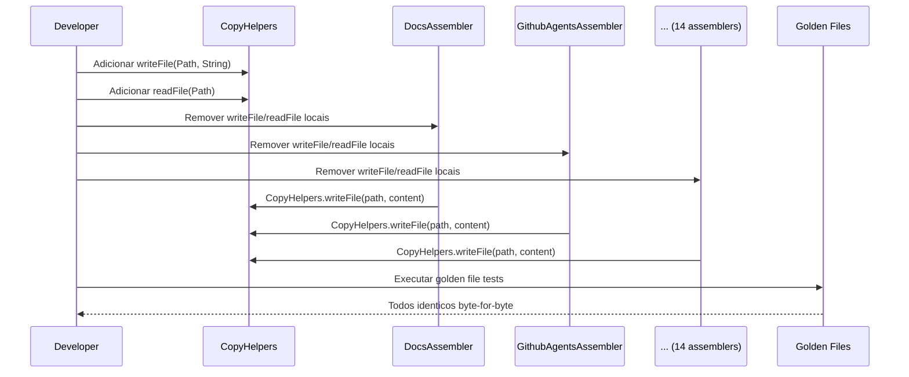

# Historia: Extrair writeFile/readFile para CopyHelpers

**ID:** story-0008-0001

## 1. Dependencias

| Blocked By | Blocks |
| :--- | :--- |
| — | story-0008-0006, story-0008-0013, story-0008-0014, story-0008-0015, story-0008-0016 |

## 2. Regras Transversais Aplicaveis

| ID | Titulo |
| :--- | :--- |
| RULE-002 | Comportamento externo inalterado |
| RULE-003 | Commits atomicos |
| RULE-007 | DRY absoluto |

## 3. Descricao

Como **Tech Lead**, eu quero extrair os metodos utilitarios `writeFile(Path, String)` e `readFile(Path)` duplicados em multiplos assemblers para a classe compartilhada `CopyHelpers.java`, garantindo que toda operacao de I/O de arquivos passe por um unico ponto centralizado e eliminando 20 copias locais identicas.

O audit C-007 identificou que `writeFile` esta copy-pasted em 14 arquivos assembler e `readFile` em 6 arquivos. Cada copia implementa a mesma logica: `Files.writeString(path, content)` com criacao de diretorios pai via `Files.createDirectories()`, e `Files.readString(path)` com tratamento basico de IOException. Essa duplicacao viola RULE-007 (DRY absoluto) e aumenta o risco de divergencia quando correcoes futuras (ex: encoding, permissoes) precisarem ser aplicadas.

A classe `CopyHelpers` ja existe no projeto e contem metodos auxiliares de copia de arquivos. Esta story adiciona `writeFile` e `readFile` como metodos estaticos publicos nessa classe, remove todas as copias locais dos 20 assemblers, e atualiza os chamadores para usar `CopyHelpers.writeFile()` e `CopyHelpers.readFile()`. Nenhuma mudanca de comportamento externo e introduzida — o output do gerador deve permanecer identico byte-for-byte (validado por golden files).

### 3.1 Metodos a Extrair

- `writeFile(Path path, String content)`: cria diretorios pai se necessario, escreve conteudo com `StandardCharsets.UTF_8`, propaga IOException como unchecked
- `readFile(Path path)`: le conteudo completo com `StandardCharsets.UTF_8`, propaga IOException como unchecked

### 3.2 Assemblers Afetados (writeFile — 14 arquivos)

- DocsAssembler, DocsAdrAssembler, EpicReportAssembler, GithubAgentsAssembler
- GithubInstructionsAssembler, GithubMcpAssembler, GithubPromptsAssembler, GithubSkillsAssembler
- GrpcDocsAssembler, PatternsAssembler, ReadmeAssembler, RunbookAssembler
- CodexAgentsMdAssembler, CodexConfigAssembler

### 3.3 Assemblers Afetados (readFile — 6 arquivos)

- DocsAssembler, GithubAgentsAssembler, GithubInstructionsAssembler
- GithubSkillsAssembler, PatternsAssembler, ReadmeAssembler

## 4. Definicoes de Qualidade Locais

### DoR Local (Definition of Ready)

- [ ] Classe `CopyHelpers.java` existente localizada e analisada
- [ ] Todos os 14 assemblers com `writeFile` mapeados com numeros de linha
- [ ] Todos os 6 assemblers com `readFile` mapeados com numeros de linha
- [ ] Assinatura identica confirmada entre todas as copias locais
- [ ] Golden files existentes executam com sucesso antes da mudanca

### DoD Local (Definition of Done)

- [ ] `CopyHelpers.writeFile(Path, String)` implementado e testado
- [ ] `CopyHelpers.readFile(Path)` implementado e testado
- [ ] Todas as 14 copias locais de `writeFile` removidas
- [ ] Todas as 6 copias locais de `readFile` removidas
- [ ] Todos os chamadores atualizados para `CopyHelpers.writeFile()` / `CopyHelpers.readFile()`
- [ ] Zero duplicacao residual (busca por `writeFile` e `readFile` confirma unica definicao)
- [ ] Todos os 1.814 testes existentes passando
- [ ] Golden files identicos byte-for-byte

### Global Definition of Done (DoD)

- **Cobertura:** >= 95% Line, >= 90% Branch
- **Testes Automatizados:** Todos os testes existentes passando + novos testes para logica extraida
- **Relatorio de Cobertura:** JaCoCo via `mvn verify`
- **Documentacao:** Javadoc atualizado quando assinaturas mudam
- **Performance:** Sem degradacao

## 5. Contratos de Dados (Data Contract)

**Antes (em cada assembler — 14 copias):**

```java
// metodo privado local em cada assembler
private void writeFile(Path path, String content) {
    try {
        Files.createDirectories(path.getParent());
        Files.writeString(path, content, StandardCharsets.UTF_8);
    } catch (IOException e) {
        throw new UncheckedIOException(e);
    }
}
```

**Depois (unica definicao em CopyHelpers):**

```java
public final class CopyHelpers {

    // ... metodos existentes ...

    /**
     * Writes content to a file, creating parent directories if needed.
     * @param path target file path
     * @param content file content (UTF-8)
     * @throws UncheckedIOException if I/O fails
     */
    public static void writeFile(Path path, String content) {
        try {
            Files.createDirectories(path.getParent());
            Files.writeString(path, content, StandardCharsets.UTF_8);
        } catch (IOException e) {
            throw new UncheckedIOException(e);
        }
    }

    /**
     * Reads entire file content as UTF-8 string.
     * @param path source file path
     * @return file content
     * @throws UncheckedIOException if I/O fails
     */
    public static String readFile(Path path) {
        try {
            return Files.readString(path, StandardCharsets.UTF_8);
        } catch (IOException e) {
            throw new UncheckedIOException(e);
        }
    }
}
```

**Chamador (antes):**

```java
writeFile(outputPath, rendered);
```

**Chamador (depois):**

```java
CopyHelpers.writeFile(outputPath, rendered);
```

## 6. Diagramas

### 6.1 Fluxo de Refactoring



## 7. Criterios de Aceite (Gherkin)

```gherkin
Cenario: writeFile cria diretorios pai e escreve conteudo
  DADO que o diretorio pai do arquivo de destino nao existe
  QUANDO CopyHelpers.writeFile(path, "conteudo") e invocado
  ENTAO o diretorio pai deve ser criado
  E o arquivo deve conter "conteudo" codificado em UTF-8

Cenario: readFile retorna conteudo completo do arquivo
  DADO que um arquivo existe com conteudo "hello world"
  QUANDO CopyHelpers.readFile(path) e invocado
  ENTAO o retorno deve ser "hello world"

Cenario: writeFile com path nulo lanca excecao
  DADO que o path fornecido e nulo
  QUANDO CopyHelpers.writeFile(null, "conteudo") e invocado
  ENTAO uma NullPointerException deve ser lancada
  E nenhum arquivo deve ser criado no sistema de arquivos

Cenario: readFile com arquivo inexistente lanca UncheckedIOException
  DADO que o path aponta para um arquivo que nao existe
  QUANDO CopyHelpers.readFile(path) e invocado
  ENTAO uma UncheckedIOException deve ser lancada
  E a causa raiz deve ser NoSuchFileException

Cenario: Assemblers nao possuem mais copias locais de writeFile
  DADO que a extracao foi concluida
  QUANDO uma busca por "private.*writeFile" e executada no pacote assembler
  ENTAO zero resultados devem ser encontrados
  E apenas CopyHelpers deve definir o metodo writeFile

Cenario: Golden files permanecem identicos apos refactoring
  DADO que todos os assemblers foram atualizados para usar CopyHelpers
  QUANDO o gerador completo e executado contra todos os profiles
  ENTAO cada arquivo gerado deve ser identico byte-for-byte ao golden file correspondente
```

### 7.1 Scenario Ordering (TPP)

> TPP: degenerate (writeFile basico) -> unconditional (readFile basico) -> erro (null path,
> arquivo inexistente) -> integridade (zero duplicacao) -> aceitacao (golden files).

### 7.2 Mandatory Scenario Categories

- [x] Degenerate cases (writeFile cria diretorios e escreve)
- [x] Happy path (readFile retorna conteudo)
- [x] Error paths (null path, arquivo inexistente)
- [x] Boundary values (zero copias locais, golden files identicos)

## 8. Sub-tarefas

- [ ] [Dev] Adicionar `writeFile(Path, String)` a `CopyHelpers.java` com Javadoc
- [ ] [Dev] Adicionar `readFile(Path)` a `CopyHelpers.java` com Javadoc
- [ ] [Dev] Remover `writeFile` local de 14 assemblers e atualizar chamadores
- [ ] [Dev] Remover `readFile` local de 6 assemblers e atualizar chamadores
- [ ] [Test] Testes unitarios para `CopyHelpers.writeFile()` (happy path, null, IOException)
- [ ] [Test] Testes unitarios para `CopyHelpers.readFile()` (happy path, inexistente, encoding)
- [ ] [Test] Verificar todos os 1.814 testes existentes passando
- [ ] [Test] Verificar golden files identicos byte-for-byte
