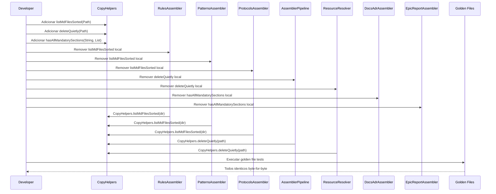

# Historia: Extrair listMdFilesSorted e deleteQuietly para utilitarios

**ID:** story-0008-0002

## 1. Dependencias

| Blocked By | Blocks |
| :--- | :--- |
| — | story-0008-0014, story-0008-0015 |

## 2. Regras Transversais Aplicaveis

| ID | Titulo |
| :--- | :--- |
| RULE-002 | Comportamento externo inalterado |
| RULE-003 | Commits atomicos |
| RULE-007 | DRY absoluto |

## 3. Descricao

Como **Tech Lead**, eu quero extrair os metodos utilitarios `listMdFilesSorted(Path)`, `deleteQuietly(Path)` e `hasAllMandatorySections(String, List<String>)` duplicados em multiplos arquivos para classes utilitarias compartilhadas, garantindo que cada operacao tenha uma unica implementacao canonica no codebase.

O audit C-007 identificou que `listMdFilesSorted` esta duplicado em 3 arquivos (RulesAssembler, PatternsAssembler, ProtocolsAssembler), `deleteQuietly` em 2 arquivos (AssemblerPipeline, ResourceResolver), e M-021 identificou `hasAllMandatorySections` duplicado em DocsAdrAssembler e EpicReportAssembler. Cada grupo implementa logica identica: `listMdFilesSorted` lista arquivos `.md` em um diretorio e retorna ordenados por nome; `deleteQuietly` deleta um arquivo ignorando IOException; `hasAllMandatorySections` verifica se um conteudo Markdown contem todas as secoes H2 requeridas.

A estrategia e adicionar `listMdFilesSorted` e `deleteQuietly` a `CopyHelpers.java` (que ja concentra operacoes de I/O de arquivos) e criar um metodo compartilhado para `hasAllMandatorySections` em local adequado (CopyHelpers ou uma nova classe `MarkdownHelpers`). Todas as copias locais serao removidas e os chamadores atualizados. O output do gerador deve permanecer identico byte-for-byte.

### 3.1 Metodos a Extrair

- `listMdFilesSorted(Path dir)`: lista arquivos `*.md` no diretorio, ordena por nome, retorna `List<Path>`
- `deleteQuietly(Path path)`: deleta arquivo/diretorio sem lancar excecao; retorna `boolean` indicando sucesso
- `hasAllMandatorySections(String content, List<String> sections)`: verifica se todas as secoes H2 (`## Section`) estao presentes no conteudo Markdown

### 3.2 Arquivos Afetados (listMdFilesSorted — 3 arquivos)

- RulesAssembler, PatternsAssembler, ProtocolsAssembler

### 3.3 Arquivos Afetados (deleteQuietly — 2 arquivos)

- AssemblerPipeline, ResourceResolver

### 3.4 Arquivos Afetados (hasAllMandatorySections — 2 arquivos)

- DocsAdrAssembler, EpicReportAssembler

## 4. Definicoes de Qualidade Locais

### DoR Local (Definition of Ready)

- [ ] Todos os 3 assemblers com `listMdFilesSorted` mapeados com numeros de linha
- [ ] Ambos os arquivos com `deleteQuietly` mapeados com numeros de linha
- [ ] Ambos os arquivos com `hasAllMandatorySections` mapeados com numeros de linha
- [ ] Assinatura identica confirmada entre todas as copias de cada metodo
- [ ] Classe `CopyHelpers.java` analisada para verificar conflitos de nome

### DoD Local (Definition of Done)

- [ ] `CopyHelpers.listMdFilesSorted(Path)` implementado e testado
- [ ] `CopyHelpers.deleteQuietly(Path)` implementado e testado
- [ ] `hasAllMandatorySections` extraido para classe compartilhada e testado
- [ ] Todas as 3 copias locais de `listMdFilesSorted` removidas
- [ ] Ambas as copias locais de `deleteQuietly` removidas
- [ ] Ambas as copias locais de `hasAllMandatorySections` removidas
- [ ] Zero duplicacao residual (busca confirma unica definicao de cada metodo)
- [ ] Todos os testes existentes passando
- [ ] Golden files identicos byte-for-byte

### Global Definition of Done (DoD)

- **Cobertura:** >= 95% Line, >= 90% Branch
- **Testes Automatizados:** Todos os testes existentes passando + novos testes para logica extraida
- **Relatorio de Cobertura:** JaCoCo via `mvn verify`
- **Documentacao:** Javadoc atualizado quando assinaturas mudam
- **Performance:** Sem degradacao

## 5. Contratos de Dados (Data Contract)

**Antes (listMdFilesSorted — em cada assembler):**

```java
// metodo privado local em 3 assemblers
private List<Path> listMdFilesSorted(Path dir) throws IOException {
    try (var stream = Files.list(dir)) {
        return stream
            .filter(p -> p.toString().endsWith(".md"))
            .sorted(Comparator.comparing(Path::getFileName))
            .toList();
    }
}
```

**Depois (unica definicao em CopyHelpers):**

```java
public final class CopyHelpers {

    /**
     * Lists all .md files in the given directory, sorted by filename.
     * @param dir directory to scan
     * @return sorted list of .md file paths; empty list if directory is empty
     * @throws UncheckedIOException if I/O fails
     */
    public static List<Path> listMdFilesSorted(Path dir) {
        try (var stream = Files.list(dir)) {
            return stream
                .filter(p -> p.toString().endsWith(".md"))
                .sorted(Comparator.comparing(Path::getFileName))
                .toList();
        } catch (IOException e) {
            throw new UncheckedIOException(e);
        }
    }

    /**
     * Deletes a file or directory without throwing exceptions.
     * @param path path to delete
     * @return true if deleted successfully, false otherwise
     */
    public static boolean deleteQuietly(Path path) {
        try {
            return Files.deleteIfExists(path);
        } catch (IOException e) {
            return false;
        }
    }
}
```

**hasAllMandatorySections (antes — em 2 assemblers):**

```java
private boolean hasAllMandatorySections(String content, List<String> sections) {
    return sections.stream()
        .allMatch(section -> content.contains("## " + section));
}
```

**hasAllMandatorySections (depois — classe compartilhada):**

```java
/**
 * Checks whether a Markdown content string contains all required H2 sections.
 * @param content Markdown content
 * @param sections list of expected section names (without "## " prefix)
 * @return true if all sections are present
 */
public static boolean hasAllMandatorySections(String content, List<String> sections) {
    return sections.stream()
        .allMatch(section -> content.contains("## " + section));
}
```

## 6. Diagramas

### 6.1 Fluxo de Refactoring



## 7. Criterios de Aceite (Gherkin)

```gherkin
Cenario: listMdFilesSorted retorna lista vazia para diretorio sem arquivos .md
  DADO que um diretorio existe mas nao contem arquivos .md
  QUANDO CopyHelpers.listMdFilesSorted(dir) e invocado
  ENTAO o retorno deve ser uma lista vazia
  E nenhuma excecao deve ser lancada

Cenario: listMdFilesSorted retorna arquivos ordenados por nome
  DADO que um diretorio contem "c-rules.md", "a-rules.md", "b-rules.md"
  QUANDO CopyHelpers.listMdFilesSorted(dir) e invocado
  ENTAO o retorno deve ser ["a-rules.md", "b-rules.md", "c-rules.md"]
  E apenas arquivos .md devem estar presentes (ignorar .txt, .yaml, etc.)

Cenario: deleteQuietly retorna false para arquivo inexistente
  DADO que o path aponta para um arquivo que nao existe
  QUANDO CopyHelpers.deleteQuietly(path) e invocado
  ENTAO o retorno deve ser false
  E nenhuma excecao deve ser lancada

Cenario: deleteQuietly remove arquivo existente com sucesso
  DADO que um arquivo temporario existe no sistema de arquivos
  QUANDO CopyHelpers.deleteQuietly(path) e invocado
  ENTAO o retorno deve ser true
  E o arquivo nao deve mais existir

Cenario: hasAllMandatorySections detecta secoes ausentes
  DADO que um conteudo Markdown contem "## Status" e "## Context" mas nao "## Decision"
  QUANDO hasAllMandatorySections(content, ["Status", "Context", "Decision"]) e invocado
  ENTAO o retorno deve ser false

Cenario: Assemblers nao possuem mais copias locais dos metodos extraidos
  DADO que a extracao foi concluida para os 3 metodos
  QUANDO uma busca por "private.*listMdFilesSorted", "private.*deleteQuietly" e "private.*hasAllMandatorySections" e executada
  ENTAO zero resultados devem ser encontrados em arquivos assembler
  E apenas CopyHelpers deve definir esses metodos
```

### 7.1 Scenario Ordering (TPP)

> TPP: degenerate (lista vazia) -> unconditional (lista ordenada) -> erro (deleteQuietly inexistente)
> -> condicional (deleteQuietly sucesso, secoes ausentes) -> integridade (zero duplicacao).

### 7.2 Mandatory Scenario Categories

- [x] Degenerate cases (diretorio vazio, arquivo inexistente)
- [x] Happy path (lista ordenada, delete com sucesso)
- [x] Error paths (secoes ausentes)
- [x] Boundary values (zero copias locais residuais)

## 8. Sub-tarefas

- [ ] [Dev] Adicionar `listMdFilesSorted(Path)` a `CopyHelpers.java` com Javadoc
- [ ] [Dev] Adicionar `deleteQuietly(Path)` a `CopyHelpers.java` com Javadoc
- [ ] [Dev] Extrair `hasAllMandatorySections` para classe compartilhada com Javadoc
- [ ] [Dev] Remover `listMdFilesSorted` local de 3 assemblers e atualizar chamadores
- [ ] [Dev] Remover `deleteQuietly` local de 2 arquivos e atualizar chamadores
- [ ] [Dev] Remover `hasAllMandatorySections` local de 2 assemblers e atualizar chamadores
- [ ] [Test] Testes unitarios para `listMdFilesSorted` (vazio, ordenacao, filtro .md)
- [ ] [Test] Testes unitarios para `deleteQuietly` (existente, inexistente, permissao)
- [ ] [Test] Testes unitarios para `hasAllMandatorySections` (todas presentes, faltando, vazio)
- [ ] [Test] Verificar todos os testes existentes passando
- [ ] [Test] Verificar golden files identicos byte-for-byte
