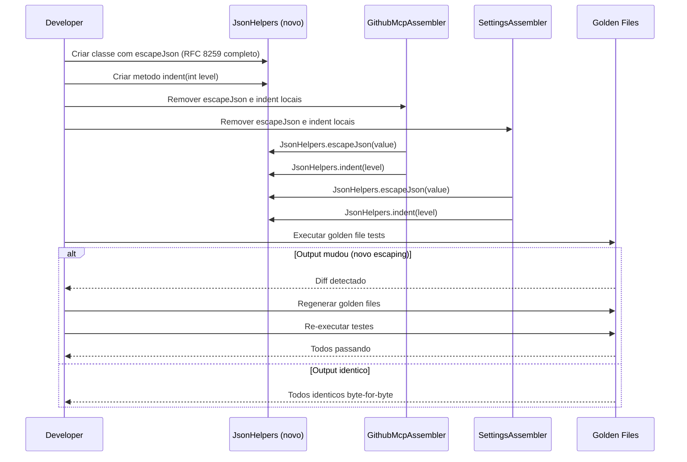

# Historia: Criar JsonHelpers com escapeJson completo RFC 8259

**ID:** story-0008-0003

## 1. Dependencias

| Blocked By | Blocks |
| :--- | :--- |
| — | story-0008-0013, story-0008-0015 |

## 2. Regras Transversais Aplicaveis

| ID | Titulo |
| :--- | :--- |
| RULE-002 | Comportamento externo inalterado |
| RULE-003 | Commits atomicos |
| RULE-007 | DRY absoluto |
| RULE-009 | String formatting |

## 3. Descricao

Como **Tech Lead**, eu quero criar uma classe utilitaria `JsonHelpers.java` com os metodos `indent(int level)` e `escapeJson(String value)` implementando escaping completo conforme RFC 8259, garantindo que toda manipulacao manual de JSON no projeto use uma implementacao correta e centralizada.

O audit identificou dois problemas: C-007 reportou que `indent()` e `escapeJson()` estao duplicados em GithubMcpAssembler e SettingsAssembler, e M-012 reportou que a implementacao atual de `escapeJson` e incompleta — apenas escapa aspas e barras invertidas, ignorando newlines (`\n`), carriage returns (`\r`), tabs (`\t`), backspace (`\b`), form feed (`\f`) e caracteres de controle Unicode (U+0000 a U+001F). Essa falha pode gerar JSON invalido quando valores contendo esses caracteres sao processados.

A nova classe `JsonHelpers` sera criada no pacote utilitario do projeto com implementacao completa de RFC 8259 Section 7 (Strings). O metodo `escapeJson` tratara todos os caracteres especiais definidos na especificacao. O metodo `indent` gerara strings de indentacao consistentes (espacos). Ambos os assemblers serao atualizados para usar `JsonHelpers`. Golden files devem ser regenerados caso o escaping mais rigoroso altere algum output.

### 3.1 RFC 8259 Section 7 — Caracteres que Devem Ser Escapados

- `\"` (aspas duplas) -> `\\"`
- `\\` (barra invertida) -> `\\\\`
- `\n` (newline) -> `\\n`
- `\r` (carriage return) -> `\\r`
- `\t` (tab) -> `\\t`
- `\b` (backspace) -> `\\b`
- `\f` (form feed) -> `\\f`
- U+0000 a U+001F (controle Unicode) -> `\\uXXXX`

### 3.2 Metodo indent

- `indent(int level)`: retorna `level * 2` espacos (ou `level * 4`, conforme convencao do projeto)
- Nivel 0 retorna string vazia
- Nivel negativo lanca IllegalArgumentException

## 4. Definicoes de Qualidade Locais

### DoR Local (Definition of Ready)

- [ ] RFC 8259 Section 7 lida e compreendida
- [ ] Implementacao atual de `escapeJson` em GithubMcpAssembler e SettingsAssembler analisada
- [ ] Diferencas entre implementacao atual e RFC 8259 documentadas
- [ ] Golden files existentes analisados para presenca de caracteres especiais nao escapados

### DoD Local (Definition of Done)

- [ ] Classe `JsonHelpers.java` criada com `indent()` e `escapeJson()`
- [ ] `escapeJson` implementa todos os escapes de RFC 8259 Section 7
- [ ] Copias locais removidas de GithubMcpAssembler e SettingsAssembler
- [ ] Testes unitarios cobrindo todos os 8 tipos de escape + Unicode control chars
- [ ] Golden files atualizados se o output mudar (RULE-010)
- [ ] Todos os testes existentes passando

### Global Definition of Done (DoD)

- **Cobertura:** >= 95% Line, >= 90% Branch
- **Testes Automatizados:** Todos os testes existentes passando + novos testes para logica extraida
- **Relatorio de Cobertura:** JaCoCo via `mvn verify`
- **Documentacao:** Javadoc atualizado quando assinaturas mudam
- **Performance:** Sem degradacao

## 5. Contratos de Dados (Data Contract)

**Antes (implementacao incompleta em 2 assemblers):**

```java
// metodo privado local — escaping incompleto
private String escapeJson(String value) {
    return value
        .replace("\\", "\\\\")
        .replace("\"", "\\\"");
}

private String indent(int level) {
    return " ".repeat(level * 2);
}
```

**Depois (JsonHelpers — implementacao completa RFC 8259):**

```java
public final class JsonHelpers {

    private JsonHelpers() {
        // utility class
    }

    /**
     * Returns an indentation string of {@code level * 2} spaces.
     * @param level indentation level (>= 0)
     * @return indentation string
     * @throws IllegalArgumentException if level is negative
     */
    public static String indent(int level) {
        if (level < 0) {
            throw new IllegalArgumentException(
                "Indent level must be >= 0, got: %d".formatted(level));
        }
        return " ".repeat(level * 2);
    }

    /**
     * Escapes a string value according to RFC 8259 Section 7.
     * Handles: quotes, backslash, newline, carriage return, tab,
     * backspace, form feed, and Unicode control characters (U+0000-U+001F).
     * @param value input string (may be null)
     * @return escaped string safe for JSON embedding; empty string if null
     */
    public static String escapeJson(String value) {
        if (value == null) {
            return "";
        }
        var sb = new StringBuilder(value.length());
        for (int i = 0; i < value.length(); i++) {
            char ch = value.charAt(i);
            switch (ch) {
                case '"'  -> sb.append("\\\"");
                case '\\' -> sb.append("\\\\");
                case '\n' -> sb.append("\\n");
                case '\r' -> sb.append("\\r");
                case '\t' -> sb.append("\\t");
                case '\b' -> sb.append("\\b");
                case '\f' -> sb.append("\\f");
                default -> {
                    if (ch < 0x20) {
                        sb.append("\\u%04x".formatted((int) ch));
                    } else {
                        sb.append(ch);
                    }
                }
            };
        }
        return sb.toString();
    }
}
```

**Chamador (antes):**

```java
String escaped = escapeJson(value);
String prefix = indent(2);
```

**Chamador (depois):**

```java
String escaped = JsonHelpers.escapeJson(value);
String prefix = JsonHelpers.indent(2);
```

## 6. Diagramas

### 6.1 Fluxo de Refactoring e Cobertura RFC 8259



## 7. Criterios de Aceite (Gherkin)

```gherkin
Cenario: escapeJson com string vazia retorna string vazia
  DADO que o valor de entrada e uma string vazia ""
  QUANDO JsonHelpers.escapeJson("") e invocado
  ENTAO o retorno deve ser ""

Cenario: escapeJson com null retorna string vazia
  DADO que o valor de entrada e null
  QUANDO JsonHelpers.escapeJson(null) e invocado
  ENTAO o retorno deve ser ""
  E nenhuma excecao deve ser lancada

Cenario: escapeJson escapa todos os caracteres RFC 8259
  DADO que o valor contem aspas, barra invertida, newline, tab, carriage return, backspace e form feed
  QUANDO JsonHelpers.escapeJson(value) e invocado
  ENTAO cada caractere especial deve ser substituido pelo escape correspondente
  E aspas devem virar \"
  E barra invertida deve virar \\
  E newline deve virar \n
  E tab deve virar \t

Cenario: escapeJson escapa caracteres de controle Unicode
  DADO que o valor contem o caractere U+0001 (SOH)
  QUANDO JsonHelpers.escapeJson(value) e invocado
  ENTAO o caractere deve ser substituido por \u0001

Cenario: indent com nivel zero retorna string vazia
  DADO que o nivel de indentacao e 0
  QUANDO JsonHelpers.indent(0) e invocado
  ENTAO o retorno deve ser ""

Cenario: indent com nivel negativo lanca excecao
  DADO que o nivel de indentacao e -1
  QUANDO JsonHelpers.indent(-1) e invocado
  ENTAO uma IllegalArgumentException deve ser lancada
  E a mensagem deve conter o valor -1

Cenario: Golden files atualizados se escaping mais rigoroso altera output
  DADO que os assemblers usam JsonHelpers.escapeJson (RFC 8259 completo)
  QUANDO o gerador completo e executado contra todos os profiles
  ENTAO se algum golden file difere, ele deve ser regenerado
  E apos regeneracao, todos os testes devem passar
```

### 7.1 Scenario Ordering (TPP)

> TPP: degenerate (string vazia, null) -> constante (escapes individuais) -> colecao (todos os
> escapes RFC 8259) -> condicional (Unicode control chars) -> limite (indent zero, negativo)
> -> aceitacao (golden files).

### 7.2 Mandatory Scenario Categories

- [x] Degenerate cases (string vazia, null)
- [x] Happy path (escapes RFC 8259, indent correto)
- [x] Error paths (indent negativo)
- [x] Boundary values (Unicode control chars, golden files)

## 8. Sub-tarefas

- [ ] [Dev] Criar `JsonHelpers.java` no pacote utilitario com `indent()` e `escapeJson()`
- [ ] [Dev] Implementar escaping completo RFC 8259 Section 7 em `escapeJson()`
- [ ] [Dev] Remover `escapeJson` e `indent` locais de GithubMcpAssembler
- [ ] [Dev] Remover `escapeJson` e `indent` locais de SettingsAssembler
- [ ] [Dev] Atualizar chamadores para usar `JsonHelpers.escapeJson()` e `JsonHelpers.indent()`
- [ ] [Test] Testes unitarios para `escapeJson`: string vazia, null, aspas, barra, newline, tab, CR, backspace, form feed
- [ ] [Test] Testes unitarios para `escapeJson`: caracteres de controle Unicode (U+0000 a U+001F)
- [ ] [Test] Testes unitarios para `indent`: nivel 0, 1, 5, negativo
- [ ] [Test] Verificar golden files e regenerar se necessario (RULE-010)
- [ ] [Test] Verificar todos os testes existentes passando
