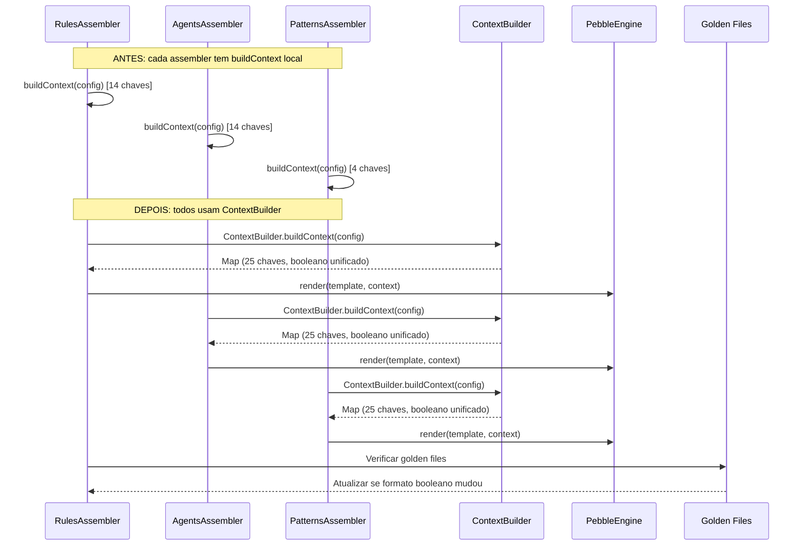

# Historia: Unificar buildContext() e corrigir conversao booleana

**ID:** story-0008-0004

## 1. Dependencias

| Blocked By | Blocks |
| :--- | :--- |
| — | story-0008-0013, story-0008-0014, story-0008-0016, story-0008-0017 |

## 2. Regras Transversais Aplicaveis

| ID | Titulo |
| :--- | :--- |
| RULE-002 | Comportamento externo inalterado |
| RULE-003 | Commits atomicos |
| RULE-007 | DRY absoluto |
| RULE-010 | Golden files |

## 3. Descricao

Como **Tech Lead**, eu quero eliminar as 3 variantes locais de `buildContext()` espalhadas em assemblers e unificar a conversao booleana para um formato consistente, garantindo que o contexto de template Pebble seja construido por um unico ponto canonico (`ContextBuilder`) e que valores booleanos sejam renderizados de forma uniforme em todos os templates.

O audit C-006 identificou 3 implementacoes locais de `buildContext()`: RulesAssembler (14 chaves), AgentsAssembler (14 chaves) e PatternsAssembler (4 chaves). A classe `ContextBuilder` ja existe e contem a versao canonica com 25 chaves. As variantes locais sao subsets da versao canonica, criadas aparentemente por conveniencia, mas que divergiram ao longo do tempo — algumas chaves foram adicionadas ao `ContextBuilder` sem refletir nos metodos locais, gerando inconsistencia.

Alem disso, o audit identificou inconsistencia na conversao de valores booleanos para templates: algumas variantes usam `Boolean.toString(value)` (produz `"true"/"false"` em Java) enquanto outras usam conversao customizada para `"True"/"False"` (formato Python). Como o projeto gera templates para multiplas linguagens (incluindo Python), e necessario decidir um formato canonico e aplica-lo consistentemente. A decisao deve ser documentada e os golden files atualizados para refletir o formato escolhido.

### 3.1 Variantes Locais a Remover

- **RulesAssembler.buildContext()**: 14 chaves, usa `Boolean.toString()` para booleanos
- **AgentsAssembler.buildContext()**: 14 chaves, mistura `Boolean.toString()` e conversao customizada
- **PatternsAssembler.buildContext()**: 4 chaves, subset minimo

### 3.2 ContextBuilder Canonico

- 25 chaves cobrindo todas as necessidades dos templates
- Unico ponto de verdade para construcao de contexto Pebble
- Todos os assemblers devem chamar `ContextBuilder.buildContext(config)` e usar o mapa retornado

### 3.3 Conversao Booleana

- Definir formato canonico: `"true"/"false"` (Java standard) para templates Java/general, com filtro Pebble `capitalize` para templates Python quando necessario
- Alternativa: campo dedicado `boolFormat` no contexto que produz o formato correto por linguagem
- A decisao deve preservar backward compatibility com golden files existentes

## 4. Definicoes de Qualidade Locais

### DoR Local (Definition of Ready)

- [ ] Todas as 3 variantes locais de `buildContext` mapeadas com numeros de linha e chaves
- [ ] `ContextBuilder.buildContext()` analisado — todas as 25 chaves documentadas
- [ ] Diff entre variantes locais e `ContextBuilder` documentado (chaves faltantes/extras)
- [ ] Templates Pebble que consomem valores booleanos identificados
- [ ] Golden files existentes analisados para formato booleano atual

### DoD Local (Definition of Done)

- [ ] `buildContext()` removido de RulesAssembler
- [ ] `buildContext()` removido de AgentsAssembler
- [ ] `buildContext()` removido de PatternsAssembler
- [ ] Todos os 3 assemblers chamam `ContextBuilder.buildContext()` diretamente
- [ ] Formato booleano unificado e consistente em todos os templates
- [ ] Golden files atualizados para refletir formato booleano canonico
- [ ] Zero variantes locais de `buildContext` no codebase
- [ ] Todos os testes existentes passando (apos atualizacao de golden files)

### Global Definition of Done (DoD)

- **Cobertura:** >= 95% Line, >= 90% Branch
- **Testes Automatizados:** Todos os testes existentes passando + novos testes para logica extraida
- **Relatorio de Cobertura:** JaCoCo via `mvn verify`
- **Documentacao:** Javadoc atualizado quando assinaturas mudam
- **Performance:** Sem degradacao

## 5. Contratos de Dados (Data Contract)

**Antes (RulesAssembler — variante local com 14 chaves):**

```java
private Map<String, Object> buildContext(SetupConfig config) {
    var ctx = new HashMap<String, Object>();
    ctx.put("PROJECT_NAME", config.projectName());
    ctx.put("LANGUAGE", config.language());
    ctx.put("FRAMEWORK", config.framework());
    // ... 11 more keys ...
    ctx.put("DDD_ENABLED", Boolean.toString(config.dddEnabled()));
    return ctx;
}
```

**Antes (PatternsAssembler — variante local com 4 chaves):**

```java
private Map<String, Object> buildContext(SetupConfig config) {
    var ctx = new HashMap<String, Object>();
    ctx.put("PROJECT_NAME", config.projectName());
    ctx.put("LANGUAGE", config.language());
    ctx.put("FRAMEWORK", config.framework());
    ctx.put("ARCHITECTURE", config.architecture());
    return ctx;
}
```

**Depois (todos os assemblers usam ContextBuilder):**

```java
// Em RulesAssembler, AgentsAssembler, PatternsAssembler:
Map<String, Object> context = ContextBuilder.buildContext(config);
String rendered = templateEngine.render(templatePath, context);
```

**ContextBuilder (canonico — 25 chaves, booleano unificado):**

```java
public final class ContextBuilder {

    /**
     * Builds the canonical template context with all 25 keys.
     * Boolean values are converted to lowercase "true"/"false".
     * @param config project setup configuration
     * @return unmodifiable map of template variables
     */
    public static Map<String, Object> buildContext(SetupConfig config) {
        var ctx = new LinkedHashMap<String, Object>();
        ctx.put("PROJECT_NAME", config.projectName());
        ctx.put("LANGUAGE", config.language());
        // ... all 25 keys ...
        ctx.put("DDD_ENABLED", String.valueOf(config.dddEnabled()));
        ctx.put("EVENT_DRIVEN", String.valueOf(config.eventDriven()));
        // boolean values: always "true" or "false" (lowercase)
        return Collections.unmodifiableMap(ctx);
    }
}
```

## 6. Diagramas

### 6.1 Fluxo de Unificacao de buildContext



## 7. Criterios de Aceite (Gherkin)

```gherkin
Cenario: ContextBuilder retorna todas as 25 chaves esperadas
  DADO que um SetupConfig valido e fornecido
  QUANDO ContextBuilder.buildContext(config) e invocado
  ENTAO o mapa retornado deve conter exatamente 25 chaves
  E todas as chaves documentadas devem estar presentes

Cenario: Valores booleanos sao convertidos consistentemente
  DADO que o SetupConfig possui dddEnabled=true e eventDriven=false
  QUANDO ContextBuilder.buildContext(config) e invocado
  ENTAO DDD_ENABLED deve ser "true" (string lowercase)
  E EVENT_DRIVEN deve ser "false" (string lowercase)
  E nenhum valor booleano deve ser "True" ou "False" (capitalizado)

Cenario: RulesAssembler nao possui mais buildContext local
  DADO que a unificacao foi concluida
  QUANDO o codigo-fonte de RulesAssembler e inspecionado
  ENTAO nenhum metodo buildContext deve existir na classe
  E a classe deve importar e usar ContextBuilder.buildContext()

Cenario: Templates Pebble renderizam corretamente com contexto unificado
  DADO que todos os assemblers usam ContextBuilder.buildContext()
  QUANDO os templates sao renderizados para cada profile configurado
  ENTAO o output deve ser identico ao golden file (ou atualizado se booleano mudou)
  E nenhum placeholder nao resolvido deve aparecer no output

Cenario: PatternsAssembler funciona com 25 chaves mesmo usando apenas 4
  DADO que PatternsAssembler antes usava buildContext com 4 chaves
  QUANDO PatternsAssembler recebe o contexto completo de 25 chaves do ContextBuilder
  ENTAO os templates devem renderizar identicamente
  E as 21 chaves extras devem ser ignoradas pelo template Pebble sem erro

Cenario: Config nulo lanca excecao informativa
  DADO que null e passado como argumento para ContextBuilder.buildContext()
  QUANDO o metodo e invocado
  ENTAO uma NullPointerException ou IllegalArgumentException deve ser lancada
  E a mensagem deve indicar que config nao pode ser nulo
```

### 7.1 Scenario Ordering (TPP)

> TPP: constante (25 chaves completas) -> condicional (booleanos consistentes) -> integridade
> (sem buildContext local) -> aceitacao (templates renderizam) -> limite (25 chaves com
> template de 4 chaves) -> erro (config nulo).

### 7.2 Mandatory Scenario Categories

- [x] Degenerate cases (config nulo)
- [x] Happy path (25 chaves, booleanos consistentes, templates renderizam)
- [x] Error paths (config nulo lanca excecao)
- [x] Boundary values (PatternsAssembler usa 4 de 25 chaves, golden files)

## 8. Sub-tarefas

- [ ] [Dev] Documentar diff entre variantes locais e `ContextBuilder` (chaves faltantes/extras)
- [ ] [Dev] Remover `buildContext()` de RulesAssembler e atualizar para `ContextBuilder.buildContext()`
- [ ] [Dev] Remover `buildContext()` de AgentsAssembler e atualizar para `ContextBuilder.buildContext()`
- [ ] [Dev] Remover `buildContext()` de PatternsAssembler e atualizar para `ContextBuilder.buildContext()`
- [ ] [Dev] Unificar conversao booleana em `ContextBuilder` para formato canonico `"true"/"false"`
- [ ] [Dev] Atualizar golden files se o formato booleano mudar (RULE-010)
- [ ] [Test] Testes unitarios para `ContextBuilder.buildContext()`: verificar 25 chaves, tipos, booleanos
- [ ] [Test] Testes de integracao: renderizar templates com contexto unificado para todos os profiles
- [ ] [Test] Verificar golden files byte-for-byte apos atualizacao
- [ ] [Test] Verificar todos os testes existentes passando
