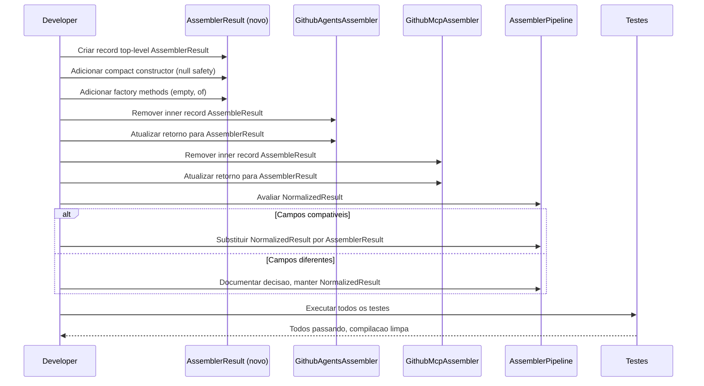

# Historia: Extrair record AssembleResult compartilhado

**ID:** story-0008-0005

## 1. Dependencias

| Blocked By | Blocks |
| :--- | :--- |
| — | story-0008-0007 |

## 2. Regras Transversais Aplicaveis

| ID | Titulo |
| :--- | :--- |
| RULE-002 | Comportamento externo inalterado |
| RULE-003 | Commits atomicos |
| RULE-007 | DRY absoluto |

## 3. Descricao

Como **Tech Lead**, eu quero extrair um record `AssemblerResult` compartilhado para representar o resultado de operacoes de montagem, eliminando os inner records duplicados em GithubAgentsAssembler e GithubMcpAssembler e unificando com `AssemblerPipeline.NormalizedResult`, garantindo que todos os assemblers usem um unico tipo de retorno padronizado.

O audit M-018 identificou que `GithubAgentsAssembler` e `GithubMcpAssembler` definem inner records identicos chamados `AssembleResult` com os campos `List<String> files` e `List<String> warnings`. Alem disso, `AssemblerPipeline` define `NormalizedResult` com estrutura similar. Essa triplicacao viola RULE-007 (DRY absoluto) e dificulta a evolucao futura — qualquer novo campo (ex: `errors`, `duration`) precisaria ser adicionado em 3 locais.

A estrategia e criar um record `AssemblerResult` no pacote `assembler` como tipo top-level, mover a definicao para fora dos inner types, e atualizar todos os consumidores. O `NormalizedResult` de `AssemblerPipeline` deve ser avaliado para unificacao: se os campos sao compativeis, substituir por `AssemblerResult`; se ha campos adicionais, considerar composicao ou extensao via interface. O comportamento externo nao deve mudar — o tipo de retorno e interno ao pacote assembler.

### 3.1 Records Duplicados Atuais

- **GithubAgentsAssembler.AssembleResult**: `record AssembleResult(List<String> files, List<String> warnings)`
- **GithubMcpAssembler.AssembleResult**: `record AssembleResult(List<String> files, List<String> warnings)`
- **AssemblerPipeline.NormalizedResult**: estrutura similar com campos de normalizacao

### 3.2 Record Compartilhado Proposto

- `AssemblerResult(List<String> files, List<String> warnings)`
- Tipo top-level no pacote `assembler`
- Imutavel (record Java 21)
- Factory methods: `AssemblerResult.empty()`, `AssemblerResult.of(List, List)`
- Validacao: listas nunca null (substituir por `List.of()` no construtor compacto)

### 3.3 Unificacao com NormalizedResult

- Avaliar se `NormalizedResult` pode ser substituido por `AssemblerResult`
- Se `NormalizedResult` tem campos adicionais: considerar `AssemblerResult` como base e `NormalizedResult` como wrapper/extensao
- Documentar decisao no commit message

## 4. Definicoes de Qualidade Locais

### DoR Local (Definition of Ready)

- [ ] Inner record `AssembleResult` em GithubAgentsAssembler mapeado com numeros de linha
- [ ] Inner record `AssembleResult` em GithubMcpAssembler mapeado com numeros de linha
- [ ] `NormalizedResult` em AssemblerPipeline analisado (campos, usos, consumidores)
- [ ] Todos os metodos que retornam ou consomem esses records identificados
- [ ] Compatibilidade entre os 3 records avaliada (campos identicos vs. diferentes)

### DoD Local (Definition of Done)

- [ ] Record `AssemblerResult` criado como tipo top-level no pacote assembler
- [ ] Inner record removido de GithubAgentsAssembler
- [ ] Inner record removido de GithubMcpAssembler
- [ ] `NormalizedResult` unificado ou documentado motivo de nao-unificacao
- [ ] Todos os chamadores atualizados para usar o tipo compartilhado
- [ ] Construtor compacto garante listas nunca null
- [ ] Todos os testes existentes passando
- [ ] Compilacao limpa sem warnings

### Global Definition of Done (DoD)

- **Cobertura:** >= 95% Line, >= 90% Branch
- **Testes Automatizados:** Todos os testes existentes passando + novos testes para logica extraida
- **Relatorio de Cobertura:** JaCoCo via `mvn verify`
- **Documentacao:** Javadoc atualizado quando assinaturas mudam
- **Performance:** Sem degradacao

## 5. Contratos de Dados (Data Contract)

**Antes (inner record em GithubAgentsAssembler):**

```java
public class GithubAgentsAssembler {

    // inner record duplicado
    record AssembleResult(List<String> files, List<String> warnings) {}

    public AssembleResult assemble(SetupConfig config, Path outputDir) {
        // ...
        return new AssembleResult(files, warnings);
    }
}
```

**Antes (inner record em GithubMcpAssembler):**

```java
public class GithubMcpAssembler {

    // inner record duplicado (identico)
    record AssembleResult(List<String> files, List<String> warnings) {}

    public AssembleResult assemble(SetupConfig config, Path outputDir) {
        // ...
        return new AssembleResult(files, warnings);
    }
}
```

**Depois (record compartilhado top-level):**

```java
/**
 * Immutable result of an assembler operation.
 * @param files list of files generated (never null)
 * @param warnings list of warnings produced (never null)
 */
public record AssemblerResult(List<String> files, List<String> warnings) {

    /** Compact constructor: ensures lists are never null. */
    public AssemblerResult {
        files = files != null ? List.copyOf(files) : List.of();
        warnings = warnings != null ? List.copyOf(warnings) : List.of();
    }

    /** Returns an empty result with no files and no warnings. */
    public static AssemblerResult empty() {
        return new AssemblerResult(List.of(), List.of());
    }

    /** Factory method for convenience. */
    public static AssemblerResult of(List<String> files, List<String> warnings) {
        return new AssemblerResult(files, warnings);
    }
}
```

**Chamadores (depois):**

```java
public class GithubAgentsAssembler {

    public AssemblerResult assemble(SetupConfig config, Path outputDir) {
        // ...
        return AssemblerResult.of(files, warnings);
    }
}

public class GithubMcpAssembler {

    public AssemblerResult assemble(SetupConfig config, Path outputDir) {
        // ...
        return AssemblerResult.of(files, warnings);
    }
}
```

## 6. Diagramas

### 6.1 Fluxo de Extracao do Record Compartilhado



## 7. Criterios de Aceite (Gherkin)

```gherkin
Cenario: AssemblerResult com listas nulas produz listas vazias
  DADO que files e null e warnings e null
  QUANDO new AssemblerResult(null, null) e invocado
  ENTAO files() deve retornar uma lista vazia imutavel
  E warnings() deve retornar uma lista vazia imutavel

Cenario: AssemblerResult.empty retorna resultado sem arquivos e sem warnings
  DADO que nenhum argumento e fornecido
  QUANDO AssemblerResult.empty() e invocado
  ENTAO files() deve retornar uma lista vazia
  E warnings() deve retornar uma lista vazia

Cenario: AssemblerResult preserva imutabilidade das listas
  DADO que um AssemblerResult foi criado com files=["a.md", "b.md"]
  QUANDO uma tentativa de modificar a lista files() e feita
  ENTAO uma UnsupportedOperationException deve ser lancada
  E a lista original deve permanecer inalterada

Cenario: GithubAgentsAssembler retorna AssemblerResult compartilhado
  DADO que GithubAgentsAssembler.assemble() e invocado com config valido
  QUANDO a montagem e concluida com sucesso
  ENTAO o retorno deve ser do tipo AssemblerResult (top-level, nao inner record)
  E files() deve conter os caminhos dos arquivos gerados

Cenario: Nenhum inner record AssembleResult residual no codebase
  DADO que a extracao foi concluida
  QUANDO uma busca por "record AssembleResult" e executada no pacote assembler
  ENTAO apenas o record top-level AssemblerResult deve ser encontrado
  E nenhum inner record com esse nome deve existir

Cenario: NormalizedResult avaliado e decisao documentada
  DADO que AssemblerPipeline define NormalizedResult
  QUANDO a compatibilidade com AssemblerResult e avaliada
  ENTAO uma decisao de unificacao ou nao-unificacao deve ser documentada no commit
  E se unificado, todos os usos de NormalizedResult devem apontar para AssemblerResult
```

### 7.1 Scenario Ordering (TPP)

> TPP: degenerate (null -> listas vazias, empty()) -> constante (imutabilidade) -> condicional
> (assembler retorna tipo correto) -> integridade (zero inner records) -> aceitacao
> (NormalizedResult avaliado).

### 7.2 Mandatory Scenario Categories

- [x] Degenerate cases (listas nulas, empty)
- [x] Happy path (assembler retorna tipo compartilhado, imutabilidade)
- [x] Error paths (tentativa de modificar lista imutavel)
- [x] Boundary values (zero inner records residuais, NormalizedResult avaliado)

## 8. Sub-tarefas

- [ ] [Dev] Criar record `AssemblerResult` como tipo top-level no pacote assembler
- [ ] [Dev] Implementar compact constructor com null safety (`List.copyOf` / `List.of`)
- [ ] [Dev] Implementar factory methods `empty()` e `of(List, List)`
- [ ] [Dev] Remover inner record `AssembleResult` de GithubAgentsAssembler e atualizar retorno
- [ ] [Dev] Remover inner record `AssembleResult` de GithubMcpAssembler e atualizar retorno
- [ ] [Dev] Avaliar `NormalizedResult` em AssemblerPipeline para unificacao
- [ ] [Dev] Atualizar todos os chamadores/consumidores dos records removidos
- [ ] [Test] Testes unitarios para `AssemblerResult`: null safety, imutabilidade, equals, hashCode, toString
- [ ] [Test] Testes unitarios para factory methods: `empty()`, `of()`
- [ ] [Test] Verificar todos os testes existentes passando
- [ ] [Test] Verificar compilacao limpa sem warnings
