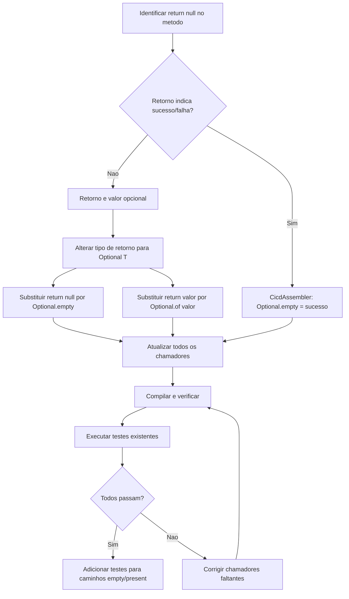
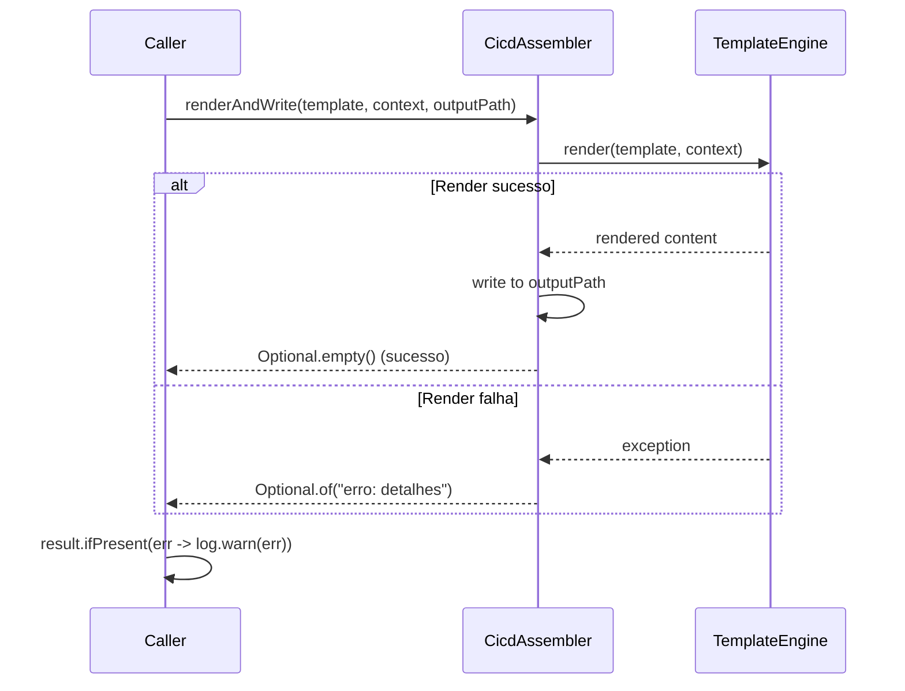

# Historia: Eliminar return null com Optional

**ID:** story-0008-0006

## 1. Dependencias

| Blocked By | Blocks |
| :--- | :--- |
| story-0008-0001 | story-0008-0017, story-0008-0024 |

## 2. Regras Transversais Aplicaveis

| ID | Titulo |
| :--- | :--- |
| RULE-002 | Comportamento externo inalterado |
| RULE-003 | Commits atomicos |
| RULE-005 | Null proibido |

## 3. Descricao

Como **Tech Lead**, eu quero substituir todos os 17 `return null` por tipos `Optional<T>`, garantindo que o codebase elimine completamente a semantica nula e torne explicita a ausencia de valor em todos os caminhos de retorno.

O audit report (finding C-002) identificou 17 ocorrencias de `return null` distribuidas em 8 arquivos. Este padrao viola diretamente a RULE-005 (Null proibido) e e fonte de NullPointerException em runtime. A substituicao por `Optional<T>` obriga os chamadores a tratar explicitamente o caso de ausencia, eliminando a possibilidade de NPE silencioso.

Alem das 17 ocorrencias, o finding M-020 identificou que `CicdAssembler.renderAndWrite()` usa semantica invertida: retorna `null` para sucesso e uma `String` para erro. Este padrao contra-intuitivo deve ser corrigido para `Optional<String>`, onde `Optional.empty()` indica sucesso e `Optional.of(errorMessage)` indica erro, alinhando a semantica ao restante do codebase.

### 3.1 Arquivos e Ocorrencias

| Arquivo | Ocorrencias | Metodos Afetados |
| :--- | :--- | :--- |
| SkillsAssembler | 4 | Metodos de lookup e resolucao de skills |
| ResourceDiscovery | 3 | Metodos de busca em classpath |
| GithubAgentsAssembler | 2 | Metodos de leitura de templates |
| GenerateCommand | 2 | Metodos de resolucao de config |
| CodexAgentsMdAssembler | 2 | Metodos de processamento de agentes |
| GithubSkillsAssembler | 1 | Metodo de resolucao de skill |
| CicdAssembler | 1 | renderAndWrite() (semantica invertida) |
| CopyHelpers | 1 | copyTemplateFileIfExists() |
| MarkdownParser | 1 | Metodo de parse de frontmatter |

### 3.2 Correcao da Semantica Invertida (CicdAssembler)

- **Antes:** `renderAndWrite()` retorna `null` = sucesso, `String` = erro
- **Depois:** `renderAndWrite()` retorna `Optional<String>` onde `empty()` = sucesso, `present` = erro
- Todos os chamadores de `renderAndWrite()` devem ser atualizados para usar `ifPresent()` ou `isPresent()`

## 4. Definicoes de Qualidade Locais

### DoR Local (Definition of Ready)

- [ ] story-0008-0001 (Extrair writeFile/readFile para CopyHelpers) concluida
- [ ] Todos os 17 `return null` localizados com numeros de linha exatos
- [ ] Chamadores de cada metodo mapeados para atualizar em cascata
- [ ] Padrao Optional<T> definido (Optional.empty() vs Optional.of())

### DoD Local (Definition of Done)

- [ ] Zero ocorrencias de `return null` nos 8 arquivos listados
- [ ] Todos os metodos afetados retornam `Optional<T>` ao inves de tipo nullable
- [ ] Todos os chamadores atualizados para usar API do Optional (map, flatMap, orElse, ifPresent)
- [ ] CicdAssembler.renderAndWrite() usa Optional<String> com semantica correta
- [ ] Nenhum uso de `Optional.get()` sem verificacao previa (usar orElse, orElseThrow, ifPresent)
- [ ] Todos os 1.814 testes existentes passando sem modificacao de comportamento

### Global Definition of Done (DoD)

- **Cobertura:** >= 95% Line, >= 90% Branch
- **Testes Automatizados:** Todos os testes existentes passando + novos testes para caminhos Optional.empty() e Optional.present()
- **Relatorio de Cobertura:** JaCoCo via `mvn verify`
- **Documentacao:** Javadoc atualizado quando assinaturas mudam
- **Performance:** Sem degradacao

## 5. Contratos de Dados (Data Contract)

**Assinaturas Antes/Depois:**

| Classe | Metodo (Antes) | Metodo (Depois) |
| :--- | :--- | :--- |
| CopyHelpers | `String copyTemplateFileIfExists(...)` | `Optional<Path> copyTemplateFileIfExists(...)` |
| CicdAssembler | `String renderAndWrite(...)` | `Optional<String> renderAndWrite(...)` |
| ResourceDiscovery | `URL findResource(String name)` | `Optional<URL> findResource(String name)` |
| SkillsAssembler | `String resolveSkillPath(...)` | `Optional<String> resolveSkillPath(...)` |
| MarkdownParser | `Map<String,String> parseFrontmatter(...)` | `Optional<Map<String,String>> parseFrontmatter(...)` |
| GenerateCommand | `Path resolveConfigPath(...)` | `Optional<Path> resolveConfigPath(...)` |
| GithubAgentsAssembler | `String readTemplate(...)` | `Optional<String> readTemplate(...)` |
| GithubSkillsAssembler | `String resolveSkill(...)` | `Optional<String> resolveSkill(...)` |
| CodexAgentsMdAssembler | `String processAgent(...)` | `Optional<String> processAgent(...)` |

**Semantica do CicdAssembler.renderAndWrite():**

| Resultado | Antes | Depois |
| :--- | :--- | :--- |
| Sucesso | `return null` | `return Optional.empty()` |
| Erro | `return "mensagem de erro"` | `return Optional.of("mensagem de erro")` |

## 6. Diagramas (mermaid)

### 6.1 Fluxo de Migracao return null -> Optional



### 6.2 Fluxo Corrigido do CicdAssembler.renderAndWrite()



## 7. Criterios de Aceite (Gherkin)

```gherkin
Cenario: Metodo que retornava null agora retorna Optional.empty
  DADO que o metodo CopyHelpers.copyTemplateFileIfExists() e chamado
  QUANDO o template NAO existe no classpath
  ENTAO o retorno e Optional.empty()
  E o tipo de retorno e Optional<Path>
  E nenhum NullPointerException e lancado

Cenario: Metodo que retornava valor agora retorna Optional.of
  DADO que o metodo ResourceDiscovery.findResource() e chamado
  QUANDO o recurso "existing-template.peb" existe no classpath
  ENTAO o retorno e Optional contendo a URL do recurso
  E Optional.isPresent() retorna true

Cenario: CicdAssembler.renderAndWrite com semantica corrigida retorna empty em sucesso
  DADO que o CicdAssembler.renderAndWrite() e chamado com template e contexto validos
  QUANDO o render e a escrita sao executados com sucesso
  ENTAO o retorno e Optional.empty()
  E o arquivo de saida e criado corretamente
  E a semantica invertida (null=sucesso) NAO existe mais

Cenario: CicdAssembler.renderAndWrite com semantica corrigida retorna erro
  DADO que o CicdAssembler.renderAndWrite() e chamado com template invalido
  QUANDO o render falha
  ENTAO o retorno e Optional contendo a mensagem de erro
  E Optional.isPresent() retorna true
  E a mensagem de erro contem detalhes da falha

Cenario: Chamadores tratam Optional sem usar get() direto
  DADO que todos os chamadores dos 17 metodos migrados foram atualizados
  QUANDO o codigo e analisado estaticamente
  ENTAO nenhum chamador usa Optional.get() sem verificacao previa
  E todos usam orElse, orElseThrow, map, flatMap ou ifPresent

Cenario: Zero ocorrencias de return null nos arquivos afetados
  DADO que os 8 arquivos foram migrados para Optional
  QUANDO uma busca por "return null" e executada nos arquivos
  ENTAO o resultado e zero ocorrencias
  E todos os 1.814 testes existentes continuam passando
```

### 7.1 Scenario Ordering (TPP)

> Scenarios seguem TPP: degenerate (retorno vazio/empty) -> constante (retorno com valor) -> regra de negocio (semantica corrigida sucesso) -> erro (semantica corrigida falha) -> restricao (proibicao de get()) -> validacao global (zero return null).

### 7.2 Mandatory Scenario Categories

- [x] Degenerate cases (Optional.empty quando recurso nao existe)
- [x] Happy path (Optional.of com valor presente, renderAndWrite sucesso)
- [x] Error paths (renderAndWrite falha, semantica de erro)
- [x] Boundary values (zero return null, proibicao de Optional.get())

## 8. Sub-tarefas

- [ ] [Dev] Alterar CopyHelpers.copyTemplateFileIfExists() para retornar Optional<Path>
- [ ] [Dev] Alterar CicdAssembler.renderAndWrite() para Optional<String> com semantica correta (empty=sucesso)
- [ ] [Dev] Alterar ResourceDiscovery (3 metodos) para retornar Optional
- [ ] [Dev] Alterar SkillsAssembler (4 metodos) para retornar Optional
- [ ] [Dev] Alterar GithubAgentsAssembler (2 metodos) para retornar Optional
- [ ] [Dev] Alterar GenerateCommand (2 metodos) para retornar Optional
- [ ] [Dev] Alterar CodexAgentsMdAssembler (2 metodos) para retornar Optional
- [ ] [Dev] Alterar GithubSkillsAssembler (1 metodo) e MarkdownParser (1 metodo) para retornar Optional
- [ ] [Dev] Atualizar todos os chamadores para usar API do Optional (map, flatMap, orElse, ifPresent)
- [ ] [Test] Testar caminho Optional.empty() para cada metodo migrado
- [ ] [Test] Testar caminho Optional.of(valor) para cada metodo migrado
- [ ] [Test] Testar semantica corrigida do CicdAssembler (empty=sucesso, present=erro)
- [ ] [Test] Verificar que todos os 1.814 testes existentes passam sem modificacao
- [ ] [Doc] Atualizar Javadoc de todos os metodos com assinatura alterada
