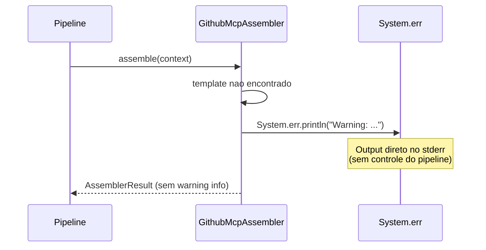
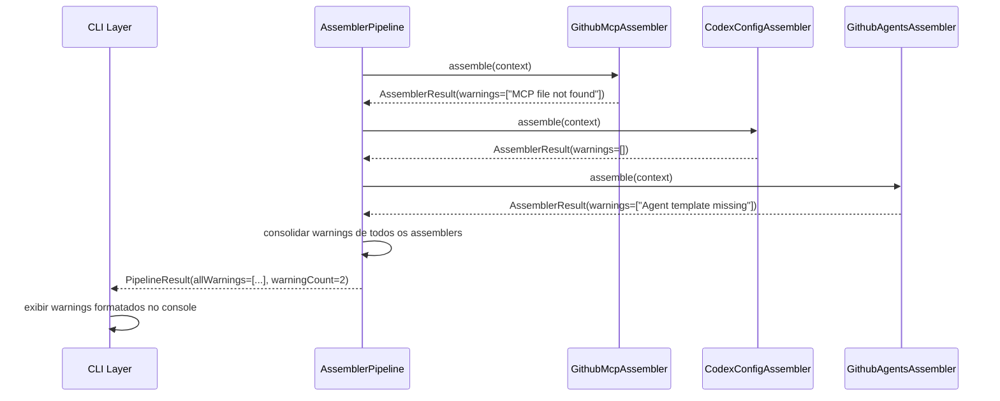

# Historia: Substituir System.err.println por propagacao de warnings

**ID:** story-0008-0007

## 1. Dependencias

| Blocked By | Blocks |
| :--- | :--- |
| story-0008-0005 | — |

## 2. Regras Transversais Aplicaveis

| ID | Titulo |
| :--- | :--- |
| RULE-002 | Comportamento externo inalterado |
| RULE-003 | Commits atomicos |

## 3. Descricao

Como **Tech Lead**, eu quero substituir todas as chamadas `System.err.println` por propagacao estruturada de warnings via `AssemblerResult`, garantindo que avisos sejam coletados e exibidos de forma consistente pelo pipeline ao inves de escritos diretamente no stderr.

O audit report identificou 3 ocorrencias de `System.err.println` (finding C-004) e inconsistencia no tratamento de warnings (finding M-017). Atualmente, tres assemblers escrevem diretamente no stderr, o que viola o principio de separacao de responsabilidades: assemblers devem montar artefatos e reportar resultados, nao controlar output de console. O output de console e responsabilidade exclusiva do pipeline/CLI.

A solucao consiste em: (1) remover os 3 `System.err.println`, (2) propagar warnings atraves do `AssemblerResult` (ou record equivalente criado na story-0008-0005), e (3) atualizar o `AssemblerPipeline` para coletar e exibir warnings de forma unificada ao final da execucao.

### 3.1 Ocorrencias de System.err.println

| Arquivo | Linha | Contexto |
| :--- | :--- | :--- |
| GithubMcpAssembler | :74 | Warning quando arquivo MCP de referencia nao encontrado |
| CodexConfigAssembler | :61 | Warning quando configuracao Codex padrao nao encontrada |
| GithubAgentsAssembler | :102 | Warning quando template de agente nao encontrado |

### 3.2 Mecanismo de Propagacao

- `AssemblerResult` (da story-0008-0005) deve incluir campo `List<String> warnings`
- Cada assembler adiciona warnings ao resultado ao inves de imprimir no stderr
- `AssemblerPipeline` coleta warnings de todos os assemblers e exibe ao final
- Formato de exibicao unificado: `[WARN] {assemblerName}: {mensagem}`

## 4. Definicoes de Qualidade Locais

### DoR Local (Definition of Ready)

- [ ] story-0008-0005 (Extrair record AssembleResult compartilhado) concluida
- [ ] Record AssemblerResult disponivel com campo para warnings
- [ ] Localizacao exata das 3 chamadas System.err.println confirmada
- [ ] Formato de exibicao de warnings definido

### DoD Local (Definition of Done)

- [ ] Zero ocorrencias de `System.err.println` nos 3 arquivos
- [ ] Warnings propagados via AssemblerResult para o pipeline
- [ ] Pipeline coleta e exibe warnings de forma unificada
- [ ] Nenhum output direto ao stderr fora do CLI/pipeline layer
- [ ] Todos os testes existentes passando

### Global Definition of Done (DoD)

- **Cobertura:** >= 95% Line, >= 90% Branch
- **Testes Automatizados:** Todos os testes existentes passando + novos testes
- **Relatorio de Cobertura:** JaCoCo via `mvn verify`
- **Documentacao:** Javadoc atualizado quando assinaturas mudam
- **Performance:** Sem degradacao

## 5. Contratos de Dados (Data Contract)

**AssemblerResult (campo de warnings):**

| Campo | Tipo | Descricao | Obrigatorio |
| :--- | :--- | :--- | :--- |
| `warnings` | `List<String>` | Lista de mensagens de warning do assembler | M (pode ser vazia) |

**Warning Format:**

| Componente | Formato | Exemplo |
| :--- | :--- | :--- |
| Prefixo | `[WARN]` | `[WARN]` |
| Origem | Nome do assembler | `GithubMcpAssembler` |
| Mensagem | Texto descritivo | `MCP reference file not found: copilot-mcp.json` |
| Completo | `[WARN] {origem}: {mensagem}` | `[WARN] GithubMcpAssembler: MCP reference file not found: copilot-mcp.json` |

**Pipeline Output (warnings agregados):**

| Campo | Tipo | Descricao |
| :--- | :--- | :--- |
| `allWarnings` | `List<String>` | Warnings consolidados de todos os assemblers |
| `warningCount` | `int` | Total de warnings (derivado de allWarnings.size()) |

## 6. Diagramas (mermaid)

### 6.1 Antes: System.err.println direto



### 6.2 Depois: Propagacao via AssemblerResult



## 7. Criterios de Aceite (Gherkin)

```gherkin
Cenario: Assembler sem warnings retorna lista vazia
  DADO que o GithubMcpAssembler e executado
  QUANDO todos os recursos de referencia existem
  ENTAO o AssemblerResult contem warnings com lista vazia
  E nenhuma mensagem e escrita em System.err

Cenario: Assembler com warning propaga via AssemblerResult
  DADO que o GithubMcpAssembler e executado
  QUANDO o arquivo MCP de referencia NAO e encontrado
  ENTAO o AssemblerResult contem exatamente 1 warning
  E o warning contem a mensagem descritiva do problema
  E nenhuma mensagem e escrita em System.err

Cenario: Pipeline consolida warnings de multiplos assemblers
  DADO que o pipeline executa GithubMcpAssembler, CodexConfigAssembler e GithubAgentsAssembler
  QUANDO GithubMcpAssembler e GithubAgentsAssembler geram 1 warning cada
  E CodexConfigAssembler NAO gera warnings
  ENTAO o PipelineResult contem exatamente 2 warnings
  E os warnings estao na ordem de execucao dos assemblers

Cenario: Zero chamadas System.err.println nos assemblers
  DADO que os 3 arquivos afetados foram modificados
  QUANDO uma busca por "System.err.println" e executada no pacote assembler
  ENTAO o resultado e zero ocorrencias
  E todos os testes existentes continuam passando

Cenario: Warning formatado segue padrao unificado
  DADO que o pipeline coletou warnings dos assemblers
  QUANDO os warnings sao exibidos no console
  ENTAO cada warning segue o formato "[WARN] {NomeAssembler}: {mensagem}"
  E warnings sao exibidos apos a execucao completa do pipeline
```

### 7.1 Scenario Ordering (TPP)

> Scenarios seguem TPP: degenerate (lista vazia, sem warnings) -> constante (1 warning propagado) -> colecao (multiplos assemblers, consolidacao) -> restricao (zero System.err.println) -> formato (padrao unificado).

### 7.2 Mandatory Scenario Categories

- [x] Degenerate cases (assembler sem warnings, lista vazia)
- [x] Happy path (warning propagado via AssemblerResult)
- [x] Error paths (zero System.err.println como validacao negativa)
- [x] Boundary values (multiplos assemblers, consolidacao de warnings)

## 8. Sub-tarefas

- [ ] [Dev] Adicionar campo `List<String> warnings` ao AssemblerResult (se nao existente da story-0008-0005)
- [ ] [Dev] Remover System.err.println de GithubMcpAssembler:74, substituir por warning no AssemblerResult
- [ ] [Dev] Remover System.err.println de CodexConfigAssembler:61, substituir por warning no AssemblerResult
- [ ] [Dev] Remover System.err.println de GithubAgentsAssembler:102, substituir por warning no AssemblerResult
- [ ] [Dev] Atualizar AssemblerPipeline para coletar warnings de todos os AssemblerResults
- [ ] [Dev] Implementar exibicao formatada de warnings no pipeline/CLI layer
- [ ] [Test] Testar assembler sem warnings retorna lista vazia
- [ ] [Test] Testar assembler com warning propaga via AssemblerResult
- [ ] [Test] Testar pipeline consolida warnings de multiplos assemblers
- [ ] [Test] Verificar zero ocorrencias de System.err.println no pacote assembler
- [ ] [Test] Verificar formato unificado de warnings
- [ ] [Test] Verificar todos os testes existentes passando
