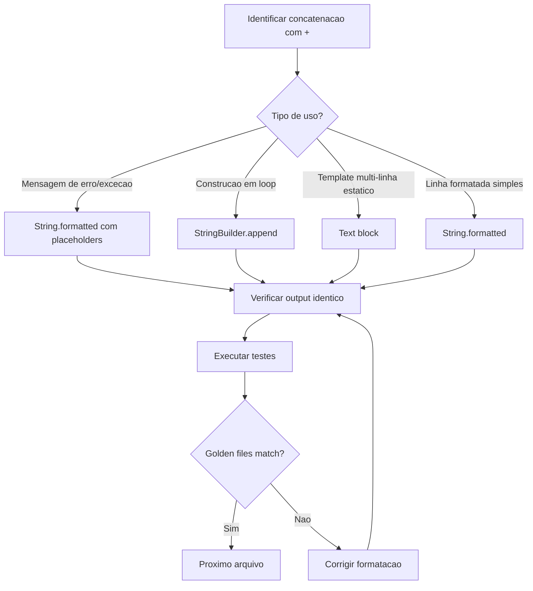
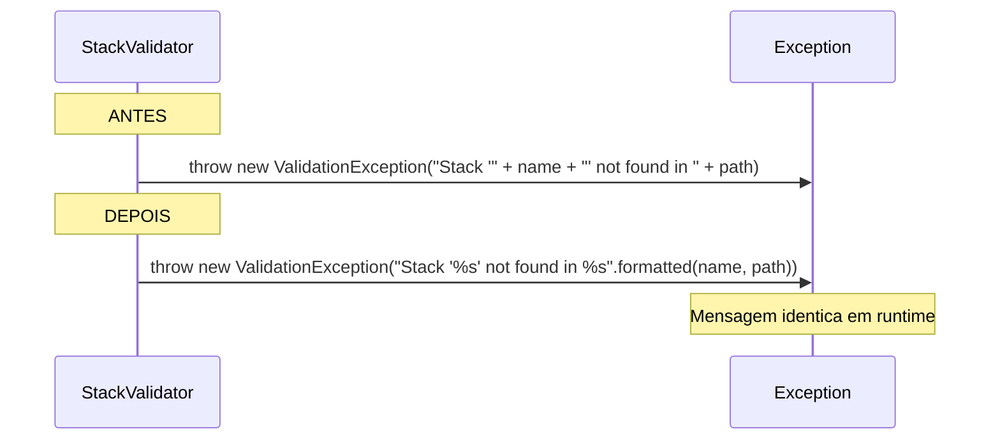

# Historia: Substituir concatenacao de string por .formatted()

**ID:** story-0008-0008

## 1. Dependencias

| Blocked By | Blocks |
| :--- | :--- |
| — | — |

## 2. Regras Transversais Aplicaveis

| ID | Titulo |
| :--- | :--- |
| RULE-002 | Comportamento externo inalterado |
| RULE-003 | Commits atomicos |
| RULE-009 | String formatting |

## 3. Descricao

Como **Tech Lead**, eu quero substituir todas as concatenacoes de string com operador `+` por `String.formatted()`, `StringBuilder` ou text blocks, garantindo que o codebase siga a RULE-009 (String formatting) e aproveite os recursos de Java 21 para legibilidade e performance.

O audit report identificou dois findings relacionados: M-003 (12+ concatenacoes em mensagens de erro/excecao) e M-004 (100+ concatenacoes em construcao de conteudo). A concatenacao com `+` em mensagens de erro torna o codigo dificil de ler e impossibilita a internacionalizacao futura. Em construcao de conteudo (assemblers gerando texto), a concatenacao com `+` e ineficiente para strings grandes e prejudica a legibilidade.

A migracao segue duas estrategias: (1) mensagens de erro e excecoes migram para `String.formatted()` com placeholders `%s`, `%d`, etc.; (2) construcao de conteudo complexo migra para `StringBuilder`, text blocks ("""), ou `String.formatted()` conforme a complexidade do trecho.

### 3.1 Prioridade 1: Mensagens de Erro (M-003)

| Arquivo | Ocorrencias | Tipo |
| :--- | :--- | :--- |
| StackValidator | 5 | Mensagens de excecao |
| Auditor | 2 | Mensagens de log/erro |
| ConfigLoader | 1 | Mensagem de excecao |
| CicdAssembler | 1 | Mensagem de erro |
| GithubAgentsAssembler | 1 | Mensagem de erro |
| Outros | 2+ | Mensagens diversas |

### 3.2 Prioridade 2: Construcao de Conteudo (M-004)

| Arquivo | Ocorrencias (aprox.) | Estrategia Recomendada |
| :--- | :--- | :--- |
| ReadmeTables | 20+ | StringBuilder para construcao de tabelas |
| ProgressFormatter | 15+ | String.formatted() para linhas formatadas |
| DocsAdrAssembler | 10+ | Text blocks para templates multi-linha |
| CicdAssembler | 10+ | StringBuilder + String.formatted() |

### 3.3 Regras de Migracao

- Mensagens de excecao: `throw new X("Erro em " + name + " linha " + line)` -> `throw new X("Erro em %s linha %d".formatted(name, line))`
- Construcao de conteudo em loop: usar `StringBuilder` com `append()`
- Templates multi-linha estaticos: usar text blocks (`"""`)
- Linhas formatadas simples: usar `String.formatted()`
- NUNCA usar `String.format()` (preferir `.formatted()` de Java 15+)

## 4. Definicoes de Qualidade Locais

### DoR Local (Definition of Ready)

- [ ] Levantamento completo de concatenacoes com `+` nos arquivos prioritarios
- [ ] Estrategia de migracao definida por tipo (erro vs. conteudo)
- [ ] Golden files de referencia disponives para comparacao byte-for-byte

### DoD Local (Definition of Done)

- [ ] Zero concatenacoes com `+` em mensagens de erro/excecao nos arquivos prioritarios
- [ ] Concatenacoes de conteudo nos 4 arquivos principais migradas para StringBuilder/formatted/text blocks
- [ ] Todas as mensagens de erro geram texto identico ao original (byte-for-byte)
- [ ] Golden files inalterados (output do gerador identico)
- [ ] Todos os testes existentes passando

### Global Definition of Done (DoD)

- **Cobertura:** >= 95% Line, >= 90% Branch
- **Testes Automatizados:** Todos os testes existentes passando + novos testes
- **Relatorio de Cobertura:** JaCoCo via `mvn verify`
- **Documentacao:** Javadoc atualizado quando assinaturas mudam
- **Performance:** Sem degradacao

## 5. Contratos de Dados (Data Contract)

**Regras de Transformacao:**

| Padrao Antes | Padrao Depois | Aplicacao |
| :--- | :--- | :--- |
| `"texto " + var + " mais"` | `"texto %s mais".formatted(var)` | Mensagens de erro, excecoes |
| `"valor: " + num` | `"valor: %d".formatted(num)` | Mensagens com numeros inteiros |
| `s += "linha\n"; s += "outra\n";` | `var sb = new StringBuilder(); sb.append("linha\n");` | Construcao em loop |
| Concatenacao multi-linha estatica | `"""\n texto multi-linha\n """` | Templates estaticos |

**Preservacao de Output:**

| Validacao | Metodo |
| :--- | :--- |
| Mensagens de erro | Comparacao textual nos testes unitarios |
| Saida do gerador | Golden file tests (byte-for-byte) |
| Formatacao de progresso | Testes de ProgressFormatter |

## 6. Diagramas (mermaid)

### 6.1 Estrategia de Migracao por Tipo



### 6.2 Exemplo de Migracao StackValidator



## 7. Criterios de Aceite (Gherkin)

```gherkin
Cenario: Mensagem de erro com formatted gera texto identico
  DADO que o StackValidator lanca excecao para stack invalido
  QUANDO o nome do stack e "invalid-stack" e o path e "/configs"
  ENTAO a mensagem da excecao e exatamente "Stack 'invalid-stack' not found in /configs"
  E o texto e identico ao gerado pela concatenacao anterior

Cenario: Construcao de conteudo com StringBuilder gera output correto
  DADO que o ReadmeTables gera uma tabela markdown com 3 linhas
  QUANDO o metodo de geracao e executado
  ENTAO o output e identico ao golden file de referencia
  E nenhuma concatenacao com + e usada no metodo

Cenario: Zero concatenacoes em mensagens de erro nos arquivos prioritarios
  DADO que os 5 arquivos prioritarios (StackValidator, ConfigLoader, Auditor, CicdAssembler, GithubAgentsAssembler) foram migrados
  QUANDO uma busca por padrao de concatenacao em throw/excecao e executada
  ENTAO o resultado e zero ocorrencias de "+" em mensagens de excecao
  E todos os testes existentes continuam passando

Cenario: Golden files inalterados apos migracao de conteudo
  DADO que os assemblers ReadmeTables, ProgressFormatter, DocsAdrAssembler e CicdAssembler foram migrados
  QUANDO os golden file tests sao executados
  ENTAO todos os golden files correspondem byte-for-byte
  E nenhum artefato gerado teve seu conteudo alterado

Cenario: Text blocks usados para templates multi-linha estaticos
  DADO que o DocsAdrAssembler contem templates multi-linha
  QUANDO o codigo migrado e analisado
  ENTAO templates estaticos de 3+ linhas usam text blocks
  E a indentacao e preservada corretamente via text block stripping
```

### 7.1 Scenario Ordering (TPP)

> Scenarios seguem TPP: constante (mensagem de erro unica) -> colecao (construcao de conteudo) -> restricao (zero concatenacoes) -> integracao (golden files) -> padrao avancado (text blocks).

### 7.2 Mandatory Scenario Categories

- [x] Degenerate cases (mensagem de erro simples, identica ao original)
- [x] Happy path (construcao com StringBuilder, golden files match)
- [x] Error paths (zero concatenacoes como validacao negativa)
- [x] Boundary values (text blocks para multi-linha, golden file byte-for-byte)

## 8. Sub-tarefas

- [ ] [Dev] Migrar mensagens de erro do StackValidator (5 ocorrencias) para .formatted()
- [ ] [Dev] Migrar mensagens de erro de ConfigLoader (1), Auditor (2), CicdAssembler (1), GithubAgentsAssembler (1)
- [ ] [Dev] Migrar construcao de conteudo de ReadmeTables para StringBuilder
- [ ] [Dev] Migrar construcao de conteudo de ProgressFormatter para .formatted()
- [ ] [Dev] Migrar construcao de conteudo de DocsAdrAssembler para text blocks + .formatted()
- [ ] [Dev] Migrar construcao de conteudo de CicdAssembler para StringBuilder + .formatted()
- [ ] [Test] Verificar mensagens de erro identicas ao original em cada arquivo migrado
- [ ] [Test] Executar golden file tests e confirmar paridade byte-for-byte
- [ ] [Test] Verificar todos os testes existentes passando
- [ ] [Test] Busca automatizada por concatenacao com + em mensagens de excecao (zero resultados)
