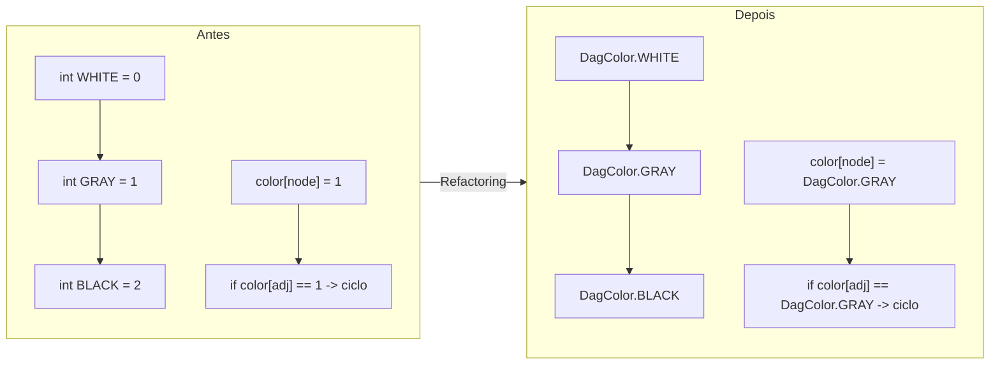
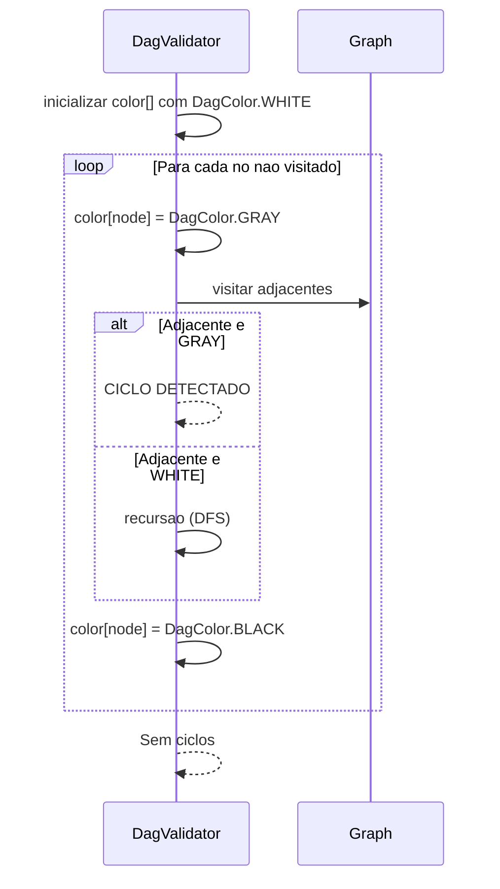

# Historia: Eliminar numeros e strings magicas

**ID:** story-0008-0009

## 1. Dependencias

| Blocked By | Blocks |
| :--- | :--- |
| — | — |

## 2. Regras Transversais Aplicaveis

| ID | Titulo |
| :--- | :--- |
| RULE-002 | Comportamento externo inalterado |
| RULE-003 | Commits atomicos |
| RULE-004 | Limites de tamanho |

## 3. Descricao

Como **Tech Lead**, eu quero substituir todos os numeros e strings magicas por constantes nomeadas, garantindo que o codebase comunique a intencao de cada valor literal e facilite a manutencao futura.

O audit report identificou 5 locais com numeros magicos (finding M-005) e constantes inteiras sem significado semantico no DagValidator (finding L-017). Numeros magicos tornam o codigo incompreensivel para novos desenvolvedores e propenso a erros de manutencao: alterar o valor em um local mas esquecer os demais. Constantes nomeadas eliminam esse risco e documentam a intencao.

O caso mais critico e o DagValidator, que usa inteiros 0, 1, 2 para representar cores no algoritmo de deteccao de ciclos (WHITE=nao visitado, GRAY=em processamento, BLACK=concluido). Estes devem ser substituidos por um enum `DagColor` que torna a semantica explicita e impede atribuicao de valores invalidos.

### 3.1 Ocorrencias Identificadas

| Arquivo | Linha | Valor Magico | Constante Proposta |
| :--- | :--- | :--- | :--- |
| ContextBuilder | :76 | `new LinkedHashMap<>(32)` | `INITIAL_CONTEXT_CAPACITY = 32` |
| CicdAssembler | :188 | `new LinkedHashMap<>(16)` | `INITIAL_CICD_MAP_CAPACITY = 16` |
| DagValidator | :24-26 | `0, 1, 2` (cores) | Enum `DagColor { WHITE, GRAY, BLACK }` |
| CheckpointEngine | :159 | `60_000.0` (ms para min) | `MILLIS_PER_MINUTE = 60_000.0` |
| GenerateCommand | :330 | Divisao implicita | Constante nomeada para o divisor |

### 3.2 Enum DagColor

```java
public enum DagColor {
    WHITE,  // Nao visitado
    GRAY,   // Em processamento (ciclo se revisitado)
    BLACK   // Concluido
}
```

- Substituir `int[] color` por `DagColor[] color` no DagValidator
- Substituir comparacoes `color[i] == 0` por `color[i] == DagColor.WHITE`
- Substituir atribuicoes `color[i] = 1` por `color[i] = DagColor.GRAY`
- O enum deve residir no mesmo pacote do DagValidator (domain)

### 3.3 Constantes de Capacidade

- Constantes de capacidade inicial de HashMap devem ser `private static final` na classe que as utiliza
- Nome deve indicar o proposito: `INITIAL_CONTEXT_CAPACITY`, nao `MAP_SIZE`
- Capacidade 32 no ContextBuilder: otimizacao para evitar rehash com ~20 entries de contexto
- Capacidade 16 no CicdAssembler: otimizacao para ~10 entries de CI/CD config

## 4. Definicoes de Qualidade Locais

### DoR Local (Definition of Ready)

- [ ] Todos os 5 locais identificados com numeros de linha exatos
- [ ] Nomes das constantes definidos seguindo convencao (SCREAMING_SNAKE_CASE)
- [ ] Enum DagColor definido com documentacao de cada valor
- [ ] Impacto em testes existentes avaliado

### DoD Local (Definition of Done)

- [ ] Zero numeros magicos nos 5 locais identificados
- [ ] Enum DagColor criado e utilizado no DagValidator
- [ ] Constantes com nomes intent-revealing em cada classe
- [ ] Constantes sao `private static final` (ou package-private se compartilhadas)
- [ ] Todos os testes existentes passando
- [ ] Comportamento identico ao original (mesmos valores, mesma logica)

### Global Definition of Done (DoD)

- **Cobertura:** >= 95% Line, >= 90% Branch
- **Testes Automatizados:** Todos os testes existentes passando + novos testes
- **Relatorio de Cobertura:** JaCoCo via `mvn verify`
- **Documentacao:** Javadoc atualizado quando assinaturas mudam
- **Performance:** Sem degradacao

## 5. Contratos de Dados (Data Contract)

**Mapeamento de Valores Magicos para Constantes:**

| Classe | Valor Magico | Constante | Tipo | Visibilidade |
| :--- | :--- | :--- | :--- | :--- |
| ContextBuilder | `32` | `INITIAL_CONTEXT_CAPACITY` | `int` | `private static final` |
| CicdAssembler | `16` | `INITIAL_CICD_MAP_CAPACITY` | `int` | `private static final` |
| CheckpointEngine | `60_000.0` | `MILLIS_PER_MINUTE` | `double` | `private static final` |
| GenerateCommand | valor implicito | Constante nomeada adequada | `int` ou `double` | `private static final` |

**Enum DagColor:**

| Valor | Significado | Substituicao |
| :--- | :--- | :--- |
| `WHITE` | No nao visitado | `0` |
| `GRAY` | No em processamento (ciclo se revisitado) | `1` |
| `BLACK` | No completamente processado | `2` |

## 6. Diagramas (mermaid)

### 6.1 Antes e Depois: DagValidator com DagColor



### 6.2 Fluxo de Deteccao de Ciclos com Enum



## 7. Criterios de Aceite (Gherkin)

```gherkin
Cenario: DagValidator usa enum DagColor ao inves de inteiros
  DADO que o DagValidator implementa deteccao de ciclos
  QUANDO o codigo e analisado
  ENTAO nao existem literais 0, 1, 2 representando cores
  E o tipo do array de cores e DagColor[]
  E comparacoes usam DagColor.WHITE, DagColor.GRAY, DagColor.BLACK

Cenario: Deteccao de ciclos funciona identicamente com enum
  DADO que o DagValidator usa DagColor enum
  QUANDO um grafo com ciclo e validado
  ENTAO o ciclo e detectado corretamente
  E a mensagem de erro e identica a versao anterior

Cenario: Constantes de capacidade inicial nomeadas em ContextBuilder e CicdAssembler
  DADO que o ContextBuilder cria um LinkedHashMap
  QUANDO o codigo e analisado
  ENTAO a capacidade inicial usa constante INITIAL_CONTEXT_CAPACITY com valor 32
  E CicdAssembler usa constante INITIAL_CICD_MAP_CAPACITY com valor 16
  E ambas sao private static final

Cenario: Conversao ms para minutos usa constante nomeada
  DADO que o CheckpointEngine converte milissegundos para minutos
  QUANDO o codigo e analisado
  ENTAO a divisao usa constante MILLIS_PER_MINUTE com valor 60_000.0
  E o resultado da conversao e identico ao original

Cenario: Zero numeros magicos nos 5 locais identificados
  DADO que os 5 arquivos foram refatorados
  QUANDO uma busca por literais numericos sem contexto e executada
  ENTAO nenhum dos valores magicos originais aparece sem constante nomeada
  E todos os testes existentes continuam passando
```

### 7.1 Scenario Ordering (TPP)

> Scenarios seguem TPP: constante (enum DagColor, tipo mais complexo) -> comportamento (deteccao de ciclo preservada) -> constante simples (capacidade de map) -> constante numerica (conversao ms/min) -> restricao global (zero magicos).

### 7.2 Mandatory Scenario Categories

- [x] Degenerate cases (enum substitui inteiros literais)
- [x] Happy path (deteccao de ciclos funciona com enum, constantes nomeadas)
- [x] Error paths (ciclo detectado com mensagem identica)
- [x] Boundary values (zero numeros magicos, validacao global)

## 8. Sub-tarefas

- [ ] [Dev] Criar enum DagColor (WHITE, GRAY, BLACK) no pacote domain
- [ ] [Dev] Refatorar DagValidator para usar DagColor[] ao inves de int[]
- [ ] [Dev] Adicionar constante INITIAL_CONTEXT_CAPACITY = 32 ao ContextBuilder
- [ ] [Dev] Adicionar constante INITIAL_CICD_MAP_CAPACITY = 16 ao CicdAssembler
- [ ] [Dev] Adicionar constante MILLIS_PER_MINUTE = 60_000.0 ao CheckpointEngine
- [ ] [Dev] Substituir literal implicito no GenerateCommand por constante nomeada
- [ ] [Test] Testar deteccao de ciclo no DagValidator com enum (grafo com ciclo e sem ciclo)
- [ ] [Test] Verificar que valores de capacidade sao utilizados corretamente
- [ ] [Test] Verificar que conversao ms/min produz resultado identico
- [ ] [Test] Verificar todos os testes existentes passando
