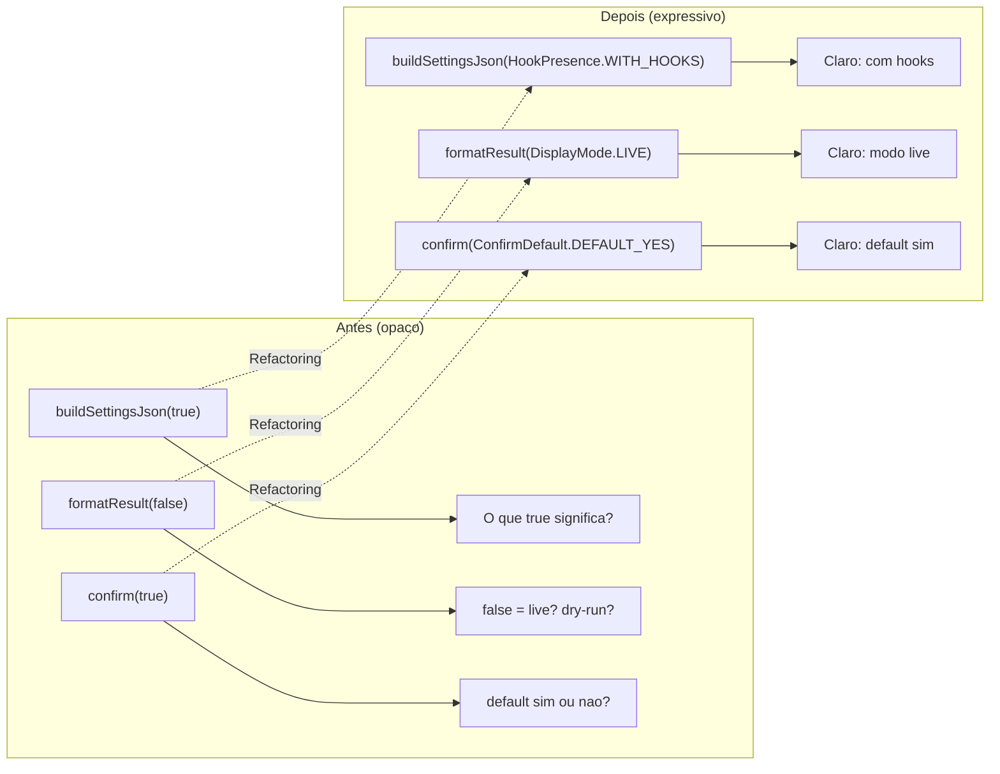
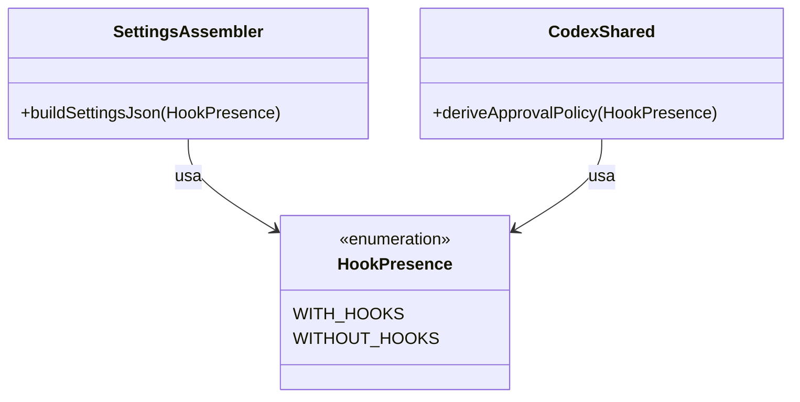

# Historia: Eliminar parametros boolean flag

**ID:** story-0008-0010

## 1. Dependencias

| Blocked By | Blocks |
| :--- | :--- |
| — | — |

## 2. Regras Transversais Aplicaveis

| ID | Titulo |
| :--- | :--- |
| RULE-002 | Comportamento externo inalterado |
| RULE-003 | Commits atomicos |
| RULE-004 | Limites de tamanho |

## 3. Descricao

Como **Tech Lead**, eu quero substituir todos os parametros boolean flag por enums ou metodos separados, garantindo que chamadas de metodo sejam auto-documentadas e nao dependam de `true/false` cujo significado e opaco no call site.

O audit report (finding M-002) identificou 5 parametros boolean flag que violam as boas praticas de Clean Code. Um boolean flag como parametro indica que o metodo faz duas coisas diferentes dependendo do valor — violando SRP. No call site, `buildSettingsJson(true)` nao comunica intencao; `buildSettingsJson(HookPresence.WITH_HOOKS)` e imediatamente compreensivel.

A estrategia de correcao e: (1) criar enums expressivos para cada boolean flag, (2) substituir os parametros por enums, (3) atualizar todos os chamadores. Para `DagNode.setOnCriticalPath(boolean)`, o padrao e diferente: trata-se de um setter de propriedade booleana que segue convencao JavaBeans e NAO precisa ser substituido (e propriedade, nao flag de comportamento). Caso a analise confirme que e flag de comportamento, substituir igualmente.

### 3.1 Ocorrencias e Enums Propostos

| Classe | Metodo | Parametro | Enum Proposto |
| :--- | :--- | :--- | :--- |
| SettingsAssembler | `buildSettingsJson(boolean hasHooks)` | `hasHooks` | `HookPresence { WITH_HOOKS, WITHOUT_HOOKS }` |
| CodexShared | `deriveApprovalPolicy(boolean hasHooks)` | `hasHooks` | `HookPresence { WITH_HOOKS, WITHOUT_HOOKS }` (reutilizar) |
| CliDisplay | `formatResult(boolean dryRun)` | `dryRun` | `DisplayMode { LIVE, DRY_RUN }` |
| TerminalProvider | `confirm(boolean defaultValue)` | `defaultValue` | `ConfirmDefault { DEFAULT_YES, DEFAULT_NO }` |
| DagNode | `setOnCriticalPath(boolean)` | setter booleano | Avaliar: se e propriedade, manter; se e flag, criar enum |

### 3.2 Localizacao dos Enums

- `HookPresence`: pacote do SettingsAssembler ou model (compartilhado entre SettingsAssembler e CodexShared)
- `DisplayMode`: pacote do CliDisplay ou model
- `ConfirmDefault`: pacote do TerminalProvider ou model
- Enums devem ser top-level classes (nao inner classes) para facilitar reuso

### 3.3 Impacto nos Chamadores

| Enum | Chamadores Estimados |
| :--- | :--- |
| HookPresence | SettingsAssembler, CodexShared, AssemblerPipeline, testes |
| DisplayMode | CliDisplay, GenerateCommand, testes |
| ConfirmDefault | TerminalProvider, JLineTerminalProvider, testes |

## 4. Definicoes de Qualidade Locais

### DoR Local (Definition of Ready)

- [ ] Todos os 5 parametros boolean flag localizados com numeros de linha
- [ ] Chamadores de cada metodo mapeados para atualizacao
- [ ] Nomes dos enums definidos e aprovados
- [ ] Decisao sobre DagNode.setOnCriticalPath (propriedade vs. flag) documentada

### DoD Local (Definition of Done)

- [ ] Zero parametros boolean flag nos metodos identificados (exceto DagNode se confirmado como propriedade)
- [ ] Enums HookPresence, DisplayMode, ConfirmDefault criados
- [ ] Todos os chamadores atualizados para usar enums
- [ ] Interfaces (TerminalProvider) atualizadas para usar enum no contrato
- [ ] Implementacoes (JLineTerminalProvider) atualizadas consistentemente
- [ ] Todos os testes existentes passando

### Global Definition of Done (DoD)

- **Cobertura:** >= 95% Line, >= 90% Branch
- **Testes Automatizados:** Todos os testes existentes passando + novos testes
- **Relatorio de Cobertura:** JaCoCo via `mvn verify`
- **Documentacao:** Javadoc atualizado quando assinaturas mudam
- **Performance:** Sem degradacao

## 5. Contratos de Dados (Data Contract)

**Assinaturas Antes/Depois:**

| Classe | Antes | Depois |
| :--- | :--- | :--- |
| SettingsAssembler | `buildSettingsJson(boolean hasHooks)` | `buildSettingsJson(HookPresence hookPresence)` |
| CodexShared | `deriveApprovalPolicy(boolean hasHooks)` | `deriveApprovalPolicy(HookPresence hookPresence)` |
| CliDisplay | `formatResult(boolean dryRun)` | `formatResult(DisplayMode displayMode)` |
| TerminalProvider | `confirm(boolean defaultValue)` | `confirm(ConfirmDefault confirmDefault)` |
| JLineTerminalProvider | `confirm(boolean defaultValue)` | `confirm(ConfirmDefault confirmDefault)` |

**Enum Definitions:**

| Enum | Valores | Pacote |
| :--- | :--- | :--- |
| `HookPresence` | `WITH_HOOKS`, `WITHOUT_HOOKS` | model ou assembler |
| `DisplayMode` | `LIVE`, `DRY_RUN` | model ou cli |
| `ConfirmDefault` | `DEFAULT_YES`, `DEFAULT_NO` | model ou cli |

**Mapeamento de Chamadas:**

| Chamada Antes | Chamada Depois |
| :--- | :--- |
| `buildSettingsJson(true)` | `buildSettingsJson(HookPresence.WITH_HOOKS)` |
| `buildSettingsJson(false)` | `buildSettingsJson(HookPresence.WITHOUT_HOOKS)` |
| `deriveApprovalPolicy(true)` | `deriveApprovalPolicy(HookPresence.WITH_HOOKS)` |
| `formatResult(true)` | `formatResult(DisplayMode.DRY_RUN)` |
| `formatResult(false)` | `formatResult(DisplayMode.LIVE)` |
| `confirm(true)` | `confirm(ConfirmDefault.DEFAULT_YES)` |
| `confirm(false)` | `confirm(ConfirmDefault.DEFAULT_NO)` |

## 6. Diagramas (mermaid)

### 6.1 Antes e Depois: Call Sites



### 6.2 Enum HookPresence Compartilhado



## 7. Criterios de Aceite (Gherkin)

```gherkin
Cenario: SettingsAssembler aceita enum HookPresence ao inves de boolean
  DADO que o metodo buildSettingsJson existe no SettingsAssembler
  QUANDO chamado com HookPresence.WITH_HOOKS
  ENTAO o resultado e identico ao antigo buildSettingsJson(true)
  E o parametro boolean nao existe mais na assinatura

Cenario: HookPresence compartilhado entre SettingsAssembler e CodexShared
  DADO que o enum HookPresence foi criado
  QUANDO SettingsAssembler e CodexShared sao analisados
  ENTAO ambos usam o mesmo enum HookPresence
  E nao existe duplicacao de enum com significado identico

Cenario: CliDisplay usa DisplayMode ao inves de boolean dryRun
  DADO que o metodo formatResult existe no CliDisplay
  QUANDO chamado com DisplayMode.DRY_RUN
  ENTAO o resultado e identico ao antigo formatResult(true)
  E quando chamado com DisplayMode.LIVE o resultado e identico ao antigo formatResult(false)

Cenario: TerminalProvider e JLineTerminalProvider usam ConfirmDefault
  DADO que a interface TerminalProvider define confirm()
  QUANDO a assinatura e analisada
  ENTAO o parametro e do tipo ConfirmDefault
  E JLineTerminalProvider implementa confirm(ConfirmDefault)
  E o comportamento e identico ao anterior para DEFAULT_YES e DEFAULT_NO

Cenario: Zero parametros boolean flag nos metodos identificados
  DADO que os 4 metodos foram migrados para enums
  QUANDO as assinaturas dos metodos sao analisadas
  ENTAO nenhum possui parametro do tipo boolean (exceto DagNode se confirmado como propriedade)
  E todos os chamadores usam o enum correspondente
  E todos os testes existentes continuam passando

Cenario: Ambos os valores de cada enum sao testados
  DADO que os enums HookPresence, DisplayMode e ConfirmDefault existem
  QUANDO os testes sao analisados
  ENTAO existem testes para WITH_HOOKS e WITHOUT_HOOKS
  E existem testes para LIVE e DRY_RUN
  E existem testes para DEFAULT_YES e DEFAULT_NO
```

### 7.1 Scenario Ordering (TPP)

> Scenarios seguem TPP: constante (enum unico, SettingsAssembler) -> reuso (HookPresence compartilhado) -> segundo enum (DisplayMode) -> interface/implementacao (TerminalProvider) -> restricao global (zero boolean flags) -> cobertura de enum (ambos valores testados).

### 7.2 Mandatory Scenario Categories

- [x] Degenerate cases (enum com valor unico aplicado)
- [x] Happy path (enum compartilhado, multiplas classes atualizadas)
- [x] Error paths (zero boolean flags como validacao negativa)
- [x] Boundary values (ambos valores de cada enum testados, interface + implementacao)

## 8. Sub-tarefas

- [ ] [Dev] Criar enum HookPresence (WITH_HOOKS, WITHOUT_HOOKS) no pacote adequado
- [ ] [Dev] Criar enum DisplayMode (LIVE, DRY_RUN) no pacote adequado
- [ ] [Dev] Criar enum ConfirmDefault (DEFAULT_YES, DEFAULT_NO) no pacote adequado
- [ ] [Dev] Refatorar SettingsAssembler.buildSettingsJson() para usar HookPresence
- [ ] [Dev] Refatorar CodexShared.deriveApprovalPolicy() para usar HookPresence
- [ ] [Dev] Refatorar CliDisplay.formatResult() para usar DisplayMode
- [ ] [Dev] Refatorar TerminalProvider.confirm() e JLineTerminalProvider.confirm() para usar ConfirmDefault
- [ ] [Dev] Avaliar DagNode.setOnCriticalPath(): se flag, criar enum; se propriedade, documentar decisao
- [ ] [Dev] Atualizar todos os chamadores para usar enums
- [ ] [Test] Testar SettingsAssembler com WITH_HOOKS e WITHOUT_HOOKS
- [ ] [Test] Testar CodexShared com WITH_HOOKS e WITHOUT_HOOKS
- [ ] [Test] Testar CliDisplay com LIVE e DRY_RUN
- [ ] [Test] Testar TerminalProvider com DEFAULT_YES e DEFAULT_NO
- [ ] [Test] Verificar todos os testes existentes passando
- [ ] [Doc] Atualizar Javadoc das assinaturas alteradas
