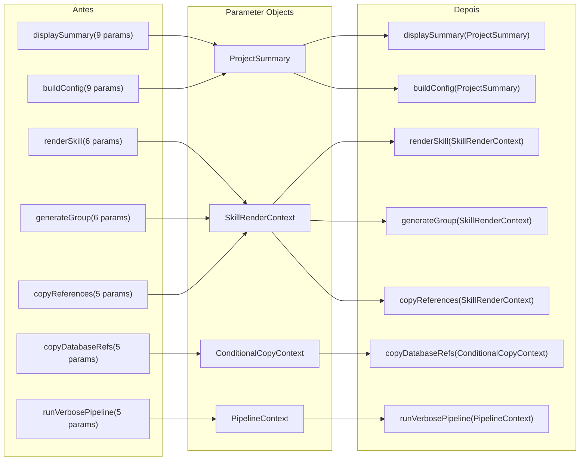
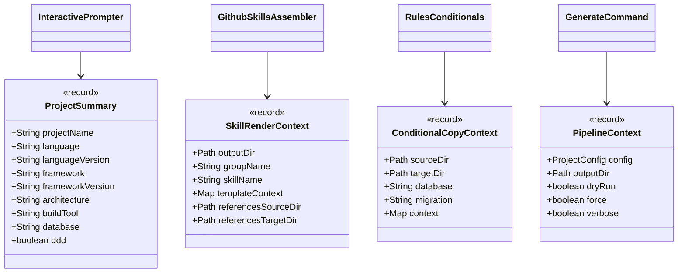

# Historia: Reduzir contagem de parametros com parameter objects

**ID:** story-0008-0011

## 1. Dependencias

| Blocked By | Blocks |
| :--- | :--- |
| — | — |

## 2. Regras Transversais Aplicaveis

| ID | Titulo |
| :--- | :--- |
| RULE-002 | Comportamento externo inalterado |
| RULE-003 | Commits atomicos |
| RULE-004 | Limites de tamanho |

## 3. Descricao

Como **Tech Lead**, eu quero criar records de parameter objects para metodos que excedem 4 parametros, garantindo que a contagem de parametros esteja dentro do limite definido em RULE-004 e que a legibilidade dos chamadores melhore significativamente.

O audit M-001 identificou 8 funcoes com mais de 4 parametros, violando o limite maximo definido nas coding standards. Metodos com muitos parametros dificultam a leitura, aumentam a probabilidade de erros na ordem dos argumentos e tornam refactorings futuros mais arriscados. A solucao e agrupar parametros relacionados em records imutaveis (parameter objects) que encapsulam o contexto necessario.

Os 4 parameter objects a serem criados sao: `ProjectSummary` (para `InteractivePrompter.displaySummary` com 9 params e `buildConfig` com 9 params), `SkillRenderContext` (para `GithubSkillsAssembler.renderSkill` com 6 params, `generateGroup` com 6 params, e `copyReferences` com 5 params), `ConditionalCopyContext` (para `RulesConditionals.copyDatabaseRefs` com 5 params), e `PipelineContext` (para `GenerateCommand.runVerbosePipeline` com 5 params). Todos os records devem ser imutaveis e seguir convencoes Java 21.

### 3.1 Parameter Objects a Criar

| Record | Metodos Beneficiados | Params Originais | Params Apos |
| :--- | :--- | :--- | :--- |
| `ProjectSummary` | `displaySummary` (9), `buildConfig` (9) | 9 | <= 4 |
| `SkillRenderContext` | `renderSkill` (6), `generateGroup` (6), `copyReferences` (5) | 5-6 | <= 4 |
| `ConditionalCopyContext` | `copyDatabaseRefs` (5) | 5 | <= 4 |
| `PipelineContext` | `runVerbosePipeline` (5) | 5 | <= 4 |

### 3.2 Arquivos Afetados

- `InteractivePrompter.java` — metodos `displaySummary` e `buildConfig`
- `GithubSkillsAssembler.java` — metodos `renderSkill`, `generateGroup`, `copyReferences`
- `RulesConditionals.java` — metodo `copyDatabaseRefs`
- `GenerateCommand.java` — metodo `runVerbosePipeline`

## 4. Definicoes de Qualidade Locais

### DoR Local (Definition of Ready)

- [ ] Todos os 8 metodos com > 4 parametros mapeados com assinaturas e numeros de linha
- [ ] Agrupamento logico dos parametros definido para cada record
- [ ] Relacionamento entre parametros analisado (quais sao usados juntos)
- [ ] Golden files executam com sucesso antes da mudanca

### DoD Local (Definition of Done)

- [ ] Record `ProjectSummary` criado e usado em `displaySummary` e `buildConfig`
- [ ] Record `SkillRenderContext` criado e usado em `renderSkill`, `generateGroup`, `copyReferences`
- [ ] Record `ConditionalCopyContext` criado e usado em `copyDatabaseRefs`
- [ ] Record `PipelineContext` criado e usado em `runVerbosePipeline`
- [ ] Todos os 8 metodos refatorados para <= 4 parametros
- [ ] Todos os chamadores atualizados
- [ ] Todos os testes existentes passando
- [ ] Golden files identicos byte-for-byte

### Global Definition of Done (DoD)

- **Cobertura:** >= 95% Line, >= 90% Branch
- **Testes Automatizados:** Todos os testes existentes passando + novos testes
- **Relatorio de Cobertura:** JaCoCo via `mvn verify`
- **Documentacao:** Javadoc atualizado quando assinaturas mudam
- **Performance:** Sem degradacao

## 5. Contratos de Dados (Data Contract)

**ProjectSummary (record):**

```java
public record ProjectSummary(
    String projectName,
    String language,
    String languageVersion,
    String framework,
    String frameworkVersion,
    String architecture,
    String buildTool,
    String database,
    boolean ddd
) {}
```

**SkillRenderContext (record):**

```java
public record SkillRenderContext(
    Path outputDir,
    String groupName,
    String skillName,
    Map<String, Object> templateContext,
    Path referencesSourceDir,
    Path referencesTargetDir
) {}
```

**ConditionalCopyContext (record):**

```java
public record ConditionalCopyContext(
    Path sourceDir,
    Path targetDir,
    String database,
    String migration,
    Map<String, Object> context
) {}
```

**PipelineContext (record):**

```java
public record PipelineContext(
    ProjectConfig config,
    Path outputDir,
    boolean dryRun,
    boolean force,
    boolean verbose
) {}
```

**Assinatura antes (exemplo InteractivePrompter):**

```java
public void displaySummary(String projectName, String language, String languageVersion,
    String framework, String frameworkVersion, String architecture,
    String buildTool, String database, boolean ddd)
```

**Assinatura depois:**

```java
public void displaySummary(ProjectSummary summary)
```

## 6. Diagramas

### 6.1 Fluxo de Refactoring



### 6.2 Estrutura dos Records



## 7. Criterios de Aceite (Gherkin)

```gherkin
Cenario: ProjectSummary record criado com todos os campos obrigatorios
  DADO que o record ProjectSummary foi criado
  QUANDO uma instancia e construida com 9 campos
  ENTAO todos os accessors devem retornar os valores fornecidos
  E o record deve ser imutavel (sem setters)

Cenario: displaySummary aceita ProjectSummary como unico parametro de dominio
  DADO que o metodo displaySummary foi refatorado
  QUANDO a assinatura e inspecionada
  ENTAO o metodo deve ter no maximo 4 parametros
  E deve receber um ProjectSummary contendo todos os dados do projeto

Cenario: Metodo com parametros nulos no record lanca excecao clara
  DADO que um SkillRenderContext e construido com outputDir nulo
  QUANDO o metodo renderSkill e invocado
  ENTAO uma NullPointerException ou IllegalArgumentException deve ser lancada
  E a mensagem deve identificar o campo invalido

Cenario: Todos os chamadores existentes foram atualizados
  DADO que os 4 parameter objects foram criados
  QUANDO uma busca por metodos com mais de 4 parametros e executada nas classes afetadas
  ENTAO zero metodos com > 4 parametros devem ser encontrados em InteractivePrompter
  E zero metodos com > 4 parametros devem ser encontrados em GithubSkillsAssembler
  E zero metodos com > 4 parametros devem ser encontrados em RulesConditionals
  E zero metodos com > 4 parametros devem ser encontrados em GenerateCommand

Cenario: Golden files permanecem identicos apos refactoring
  DADO que todos os 8 metodos foram refatorados para usar parameter objects
  QUANDO o gerador completo e executado contra todos os profiles
  ENTAO cada arquivo gerado deve ser identico byte-for-byte ao golden file correspondente

Cenario: Records sao serializaveis e usaveis em contextos de log
  DADO que cada record implementa toString() automaticamente (Java record)
  QUANDO toString() e invocado em uma instancia de PipelineContext
  ENTAO a saida deve conter os nomes e valores dos campos
  E deve ser legivel para fins de debugging
```

### 7.1 Scenario Ordering (TPP)

> TPP: degenerate (record criado com campos) -> happy path (metodo refatorado) -> erro (campos nulos) -> integridade (zero metodos > 4 params) -> aceitacao (golden files) -> edge (serializacao).

### 7.2 Mandatory Scenario Categories

- [x] Degenerate cases (record com campos obrigatorios)
- [x] Happy path (metodo refatorado aceita parameter object)
- [x] Error paths (campos nulos no record)
- [x] Boundary values (zero metodos > 4 parametros, golden files identicos)

## 8. Sub-tarefas

- [ ] [Dev] Criar record `ProjectSummary` com Javadoc
- [ ] [Dev] Criar record `SkillRenderContext` com Javadoc
- [ ] [Dev] Criar record `ConditionalCopyContext` com Javadoc
- [ ] [Dev] Criar record `PipelineContext` com Javadoc
- [ ] [Dev] Refatorar `InteractivePrompter.displaySummary` e `buildConfig` para usar `ProjectSummary`
- [ ] [Dev] Refatorar `GithubSkillsAssembler.renderSkill`, `generateGroup`, `copyReferences` para usar `SkillRenderContext`
- [ ] [Dev] Refatorar `RulesConditionals.copyDatabaseRefs` para usar `ConditionalCopyContext`
- [ ] [Dev] Refatorar `GenerateCommand.runVerbosePipeline` para usar `PipelineContext`
- [ ] [Test] Testes unitarios para cada record (construcao, accessors, equals/hashCode)
- [ ] [Test] Verificar que todos os chamadores compilam e funcionam corretamente
- [ ] [Test] Todos os testes existentes passando
- [ ] [Test] Golden files identicos byte-for-byte
