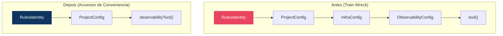
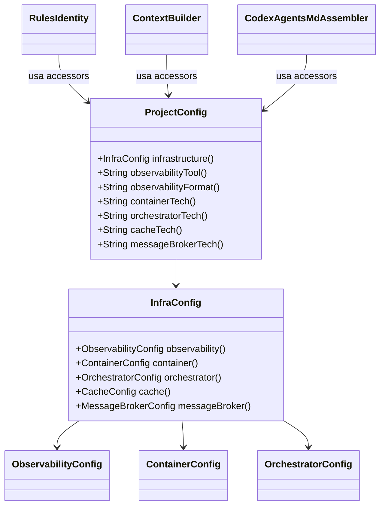

# Historia: Corrigir train wrecks com accessors de conveniencia

**ID:** story-0008-0012

## 1. Dependencias

| Blocked By | Blocks |
| :--- | :--- |
| — | — |

## 2. Regras Transversais Aplicaveis

| ID | Titulo |
| :--- | :--- |
| RULE-002 | Comportamento externo inalterado |
| RULE-003 | Commits atomicos |

## 3. Descricao

Como **Tech Lead**, eu quero adicionar metodos accessors de conveniencia em `ProjectConfig` ou em records intermediarios para eliminar cadeias de acesso com 3 ou mais niveis de profundidade (train wrecks), garantindo que o codigo cliente nao viole a Lei de Demeter e que futuras mudancas na estrutura interna de `ProjectConfig` nao propaguem para dezenas de chamadores.

O audit M-006 identificou cadeias de acesso com 3 niveis de profundidade como `config.infrastructure().observability().tool()`, `config.infrastructure().container().technology()`, e `config.infrastructure().orchestrator().technology()`. Essas cadeias criam acoplamento forte entre o chamador e a estrutura interna do grafo de objetos, tornando qualquer reestruturacao de `InfraConfig`, `ObservabilityConfig`, `ContainerConfig` ou `OrchestratorConfig` impossivel sem alterar todos os chamadores.

A solucao e adicionar metodos de conveniencia como `config.observabilityTool()`, `config.containerTech()`, `config.orchestratorTech()` diretamente em `ProjectConfig` ou na record intermediaria `InfraConfig`. Os arquivos afetados sao: `RulesIdentity.java` (linhas 129-165), `ContextBuilder.java` (linhas 104-117) e `CodexAgentsMdAssembler.java` (linhas 281-282). Apos a refatoracao, nenhum codigo fora de `ProjectConfig`/`InfraConfig` deve acessar mais de 2 niveis de profundidade.

### 3.1 Accessors de Conveniencia a Criar

| Metodo | Expressao Substituida | Local |
| :--- | :--- | :--- |
| `observabilityTool()` | `infrastructure().observability().tool()` | ProjectConfig ou InfraConfig |
| `observabilityFormat()` | `infrastructure().observability().format()` | ProjectConfig ou InfraConfig |
| `containerTech()` | `infrastructure().container().technology()` | ProjectConfig ou InfraConfig |
| `orchestratorTech()` | `infrastructure().orchestrator().technology()` | ProjectConfig ou InfraConfig |
| `cacheTech()` | `infrastructure().cache().technology()` | ProjectConfig ou InfraConfig |
| `messageBrokerTech()` | `infrastructure().messageBroker().technology()` | ProjectConfig ou InfraConfig |

### 3.2 Arquivos Afetados

- `ProjectConfig.java` ou `InfraConfig.java` — novos metodos de conveniencia
- `RulesIdentity.java` — linhas 129-165 (multiplos train wrecks)
- `ContextBuilder.java` — linhas 104-117 (multiplos train wrecks)
- `CodexAgentsMdAssembler.java` — linhas 281-282 (train wrecks pontuais)

## 4. Definicoes de Qualidade Locais

### DoR Local (Definition of Ready)

- [ ] Todas as ocorrencias de cadeias com 3+ niveis mapeadas com numeros de linha
- [ ] Estrutura de `ProjectConfig` e records filhas analisada
- [ ] Decisao tomada sobre onde colocar os accessors (ProjectConfig vs InfraConfig)
- [ ] Golden files executam com sucesso antes da mudanca

### DoD Local (Definition of Done)

- [ ] Metodos de conveniencia criados em `ProjectConfig` ou `InfraConfig`
- [ ] Todas as cadeias de 3+ niveis substituidas nos 3 arquivos afetados
- [ ] Busca por padroes de train wreck confirma zero ocorrencias residuais
- [ ] Testes unitarios para cada novo accessor de conveniencia
- [ ] Todos os testes existentes passando
- [ ] Golden files identicos byte-for-byte

### Global Definition of Done (DoD)

- **Cobertura:** >= 95% Line, >= 90% Branch
- **Testes Automatizados:** Todos os testes existentes passando + novos testes
- **Relatorio de Cobertura:** JaCoCo via `mvn verify`
- **Documentacao:** Javadoc atualizado quando assinaturas mudam
- **Performance:** Sem degradacao

## 5. Contratos de Dados (Data Contract)

**Antes (train wreck — 3 niveis):**

```java
String tool = config.infrastructure().observability().tool();
String container = config.infrastructure().container().technology();
String orchestrator = config.infrastructure().orchestrator().technology();
```

**Depois (accessor de conveniencia — 1 nivel):**

```java
String tool = config.observabilityTool();
String container = config.containerTech();
String orchestrator = config.orchestratorTech();
```

**Novos metodos em ProjectConfig (ou InfraConfig):**

```java
public String observabilityTool() {
    return infrastructure().observability().tool();
}

public String observabilityFormat() {
    return infrastructure().observability().format();
}

public String containerTech() {
    return infrastructure().container().technology();
}

public String orchestratorTech() {
    return infrastructure().orchestrator().technology();
}

public String cacheTech() {
    return infrastructure().cache().technology();
}

public String messageBrokerTech() {
    return infrastructure().messageBroker().technology();
}
```

## 6. Diagramas

### 6.1 Antes vs Depois — Nivel de Acoplamento



### 6.2 Classe ProjectConfig com Accessors



## 7. Criterios de Aceite (Gherkin)

```gherkin
Cenario: Accessor observabilityTool retorna valor correto
  DADO que um ProjectConfig possui infrastructure com observability.tool = "prometheus"
  QUANDO config.observabilityTool() e invocado
  ENTAO o retorno deve ser "prometheus"
  E o resultado deve ser identico a config.infrastructure().observability().tool()

Cenario: Accessor containerTech retorna valor para configuracao completa
  DADO que um ProjectConfig possui infrastructure com container.technology = "docker"
  QUANDO config.containerTech() e invocado
  ENTAO o retorno deve ser "docker"

Cenario: Accessor retorna null-safe quando infra nao esta configurada
  DADO que um ProjectConfig possui infrastructure com observability.tool = "none"
  QUANDO config.observabilityTool() e invocado
  ENTAO o retorno deve ser "none"
  E nenhuma excecao deve ser lancada

Cenario: RulesIdentity nao contem cadeias de acesso com 3+ niveis
  DADO que os accessors de conveniencia foram criados
  QUANDO o codigo de RulesIdentity.java e inspecionado
  ENTAO nenhuma linha deve conter padroes como ".infrastructure().observability()"
  E nenhuma linha deve conter padroes como ".infrastructure().container()"
  E todos os acessos devem usar metodos de conveniencia de 1 nivel

Cenario: ContextBuilder e CodexAgentsMdAssembler sem train wrecks
  DADO que os accessors de conveniencia foram criados
  QUANDO o codigo de ContextBuilder.java e CodexAgentsMdAssembler.java e inspecionado
  ENTAO zero cadeias de acesso com 3+ niveis devem existir
  E todos os acessos a dados de infraestrutura usam accessors de conveniencia

Cenario: Golden files permanecem identicos apos refactoring
  DADO que todos os train wrecks foram substituidos por accessors de conveniencia
  QUANDO o gerador completo e executado contra todos os profiles
  ENTAO cada arquivo gerado deve ser identico byte-for-byte ao golden file correspondente
```

### 7.1 Scenario Ordering (TPP)

> TPP: degenerate (accessor retorna valor simples) -> happy path (accessor com config completa) -> edge (null-safe) -> integridade (zero train wrecks em RulesIdentity) -> integridade (zero train wrecks em ContextBuilder/Codex) -> aceitacao (golden files).

### 7.2 Mandatory Scenario Categories

- [x] Degenerate cases (accessor retorna valor simples)
- [x] Happy path (accessor com configuracao completa)
- [x] Error paths (configuracao com valor "none")
- [x] Boundary values (zero train wrecks, golden files identicos)

## 8. Sub-tarefas

- [ ] [Dev] Adicionar metodos de conveniencia a `ProjectConfig` ou `InfraConfig` com Javadoc
- [ ] [Dev] Substituir train wrecks em `RulesIdentity.java` (linhas 129-165)
- [ ] [Dev] Substituir train wrecks em `ContextBuilder.java` (linhas 104-117)
- [ ] [Dev] Substituir train wrecks em `CodexAgentsMdAssembler.java` (linhas 281-282)
- [ ] [Test] Testes unitarios para cada accessor de conveniencia (happy path, edge cases)
- [ ] [Test] Verificar ausencia de cadeias 3+ niveis via busca no codigo
- [ ] [Test] Todos os testes existentes passando
- [ ] [Test] Golden files identicos byte-for-byte
