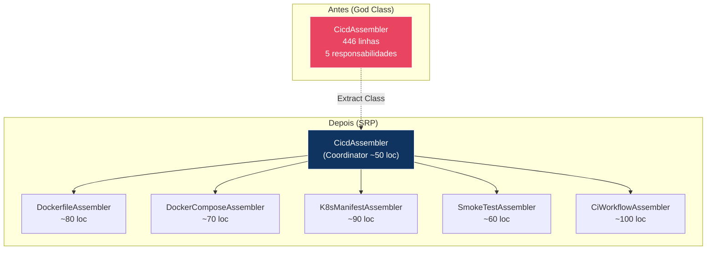
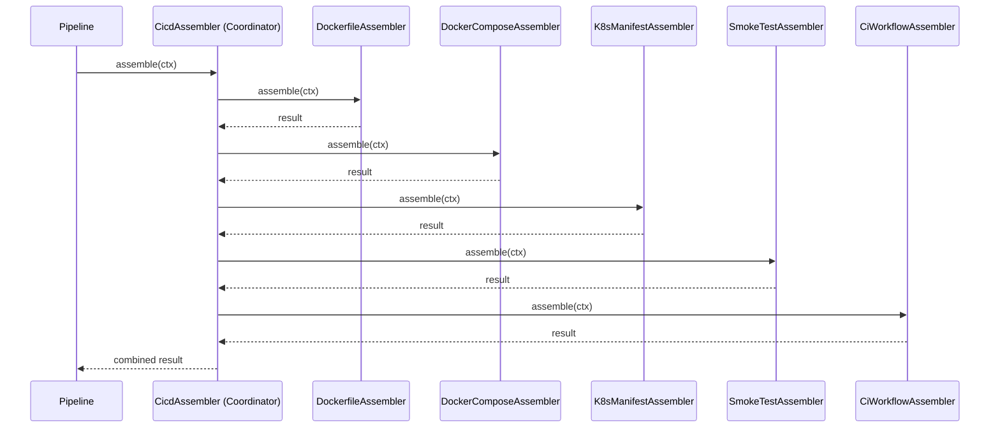

# Historia: Dividir CicdAssembler em classes por responsabilidade

**ID:** story-0008-0013

## 1. Dependencias

| Blocked By | Blocks |
| :--- | :--- |
| story-0008-0001, story-0008-0003, story-0008-0004 | story-0008-0023, story-0008-0025 |

## 2. Regras Transversais Aplicaveis

| ID | Titulo |
| :--- | :--- |
| RULE-001 | Cobertura obrigatoria |
| RULE-002 | Comportamento externo inalterado |
| RULE-003 | Commits atomicos |
| RULE-004 | Limites de tamanho |
| RULE-007 | DRY absoluto |
| RULE-010 | Golden files |

## 3. Descricao

Como **Tech Lead**, eu quero dividir a classe `CicdAssembler` (446 linhas, 5 responsabilidades distintas) em classes especializadas por responsabilidade, garantindo que cada classe resultante tenha no maximo 250 linhas e uma unica razao para mudar (SRP), reduzindo a complexidade cognitiva e facilitando manutencao futura.

O audit C-001 identificou `CicdAssembler` como uma god class com 446 linhas que acumula 5 responsabilidades distintas: geracao de Dockerfile, geracao de docker-compose.yml, geracao de manifests Kubernetes, geracao de smoke tests, e geracao de CI workflows (GitHub Actions). Cada responsabilidade possui logica condicional propria baseada no stack profile (container runtime, orchestrator, test framework), o que torna a classe dificil de testar isoladamente e propensa a efeitos colaterais quando uma responsabilidade e alterada.

A refatoracao extrai 5 classes especializadas: `DockerfileAssembler`, `DockerComposeAssembler`, `K8sManifestAssembler`, `SmokeTestAssembler` e `CiWorkflowAssembler`. O `CicdAssembler` original se torna um coordenador fino que delega para cada especialista. Adicionalmente, o audit L-007 identificou um `List` mutavel no record `GenerationContext` — este deve ser substituido por uma copia defensiva imutavel (`List.copyOf()`). Nenhuma mudanca de comportamento externo e introduzida.

### 3.1 Classes a Extrair

| Classe | Responsabilidade | Linhas Estimadas |
| :--- | :--- | :--- |
| `DockerfileAssembler` | Geracao de Dockerfile e .dockerignore | ~80 |
| `DockerComposeAssembler` | Geracao de docker-compose.yml | ~70 |
| `K8sManifestAssembler` | Geracao de deployment.yaml, service.yaml, configmap.yaml | ~90 |
| `SmokeTestAssembler` | Geracao de scripts de smoke test | ~60 |
| `CiWorkflowAssembler` | Geracao de .github/workflows/*.yml | ~100 |
| `CicdAssembler` (coordinator) | Delegacao para as 5 classes acima | ~50 |

### 3.2 Fix Adicional: GenerationContext Record Mutavel (L-007)

O record `GenerationContext` contem um campo `List` que esta sendo exposto sem copia defensiva. O fix consiste em aplicar `List.copyOf()` no compact constructor do record para garantir imutabilidade.

### 3.3 Dependencias de Stories Anteriores

- **story-0008-0001** (CopyHelpers): as novas classes usarao `CopyHelpers.writeFile()` em vez de copias locais
- **story-0008-0003** (JsonHelpers): as novas classes usarao `JsonHelpers.escapeJson()` se necessario
- **story-0008-0004** (buildContext unificado): as novas classes consumirao o `buildContext()` unificado

## 4. Definicoes de Qualidade Locais

### DoR Local (Definition of Ready)

- [ ] Stories story-0008-0001, story-0008-0003, story-0008-0004 concluidas
- [ ] `CicdAssembler.java` analisado com mapeamento de responsabilidades por linha
- [ ] Fronteiras de extracao definidas (quais metodos vao para qual classe)
- [ ] Record `GenerationContext` localizado e campo mutavel identificado
- [ ] Golden files executam com sucesso antes da mudanca

### DoD Local (Definition of Done)

- [ ] `DockerfileAssembler` extraido e <= 250 linhas
- [ ] `DockerComposeAssembler` extraido e <= 250 linhas
- [ ] `K8sManifestAssembler` extraido e <= 250 linhas
- [ ] `SmokeTestAssembler` extraido e <= 250 linhas
- [ ] `CiWorkflowAssembler` extraido e <= 250 linhas
- [ ] `CicdAssembler` reduzido a coordenador <= 250 linhas
- [ ] `GenerationContext` record com `List.copyOf()` no compact constructor
- [ ] Testes unitarios para cada nova classe
- [ ] Todos os testes existentes passando
- [ ] Golden files atualizados e identicos byte-for-byte

### Global Definition of Done (DoD)

- **Cobertura:** >= 95% Line, >= 90% Branch
- **Testes Automatizados:** Todos os testes existentes passando + novos testes
- **Relatorio de Cobertura:** JaCoCo via `mvn verify`
- **Documentacao:** Javadoc atualizado quando assinaturas mudam
- **Performance:** Sem degradacao

## 5. Contratos de Dados (Data Contract)

**CicdAssembler (antes — 446 linhas, 5 responsabilidades):**

```java
public class CicdAssembler {
    // ~80 linhas — Dockerfile
    public void assembleDockerfile(GenerationContext ctx) { ... }

    // ~70 linhas — Docker Compose
    public void assembleDockerCompose(GenerationContext ctx) { ... }

    // ~90 linhas — K8s Manifests
    public void assembleK8sManifests(GenerationContext ctx) { ... }

    // ~60 linhas — Smoke Tests
    public void assembleSmokeTests(GenerationContext ctx) { ... }

    // ~100 linhas — CI Workflows
    public void assembleCiWorkflows(GenerationContext ctx) { ... }
}
```

**CicdAssembler (depois — coordenador ~50 linhas):**

```java
public class CicdAssembler {
    private final DockerfileAssembler dockerfileAssembler;
    private final DockerComposeAssembler dockerComposeAssembler;
    private final K8sManifestAssembler k8sManifestAssembler;
    private final SmokeTestAssembler smokeTestAssembler;
    private final CiWorkflowAssembler ciWorkflowAssembler;

    public AssembleResult assemble(GenerationContext ctx) {
        dockerfileAssembler.assemble(ctx);
        dockerComposeAssembler.assemble(ctx);
        k8sManifestAssembler.assemble(ctx);
        smokeTestAssembler.assemble(ctx);
        ciWorkflowAssembler.assemble(ctx);
        // ...
    }
}
```

**GenerationContext fix (L-007):**

```java
// Antes
public record GenerationContext(List<String> enabledFeatures, ...) {}

// Depois
public record GenerationContext(List<String> enabledFeatures, ...) {
    public GenerationContext {
        enabledFeatures = List.copyOf(enabledFeatures);
    }
}
```

## 6. Diagramas

### 6.1 Decomposicao de Responsabilidades



### 6.2 Sequencia de Delegacao



## 7. Criterios de Aceite (Gherkin)

```gherkin
Cenario: DockerfileAssembler gera Dockerfile identico ao original
  DADO que DockerfileAssembler foi extraido do CicdAssembler
  QUANDO assemble() e invocado com um GenerationContext de profile java-spring
  ENTAO o Dockerfile gerado deve ser identico ao gerado pela versao anterior
  E a classe DockerfileAssembler deve ter <= 250 linhas

Cenario: CicdAssembler coordenador delega para todas as 5 classes
  DADO que CicdAssembler foi refatorado como coordenador
  QUANDO assemble() e invocado com um GenerationContext valido
  ENTAO DockerfileAssembler.assemble() deve ser invocado
  E DockerComposeAssembler.assemble() deve ser invocado
  E K8sManifestAssembler.assemble() deve ser invocado
  E SmokeTestAssembler.assemble() deve ser invocado
  E CiWorkflowAssembler.assemble() deve ser invocado

Cenario: GenerationContext com lista mutavel e protegido por copia defensiva
  DADO que uma lista mutavel e passada ao construtor de GenerationContext
  QUANDO a lista original e modificada apos a construcao
  ENTAO GenerationContext.enabledFeatures() deve retornar a lista original inalterada
  E uma UnsupportedOperationException deve ser lancada ao tentar modificar a lista interna

Cenario: Nenhuma classe extraida excede 250 linhas
  DADO que as 5 classes foram extraidas
  QUANDO a contagem de linhas de cada classe e verificada
  ENTAO DockerfileAssembler deve ter <= 250 linhas
  E DockerComposeAssembler deve ter <= 250 linhas
  E K8sManifestAssembler deve ter <= 250 linhas
  E SmokeTestAssembler deve ter <= 250 linhas
  E CiWorkflowAssembler deve ter <= 250 linhas
  E CicdAssembler (coordenador) deve ter <= 250 linhas

Cenario: Golden files permanecem identicos apos a decomposicao
  DADO que CicdAssembler foi decomposto em 5 classes + coordenador
  QUANDO o gerador completo e executado contra todos os profiles
  ENTAO cada arquivo gerado deve ser identico byte-for-byte ao golden file correspondente

Cenario: Profile sem container ou orchestrator nao gera artefatos desnecessarios
  DADO que o profile configurado possui container = "none" e orchestrator = "none"
  QUANDO CicdAssembler coordenador e executado
  ENTAO DockerfileAssembler nao deve gerar Dockerfile
  E K8sManifestAssembler nao deve gerar manifests
  E os demais assemblers devem executar normalmente
```

### 7.1 Scenario Ordering (TPP)

> TPP: degenerate (classe extraida gera output identico) -> happy path (coordenador delega para 5 classes) -> erro (lista mutavel protegida) -> restricao (250 linhas) -> aceitacao (golden files) -> edge (profile sem container).

### 7.2 Mandatory Scenario Categories

- [x] Degenerate cases (classe extraida gera output identico)
- [x] Happy path (coordenador delega corretamente)
- [x] Error paths (lista mutavel, copia defensiva)
- [x] Boundary values (250 linhas, profile sem container)

## 8. Sub-tarefas

- [ ] [Dev] Extrair `DockerfileAssembler` do `CicdAssembler`
- [ ] [Dev] Extrair `DockerComposeAssembler` do `CicdAssembler`
- [ ] [Dev] Extrair `K8sManifestAssembler` do `CicdAssembler`
- [ ] [Dev] Extrair `SmokeTestAssembler` do `CicdAssembler`
- [ ] [Dev] Extrair `CiWorkflowAssembler` do `CicdAssembler`
- [ ] [Dev] Refatorar `CicdAssembler` como coordenador que delega para as 5 classes
- [ ] [Dev] Corrigir `GenerationContext` record com `List.copyOf()` no compact constructor (L-007)
- [ ] [Test] Testes unitarios para `DockerfileAssembler` (happy path, profile sem container)
- [ ] [Test] Testes unitarios para `DockerComposeAssembler`
- [ ] [Test] Testes unitarios para `K8sManifestAssembler` (happy path, profile sem orchestrator)
- [ ] [Test] Testes unitarios para `SmokeTestAssembler`
- [ ] [Test] Testes unitarios para `CiWorkflowAssembler`
- [ ] [Test] Teste de imutabilidade do `GenerationContext` record
- [ ] [Test] Todos os testes existentes passando
- [ ] [Test] Golden files atualizados e identicos byte-for-byte
