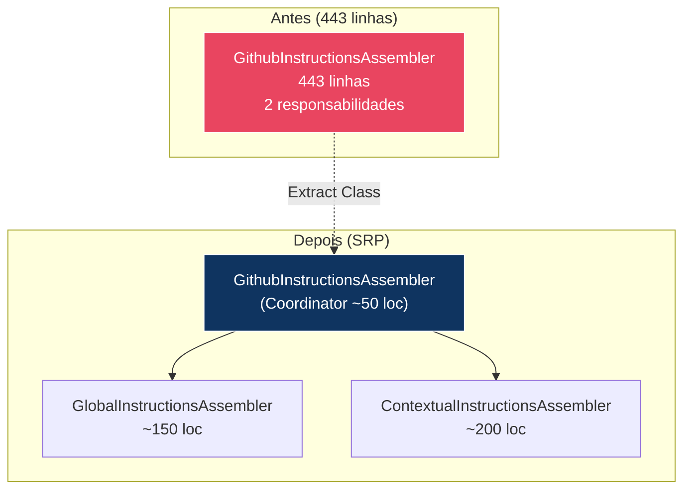
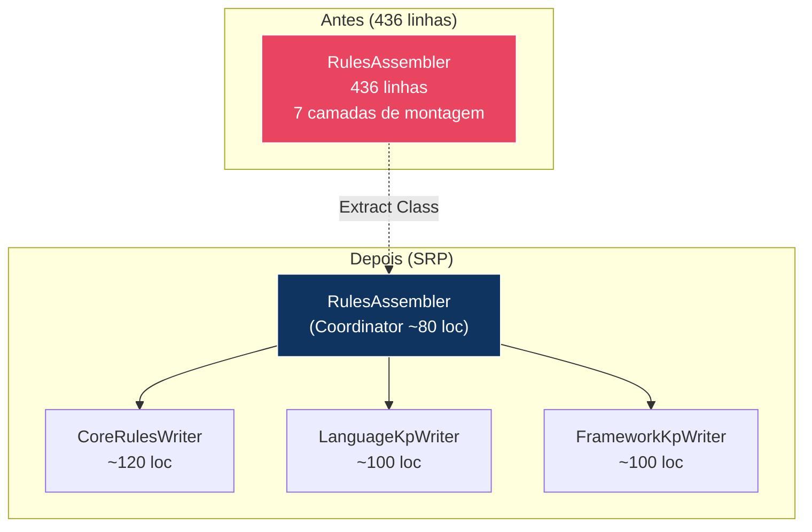
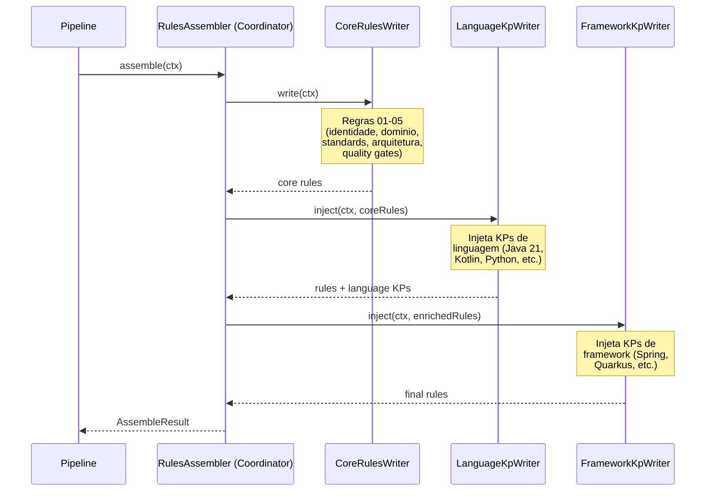

# Historia: Dividir GithubInstructionsAssembler e RulesAssembler

**ID:** story-0008-0014

## 1. Dependencias

| Blocked By | Blocks |
| :--- | :--- |
| story-0008-0001, story-0008-0004 | story-0008-0023, story-0008-0025 |

## 2. Regras Transversais Aplicaveis

| ID | Titulo |
| :--- | :--- |
| RULE-001 | Cobertura obrigatoria |
| RULE-002 | Comportamento externo inalterado |
| RULE-003 | Commits atomicos |
| RULE-004 | Limites de tamanho |
| RULE-007 | DRY absoluto |
| RULE-010 | Golden files |

## 3. Descricao

Como **Tech Lead**, eu quero dividir as classes `GithubInstructionsAssembler` (443 linhas) e `RulesAssembler` (436 linhas) em classes menores e focadas, garantindo que cada classe resultante tenha no maximo 250 linhas e uma unica responsabilidade, reduzindo a complexidade cognitiva e permitindo testes mais granulares.

O audit C-001 identificou ambas as classes como excedendo o limite de 250 linhas. `GithubInstructionsAssembler` mistura duas responsabilidades distintas: geracao de `copilot-instructions.md` (instrucoes globais) e geracao de arquivos `instructions/*.instructions.md` (instrucoes contextuais). A divisao natural e em `GlobalInstructionsAssembler` e `ContextualInstructionsAssembler`, com o `GithubInstructionsAssembler` original servindo como coordenador.

`RulesAssembler` acumula 7 camadas de montagem de regras: regras core (identidade, dominio, standards, arquitetura, quality gates), injecao de knowledge packs de linguagem, injecao de knowledge packs de framework, regras condicionais (database, messaging, etc.), numeracao sequencial, e gravacao dos arquivos finais. A divisao extrai helpers especializados: `CoreRulesWriter` (regras 01-05), `LanguageKpWriter` (knowledge packs de linguagem), `FrameworkKpWriter` (knowledge packs de framework), e eventualmente `ConditionalRulesWriter` se necessario para manter cada classe <= 250 linhas.

### 3.1 GithubInstructionsAssembler — Divisao Planejada

| Classe | Responsabilidade | Linhas Estimadas |
| :--- | :--- | :--- |
| `GlobalInstructionsAssembler` | Gera `copilot-instructions.md` | ~150 |
| `ContextualInstructionsAssembler` | Gera `instructions/*.instructions.md` | ~200 |
| `GithubInstructionsAssembler` (coordinator) | Delega para as 2 classes acima | ~50 |

### 3.2 RulesAssembler — Divisao Planejada

| Classe | Responsabilidade | Linhas Estimadas |
| :--- | :--- | :--- |
| `CoreRulesWriter` | Monta regras 01-05 (identidade, dominio, standards, arquitetura, quality) | ~120 |
| `LanguageKpWriter` | Injeta knowledge packs de linguagem nas regras | ~100 |
| `FrameworkKpWriter` | Injeta knowledge packs de framework nas regras | ~100 |
| `RulesAssembler` (coordinator) | Orquestra a montagem sequencial e grava arquivos | ~80 |

### 3.3 Dependencias de Stories Anteriores

- **story-0008-0001** (CopyHelpers): as novas classes usarao `CopyHelpers.writeFile()` em vez de copias locais
- **story-0008-0004** (buildContext unificado): as novas classes consumirao o `buildContext()` unificado

## 4. Definicoes de Qualidade Locais

### DoR Local (Definition of Ready)

- [ ] Stories story-0008-0001 e story-0008-0004 concluidas
- [ ] `GithubInstructionsAssembler.java` analisado com mapeamento de responsabilidades
- [ ] `RulesAssembler.java` analisado com identificacao das 7 camadas de montagem
- [ ] Fronteiras de extracao definidas (quais metodos vao para qual classe)
- [ ] Golden files executam com sucesso antes da mudanca

### DoD Local (Definition of Done)

- [ ] `GlobalInstructionsAssembler` extraido e <= 250 linhas
- [ ] `ContextualInstructionsAssembler` extraido e <= 250 linhas
- [ ] `GithubInstructionsAssembler` reduzido a coordenador <= 250 linhas
- [ ] `CoreRulesWriter` extraido e <= 250 linhas
- [ ] `LanguageKpWriter` extraido e <= 250 linhas
- [ ] `FrameworkKpWriter` extraido e <= 250 linhas
- [ ] `RulesAssembler` reduzido a coordenador <= 250 linhas
- [ ] Testes unitarios para cada nova classe
- [ ] Todos os testes existentes passando
- [ ] Golden files atualizados e identicos byte-for-byte

### Global Definition of Done (DoD)

- **Cobertura:** >= 95% Line, >= 90% Branch
- **Testes Automatizados:** Todos os testes existentes passando + novos testes
- **Relatorio de Cobertura:** JaCoCo via `mvn verify`
- **Documentacao:** Javadoc atualizado quando assinaturas mudam
- **Performance:** Sem degradacao

## 5. Contratos de Dados (Data Contract)

**GithubInstructionsAssembler (antes — 443 linhas):**

```java
public class GithubInstructionsAssembler {
    // ~200 linhas — instrucoes globais
    private void assembleGlobalInstructions(GenerationContext ctx) { ... }

    // ~200 linhas — instrucoes contextuais
    private void assembleContextualInstructions(GenerationContext ctx) { ... }
}
```

**GithubInstructionsAssembler (depois — coordenador ~50 linhas):**

```java
public class GithubInstructionsAssembler {
    private final GlobalInstructionsAssembler globalAssembler;
    private final ContextualInstructionsAssembler contextualAssembler;

    public AssembleResult assemble(GenerationContext ctx) {
        globalAssembler.assemble(ctx);
        contextualAssembler.assemble(ctx);
        // ...
    }
}
```

**RulesAssembler (antes — 436 linhas):**

```java
public class RulesAssembler {
    // ~120 linhas — regras core 01-05
    private void writeCoreRules(...) { ... }

    // ~100 linhas — KP de linguagem
    private void injectLanguageKp(...) { ... }

    // ~100 linhas — KP de framework
    private void injectFrameworkKp(...) { ... }

    // ~80 linhas — orquestracao e gravacao
    public AssembleResult assemble(...) { ... }
}
```

**RulesAssembler (depois — coordenador ~80 linhas):**

```java
public class RulesAssembler {
    private final CoreRulesWriter coreWriter;
    private final LanguageKpWriter languageWriter;
    private final FrameworkKpWriter frameworkWriter;

    public AssembleResult assemble(GenerationContext ctx) {
        coreWriter.write(ctx);
        languageWriter.inject(ctx);
        frameworkWriter.inject(ctx);
        // ...
    }
}
```

## 6. Diagramas

### 6.1 Decomposicao do GithubInstructionsAssembler



### 6.2 Decomposicao do RulesAssembler



### 6.3 Sequencia de Montagem de Regras



## 7. Criterios de Aceite (Gherkin)

```gherkin
Cenario: GlobalInstructionsAssembler gera copilot-instructions.md identico
  DADO que GlobalInstructionsAssembler foi extraido do GithubInstructionsAssembler
  QUANDO assemble() e invocado com um GenerationContext de profile java-spring
  ENTAO o copilot-instructions.md gerado deve ser identico ao gerado pela versao anterior
  E a classe deve ter <= 250 linhas

Cenario: ContextualInstructionsAssembler gera todos os instructions/*.instructions.md
  DADO que ContextualInstructionsAssembler foi extraido do GithubInstructionsAssembler
  QUANDO assemble() e invocado com um GenerationContext de profile java-spring
  ENTAO todos os arquivos instructions/*.instructions.md devem ser gerados
  E cada arquivo deve ser identico ao gerado pela versao anterior

Cenario: CoreRulesWriter gera regras 01-05 corretamente
  DADO que CoreRulesWriter foi extraido do RulesAssembler
  QUANDO write() e invocado com um GenerationContext valido
  ENTAO os arquivos rules/01-project-identity.md ate rules/05-quality-gates.md devem ser gerados
  E o conteudo deve conter os placeholders resolvidos corretamente

Cenario: RulesAssembler coordenador monta regras na ordem correta
  DADO que RulesAssembler foi refatorado como coordenador
  QUANDO assemble() e invocado com um GenerationContext valido
  ENTAO CoreRulesWriter.write() deve ser invocado primeiro
  E LanguageKpWriter.inject() deve ser invocado em seguida
  E FrameworkKpWriter.inject() deve ser invocado por ultimo

Cenario: Nenhuma classe resultante excede 250 linhas
  DADO que ambos os assemblers foram decompostos
  QUANDO a contagem de linhas de cada classe e verificada
  ENTAO GlobalInstructionsAssembler deve ter <= 250 linhas
  E ContextualInstructionsAssembler deve ter <= 250 linhas
  E CoreRulesWriter deve ter <= 250 linhas
  E LanguageKpWriter deve ter <= 250 linhas
  E FrameworkKpWriter deve ter <= 250 linhas

Cenario: Golden files permanecem identicos apos a decomposicao
  DADO que ambos os assemblers foram decompostos em classes menores
  QUANDO o gerador completo e executado contra todos os profiles
  ENTAO cada arquivo gerado deve ser identico byte-for-byte ao golden file correspondente
```

### 7.1 Scenario Ordering (TPP)

> TPP: degenerate (classe extraida gera output identico — global instructions) -> happy path (contextual instructions) -> happy path (core rules) -> orquestracao (ordem de montagem) -> restricao (250 linhas) -> aceitacao (golden files).

### 7.2 Mandatory Scenario Categories

- [x] Degenerate cases (classe extraida gera output identico)
- [x] Happy path (montagem de regras na ordem correta)
- [x] Error paths (validacao de orquestracao sequencial)
- [x] Boundary values (250 linhas, golden files identicos)

## 8. Sub-tarefas

- [ ] [Dev] Extrair `GlobalInstructionsAssembler` do `GithubInstructionsAssembler`
- [ ] [Dev] Extrair `ContextualInstructionsAssembler` do `GithubInstructionsAssembler`
- [ ] [Dev] Refatorar `GithubInstructionsAssembler` como coordenador
- [ ] [Dev] Extrair `CoreRulesWriter` do `RulesAssembler`
- [ ] [Dev] Extrair `LanguageKpWriter` do `RulesAssembler`
- [ ] [Dev] Extrair `FrameworkKpWriter` do `RulesAssembler`
- [ ] [Dev] Refatorar `RulesAssembler` como coordenador
- [ ] [Test] Testes unitarios para `GlobalInstructionsAssembler`
- [ ] [Test] Testes unitarios para `ContextualInstructionsAssembler`
- [ ] [Test] Testes unitarios para `CoreRulesWriter`
- [ ] [Test] Testes unitarios para `LanguageKpWriter`
- [ ] [Test] Testes unitarios para `FrameworkKpWriter`
- [ ] [Test] Todos os testes existentes passando
- [ ] [Test] Golden files atualizados e identicos byte-for-byte
