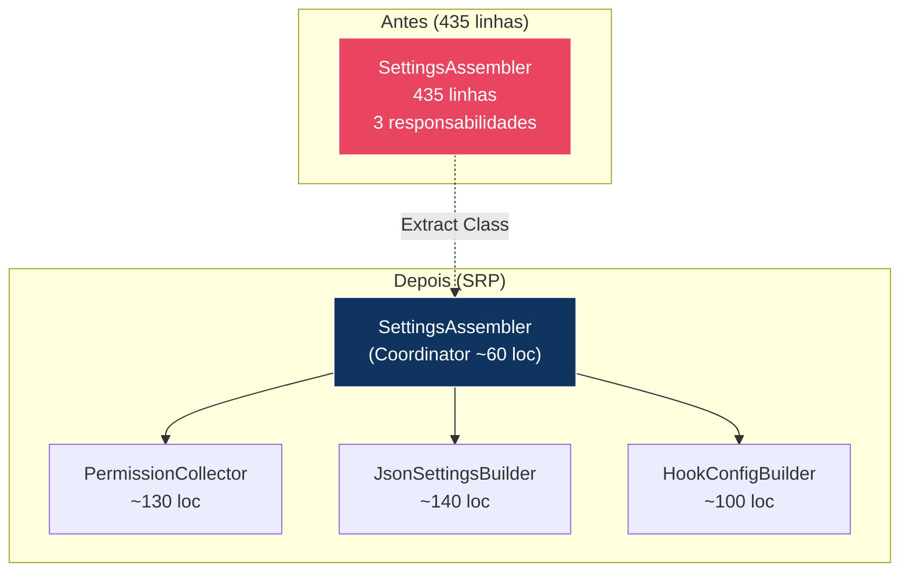
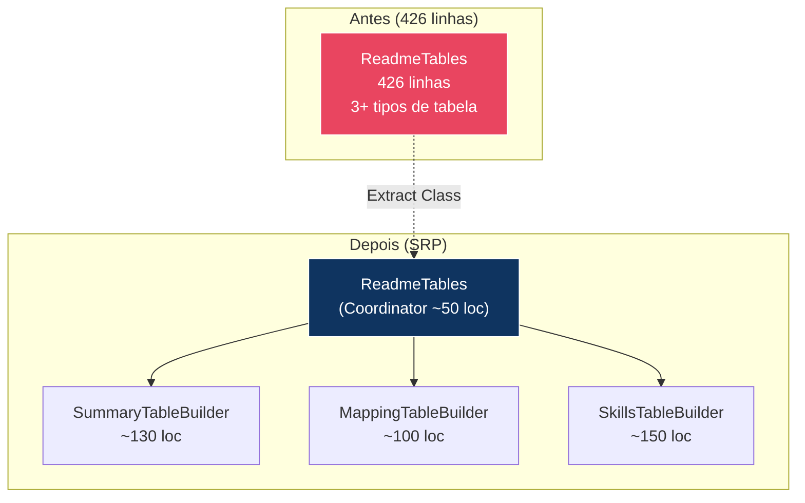
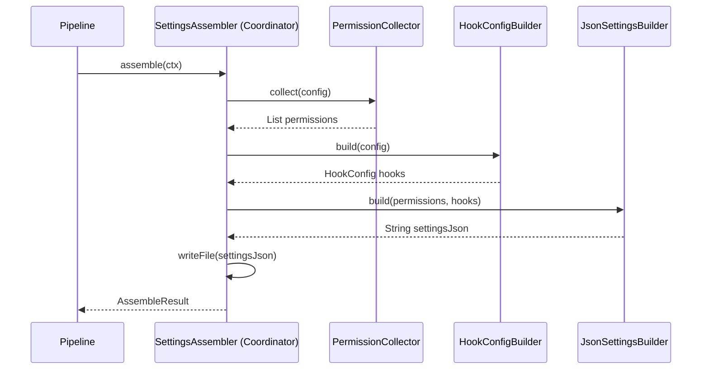

# Historia: Dividir SettingsAssembler e ReadmeTables

**ID:** story-0008-0015

## 1. Dependencias

| Blocked By | Blocks |
| :--- | :--- |
| story-0008-0001, story-0008-0003 | story-0008-0023, story-0008-0025 |

## 2. Regras Transversais Aplicaveis

| ID | Titulo |
| :--- | :--- |
| RULE-001 | Cobertura obrigatoria |
| RULE-002 | Comportamento externo inalterado |
| RULE-003 | Commits atomicos |
| RULE-004 | Limites de tamanho |
| RULE-007 | DRY absoluto |
| RULE-010 | Golden files |

## 3. Descricao

Como **Tech Lead**, eu quero dividir as classes `SettingsAssembler` (435 linhas) e `ReadmeTables` (426 linhas) em classes menores e focadas, garantindo que cada classe resultante tenha no maximo 250 linhas e uma unica responsabilidade, melhorando a testabilidade e a manutenibilidade do codigo.

O audit C-001 identificou ambas as classes como excedendo o limite de 250 linhas. `SettingsAssembler` acumula 3 responsabilidades: coleta de permissoes permitidas por perfil (`PermissionCollector`), construcao do JSON de settings (`JsonSettingsBuilder`), e configuracao de hooks (`HookConfigBuilder`). Cada responsabilidade possui logica condicional propria e merece isolamento para testes focados.

`ReadmeTables` acumula a geracao de multiplas tabelas Markdown para o README: tabela de sumario do projeto, tabela de mapeamento `.claude/` vs `.github/`, tabela de skills disponiveis, tabela de knowledge packs, tabela de agentes, tabela de regras, e tabela de generation summary. A divisao extrai builders especializados: `SummaryTableBuilder` (tabela de sumario e identity), `MappingTableBuilder` (tabela de mapeamento entre plataformas), e `SkillsTableBuilder` (tabela de skills, KPs e agentes). Cada builder encapsula a logica de formatacao da sua tabela especifica.

### 3.1 SettingsAssembler — Divisao Planejada

| Classe | Responsabilidade | Linhas Estimadas |
| :--- | :--- | :--- |
| `PermissionCollector` | Coleta permissoes CLI por profile (bash, node, python, etc.) | ~130 |
| `JsonSettingsBuilder` | Monta a estrutura JSON de settings.json | ~140 |
| `HookConfigBuilder` | Configura hooks (post-compile, pre-commit, etc.) | ~100 |
| `SettingsAssembler` (coordinator) | Orquestra coleta, construcao e gravacao | ~60 |

### 3.2 ReadmeTables — Divisao Planejada

| Classe | Responsabilidade | Linhas Estimadas |
| :--- | :--- | :--- |
| `SummaryTableBuilder` | Tabela de sumario, identity e generation summary | ~130 |
| `MappingTableBuilder` | Tabela de mapeamento .claude/ vs .github/ | ~100 |
| `SkillsTableBuilder` | Tabelas de skills, knowledge packs, agentes e regras | ~150 |
| `ReadmeTables` (coordinator) | Compoe todas as tabelas na ordem correta | ~50 |

### 3.3 Dependencias de Stories Anteriores

- **story-0008-0001** (CopyHelpers): as novas classes usarao `CopyHelpers.writeFile()` em vez de copias locais
- **story-0008-0003** (JsonHelpers): `JsonSettingsBuilder` usara `JsonHelpers.escapeJson()` para seguranca na geracao JSON

## 4. Definicoes de Qualidade Locais

### DoR Local (Definition of Ready)

- [ ] Stories story-0008-0001 e story-0008-0003 concluidas
- [ ] `SettingsAssembler.java` analisado com mapeamento de responsabilidades por linha
- [ ] `ReadmeTables.java` analisado com identificacao de cada tabela gerada
- [ ] Fronteiras de extracao definidas (quais metodos vao para qual classe)
- [ ] Golden files executam com sucesso antes da mudanca

### DoD Local (Definition of Done)

- [ ] `PermissionCollector` extraido e <= 250 linhas
- [ ] `JsonSettingsBuilder` extraido e <= 250 linhas
- [ ] `HookConfigBuilder` extraido e <= 250 linhas
- [ ] `SettingsAssembler` reduzido a coordenador <= 250 linhas
- [ ] `SummaryTableBuilder` extraido e <= 250 linhas
- [ ] `MappingTableBuilder` extraido e <= 250 linhas
- [ ] `SkillsTableBuilder` extraido e <= 250 linhas
- [ ] `ReadmeTables` reduzido a coordenador <= 250 linhas
- [ ] Testes unitarios para cada nova classe
- [ ] Todos os testes existentes passando
- [ ] Golden files atualizados e identicos byte-for-byte

### Global Definition of Done (DoD)

- **Cobertura:** >= 95% Line, >= 90% Branch
- **Testes Automatizados:** Todos os testes existentes passando + novos testes
- **Relatorio de Cobertura:** JaCoCo via `mvn verify`
- **Documentacao:** Javadoc atualizado quando assinaturas mudam
- **Performance:** Sem degradacao

## 5. Contratos de Dados (Data Contract)

**SettingsAssembler (antes — 435 linhas):**

```java
public class SettingsAssembler {
    // ~130 linhas — coleta de permissoes
    private List<String> collectPermissions(ProjectConfig config) { ... }

    // ~140 linhas — construcao JSON
    private String buildSettingsJson(List<String> permissions, ...) { ... }

    // ~100 linhas — configuracao de hooks
    private String buildHooksConfig(ProjectConfig config) { ... }

    // ~60 linhas — orquestracao
    public AssembleResult assemble(GenerationContext ctx) { ... }
}
```

**SettingsAssembler (depois — coordenador ~60 linhas):**

```java
public class SettingsAssembler {
    private final PermissionCollector permissionCollector;
    private final JsonSettingsBuilder jsonSettingsBuilder;
    private final HookConfigBuilder hookConfigBuilder;

    public AssembleResult assemble(GenerationContext ctx) {
        var permissions = permissionCollector.collect(ctx.config());
        var hooks = hookConfigBuilder.build(ctx.config());
        var json = jsonSettingsBuilder.build(permissions, hooks);
        // gravar arquivo
    }
}
```

**ReadmeTables (antes — 426 linhas):**

```java
public class ReadmeTables {
    // ~130 linhas — sumario e identity
    private String buildSummaryTable(...) { ... }

    // ~100 linhas — mapeamento .claude/ vs .github/
    private String buildMappingTable(...) { ... }

    // ~150 linhas — skills, KPs, agentes
    private String buildSkillsTables(...) { ... }
}
```

**ReadmeTables (depois — coordenador ~50 linhas):**

```java
public class ReadmeTables {
    private final SummaryTableBuilder summaryBuilder;
    private final MappingTableBuilder mappingBuilder;
    private final SkillsTableBuilder skillsBuilder;

    public String buildAllTables(GenerationContext ctx) {
        return summaryBuilder.build(ctx)
            + mappingBuilder.build(ctx)
            + skillsBuilder.build(ctx);
    }
}
```

## 6. Diagramas

### 6.1 Decomposicao do SettingsAssembler



### 6.2 Decomposicao do ReadmeTables



### 6.3 Fluxo de Geracao de Settings



## 7. Criterios de Aceite (Gherkin)

```gherkin
Cenario: PermissionCollector coleta permissoes corretas para profile java-spring
  DADO que PermissionCollector foi extraido do SettingsAssembler
  QUANDO collect() e invocado com um ProjectConfig de profile java-spring
  ENTAO a lista de permissoes deve conter "Bash(mvn *)"
  E a lista deve conter permissoes de ferramentas Java (javac, java, etc.)
  E a lista nao deve conter permissoes de outras linguagens (npm, pip, etc.)

Cenario: JsonSettingsBuilder gera JSON valido e identico ao original
  DADO que JsonSettingsBuilder foi extraido do SettingsAssembler
  QUANDO build() e invocado com permissoes e hooks validos
  ENTAO o JSON gerado deve ser sintaticamente valido
  E deve ser identico ao gerado pela versao anterior do SettingsAssembler

Cenario: SummaryTableBuilder gera tabela Markdown com formato correto
  DADO que SummaryTableBuilder foi extraido do ReadmeTables
  QUANDO build() e invocado com um GenerationContext valido
  ENTAO o output deve conter headers de tabela Markdown com "|"
  E deve conter o nome do projeto, linguagem e framework

Cenario: SkillsTableBuilder gera tabela vazia para projeto sem skills customizadas
  DADO que SkillsTableBuilder foi extraido do ReadmeTables
  QUANDO build() e invocado com um GenerationContext sem skills adicionais
  ENTAO a tabela deve conter apenas as skills core do ia-dev-env
  E nao deve conter linhas extras ou placeholders nao resolvidos

Cenario: Nenhuma classe resultante excede 250 linhas
  DADO que ambas as classes foram decompostas
  QUANDO a contagem de linhas de cada classe e verificada
  ENTAO PermissionCollector deve ter <= 250 linhas
  E JsonSettingsBuilder deve ter <= 250 linhas
  E HookConfigBuilder deve ter <= 250 linhas
  E SummaryTableBuilder deve ter <= 250 linhas
  E MappingTableBuilder deve ter <= 250 linhas
  E SkillsTableBuilder deve ter <= 250 linhas

Cenario: Golden files permanecem identicos apos a decomposicao
  DADO que SettingsAssembler e ReadmeTables foram decompostos
  QUANDO o gerador completo e executado contra todos os profiles
  ENTAO cada arquivo gerado deve ser identico byte-for-byte ao golden file correspondente

Cenario: HookConfigBuilder gera configuracao vazia quando hooks desabilitados
  DADO que o ProjectConfig nao possui hooks habilitados
  QUANDO HookConfigBuilder.build() e invocado
  ENTAO o resultado deve conter um objeto hooks vazio ou ausente
  E nenhuma excecao deve ser lancada
```

### 7.1 Scenario Ordering (TPP)

> TPP: degenerate (PermissionCollector retorna lista) -> happy path (JsonSettingsBuilder gera JSON valido) -> happy path (SummaryTableBuilder) -> edge (skills vazia) -> restricao (250 linhas) -> aceitacao (golden files) -> edge (hooks desabilitados).

### 7.2 Mandatory Scenario Categories

- [x] Degenerate cases (permissoes coletadas corretamente)
- [x] Happy path (JSON e tabelas gerados identicos ao original)
- [x] Error paths (projeto sem skills, hooks desabilitados)
- [x] Boundary values (250 linhas, golden files identicos)

## 8. Sub-tarefas

- [ ] [Dev] Extrair `PermissionCollector` do `SettingsAssembler`
- [ ] [Dev] Extrair `JsonSettingsBuilder` do `SettingsAssembler`
- [ ] [Dev] Extrair `HookConfigBuilder` do `SettingsAssembler`
- [ ] [Dev] Refatorar `SettingsAssembler` como coordenador
- [ ] [Dev] Extrair `SummaryTableBuilder` do `ReadmeTables`
- [ ] [Dev] Extrair `MappingTableBuilder` do `ReadmeTables`
- [ ] [Dev] Extrair `SkillsTableBuilder` do `ReadmeTables`
- [ ] [Dev] Refatorar `ReadmeTables` como coordenador
- [ ] [Test] Testes unitarios para `PermissionCollector` (por profile)
- [ ] [Test] Testes unitarios para `JsonSettingsBuilder` (JSON valido, escaping)
- [ ] [Test] Testes unitarios para `HookConfigBuilder` (com e sem hooks)
- [ ] [Test] Testes unitarios para `SummaryTableBuilder`
- [ ] [Test] Testes unitarios para `MappingTableBuilder`
- [ ] [Test] Testes unitarios para `SkillsTableBuilder` (com e sem skills)
- [ ] [Test] Todos os testes existentes passando
- [ ] [Test] Golden files atualizados e identicos byte-for-byte
