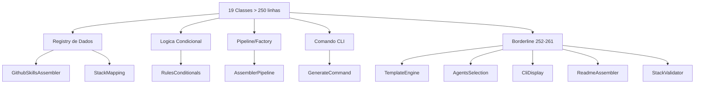
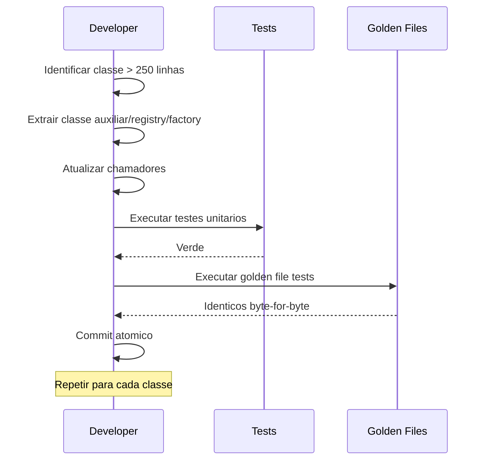

# Historia: Dividir demais assemblers acima de 250 linhas

**ID:** story-0008-0016

## 1. Dependencias

| Blocked By | Blocks |
| :--- | :--- |
| story-0008-0001, story-0008-0004 | story-0008-0023, story-0008-0025 |

## 2. Regras Transversais Aplicaveis

| ID | Titulo |
| :--- | :--- |
| RULE-001 | Cobertura obrigatoria |
| RULE-002 | Comportamento externo inalterado |
| RULE-003 | Commits atomicos |
| RULE-004 | Limites de tamanho |
| RULE-010 | Golden files |

## 3. Descricao

Como **Tech Lead**, eu quero dividir as 17+ classes restantes que excedem 250 linhas em classes menores e coesas, garantindo que o codebase inteiro respeite o limite RULE-004 (classe <= 250 linhas) e que nenhum comportamento externo seja alterado.

O audit C-001 identificou 24 classes acima de 250 linhas. As stories 0008-0013, 0008-0014 e 0008-0015 tratam os 7 piores casos (CicdAssembler, GithubInstructionsAssembler, RulesAssembler, SettingsAssembler, ReadmeTables). Esta story cobre os 17 restantes: GithubAgentsAssembler (392), SkillsAssembler (384), RulesConditionals (375), ReadmeUtils (355), AssemblerPipeline (355), GithubSkillsAssembler (353), GenerateCommand (343), CodexAgentsMdAssembler (334), AgentsAssembler (326), GithubMcpAssembler (301), PatternsAssembler (285), ProtocolsAssembler (269), DocsAdrAssembler (269), CliDisplay (261), ReadmeAssembler (261), StackMapping (258), StackValidator (257), AgentsSelection (256) e TemplateEngine (252).

A estrategia de divisao varia conforme o tipo de excesso: para classes com dados estaticos (GithubSkillsAssembler, StackMapping), extrair registries de dados para classes dedicadas; para classes com logica condicional complexa (RulesConditionals), dividir por categoria de regras; para classes com multiplas responsabilidades (AssemblerPipeline, GenerateCommand), extrair responsabilidades secundarias para colaboradores. Para casos limites (252-261 linhas como TemplateEngine, AgentsSelection), uma extracao simples de um ou dois metodos auxiliares para uma classe helper e suficiente.

### 3.1 Estrategias por Grupo

- **Registries de dados:** GithubSkillsAssembler, StackMapping — extrair constantes e mapeamentos para classes `*Registry`
- **Logica condicional:** RulesConditionals — dividir por categoria (identity, coding, quality, architecture)
- **Pipeline:** AssemblerPipeline — extrair construcao de assemblers para `AssemblerFactory` ou grupo de builders
- **Comando CLI:** GenerateCommand — extrair validacao de input, prompting interativo e formatacao de output
- **Borderline (252-261):** TemplateEngine, AgentsSelection, CliDisplay, ReadmeAssembler, StackValidator — extrair 1-2 metodos auxiliares

### 3.2 Classes Alvo e Linhas Atuais

| Classe | Linhas | Estrategia |
| :--- | :--- | :--- |
| GithubAgentsAssembler | 392 | Extrair templates e mappings |
| SkillsAssembler | 384 | Extrair logica de categorizacao |
| RulesConditionals | 375 | Dividir por categoria de regras |
| ReadmeUtils | 355 | Extrair formatadores especificos |
| AssemblerPipeline | 355 | Extrair factory de assemblers |
| GithubSkillsAssembler | 353 | Extrair registry de dados |
| GenerateCommand | 343 | Extrair validacao e prompting |
| CodexAgentsMdAssembler | 334 | Extrair builder de secoes |
| AgentsAssembler | 326 | Extrair logica de selecao |
| GithubMcpAssembler | 301 | Extrair builder de configuracao |
| PatternsAssembler | 285 | Extrair geracao de secoes |
| ProtocolsAssembler | 269 | Extrair rendering de blocos |
| DocsAdrAssembler | 269 | Extrair formatacao ADR |
| CliDisplay | 261 | Extrair metodo auxiliar |
| ReadmeAssembler | 261 | Extrair metodo auxiliar |
| StackMapping | 258 | Extrair registry de dados |
| StackValidator | 257 | Extrair metodo auxiliar |
| AgentsSelection | 256 | Extrair metodo auxiliar |
| TemplateEngine | 252 | Extrair metodo auxiliar |

## 4. Definicoes de Qualidade Locais

### DoR Local (Definition of Ready)

- [ ] Stories 0008-0001 e 0008-0004 concluidas (dependencias)
- [ ] Contagem de linhas atualizada para todas as 19 classes
- [ ] Estrategia de divisao definida para cada classe
- [ ] Golden files executando com sucesso antes da mudanca

### DoD Local (Definition of Done)

- [ ] Todas as 19 classes com <= 250 linhas
- [ ] Classes extraidas com nomes descritivos e responsabilidade unica
- [ ] Zero classes no projeto acima de 250 linhas (validacao global)
- [ ] Todos os testes existentes passando
- [ ] Golden files identicos byte-for-byte
- [ ] Nenhuma dependencia circular introduzida

### Global Definition of Done (DoD)

- **Cobertura:** >= 95% Line, >= 90% Branch
- **Testes Automatizados:** Todos os testes existentes passando + novos testes
- **Relatorio de Cobertura:** JaCoCo via `mvn verify`
- **Documentacao:** Javadoc atualizado quando assinaturas mudam
- **Performance:** Sem degradacao

## 5. Contratos de Dados (Data Contract)

**Antes (GithubSkillsAssembler — 353 linhas com dados embutidos):**

```java
public class GithubSkillsAssembler {
    private static final Map<String, String> SKILL_DESCRIPTIONS = Map.ofEntries(
        // 50+ entries inline...
    );

    public void assemble(AssembleContext context) {
        // logica de montagem + dados misturados
    }
}
```

**Depois (dados extraidos para registry):**

```java
public class GithubSkillsRegistry {
    private static final Map<String, String> SKILL_DESCRIPTIONS = Map.ofEntries(
        // 50+ entries isoladas
    );

    public static Map<String, String> getDescriptions() {
        return SKILL_DESCRIPTIONS;
    }
}

public class GithubSkillsAssembler {
    public void assemble(AssembleContext context) {
        var descriptions = GithubSkillsRegistry.getDescriptions();
        // logica de montagem limpa
    }
}
```

**Antes (AssemblerPipeline — 355 linhas):**

```java
public class AssemblerPipeline {
    public List<Assembler> buildAssemblers(Config config) {
        // 100+ linhas construindo assemblers por grupo
    }
}
```

**Depois (factory extraida):**

```java
public class AssemblerFactory {
    public List<Assembler> createCoreAssemblers(Config config) { ... }
    public List<Assembler> createGithubAssemblers(Config config) { ... }
    public List<Assembler> createDocsAssemblers(Config config) { ... }
}

public class AssemblerPipeline {
    private final AssemblerFactory factory;

    public List<Assembler> buildAssemblers(Config config) {
        var assemblers = new ArrayList<Assembler>();
        assemblers.addAll(factory.createCoreAssemblers(config));
        assemblers.addAll(factory.createGithubAssemblers(config));
        assemblers.addAll(factory.createDocsAssemblers(config));
        return assemblers;
    }
}
```

## 6. Diagramas

### 6.1 Estrategia de Divisao por Grupo



### 6.2 Fluxo de Refactoring



## 7. Criterios de Aceite (Gherkin)

```gherkin
Cenario: Todas as classes respeitam o limite de 250 linhas
  DADO que todas as 19 classes alvo foram refatoradas
  QUANDO uma analise estatica de contagem de linhas e executada no projeto
  ENTAO nenhuma classe deve exceder 250 linhas
  E o total de classes no projeto deve ser maior que antes (novas classes extraidas)

Cenario: Registry de dados extraido do GithubSkillsAssembler
  DADO que GithubSkillsAssembler possui mapeamentos estaticos embutidos
  QUANDO os dados sao extraidos para GithubSkillsRegistry
  ENTAO GithubSkillsAssembler deve ter <= 250 linhas
  E GithubSkillsRegistry deve conter todos os mapeamentos originais
  E a saida do assembler deve ser identica ao golden file

Cenario: Classe borderline TemplateEngine reduzida com extracao minima
  DADO que TemplateEngine possui 252 linhas (2 linhas acima do limite)
  QUANDO um metodo auxiliar e extraido para uma classe helper
  ENTAO TemplateEngine deve ter <= 250 linhas
  E a classe helper deve ter responsabilidade unica
  E todos os testes de TemplateEngine devem continuar passando

Cenario: Divisao de RulesConditionals por categoria preserva comportamento
  DADO que RulesConditionals possui 375 linhas com logica condicional mista
  QUANDO a classe e dividida por categoria de regras
  ENTAO cada classe resultante deve ter <= 250 linhas
  E o comportamento combinado deve produzir a mesma saida
  E os golden files devem permanecer identicos byte-for-byte

Cenario: Extracao de AssemblerFactory nao altera pipeline de execucao
  DADO que AssemblerPipeline constroi assemblers internamente
  QUANDO a construcao e extraida para AssemblerFactory
  ENTAO a ordem de execucao dos assemblers deve ser preservada
  E a lista de assemblers retornada deve ser identica
  E todos os testes de integracao devem continuar passando

Cenario: Nenhuma dependencia circular introduzida apos divisoes
  DADO que 19 classes foram divididas em classes menores
  QUANDO o compilador Java analisa o projeto
  ENTAO zero erros de dependencia circular devem ser detectados
  E a compilacao deve completar sem warnings
```

### 7.1 Scenario Ordering (TPP)

> TPP: degenerate (todas as classes <= 250) -> happy path (registry extraido, borderline corrigido)
> -> integridade (divisao preserva comportamento, factory preserva pipeline) -> erro (zero dependencias circulares).

### 7.2 Mandatory Scenario Categories

- [x] Degenerate cases (todas as classes respeitam limite)
- [x] Happy path (registry extraido, borderline corrigido)
- [x] Error paths (nenhuma dependencia circular)
- [x] Boundary values (classe com 252 linhas exatamente no limite)

## 8. Sub-tarefas

- [ ] [Dev] Extrair data registries de GithubSkillsAssembler e StackMapping
- [ ] [Dev] Dividir RulesConditionals por categoria (identity, coding, quality, architecture)
- [ ] [Dev] Extrair AssemblerFactory do AssemblerPipeline
- [ ] [Dev] Extrair responsabilidades secundarias do GenerateCommand (validacao, prompting, formatacao)
- [ ] [Dev] Dividir classes de 269-392 linhas (GithubAgentsAssembler, SkillsAssembler, ReadmeUtils, CodexAgentsMdAssembler, AgentsAssembler, GithubMcpAssembler, PatternsAssembler, ProtocolsAssembler, DocsAdrAssembler)
- [ ] [Dev] Corrigir classes borderline 252-261 linhas (CliDisplay, ReadmeAssembler, StackValidator, AgentsSelection, TemplateEngine)
- [ ] [Test] Atualizar testes para novas classes extraidas
- [ ] [Test] Verificar golden files identicos byte-for-byte
- [ ] [Test] Verificar todos os testes existentes passando
