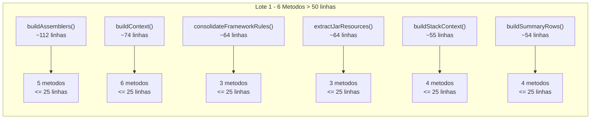
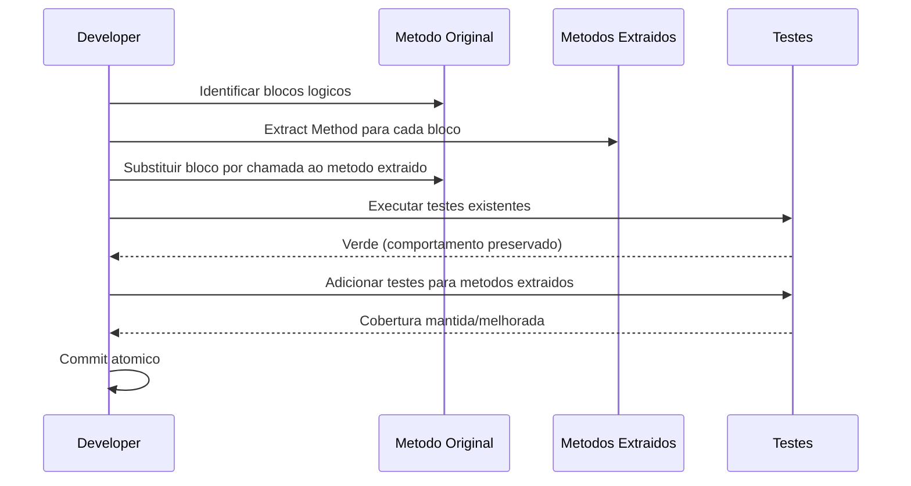

# Historia: Decompor metodos acima de 25 linhas — lote 1

**ID:** story-0008-0017

## 1. Dependencias

| Blocked By | Blocks |
| :--- | :--- |
| story-0008-0004, story-0008-0006 | story-0008-0018 |

## 2. Regras Transversais Aplicaveis

| ID | Titulo |
| :--- | :--- |
| RULE-001 | Cobertura obrigatoria |
| RULE-002 | Comportamento externo inalterado |
| RULE-003 | Commits atomicos |
| RULE-004 | Limites de tamanho |

## 3. Descricao

Como **Tech Lead**, eu quero decompor os 6 metodos mais extensos do projeto (todos acima de 50 linhas) em metodos menores de ate 25 linhas cada, garantindo que o codigo seja mais legivel, testavel e mantenivel sem alterar nenhum comportamento externo.

O audit C-003 identificou 50+ metodos acima de 25 linhas. Esta story trata o lote 1: os 6 piores ofensores que excedem significativamente o limite. Estes metodos concentram multiplas responsabilidades em um unico bloco, dificultando compreensao, teste unitario e manutencao. A decomposicao segue o principio de Extract Method, onde cada metodo resultante tem uma unica responsabilidade claramente nomeada.

Os 6 metodos alvo e suas estrategias de decomposicao sao:

### 3.1 AssemblerPipeline.buildAssemblers() (~112 linhas)

Extrair grupos de assemblers por categoria: `buildCoreAssemblers()`, `buildGithubAssemblers()`, `buildDocsAssemblers()`, `buildCodexAssemblers()`, `buildCicdAssemblers()`. Cada grupo retorna `List<Assembler>` e o metodo principal apenas concatena.

### 3.2 ContextBuilder.buildContext() (~74 linhas)

Dividir em metodos por dominio: `buildIdentity(config)`, `buildLanguage(config)`, `buildFramework(config)`, `buildInfra(config)`, `buildTesting(config)`, `buildInterfaces(config)`. Cada metodo popula uma secao do mapa de contexto.

### 3.3 Consolidator.consolidateFrameworkRules() (~64 linhas)

Extrair cada fase de consolidacao: `consolidateBaseRules()`, `consolidateOverrides()`, `mergeConditionalRules()`. Cada fase processa um subconjunto das regras.

### 3.4 ResourceResolver.extractJarResources() (~64 linhas)

Separar em: `listJarEntries(jarPath)`, `filterMatchingEntries(entries, pattern)`, `extractEntry(entry, targetDir)`. Cada metodo trata uma etapa do pipeline de extracao.

### 3.5 CicdAssembler.buildStackContext() (~55 linhas)

Dividir por secao de stack: `buildLanguageContext()`, `buildBuildToolContext()`, `buildContainerContext()`, `buildTestContext()`. Cada metodo retorna um sub-mapa de contexto.

### 3.6 ReadmeTables.buildSummaryRows() (~54 linhas)

Extrair geracao de cada grupo de linhas: `buildIdentityRows()`, `buildStackRows()`, `buildFeatureRows()`, `buildSkillRows()`. Cada metodo gera um subconjunto das linhas da tabela.

## 4. Definicoes de Qualidade Locais

### DoR Local (Definition of Ready)

- [ ] Stories 0008-0004 e 0008-0006 concluidas (dependencias)
- [ ] Contagem de linhas atualizada para os 6 metodos alvo
- [ ] Estrategia de decomposicao definida para cada metodo
- [ ] Testes existentes cobrindo cada metodo identificados

### DoD Local (Definition of Done)

- [ ] Todos os 6 metodos decompostos com cada parte <= 25 linhas
- [ ] Metodos extraidos com nomes descritivos (intent-revealing)
- [ ] Nenhum metodo no lote 1 acima de 25 linhas
- [ ] Todos os testes existentes passando
- [ ] Cobertura mantida ou melhorada para cada classe afetada
- [ ] Golden files identicos byte-for-byte

### Global Definition of Done (DoD)

- **Cobertura:** >= 95% Line, >= 90% Branch
- **Testes Automatizados:** Todos os testes existentes passando + novos testes
- **Relatorio de Cobertura:** JaCoCo via `mvn verify`
- **Documentacao:** Javadoc atualizado quando assinaturas mudam
- **Performance:** Sem degradacao

## 5. Contratos de Dados (Data Contract)

**Antes (ContextBuilder.buildContext — ~74 linhas):**

```java
public Map<String, Object> buildContext(SetupConfig config) {
    var context = new HashMap<String, Object>();
    // ~12 linhas: identity
    context.put("projectName", config.getProjectName());
    context.put("purpose", config.getPurpose());
    // ... mais campos
    // ~10 linhas: language
    context.put("language", config.getLanguage());
    context.put("languageVersion", config.getLanguageVersion());
    // ... mais campos
    // ~15 linhas: framework
    // ~12 linhas: infra
    // ~10 linhas: testing
    // ~15 linhas: interfaces
    return context;
}
```

**Depois (decomposicao por dominio):**

```java
public Map<String, Object> buildContext(SetupConfig config) {
    var context = new HashMap<String, Object>();
    buildIdentity(config, context);
    buildLanguage(config, context);
    buildFramework(config, context);
    buildInfra(config, context);
    buildTesting(config, context);
    buildInterfaces(config, context);
    return context;
}

private void buildIdentity(SetupConfig config, Map<String, Object> context) {
    context.put("projectName", config.getProjectName());
    context.put("purpose", config.getPurpose());
    // <= 25 linhas total
}
```

**Antes (AssemblerPipeline.buildAssemblers — ~112 linhas):**

```java
public List<Assembler> buildAssemblers(Config config) {
    var assemblers = new ArrayList<Assembler>();
    // ~20 linhas: core assemblers
    // ~25 linhas: github assemblers
    // ~20 linhas: docs assemblers
    // ~15 linhas: codex assemblers
    // ~15 linhas: cicd assemblers
    // ~17 linhas: conditional assemblers
    return assemblers;
}
```

**Depois (decomposicao por grupo):**

```java
public List<Assembler> buildAssemblers(Config config) {
    var assemblers = new ArrayList<Assembler>();
    assemblers.addAll(buildCoreAssemblers(config));
    assemblers.addAll(buildGithubAssemblers(config));
    assemblers.addAll(buildDocsAssemblers(config));
    assemblers.addAll(buildCodexAssemblers(config));
    assemblers.addAll(buildCicdAssemblers(config));
    return assemblers;
}

private List<Assembler> buildCoreAssemblers(Config config) {
    // <= 25 linhas
}
```

## 6. Diagramas

### 6.1 Metodos Alvo e Decomposicao



### 6.2 Fluxo de Decomposicao por Metodo



## 7. Criterios de Aceite (Gherkin)

```gherkin
Cenario: buildAssemblers decomposto em metodos de ate 25 linhas
  DADO que AssemblerPipeline.buildAssemblers() possui ~112 linhas
  QUANDO o metodo e decomposto em buildCoreAssemblers, buildGithubAssemblers, buildDocsAssemblers, buildCodexAssemblers e buildCicdAssemblers
  ENTAO cada metodo resultante deve ter <= 25 linhas
  E a lista de assemblers retornada deve ser identica a original
  E todos os testes de AssemblerPipeline devem continuar passando

Cenario: buildContext decomposto preserva todas as chaves de contexto
  DADO que ContextBuilder.buildContext() popula ~30 chaves no mapa de contexto
  QUANDO o metodo e dividido em buildIdentity, buildLanguage, buildFramework, buildInfra, buildTesting, buildInterfaces
  ENTAO o mapa de contexto resultante deve conter todas as ~30 chaves originais
  E nenhuma chave deve ser perdida ou duplicada
  E os golden files devem permanecer identicos byte-for-byte

Cenario: Metodo com 55 linhas decomposto sem alterar saida
  DADO que CicdAssembler.buildStackContext() possui ~55 linhas
  QUANDO o metodo e dividido em buildLanguageContext, buildBuildToolContext, buildContainerContext, buildTestContext
  ENTAO cada metodo resultante deve ter <= 25 linhas
  E o contexto de stack gerado deve ser identico ao original
  E os testes de CicdAssembler devem continuar passando

Cenario: Tentativa de metodo extraido com mais de 25 linhas e rejeitada
  DADO que um metodo extraido possui 26 linhas
  QUANDO a validacao de tamanho e executada
  ENTAO a validacao deve falhar
  E o desenvolvedor deve subdividir o metodo novamente ate atingir <= 25 linhas

Cenario: Decomposicao de extractJarResources preserva extracao de recursos
  DADO que ResourceResolver.extractJarResources() extrai recursos de um JAR
  QUANDO o metodo e dividido em listJarEntries, filterMatchingEntries, extractEntry
  ENTAO todos os recursos devem ser extraidos corretamente
  E nenhum recurso deve ser perdido ou corrompido
  E os testes de integracao de ResourceResolver devem continuar passando

Cenario: Todos os 6 metodos do lote 1 respeitam limite apos decomposicao
  DADO que os 6 metodos alvo foram decompostos
  QUANDO uma analise estatica de contagem de linhas e executada
  ENTAO nenhum dos metodos originais ou extraidos deve exceder 25 linhas
  E a contagem total de metodos nas classes afetadas deve ser maior que antes
```

### 7.1 Scenario Ordering (TPP)

> TPP: degenerate (buildAssemblers decomposto) -> happy path (buildContext preserva chaves,
> buildStackContext preserva saida) -> erro (metodo > 25 linhas rejeitado) -> integridade
> (extractJarResources preserva recursos, todos os 6 metodos conformes).

### 7.2 Mandatory Scenario Categories

- [x] Degenerate cases (decomposicao basica de buildAssemblers)
- [x] Happy path (buildContext preserva chaves, buildStackContext preserva saida)
- [x] Error paths (metodo extraido > 25 linhas rejeitado)
- [x] Boundary values (todos os 6 metodos respeitam limite)

## 8. Sub-tarefas

- [ ] [Dev] Decompor AssemblerPipeline.buildAssemblers() em 5+ metodos por grupo
- [ ] [Dev] Decompor ContextBuilder.buildContext() em 6 metodos por dominio
- [ ] [Dev] Decompor Consolidator.consolidateFrameworkRules() em 3 metodos por fase
- [ ] [Dev] Decompor ResourceResolver.extractJarResources() em 3 metodos por etapa
- [ ] [Dev] Decompor CicdAssembler.buildStackContext() em 4 metodos por secao
- [ ] [Dev] Decompor ReadmeTables.buildSummaryRows() em 4 metodos por grupo de linhas
- [ ] [Test] Verificar todos os testes existentes passando
- [ ] [Test] Verificar golden files identicos byte-for-byte
- [ ] [Test] Adicionar testes para metodos extraidos quando cobertura cai
