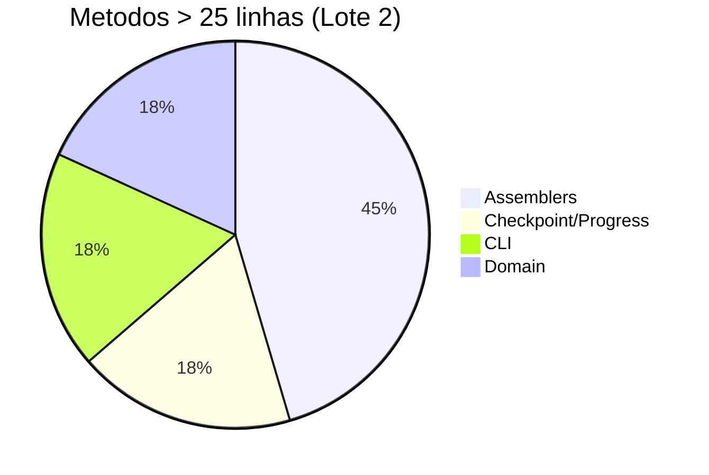
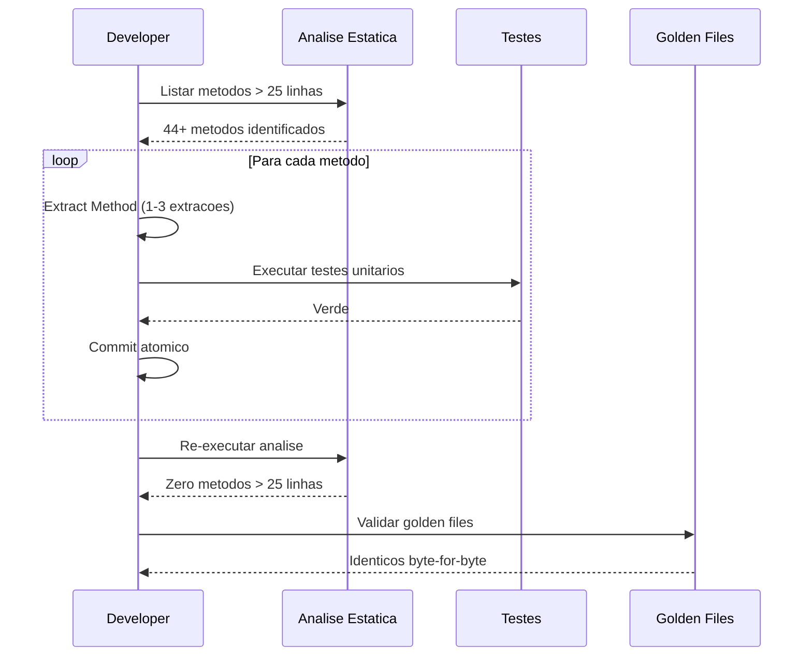

# Historia: Decompor metodos acima de 25 linhas — lote 2

**ID:** story-0008-0018

## 1. Dependencias

| Blocked By | Blocks |
| :--- | :--- |
| story-0008-0017 | — |

## 2. Regras Transversais Aplicaveis

| ID | Titulo |
| :--- | :--- |
| RULE-001 | Cobertura obrigatoria |
| RULE-002 | Comportamento externo inalterado |
| RULE-003 | Commits atomicos |
| RULE-004 | Limites de tamanho |

## 3. Descricao

Como **Tech Lead**, eu quero decompor os 44+ metodos restantes acima de 25 linhas (apos o lote 1) em metodos menores e coesos, garantindo que todo o codebase respeite o limite RULE-004 (metodo <= 25 linhas) e que o projeto atinja zero violacoes de tamanho de metodo.

O audit C-003 identificou 50+ metodos acima de 25 linhas. O lote 1 (story-0008-0017) tratou os 6 piores ofensores (> 50 linhas). Este lote 2 cobre os metodos restantes com 26-54 linhas, distribuidos por diversas classes do projeto. A maioria destes metodos requer extracoes menores — tipicamente 1-3 Extract Method por metodo original — tornando cada refactoring pontual e de baixo risco.

Os metodos estao distribuidos em quatro categorias de classes:

### 3.1 Metodos em Classes Assembler

- `ReadmeTables.buildMappingRows()` (~49 linhas) — extrair geracao por secao de mapeamento
- `AgentsAssembler.assemble()` (~51 linhas) — extrair processamento de templates e selecao
- `SkillsAssembler.assemble()` (~50 linhas) — extrair categorizacao e rendering
- `SettingsAssembler.assemble()` (~48 linhas) — extrair construcao de secoes de settings
- `DocsAdrAssembler.assemble()` (~43 linhas) — extrair formatacao e escrita de ADRs

### 3.2 Metodos em Classes Checkpoint/Progress

- `CheckpointEngine.updateMetrics()` (~54 linhas) — extrair calculo de cada metrica
- `ProgressFormatter.appendStoriesByStatus()` (~31 linhas) — extrair formatacao por status

### 3.3 Metodos em Classes CLI

- `CliDisplay.categorize()` (~50 linhas) — extrair categorizacao por tipo de artefato
- `InteractivePrompter.displaySummary()` (~29 linhas) — extrair formatacao de secoes do sumario

### 3.4 Metodos em Classes Domain

- `RulesIdentity.buildHeader()` (~43 linhas) — extrair construcao de cada secao do header
- `RulesIdentity.buildTechStack()` (~54 linhas) — extrair construcao de cada grupo de tecnologias

## 4. Definicoes de Qualidade Locais

### DoR Local (Definition of Ready)

- [ ] Story 0008-0017 (lote 1) concluida
- [ ] Lista completa de metodos > 25 linhas gerada via analise estatica
- [ ] Estrategia de decomposicao definida para cada metodo
- [ ] Testes existentes cobrindo cada metodo identificados

### DoD Local (Definition of Done)

- [ ] Zero metodos no projeto acima de 25 linhas (validacao global)
- [ ] Todos os metodos extraidos com nomes intent-revealing
- [ ] Nenhum metodo extraido recebe mais de 4 parametros
- [ ] Todos os testes existentes passando
- [ ] Golden files identicos byte-for-byte
- [ ] Cobertura mantida ou melhorada

### Global Definition of Done (DoD)

- **Cobertura:** >= 95% Line, >= 90% Branch
- **Testes Automatizados:** Todos os testes existentes passando + novos testes
- **Relatorio de Cobertura:** JaCoCo via `mvn verify`
- **Documentacao:** Javadoc atualizado quando assinaturas mudam
- **Performance:** Sem degradacao

## 5. Contratos de Dados (Data Contract)

**Antes (AgentsAssembler.assemble — ~51 linhas):**

```java
public AssembleResult assemble(AssembleContext context) {
    var agents = context.config().agents();
    var selectedAgents = filterByStack(agents, context.stack());
    // ~10 linhas: preparar templates
    // ~15 linhas: processar cada agente selecionado
    // ~10 linhas: escrever arquivos
    // ~10 linhas: construir resultado
    return result;
}
```

**Depois (decomposicao por responsabilidade):**

```java
public AssembleResult assemble(AssembleContext context) {
    var selectedAgents = selectAgents(context);
    var templates = prepareTemplates(context);
    var renderedAgents = renderAgents(selectedAgents, templates);
    writeAgentFiles(renderedAgents, context.outputDir());
    return buildResult(renderedAgents);
}

private List<Agent> selectAgents(AssembleContext context) {
    // <= 25 linhas
}

private Map<String, String> prepareTemplates(AssembleContext context) {
    // <= 25 linhas
}
```

**Antes (CheckpointEngine.updateMetrics — ~54 linhas):**

```java
public void updateMetrics(Checkpoint checkpoint) {
    // ~12 linhas: calcular progresso
    // ~10 linhas: calcular cobertura
    // ~10 linhas: calcular tempo estimado
    // ~10 linhas: atualizar status
    // ~12 linhas: persistir
}
```

**Depois:**

```java
public void updateMetrics(Checkpoint checkpoint) {
    var progress = calculateProgress(checkpoint);
    var coverage = calculateCoverage(checkpoint);
    var estimate = calculateTimeEstimate(checkpoint);
    updateStatus(checkpoint, progress, coverage);
    persist(checkpoint);
}
```

## 6. Diagramas

### 6.1 Distribuicao de Metodos por Categoria



### 6.2 Fluxo de Decomposicao Incremental



## 7. Criterios de Aceite (Gherkin)

```gherkin
Cenario: Zero metodos acima de 25 linhas no projeto
  DADO que todos os metodos do lote 2 foram decompostos
  QUANDO uma analise estatica de contagem de linhas e executada em todo o projeto
  ENTAO nenhum metodo deve exceder 25 linhas
  E o total de metodos no projeto deve ser maior que antes (novos metodos extraidos)

Cenario: Metodo assemble de AgentsAssembler decomposto preserva saida
  DADO que AgentsAssembler.assemble() possui ~51 linhas
  QUANDO o metodo e dividido em selectAgents, prepareTemplates, renderAgents, writeAgentFiles, buildResult
  ENTAO cada metodo resultante deve ter <= 25 linhas
  E a saida gerada pelo assembler deve ser identica ao golden file
  E todos os testes de AgentsAssembler devem continuar passando

Cenario: Decomposicao de updateMetrics preserva calculo de progresso
  DADO que CheckpointEngine.updateMetrics() calcula progresso, cobertura e estimativa
  QUANDO o metodo e dividido em calculateProgress, calculateCoverage, calculateTimeEstimate, updateStatus, persist
  ENTAO cada metrica calculada deve ter o mesmo valor que antes
  E o checkpoint persistido deve conter os mesmos dados
  E os testes de CheckpointEngine devem continuar passando

Cenario: Metodo borderline com 26 linhas requer apenas uma extracao
  DADO que um metodo possui 26 linhas (1 linha acima do limite)
  QUANDO uma unica Extract Method e aplicada
  ENTAO o metodo original deve ter <= 25 linhas
  E o metodo extraido deve ter responsabilidade unica e nome descritivo

Cenario: Decomposicao de RulesIdentity.buildTechStack preserva formatacao
  DADO que RulesIdentity.buildTechStack() gera tabela de tecnologias com ~54 linhas
  QUANDO o metodo e dividido em metodos por grupo de tecnologias
  ENTAO a tabela gerada deve ser identica a original
  E cada metodo extraido deve ter <= 25 linhas
  E os golden files de rules devem permanecer identicos byte-for-byte

Cenario: Metodos extraidos nao excedem limite de parametros
  DADO que metodos foram extraidos durante a decomposicao
  QUANDO a assinatura de cada metodo extraido e analisada
  ENTAO nenhum metodo deve ter mais de 4 parametros
  E parametros excessivos devem ser agrupados em parameter objects
```

### 7.1 Scenario Ordering (TPP)

> TPP: degenerate (zero metodos > 25 linhas) -> happy path (assemble decomposto, updateMetrics decomposto)
> -> boundary (metodo borderline 26 linhas, buildTechStack preserva formatacao) -> integridade
> (parametros <= 4).

### 7.2 Mandatory Scenario Categories

- [x] Degenerate cases (zero metodos acima do limite)
- [x] Happy path (assemblers e checkpoint decompostos corretamente)
- [x] Error paths (metodo borderline requer minima extracao)
- [x] Boundary values (limite de parametros respeitado)

## 8. Sub-tarefas

- [ ] [Dev] Decompor metodos em classes assembler (ReadmeTables, AgentsAssembler, SkillsAssembler, SettingsAssembler, DocsAdrAssembler)
- [ ] [Dev] Decompor metodos em classes checkpoint/progress (CheckpointEngine, ProgressFormatter)
- [ ] [Dev] Decompor metodos em classes CLI (CliDisplay, InteractivePrompter)
- [ ] [Dev] Decompor metodos em classes domain (RulesIdentity)
- [ ] [Test] Verificar todos os testes existentes passando
- [ ] [Test] Verificar golden files identicos byte-for-byte
- [ ] [Test] Adicionar testes para metodos extraidos quando cobertura cai
- [ ] [Test] Executar analise estatica final confirmando zero metodos > 25 linhas
