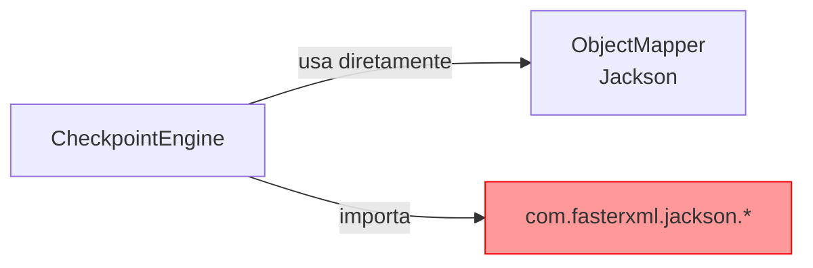
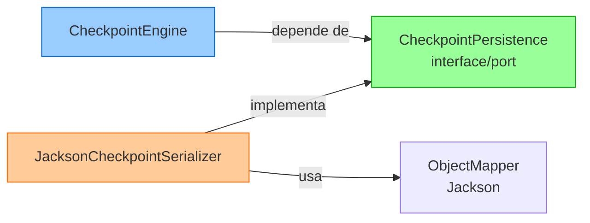
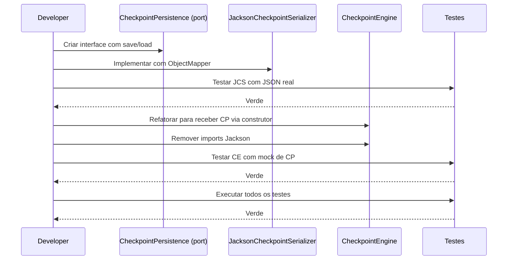

# Historia: Extrair Jackson do dominio checkpoint

**ID:** story-0008-0019

## 1. Dependencias

| Blocked By | Blocks |
| :--- | :--- |
| — | story-0008-0030 |

## 2. Regras Transversais Aplicaveis

| ID | Titulo |
| :--- | :--- |
| RULE-002 | Comportamento externo inalterado |
| RULE-003 | Commits atomicos |
| RULE-006 | Dominio puro |

## 3. Descricao

Como **Tech Lead**, eu quero extrair a dependencia de Jackson `ObjectMapper` da classe `CheckpointEngine` para um adapter dedicado, garantindo que o dominio (ou codigo domain-adjacent) nao dependa de frameworks de serializacao e respeite RULE-006 (dominio puro).

O audit C-005 identificou que `CheckpointEngine` usa `ObjectMapper` diretamente para serializar/deserializar checkpoints em JSON. O audit L-010 complementa que a dependencia concreta no `ObjectMapper` impede a testabilidade da engine sem Jackson no classpath. A solucao e aplicar o padrao Port/Adapter: criar uma interface `CheckpointPersistence` (port) que `CheckpointEngine` consome, e implementa-la com `JacksonCheckpointSerializer` (adapter) que encapsula toda a logica Jackson.

Apos esta mudanca, `CheckpointEngine` depende apenas de uma interface — pode ser testada com um mock/stub sem necessidade de Jackson. O adapter `JacksonCheckpointSerializer` concentra toda a logica de serializacao e pode ser substituido por outra implementacao (ex: Gson, custom) sem alterar a engine.

### 3.1 Interface CheckpointPersistence (Port)

A interface define dois metodos:
- `save(Checkpoint checkpoint, Path path)` — serializa e persiste o checkpoint
- `load(Path path)` — carrega e deserializa o checkpoint

### 3.2 JacksonCheckpointSerializer (Adapter)

Implementa `CheckpointPersistence` usando `ObjectMapper` com configuracao:
- `SerializationFeature.INDENT_OUTPUT` para JSON legivel
- `DeserializationFeature.FAIL_ON_UNKNOWN_PROPERTIES` desabilitado para compatibilidade futura
- Tratamento de `IOException` convertido para excecao de dominio

### 3.3 CheckpointEngine (Refatorado)

Recebe `CheckpointPersistence` via construtor (constructor injection). Remove import de `com.fasterxml.jackson.*`. Delega toda serializacao/deserializacao para o port.

## 4. Definicoes de Qualidade Locais

### DoR Local (Definition of Ready)

- [ ] Classe `CheckpointEngine` analisada com imports Jackson identificados
- [ ] Todos os usos de `ObjectMapper` na engine mapeados com numeros de linha
- [ ] Configuracao atual do ObjectMapper documentada
- [ ] Testes existentes de checkpoint identificados

### DoD Local (Definition of Done)

- [ ] Interface `CheckpointPersistence` criada com Javadoc
- [ ] `JacksonCheckpointSerializer` implementado e testado
- [ ] `CheckpointEngine` refatorada para usar port via constructor injection
- [ ] Zero imports de `com.fasterxml.jackson.*` em `CheckpointEngine`
- [ ] Testes de `CheckpointEngine` usam mock/stub de `CheckpointPersistence`
- [ ] Testes de `JacksonCheckpointSerializer` validam serializacao real
- [ ] Todos os testes existentes passando

### Global Definition of Done (DoD)

- **Cobertura:** >= 95% Line, >= 90% Branch
- **Testes Automatizados:** Todos os testes existentes passando + novos testes
- **Relatorio de Cobertura:** JaCoCo via `mvn verify`
- **Documentacao:** Javadoc atualizado quando assinaturas mudam
- **Performance:** Sem degradacao

## 5. Contratos de Dados (Data Contract)

**Antes (CheckpointEngine com Jackson direto):**

```java
import com.fasterxml.jackson.databind.ObjectMapper;
import com.fasterxml.jackson.databind.SerializationFeature;

public class CheckpointEngine {
    private final ObjectMapper objectMapper;

    public CheckpointEngine() {
        this.objectMapper = new ObjectMapper()
            .enable(SerializationFeature.INDENT_OUTPUT);
    }

    public void save(Checkpoint checkpoint, Path path) {
        objectMapper.writeValue(path.toFile(), checkpoint);
    }

    public Checkpoint load(Path path) {
        return objectMapper.readValue(path.toFile(), Checkpoint.class);
    }
}
```

**Depois (Port/Adapter):**

```java
// Port (dominio)
public interface CheckpointPersistence {
    void save(Checkpoint checkpoint, Path path);
    Checkpoint load(Path path);
}

// Adapter (infraestrutura)
import com.fasterxml.jackson.databind.ObjectMapper;

public class JacksonCheckpointSerializer implements CheckpointPersistence {
    private final ObjectMapper objectMapper;

    public JacksonCheckpointSerializer() {
        this.objectMapper = new ObjectMapper()
            .enable(SerializationFeature.INDENT_OUTPUT)
            .disable(DeserializationFeature.FAIL_ON_UNKNOWN_PROPERTIES);
    }

    @Override
    public void save(Checkpoint checkpoint, Path path) {
        try {
            objectMapper.writeValue(path.toFile(), checkpoint);
        } catch (IOException e) {
            throw new CheckpointPersistenceException("Failed to save checkpoint", e);
        }
    }

    @Override
    public Checkpoint load(Path path) {
        try {
            return objectMapper.readValue(path.toFile(), Checkpoint.class);
        } catch (IOException e) {
            throw new CheckpointPersistenceException("Failed to load checkpoint", e);
        }
    }
}

// Engine refatorada (dominio)
public class CheckpointEngine {
    private final CheckpointPersistence persistence;

    public CheckpointEngine(CheckpointPersistence persistence) {
        this.persistence = persistence;
    }

    public void save(Checkpoint checkpoint, Path path) {
        persistence.save(checkpoint, path);
    }

    public Checkpoint load(Path path) {
        return persistence.load(path);
    }
}
```

## 6. Diagramas

### 6.1 Antes — Dependencia Direta



### 6.2 Depois — Port/Adapter



### 6.3 Fluxo de Refactoring



## 7. Criterios de Aceite (Gherkin)

```gherkin
Cenario: CheckpointEngine nao importa classes Jackson
  DADO que CheckpointEngine foi refatorada para usar CheckpointPersistence
  QUANDO uma busca por "com.fasterxml.jackson" e executada em CheckpointEngine.java
  ENTAO zero resultados devem ser encontrados
  E a classe deve importar apenas a interface CheckpointPersistence

Cenario: JacksonCheckpointSerializer serializa checkpoint em JSON formatado
  DADO que um Checkpoint valido com dados de progresso existe
  QUANDO JacksonCheckpointSerializer.save(checkpoint, path) e invocado
  ENTAO o arquivo JSON deve ser criado com indentacao (pretty-printed)
  E o conteudo deve conter todas as propriedades do Checkpoint
  E o JSON deve ser valido (parseable)

Cenario: JacksonCheckpointSerializer deserializa checkpoint de JSON
  DADO que um arquivo JSON valido de checkpoint existe no filesystem
  QUANDO JacksonCheckpointSerializer.load(path) e invocado
  ENTAO um objeto Checkpoint deve ser retornado
  E todas as propriedades devem corresponder ao JSON original
  E propriedades desconhecidas no JSON devem ser ignoradas

Cenario: JacksonCheckpointSerializer com arquivo inexistente lanca excecao de dominio
  DADO que o path aponta para um arquivo que nao existe
  QUANDO JacksonCheckpointSerializer.load(path) e invocado
  ENTAO uma CheckpointPersistenceException deve ser lancada
  E a causa raiz deve ser IOException
  E a mensagem deve conter contexto sobre o erro

Cenario: CheckpointEngine testavel com mock de persistencia
  DADO que CheckpointEngine recebe um mock de CheckpointPersistence
  QUANDO save e load sao invocados
  ENTAO os metodos do mock devem ser chamados com os argumentos corretos
  E nenhuma dependencia de Jackson e necessaria no classpath de teste

Cenario: Roundtrip save-load preserva dados do checkpoint
  DADO que um Checkpoint e serializado via save
  QUANDO o mesmo arquivo e carregado via load
  ENTAO o Checkpoint carregado deve ser igual ao original
  E nenhum dado deve ser perdido na serializacao/deserializacao
```

### 7.1 Scenario Ordering (TPP)

> TPP: degenerate (nenhum import Jackson) -> happy path (serializa JSON, deserializa JSON)
> -> erro (arquivo inexistente lanca excecao) -> testabilidade (mock de persistencia)
> -> integridade (roundtrip save-load).

### 7.2 Mandatory Scenario Categories

- [x] Degenerate cases (zero imports Jackson na engine)
- [x] Happy path (serializa e deserializa corretamente)
- [x] Error paths (arquivo inexistente lanca excecao de dominio)
- [x] Boundary values (roundtrip save-load preserva dados)

## 8. Sub-tarefas

- [ ] [Dev] Criar interface `CheckpointPersistence` com metodos `save` e `load`
- [ ] [Dev] Criar classe `JacksonCheckpointSerializer` implementando o port
- [ ] [Dev] Criar excecao `CheckpointPersistenceException` (se nao existir)
- [ ] [Dev] Refatorar `CheckpointEngine` para receber `CheckpointPersistence` via construtor
- [ ] [Dev] Remover imports de `com.fasterxml.jackson.*` de `CheckpointEngine`
- [ ] [Dev] Atualizar chamadores de `CheckpointEngine` para injetar `JacksonCheckpointSerializer`
- [ ] [Test] Testes unitarios para `JacksonCheckpointSerializer` (save, load, roundtrip, erro)
- [ ] [Test] Testes unitarios para `CheckpointEngine` com mock de `CheckpointPersistence`
- [ ] [Test] Verificar todos os testes existentes passando
