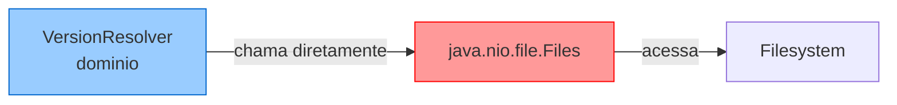
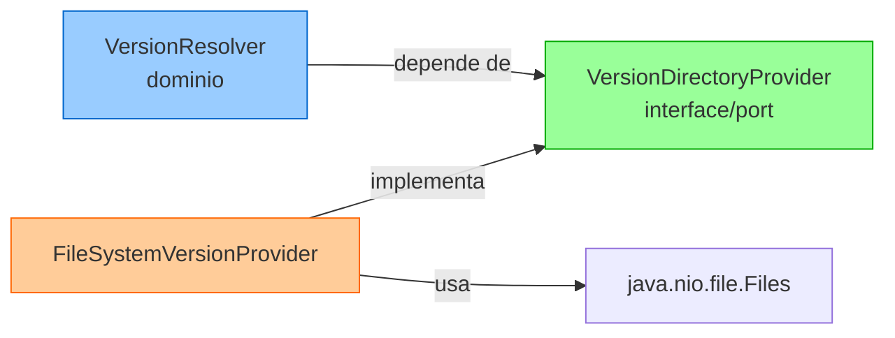
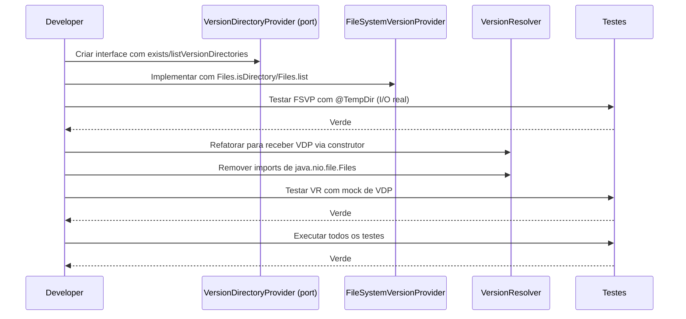

# Historia: Corrigir I/O no dominio VersionResolver

**ID:** story-0008-0020

## 1. Dependencias

| Blocked By | Blocks |
| :--- | :--- |
| — | story-0008-0030 |

## 2. Regras Transversais Aplicaveis

| ID | Titulo |
| :--- | :--- |
| RULE-002 | Comportamento externo inalterado |
| RULE-003 | Commits atomicos |
| RULE-006 | Dominio puro |

## 3. Descricao

Como **Tech Lead**, eu quero remover o acesso direto ao filesystem (`Files.isDirectory()`) da classe `VersionResolver` no layer de dominio, garantindo que o dominio permaneca puro (RULE-006) e que a logica de resolucao de versoes seja testavel sem dependencia de I/O real.

O audit M-009 identificou que `VersionResolver` — uma classe de dominio — faz chamadas diretas a `java.nio.file.Files.isDirectory()` para verificar a existencia de diretorios de versao. Isso viola o principio de dominio puro: classes de dominio nao devem depender de I/O, filesystem ou qualquer infraestrutura externa. A dependencia concreta no filesystem dificulta testes unitarios (necessitam de diretorios reais) e impede reuso da logica em contextos sem filesystem (ex: testes em memoria).

A solucao aplica o padrao Port/Adapter: criar uma interface `VersionDirectoryProvider` (port) que abstrai a verificacao de existencia de diretorios. Implementa-la com `FileSystemVersionProvider` (adapter) que encapsula as chamadas a `Files.isDirectory()`. `VersionResolver` recebe o provider via constructor injection e delega todas as verificacoes de filesystem ao port.

### 3.1 Interface VersionDirectoryProvider (Port)

A interface define metodos para:
- `exists(Path path)` — verifica se um diretorio de versao existe
- `listVersionDirectories(Path basePath)` — lista subdiretorios de versao disponiveis

### 3.2 FileSystemVersionProvider (Adapter)

Implementa `VersionDirectoryProvider` usando `java.nio.file.Files`:
- `exists(Path)` delega para `Files.isDirectory(path)`
- `listVersionDirectories(Path)` delega para `Files.list(path).filter(Files::isDirectory)`

### 3.3 VersionResolver (Refatorado)

Recebe `VersionDirectoryProvider` via construtor. Remove imports de `java.nio.file.Files`. Toda logica de resolucao de versoes permanece intacta — apenas a fonte de dados muda de I/O direto para o port.

## 4. Definicoes de Qualidade Locais

### DoR Local (Definition of Ready)

- [ ] Classe `VersionResolver` analisada com chamadas a `Files.*` identificadas
- [ ] Todos os usos de filesystem na classe mapeados com numeros de linha
- [ ] Testes existentes de VersionResolver identificados
- [ ] Comportamento atual documentado (quais paths sao verificados, quais versoes sao resolvidas)

### DoD Local (Definition of Done)

- [ ] Interface `VersionDirectoryProvider` criada com Javadoc
- [ ] `FileSystemVersionProvider` implementado e testado
- [ ] `VersionResolver` refatorada para usar port via constructor injection
- [ ] Zero imports de `java.nio.file.Files` em `VersionResolver`
- [ ] Testes de `VersionResolver` usam mock/stub de `VersionDirectoryProvider`
- [ ] Testes de `FileSystemVersionProvider` validam I/O real com `@TempDir`
- [ ] Todos os testes existentes passando

### Global Definition of Done (DoD)

- **Cobertura:** >= 95% Line, >= 90% Branch
- **Testes Automatizados:** Todos os testes existentes passando + novos testes
- **Relatorio de Cobertura:** JaCoCo via `mvn verify`
- **Documentacao:** Javadoc atualizado quando assinaturas mudam
- **Performance:** Sem degradacao

## 5. Contratos de Dados (Data Contract)

**Antes (VersionResolver com I/O direto):**

```java
import java.nio.file.Files;
import java.nio.file.Path;

public class VersionResolver {

    public String resolve(String language, String version, Path resourcesDir) {
        var versionDir = resourcesDir.resolve(language).resolve(version);
        if (Files.isDirectory(versionDir)) {
            return version;
        }
        // fallback logic...
        var majorVersion = extractMajor(version);
        var majorDir = resourcesDir.resolve(language).resolve(majorVersion);
        if (Files.isDirectory(majorDir)) {
            return majorVersion;
        }
        return "default";
    }
}
```

**Depois (Port/Adapter):**

```java
// Port (dominio)
public interface VersionDirectoryProvider {
    boolean exists(Path path);
    List<Path> listVersionDirectories(Path basePath);
}

// Adapter (infraestrutura)
import java.nio.file.Files;

public class FileSystemVersionProvider implements VersionDirectoryProvider {

    @Override
    public boolean exists(Path path) {
        return Files.isDirectory(path);
    }

    @Override
    public List<Path> listVersionDirectories(Path basePath) {
        try (var stream = Files.list(basePath)) {
            return stream.filter(Files::isDirectory).toList();
        } catch (IOException e) {
            return List.of();
        }
    }
}

// VersionResolver refatorado (dominio puro)
public class VersionResolver {
    private final VersionDirectoryProvider provider;

    public VersionResolver(VersionDirectoryProvider provider) {
        this.provider = provider;
    }

    public String resolve(String language, String version, Path resourcesDir) {
        var versionDir = resourcesDir.resolve(language).resolve(version);
        if (provider.exists(versionDir)) {
            return version;
        }
        var majorVersion = extractMajor(version);
        var majorDir = resourcesDir.resolve(language).resolve(majorVersion);
        if (provider.exists(majorDir)) {
            return majorVersion;
        }
        return "default";
    }
}
```

## 6. Diagramas

### 6.1 Antes — Dependencia Direta no Filesystem



### 6.2 Depois — Port/Adapter



### 6.3 Fluxo de Refactoring



## 7. Criterios de Aceite (Gherkin)

```gherkin
Cenario: VersionResolver nao importa java.nio.file.Files
  DADO que VersionResolver foi refatorada para usar VersionDirectoryProvider
  QUANDO uma busca por "java.nio.file.Files" e executada em VersionResolver.java
  ENTAO zero resultados devem ser encontrados
  E a classe deve importar apenas a interface VersionDirectoryProvider

Cenario: VersionResolver resolve versao exata quando diretorio existe
  DADO que o provider reporta que o diretorio "java/21" existe
  QUANDO VersionResolver.resolve("java", "21", resourcesDir) e invocado
  ENTAO o retorno deve ser "21"
  E o provider.exists deve ter sido chamado com o path correto

Cenario: VersionResolver faz fallback para versao major quando exata nao existe
  DADO que o provider reporta que "java/21" nao existe mas "java/21" (major) existe
  QUANDO VersionResolver.resolve("java", "21.0.2", resourcesDir) e invocado
  ENTAO o retorno deve ser "21"
  E o provider.exists deve ter sido chamado duas vezes

Cenario: VersionResolver retorna default quando nenhum diretorio existe
  DADO que o provider reporta que nenhum diretorio de versao existe
  QUANDO VersionResolver.resolve("java", "99", resourcesDir) e invocado
  ENTAO o retorno deve ser "default"

Cenario: FileSystemVersionProvider verifica existencia de diretorio real
  DADO que um diretorio temporario "java/21" existe no filesystem
  QUANDO FileSystemVersionProvider.exists(path) e invocado
  ENTAO o retorno deve ser true
  E para um path inexistente o retorno deve ser false

Cenario: FileSystemVersionProvider lista subdiretorios de versao
  DADO que um diretorio base contem subdiretorios "17", "21" e "default"
  QUANDO FileSystemVersionProvider.listVersionDirectories(basePath) e invocado
  ENTAO a lista deve conter 3 paths correspondentes
  E cada path deve ser um diretorio valido

Cenario: VersionResolver testavel com mock sem filesystem
  DADO que VersionResolver recebe um mock de VersionDirectoryProvider
  QUANDO resolve e invocado com qualquer combinacao de parametros
  ENTAO a logica de resolucao deve funcionar corretamente
  E nenhum acesso ao filesystem real deve ocorrer
```

### 7.1 Scenario Ordering (TPP)

> TPP: degenerate (nenhum import Files) -> happy path (versao exata resolvida)
> -> condicional (fallback para major) -> default (nenhum diretorio retorna "default")
> -> adapter (FileSystemVersionProvider I/O real) -> testabilidade (mock sem filesystem).

### 7.2 Mandatory Scenario Categories

- [x] Degenerate cases (zero imports de Files na classe de dominio)
- [x] Happy path (versao exata resolvida, FileSystemVersionProvider funcional)
- [x] Error paths (nenhum diretorio existe retorna default)
- [x] Boundary values (fallback para versao major, mock sem filesystem)

## 8. Sub-tarefas

- [ ] [Dev] Criar interface `VersionDirectoryProvider` com metodos `exists` e `listVersionDirectories`
- [ ] [Dev] Criar classe `FileSystemVersionProvider` implementando o port
- [ ] [Dev] Refatorar `VersionResolver` para receber `VersionDirectoryProvider` via construtor
- [ ] [Dev] Remover imports de `java.nio.file.Files` de `VersionResolver`
- [ ] [Dev] Atualizar chamadores de `VersionResolver` para injetar `FileSystemVersionProvider`
- [ ] [Test] Testes unitarios para `VersionResolver` com mock de `VersionDirectoryProvider` (exata, fallback, default)
- [ ] [Test] Testes unitarios para `FileSystemVersionProvider` com `@TempDir` (exists, listVersionDirectories)
- [ ] [Test] Verificar todos os testes existentes passando
