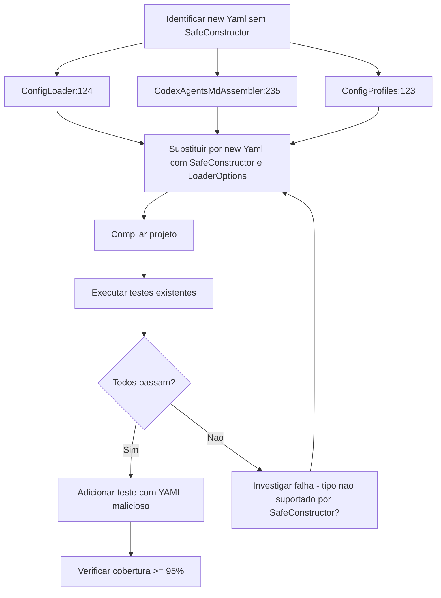
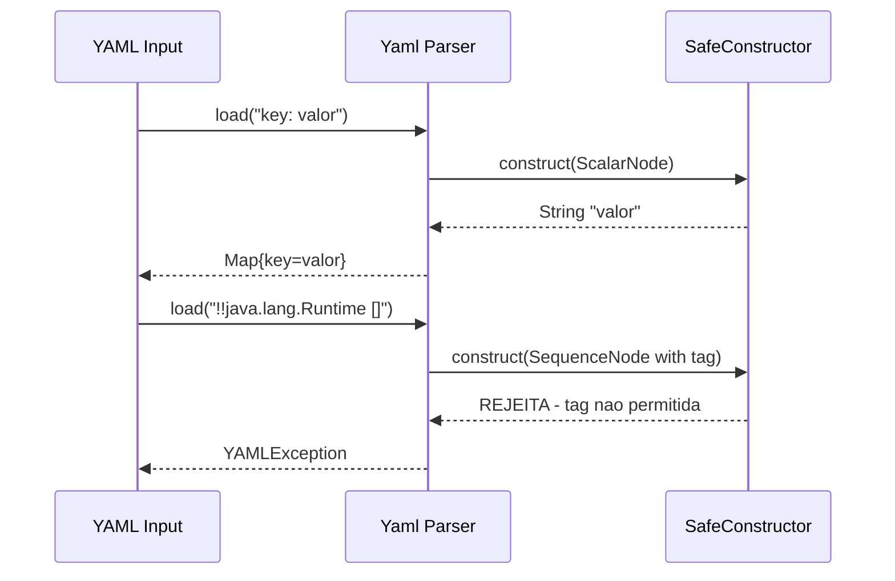

# Historia: Adicionar SafeConstructor explicito no parsing YAML

**ID:** story-0008-0021

## 1. Dependencias

| Blocked By | Blocks |
| :--- | :--- |
| — | — |

## 2. Regras Transversais Aplicaveis

| ID | Titulo |
| :--- | :--- |
| RULE-002 | Comportamento externo inalterado |
| RULE-003 | Commits atomicos |

## 3. Descricao

Como **Tech Lead**, eu quero substituir todas as instanciacoes de `new Yaml().load()` por `new Yaml(new SafeConstructor(new LoaderOptions())).load()`, garantindo que o comportamento seguro do parser YAML seja explicito e resistente a futuras mudancas de defaults do SnakeYAML.

O audit report (findings M-011 e L-011) identificou 3 locais no codebase onde `new Yaml()` e instanciado sem constructor explicito: ConfigLoader:124, CodexAgentsMdAssembler:235 e ConfigProfiles:123. Embora versoes recentes do SnakeYAML ja utilizem SafeConstructor como default, essa dependencia implicita e fragil. Uma atualizacao futura de versao do SnakeYAML poderia alterar o constructor padrao, introduzindo vulnerabilidades de deserializacao de objetos arbitrarios (Remote Code Execution via YAML deserialization attacks). A dependencia concreta no SnakeYAML (L-011) reforca a necessidade de tornar a configuracao segura explicita.

A correcao e cirurgica: em cada um dos 3 locais, substituir `new Yaml()` por `new Yaml(new SafeConstructor(new LoaderOptions()))`. Nenhuma mudanca de comportamento externo e introduzida — o parsing YAML continua identico para inputs validos. A unica diferenca e que inputs maliciosos contendo tags de instanciacao de classes Java serao explicitamente rejeitados, independentemente de defaults futuros do SnakeYAML.

### 3.1 Locais de Correcao

| Classe | Linha Aproximada | Contexto |
| :--- | :--- | :--- |
| ConfigLoader | 124 | Carregamento do arquivo de configuracao YAML do projeto |
| CodexAgentsMdAssembler | 235 | Parsing de frontmatter YAML em arquivos de agentes Codex |
| ConfigProfiles | 123 | Carregamento de profiles YAML embutidos no classpath |

### 3.2 SafeConstructor vs Constructor Padrao

- `new Yaml()` — usa constructor padrao, que pode variar entre versoes do SnakeYAML
- `new Yaml(new SafeConstructor(new LoaderOptions()))` — restringe explicitamente a tipos seguros (String, Map, List, primitivos), rejeitando tags `!!` que instanciam classes arbitrarias

## 4. Definicoes de Qualidade Locais

### DoR Local (Definition of Ready)

- [ ] Todos os 3 locais de `new Yaml()` mapeados com numeros de linha exatos
- [ ] Versao atual do SnakeYAML identificada no pom.xml
- [ ] Payload YAML malicioso de teste preparado (tentativa de instanciar classe Java via tag `!!`)
- [ ] Testes existentes executam com sucesso antes da mudanca

### DoD Local (Definition of Done)

- [ ] Zero instanciacoes de `new Yaml()` sem SafeConstructor nos 3 arquivos
- [ ] ConfigLoader usa `new Yaml(new SafeConstructor(new LoaderOptions()))`
- [ ] CodexAgentsMdAssembler usa `new Yaml(new SafeConstructor(new LoaderOptions()))`
- [ ] ConfigProfiles usa `new Yaml(new SafeConstructor(new LoaderOptions()))`
- [ ] Parsing YAML funcional para todos os profiles existentes
- [ ] Input YAML malicioso rejeitado com excecao explicita
- [ ] Todos os testes existentes passando

### Global Definition of Done (DoD)

- **Cobertura:** >= 95% Line, >= 90% Branch
- **Testes Automatizados:** Todos os testes existentes passando + novos testes
- **Relatorio de Cobertura:** JaCoCo via `mvn verify`
- **Documentacao:** Javadoc atualizado quando assinaturas mudam
- **Performance:** Sem degradacao

## 5. Contratos de Dados (Data Contract)

**Antes (em cada um dos 3 locais):**

```java
Yaml yaml = new Yaml();
Map<String, Object> config = yaml.load(inputStream);
```

**Depois (em cada um dos 3 locais):**

```java
Yaml yaml = new Yaml(new SafeConstructor(new LoaderOptions()));
Map<String, Object> config = yaml.load(inputStream);
```

**Imports adicionais necessarios:**

```java
import org.yaml.snakeyaml.constructor.SafeConstructor;
import org.yaml.snakeyaml.LoaderOptions;
```

**Comportamento com input malicioso:**

| Input YAML | Antes (implicito) | Depois (explicito) |
| :--- | :--- | :--- |
| `key: valor` | `Map{key=valor}` | `Map{key=valor}` |
| `!!java.lang.Runtime []` | Depende da versao | `YAMLException: could not determine a constructor` |

## 6. Diagramas (mermaid)

### 6.1 Fluxo de Correcao SafeConstructor



### 6.2 Comparacao de Seguranca



## 7. Criterios de Aceite (Gherkin)

```gherkin
Cenario: ConfigLoader carrega YAML valido com SafeConstructor
  DADO que o arquivo de configuracao YAML contem chaves validas (strings, listas, mapas)
  QUANDO ConfigLoader.load() e invocado
  ENTAO o mapa de configuracao e retornado corretamente
  E todos os valores sao do tipo esperado (String, Map, List)

Cenario: CodexAgentsMdAssembler processa frontmatter YAML valido
  DADO que um arquivo de agente contem frontmatter YAML valido
  QUANDO CodexAgentsMdAssembler processa o arquivo
  ENTAO o frontmatter e parseado corretamente
  E os metadados do agente sao extraidos sem erro

Cenario: YAML malicioso com tag de classe Java e rejeitado
  DADO que o input YAML contem "!!java.lang.ProcessBuilder [cmd, /c, dir]"
  QUANDO o parser YAML com SafeConstructor tenta carregar o input
  ENTAO uma excecao do tipo YAMLException e lancada
  E a mensagem de erro indica que o constructor nao e permitido
  E nenhuma classe Java e instanciada

Cenario: ConfigProfiles carrega todos os profiles embutidos com SafeConstructor
  DADO que os profiles YAML estao embutidos no classpath
  QUANDO ConfigProfiles carrega cada profile disponivel
  ENTAO todos os profiles sao parseados com sucesso
  E nenhum profile causa erro de parsing

Cenario: Zero instanciacoes de new Yaml sem SafeConstructor no codebase
  DADO que as 3 correcoes foram aplicadas
  QUANDO uma busca por "new Yaml()" sem SafeConstructor e executada no codigo fonte
  ENTAO zero resultados sao encontrados
  E todas as instanciacoes usam SafeConstructor com LoaderOptions
```

### 7.1 Scenario Ordering (TPP)

> TPP: degenerate (YAML valido simples) -> constante (frontmatter valido) -> erro (YAML malicioso rejeitado) -> colecao (todos os profiles) -> validacao global (zero instanciacoes inseguras).

### 7.2 Mandatory Scenario Categories

- [x] Degenerate cases (ConfigLoader com YAML valido)
- [x] Happy path (CodexAgentsMdAssembler com frontmatter, ConfigProfiles com todos profiles)
- [x] Error paths (YAML malicioso rejeitado)
- [x] Boundary values (zero instanciacoes sem SafeConstructor)

## 8. Sub-tarefas

- [ ] [Dev] Atualizar ConfigLoader para usar `new Yaml(new SafeConstructor(new LoaderOptions()))`
- [ ] [Dev] Atualizar CodexAgentsMdAssembler para usar `new Yaml(new SafeConstructor(new LoaderOptions()))`
- [ ] [Dev] Atualizar ConfigProfiles para usar `new Yaml(new SafeConstructor(new LoaderOptions()))`
- [ ] [Test] Verificar que parsing YAML continua funcional para todos os profiles
- [ ] [Test] Adicionar teste com input YAML malicioso (tentativa de instanciacao de classe Java)
- [ ] [Test] Verificar todos os testes existentes passando
- [ ] [Test] Verificar cobertura >= 95% line, >= 90% branch
