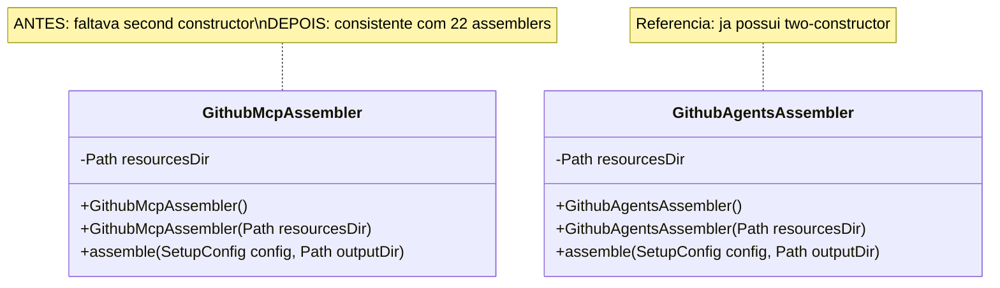
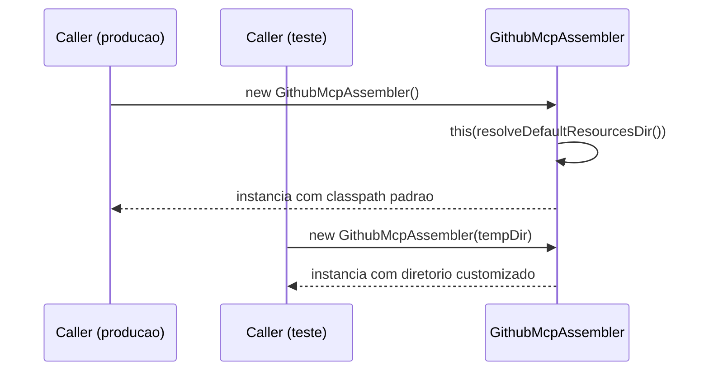

# Historia: Adicionar constructor testavel ao GithubMcpAssembler

**ID:** story-0008-0022

## 1. Dependencias

| Blocked By | Blocks |
| :--- | :--- |
| — | — |

## 2. Regras Transversais Aplicaveis

| ID | Titulo |
| :--- | :--- |
| RULE-002 | Comportamento externo inalterado |
| RULE-003 | Commits atomicos |

## 3. Descricao

Como **Tech Lead**, eu quero adicionar o padrao two-constructor ao GithubMcpAssembler (o unico assembler que nao o possui), garantindo que essa classe seja testavel com diretorios de recursos customizados, mantendo consistencia com os outros 22 assemblers do projeto.

O audit report (finding M-019) identificou que `GithubMcpAssembler` e o unico assembler que nao implementa o padrao two-constructor. Este padrao, presente em todos os outros 22 assemblers, consiste em: (1) um constructor padrao sem argumentos que resolve `resourcesDir` via classpath, e (2) um constructor com parametro `Path resourcesDir` que permite injecao direta do diretorio de recursos. A ausencia desse segundo constructor impede testes unitarios com recursos customizados e viola a consistencia arquitetural do projeto.

A correcao envolve: adicionar um campo `private final Path resourcesDir` a classe, criar o constructor `GithubMcpAssembler(Path resourcesDir)` que aceita o diretorio externo, ajustar o constructor padrao para delegar ao novo constructor com o path padrao do classpath, e atualizar os metodos internos para usar o campo `resourcesDir` ao inves de resolver via classpath diretamente. Nenhuma mudanca de comportamento externo e introduzida — o constructor padrao continua funcionando identicamente.

### 3.1 Padrao Two-Constructor (Referencia)

O padrao estabelecido nos 22 assemblers existentes segue esta estrutura:

```java
public class ExampleAssembler {
    private final Path resourcesDir;

    public ExampleAssembler() {
        this(resolveDefaultResourcesDir());
    }

    public ExampleAssembler(Path resourcesDir) {
        this.resourcesDir = resourcesDir;
    }
}
```

### 3.2 Beneficios para Testabilidade

- Testes unitarios podem injetar um `@TempDir` como `resourcesDir`
- Elimina dependencia implicita de classpath em testes
- Permite testar cenarios de erro (diretorio inexistente, permissoes, recursos faltantes)

## 4. Definicoes de Qualidade Locais

### DoR Local (Definition of Ready)

- [ ] Classe GithubMcpAssembler localizada e analisada
- [ ] Padrao two-constructor documentado com base em assembler de referencia
- [ ] Testes existentes de GithubMcpAssembler identificados
- [ ] Pelo menos 1 assembler de referencia analisado como modelo (ex: GithubAgentsAssembler)

### DoD Local (Definition of Done)

- [ ] Campo `private final Path resourcesDir` adicionado a GithubMcpAssembler
- [ ] Constructor `GithubMcpAssembler(Path resourcesDir)` implementado
- [ ] Constructor padrao `GithubMcpAssembler()` delega ao novo constructor
- [ ] Metodos internos usam `resourcesDir` ao inves de resolver classpath diretamente
- [ ] Testes existentes continuam passando com constructor padrao
- [ ] Novos testes utilizam constructor com Path customizado
- [ ] 23 de 23 assemblers agora implementam o padrao two-constructor

### Global Definition of Done (DoD)

- **Cobertura:** >= 95% Line, >= 90% Branch
- **Testes Automatizados:** Todos os testes existentes passando + novos testes
- **Relatorio de Cobertura:** JaCoCo via `mvn verify`
- **Documentacao:** Javadoc atualizado quando assinaturas mudam
- **Performance:** Sem degradacao

## 5. Contratos de Dados (Data Contract)

**Antes (GithubMcpAssembler — unico constructor):**

```java
public class GithubMcpAssembler {

    public GithubMcpAssembler() {
        // resolve recursos via classpath internamente
    }

    public void assemble(SetupConfig config, Path outputDir) {
        // usa classpath diretamente para localizar templates
    }
}
```

**Depois (GithubMcpAssembler — two-constructor):**

```java
public class GithubMcpAssembler {
    private final Path resourcesDir;

    public GithubMcpAssembler() {
        this(resolveDefaultResourcesDir());
    }

    public GithubMcpAssembler(Path resourcesDir) {
        this.resourcesDir = resourcesDir;
    }

    public void assemble(SetupConfig config, Path outputDir) {
        // usa this.resourcesDir para localizar templates
    }
}
```

**Uso em testes (novo):**

```java
@TempDir
Path tempResources;

@Test
void assemble_withCustomResources_generatesExpectedOutput() {
    // Preparar recursos customizados em tempResources
    var assembler = new GithubMcpAssembler(tempResources);
    assembler.assemble(config, outputDir);
    // Verificar output
}
```

## 6. Diagramas (mermaid)

### 6.1 Padrao Two-Constructor



### 6.2 Fluxo de Delegacao do Constructor



## 7. Criterios de Aceite (Gherkin)

```gherkin
Cenario: Constructor padrao resolve recursos via classpath
  DADO que GithubMcpAssembler e instanciado com constructor padrao
  QUANDO assemble() e invocado com configuracao valida
  ENTAO o output e gerado corretamente
  E os templates sao resolvidos via classpath padrao

Cenario: Constructor com Path customizado usa diretorio fornecido
  DADO que um diretorio temporario contem templates MCP validos
  QUANDO GithubMcpAssembler e instanciado com o diretorio temporario
  E assemble() e invocado com configuracao valida
  ENTAO o output e gerado usando os templates do diretorio customizado
  E nenhum acesso ao classpath padrao e realizado para templates

Cenario: Constructor com Path nulo lanca excecao
  DADO que null e passado como resourcesDir
  QUANDO GithubMcpAssembler e instanciado com null
  ENTAO uma NullPointerException e lancada
  E nenhuma instancia e criada

Cenario: Constructor com diretorio inexistente resulta em erro ao montar
  DADO que um Path aponta para um diretorio que nao existe
  QUANDO GithubMcpAssembler e instanciado com esse Path
  E assemble() e invocado
  ENTAO uma excecao de I/O e lancada durante a montagem
  E a mensagem indica que o recurso nao foi encontrado

Cenario: Todos os 23 assemblers possuem padrao two-constructor
  DADO que a correcao do GithubMcpAssembler foi aplicada
  QUANDO uma analise dos 23 assemblers e realizada
  ENTAO cada assembler possui um constructor padrao e um constructor com Path
  E o padrao two-constructor e 100% consistente no projeto
```

### 7.1 Scenario Ordering (TPP)

> TPP: degenerate (constructor padrao funcional) -> constante (constructor com Path customizado) -> erro (null, diretorio inexistente) -> validacao global (23/23 assemblers consistentes).

### 7.2 Mandatory Scenario Categories

- [x] Degenerate cases (constructor padrao resolve classpath)
- [x] Happy path (constructor com Path customizado gera output correto)
- [x] Error paths (null, diretorio inexistente)
- [x] Boundary values (23/23 assemblers com padrao two-constructor)

## 8. Sub-tarefas

- [ ] [Dev] Adicionar campo `private final Path resourcesDir` ao GithubMcpAssembler
- [ ] [Dev] Criar constructor `GithubMcpAssembler(Path resourcesDir)`
- [ ] [Dev] Ajustar constructor padrao para delegar ao novo constructor
- [ ] [Dev] Atualizar metodos internos para usar `this.resourcesDir`
- [ ] [Test] Testar constructor padrao com comportamento inalterado
- [ ] [Test] Testar constructor com diretorio customizado (@TempDir)
- [ ] [Test] Testar constructor com null (NullPointerException esperada)
- [ ] [Test] Testar assemble com diretorio inexistente (erro de I/O esperado)
- [ ] [Test] Verificar todos os testes existentes passando
- [ ] [Test] Verificar cobertura >= 95% line, >= 90% branch
