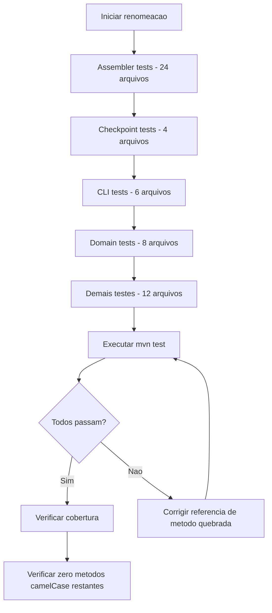
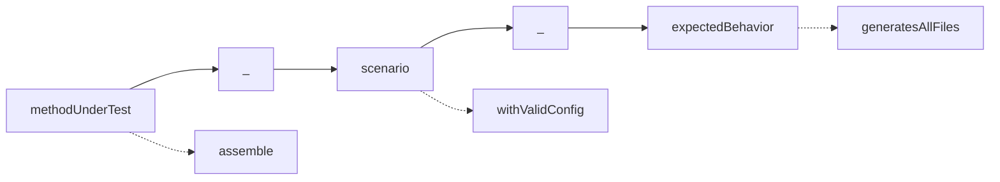

# Historia: Padronizar nomes de metodos de teste

**ID:** story-0008-0023

## 1. Dependencias

| Blocked By | Blocks |
| :--- | :--- |
| story-0008-0013, story-0008-0014, story-0008-0015, story-0008-0016 | — |

## 2. Regras Transversais Aplicaveis

| ID | Titulo |
| :--- | :--- |
| RULE-002 | Comportamento externo inalterado |
| RULE-003 | Commits atomicos |
| RULE-008 | Convencao de nomenclatura de testes |

## 3. Descricao

Como **Tech Lead**, eu quero renomear os ~441 metodos de teste que usam camelCase puro para a convencao `[methodUnderTest]_[scenario]_[expectedBehavior]`, garantindo que a nomenclatura de testes seja consistente em todo o codebase e que cada nome de teste comunique claramente o que esta sendo testado, sob qual condicao e qual resultado e esperado.

O audit report (finding M-014) identificou aproximadamente 441 metodos de teste que utilizam nomenclatura plain camelCase (ex: `testGenerateCommand`, `shouldReturnEmptyList`, `handlesNullInput`). A convencao do projeto, definida em RULE-008 e no Quality Gates (Rule 05), exige o formato `[methodUnderTest]_[scenario]_[expectedBehavior]` (ex: `generate_withValidConfig_producesExpectedOutput`, `resolveSkill_whenNotFound_returnsEmpty`). Esta inconsistencia dificulta a leitura de relatorios de teste e impede identificacao rapida de falhas.

A renomeacao e estritamente mecanica — nenhuma logica de teste e alterada, nenhuma assertion e modificada, nenhum `@DisplayName` e tocado. A strategy prioriza os testes de assemblers (24 arquivos) por serem o maior bloco, seguido por checkpoint, cli e domain. Esta story esta bloqueada pelas stories de class-splitting (0013-0016) porque as divisoes de classes podem alterar significativamente os arquivos de teste, tornando renames prematuros susceptiveis a conflitos de merge.

### 3.1 Convencao de Nomenclatura

| Formato | Exemplo |
| :--- | :--- |
| `[methodUnderTest]_[scenario]_[expectedBehavior]` | `assemble_withValidConfig_generatesAllFiles` |
| `[methodUnderTest]_[scenario]_[expectedBehavior]` | `resolveSkill_whenSkillNotFound_returnsOptionalEmpty` |
| `[methodUnderTest]_[scenario]_[expectedBehavior]` | `load_withMalformedYaml_throwsParseException` |

### 3.2 Distribuicao dos ~441 Metodos por Pacote

| Pacote | Arquivos | Metodos Estimados |
| :--- | :--- | :--- |
| assembler tests | 24 | ~220 |
| checkpoint tests | 4 | ~45 |
| cli tests | 6 | ~65 |
| domain tests | 8 | ~55 |
| demais testes | 12 | ~56 |

### 3.3 Prioridade de Execucao

1. Assembler tests (24 arquivos, ~220 metodos) — maior impacto
2. Checkpoint tests (4 arquivos, ~45 metodos)
3. CLI tests (6 arquivos, ~65 metodos)
4. Domain tests (8 arquivos, ~55 metodos)
5. Demais testes (12 arquivos, ~56 metodos)

## 4. Definicoes de Qualidade Locais

### DoR Local (Definition of Ready)

- [ ] Stories 0008-0013, 0008-0014, 0008-0015 e 0008-0016 (class-splitting) concluidas
- [ ] Lista completa dos ~441 metodos com nomes atuais e nomes propostos
- [ ] Convencao `[methodUnderTest]_[scenario]_[expectedBehavior]` documentada com exemplos
- [ ] @DisplayName annotations verificados — nenhum deve ser alterado

### DoD Local (Definition of Done)

- [ ] Zero metodos de teste com nomenclatura plain camelCase
- [ ] Todos os ~441 metodos renomeados para `[methodUnderTest]_[scenario]_[expectedBehavior]`
- [ ] Nenhum @DisplayName alterado
- [ ] Nenhuma logica de teste ou assertion modificada
- [ ] Todos os testes passando com os novos nomes
- [ ] Relatorio de testes mostra nomes descritivos e consistentes

### Global Definition of Done (DoD)

- **Cobertura:** >= 95% Line, >= 90% Branch
- **Testes Automatizados:** Todos os testes existentes passando + novos testes
- **Relatorio de Cobertura:** JaCoCo via `mvn verify`
- **Documentacao:** Javadoc atualizado quando assinaturas mudam
- **Performance:** Sem degradacao

## 5. Contratos de Dados (Data Contract)

**Exemplos de Renomeacao:**

| Arquivo | Antes | Depois |
| :--- | :--- | :--- |
| SkillsAssemblerTest | `testAssembleWithValidConfig()` | `assemble_withValidConfig_generatesSkillFiles()` |
| SkillsAssemblerTest | `shouldReturnEmptyWhenNoSkills()` | `assemble_whenNoSkillsDefined_producesEmptyOutput()` |
| RulesAssemblerTest | `testRulesGeneration()` | `assemble_withStandardRules_generatesNumberedFiles()` |
| SettingsAssemblerTest | `handlesNullPermissions()` | `assemble_withNullPermissions_usesDefaults()` |
| CodexConfigAssemblerTest | `testConfigOutput()` | `assemble_withCodexConfig_generatesExpectedToml()` |
| RunbookAssemblerTest | `shouldGenerateRunbook()` | `assemble_withValidConfig_generatesRunbookMd()` |
| GithubInstructionsAssemblerTest | `testInstructionsForAllProfiles()` | `assemble_withAllProfiles_generatesInstructionFiles()` |
| GenerateCommandTest | `shouldFailWithInvalidPath()` | `execute_withInvalidPath_throwsIllegalArgument()` |
| CheckpointEngineTest | `testCheckpointSaveAndLoad()` | `saveAndLoad_withValidState_restoresIdenticalState()` |

**Regra: @DisplayName NAO e alterado:**

```java
// ANTES
@Test
@DisplayName("Should generate all skill files for valid config")
void testAssembleWithValidConfig() { ... }

// DEPOIS — apenas nome do metodo muda
@Test
@DisplayName("Should generate all skill files for valid config")
void assemble_withValidConfig_generatesSkillFiles() { ... }
```

## 6. Diagramas (mermaid)

### 6.1 Fluxo de Renomeacao por Pacote



### 6.2 Estrutura da Convencao



## 7. Criterios de Aceite (Gherkin)

```gherkin
Cenario: Metodo de teste renomeado segue convencao do projeto
  DADO que o metodo "testAssembleWithValidConfig" existe em SkillsAssemblerTest
  QUANDO a renomeacao e aplicada
  ENTAO o metodo se chama "assemble_withValidConfig_generatesSkillFiles"
  E o @DisplayName permanece inalterado
  E a logica do teste e identica

Cenario: Todos os ~441 metodos seguem o padrao apos renomeacao
  DADO que todos os metodos de teste foram renomeados
  QUANDO uma busca por metodos @Test sem underscore e executada
  ENTAO zero resultados sao encontrados
  E cada metodo @Test contem exatamente dois underscores separando as tres partes

Cenario: Renomeacao nao altera comportamento de testes
  DADO que 441 metodos foram renomeados
  QUANDO mvn test e executado
  ENTAO todos os testes passam com os mesmos resultados de antes
  E a cobertura de linhas permanece >= 95%
  E a cobertura de branches permanece >= 90%

Cenario: @DisplayName annotations nao sao modificados
  DADO que metodos de teste possuem @DisplayName
  QUANDO a renomeacao e aplicada
  ENTAO cada @DisplayName mantem exatamente o mesmo texto original
  E nenhuma annotation e adicionada ou removida

Cenario: Relatorio de testes exibe nomes descritivos
  DADO que todos os metodos foram renomeados
  QUANDO o relatorio de testes do JUnit e gerado
  ENTAO cada entrada do relatorio exibe o nome no formato methodUnderTest_scenario_expectedBehavior
  E a identificacao de falhas e imediatamente compreensivel
```

### 7.1 Scenario Ordering (TPP)

> TPP: degenerate (um metodo renomeado) -> constante (todos os 441 metodos) -> invariante (testes passam identicamente) -> restricao (@DisplayName inalterado) -> aceitacao (relatorio legivel).

### 7.2 Mandatory Scenario Categories

- [x] Degenerate cases (um metodo renomeado corretamente)
- [x] Happy path (todos os 441 metodos renomeados, testes passam)
- [x] Error paths (comportamento inalterado, cobertura mantida)
- [x] Boundary values (@DisplayName intocados, zero metodos camelCase restantes)

## 8. Sub-tarefas

- [ ] [Dev] Renomear metodos de teste em assembler tests (24 arquivos, ~220 metodos)
- [ ] [Dev] Renomear metodos de teste em checkpoint tests (4 arquivos, ~45 metodos)
- [ ] [Dev] Renomear metodos de teste em cli tests (6 arquivos, ~65 metodos)
- [ ] [Dev] Renomear metodos de teste em domain tests (8 arquivos, ~55 metodos)
- [ ] [Dev] Renomear metodos de teste restantes (12 arquivos, ~56 metodos)
- [ ] [Test] Executar `mvn test` e confirmar todos os testes passando com novos nomes
- [ ] [Test] Verificar que zero metodos @Test usam plain camelCase
- [ ] [Test] Verificar cobertura >= 95% line, >= 90% branch
