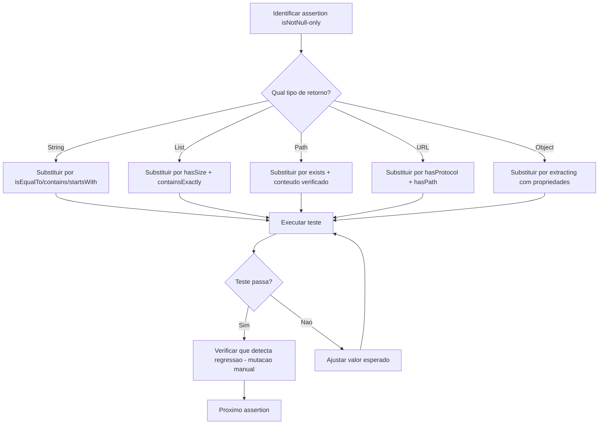
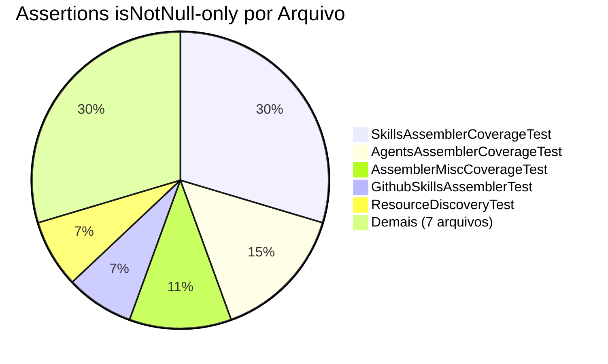

# Historia: Fortalecer assertions fracas nos testes

**ID:** story-0008-0024

## 1. Dependencias

| Blocked By | Blocks |
| :--- | :--- |
| story-0008-0006 | — |

## 2. Regras Transversais Aplicaveis

| ID | Titulo |
| :--- | :--- |
| RULE-001 | Qualidade de testes |
| RULE-002 | Comportamento externo inalterado |
| RULE-003 | Commits atomicos |

## 3. Descricao

Como **Tech Lead**, eu quero substituir as 27 assertions `isNotNull()`-only por verificacoes especificas de valor/conteudo, garantindo que os testes realmente validem o comportamento correto ao inves de apenas confirmar que algo nao e nulo.

O audit report (finding M-015) identificou 27 pontos em 13 arquivos de teste onde a unica assertion e `assertThat(result).isNotNull()` ou equivalente. Essas assertions sao fracas porque passam mesmo quando o valor retornado e incorreto — qualquer objeto nao-nulo satisfaz a verificacao. Um teste que apenas confirma `isNotNull()` nao detecta regressoes de valor, formato, conteudo ou estrutura. Essencialmente, esses testes fornecem cobertura numerica sem proteao real contra bugs.

Cada assertion deve ser substituida por uma verificacao especifica ao contexto: `containsExactly()` para colecoes, `isEqualTo()` para valores escalares, `contains()`/`startsWith()` para strings, `hasSize()` para listas, `extracting()` para propriedades de objetos. A escolha depende do que o metodo testado retorna. Esta story esta bloqueada pela story-0008-0006 (Optional) porque as mudancas de retorno `null -> Optional` vao alterar os padroes de assertion necessarios nos mesmos arquivos.

### 3.1 Distribuicao das 27 Assertions por Arquivo

| Arquivo de Teste | Quantidade | Tipo de Resultado |
| :--- | :--- | :--- |
| SkillsAssemblerCoverageTest | 8 | Strings (paths de skills), Lists |
| AgentsAssemblerCoverageTest | 4 | Strings (conteudo de agentes) |
| AssemblerMiscCoverageTest | 3 | Objetos diversos |
| GithubSkillsAssemblerTest | 2 | Strings (conteudo de skills) |
| ResourceDiscoveryTest | 2 | URLs, Paths |
| AssemblerPipelineTest | 1 | Pipeline result |
| AssemblerTest | 1 | Output directory content |
| CheckpointEngineCoverageTest | 1 | Checkpoint state |
| GithubInstructionsCoverageTest | 1 | String (instrucao gerada) |
| CopyHelpersTest | 1 | Path (arquivo copiado) |
| InteractivePrompterTest | 1 | String (resposta do prompter) |
| NativeImageConfigTest | 1 | JSON config object |
| ResourceResolverTest | 1 | Resolved resource content |

### 3.2 Estrategia de Substituicao

| Tipo de Retorno | Assertion Fraca | Assertion Forte |
| :--- | :--- | :--- |
| `String` | `isNotNull()` | `isEqualTo("expected")` ou `contains("substring")` |
| `List<T>` | `isNotNull()` | `hasSize(N)` + `containsExactly(...)` |
| `Path` | `isNotNull()` | `exists()` + conteudo do arquivo verificado |
| `URL` | `isNotNull()` | `hasProtocol("file")` + `hasPath(...)` |
| `Object` | `isNotNull()` | `extracting(...)` com verificacoes de propriedades |

## 4. Definicoes de Qualidade Locais

### DoR Local (Definition of Ready)

- [ ] story-0008-0006 (Optional) concluida
- [ ] Todas as 27 assertions fracas localizadas com numeros de linha exatos
- [ ] Para cada assertion, o valor esperado correto foi identificado
- [ ] Tipo de retorno de cada metodo testado documentado

### DoD Local (Definition of Done)

- [ ] Zero assertions `isNotNull()`-only nos 13 arquivos
- [ ] Cada assertion substituida por verificacao especifica de valor/conteudo
- [ ] Assertions novas detectam regressoes reais (testado com mutacao manual)
- [ ] Nenhuma logica de producao alterada
- [ ] Todos os testes existentes passando
- [ ] Cobertura permanece >= 95% line, >= 90% branch

### Global Definition of Done (DoD)

- **Cobertura:** >= 95% Line, >= 90% Branch
- **Testes Automatizados:** Todos os testes existentes passando + novos testes
- **Relatorio de Cobertura:** JaCoCo via `mvn verify`
- **Documentacao:** Javadoc atualizado quando assinaturas mudam
- **Performance:** Sem degradacao

## 5. Contratos de Dados (Data Contract)

**Exemplo 1 — String (SkillsAssemblerCoverageTest):**

```java
// ANTES (assertion fraca)
var result = assembler.resolveSkillContent(skillName);
assertThat(result).isNotNull();

// DEPOIS (assertion forte)
var result = assembler.resolveSkillContent(skillName);
assertThat(result)
    .isNotEmpty()
    .contains("name: " + skillName)
    .contains("description:");
```

**Exemplo 2 — List (AgentsAssemblerCoverageTest):**

```java
// ANTES (assertion fraca)
var agents = assembler.listAgents(config);
assertThat(agents).isNotNull();

// DEPOIS (assertion forte)
var agents = assembler.listAgents(config);
assertThat(agents)
    .hasSize(3)
    .extracting("name")
    .containsExactlyInAnyOrder("architect", "tech-lead", "qa-engineer");
```

**Exemplo 3 — Path (CopyHelpersTest):**

```java
// ANTES (assertion fraca)
var copied = CopyHelpers.copyTemplateFileIfExists(source, target);
assertThat(copied).isNotNull();

// DEPOIS (assertion forte)
var copied = CopyHelpers.copyTemplateFileIfExists(source, target);
assertThat(copied).exists();
assertThat(Files.readString(copied)).isEqualTo(expectedContent);
```

**Exemplo 4 — JSON (NativeImageConfigTest):**

```java
// ANTES (assertion fraca)
var config = generator.generateConfig();
assertThat(config).isNotNull();

// DEPOIS (assertion forte)
var config = generator.generateConfig();
assertThat(config.toString())
    .contains("\"name\":")
    .contains("\"resources\":");
```

## 6. Diagramas (mermaid)

### 6.1 Fluxo de Fortalecimento de Assertions



### 6.2 Distribuicao das 27 Assertions por Arquivo



## 7. Criterios de Aceite (Gherkin)

```gherkin
Cenario: Assertion de String substituida por verificacao de conteudo
  DADO que SkillsAssemblerCoverageTest contem assertion "isNotNull()" para resultado String
  QUANDO a assertion e fortalecida
  ENTAO a nova assertion verifica o conteudo esperado (contains, isEqualTo, ou startsWith)
  E o teste passa com o valor correto
  E o teste FALHA quando o valor retornado e alterado para string diferente

Cenario: Assertion de List substituida por verificacao de tamanho e elementos
  DADO que AgentsAssemblerCoverageTest contem assertion "isNotNull()" para resultado List
  QUANDO a assertion e fortalecida
  ENTAO a nova assertion verifica hasSize e containsExactly ou containsExactlyInAnyOrder
  E o teste FALHA quando um elemento e removido da lista

Cenario: Todas as 27 assertions fracas eliminadas
  DADO que os 13 arquivos de teste foram atualizados
  QUANDO uma busca por assertions "isNotNull()" sem verificacao adicional e executada
  ENTAO zero resultados sao encontrados nos 13 arquivos listados
  E cada assertion anterior foi substituida por verificacao especifica

Cenario: Assertions fortalecidas detectam regressoes reais
  DADO que as 27 assertions foram substituidas por verificacoes especificas
  QUANDO uma mutacao manual e introduzida no codigo de producao (ex: retornar string vazia)
  ENTAO pelo menos uma das assertions fortalecidas FALHA
  E a mensagem de falha indica claramente o valor esperado vs valor recebido

Cenario: Cobertura nao regride apos fortalecimento
  DADO que nenhuma logica de producao foi alterada
  QUANDO mvn verify e executado
  ENTAO a cobertura de linhas permanece >= 95%
  E a cobertura de branches permanece >= 90%
  E nenhum teste existente falha
```

### 7.1 Scenario Ordering (TPP)

> TPP: degenerate (uma assertion String fortalecida) -> constante (assertion List fortalecida) -> colecao (todas as 27 eliminadas) -> validacao (detecta regressoes) -> invariante (cobertura mantida).

### 7.2 Mandatory Scenario Categories

- [x] Degenerate cases (assertion String com verificacao de conteudo)
- [x] Happy path (assertion List com verificacao de tamanho e elementos)
- [x] Error paths (assertions fortalecidas detectam regressoes reais)
- [x] Boundary values (zero assertions fracas, cobertura >= 95%)

## 8. Sub-tarefas

- [ ] [Dev] Fortalecer 8 assertions em SkillsAssemblerCoverageTest
- [ ] [Dev] Fortalecer 4 assertions em AgentsAssemblerCoverageTest
- [ ] [Dev] Fortalecer 3 assertions em AssemblerMiscCoverageTest
- [ ] [Dev] Fortalecer 2 assertions em GithubSkillsAssemblerTest
- [ ] [Dev] Fortalecer 2 assertions em ResourceDiscoveryTest
- [ ] [Dev] Fortalecer 7 assertions em arquivos restantes (AssemblerPipelineTest, AssemblerTest, CheckpointEngineCoverageTest, GithubInstructionsCoverageTest, CopyHelpersTest, InteractivePrompterTest, NativeImageConfigTest, ResourceResolverTest)
- [ ] [Test] Validar que cada assertion fortalecida detecta regressao via mutacao manual
- [ ] [Test] Executar `mvn verify` e confirmar todos os testes passando
- [ ] [Test] Verificar cobertura >= 95% line, >= 90% branch
