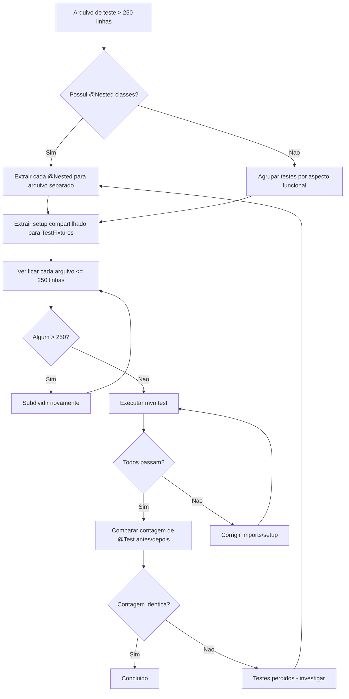
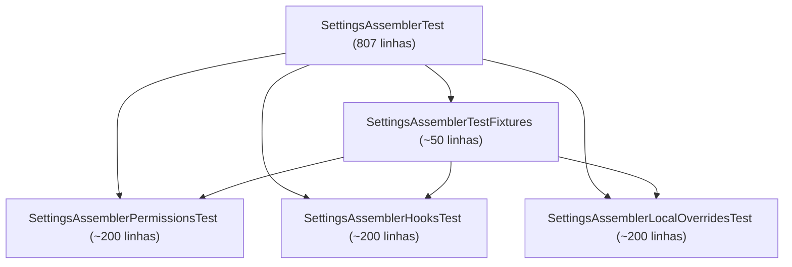

# Historia: Dividir arquivos de teste acima de 250 linhas

**ID:** story-0008-0025

## 1. Dependencias

| Blocked By | Blocks |
| :--- | :--- |
| story-0008-0013, story-0008-0014, story-0008-0015, story-0008-0016 | — |

## 2. Regras Transversais Aplicaveis

| ID | Titulo |
| :--- | :--- |
| RULE-002 | Comportamento externo inalterado |
| RULE-003 | Commits atomicos |
| RULE-004 | Limite de 250 linhas por classe/modulo |

## 3. Descricao

Como **Tech Lead**, eu quero dividir os 10 maiores arquivos de teste que excedem 250 linhas em classes menores e focadas, garantindo que cada arquivo de teste respeite o limite de 250 linhas definido em RULE-004 e que a organizacao dos testes reflita a estrutura logica do codigo testado.

O audit report (finding M-016) identificou 63 arquivos de teste que excedem o limite de 250 linhas. Esta story foca nos 10 maiores: GithubInstructionsAssemblerTest (819 linhas), SettingsAssemblerTest (807), AgentsAssemblerTest (752), SkillsAssemblerTest (748), GithubAgentsAssemblerTest (734), RulesConditionalsCoverageTest (688), GenerateCommandTest (670), InteractivePrompterTest (667), StackValidatorTest (664) e CicdAssemblerTest (650). Arquivos de teste excessivamente grandes dificultam a navegacao, aumentam o tempo de compilacao incremental e tornam dificil identificar qual aspecto do comportamento falhou quando um teste quebra.

A estrategia de divisao utiliza duas tecnicas: (1) extrair classes `@Nested` existentes para arquivos de teste separados (ex: `GithubInstructionsAssemblerTest.ProfileTests` vira `GithubInstructionsAssemblerProfileTest`), e (2) extrair setup compartilhado para test fixtures reutilizaveis (ex: `AssemblerTestFixtures` com configuracoes pre-construidas). Esta story esta bloqueada pelas stories de class-splitting de producao (0013-0016) porque as divisoes de classes de producao vao alterar imports, nomes e estrutura nos arquivos de teste, tornando divisoes prematuras de testes susceptiveis a conflitos massivos de merge.

### 3.1 Top 10 Arquivos de Teste para Divisao

| # | Arquivo | Linhas | Estrategia de Divisao |
| :--- | :--- | :--- | :--- |
| 1 | GithubInstructionsAssemblerTest | 819 | Extrair por tipo de instrucao (profile, rule, general) |
| 2 | SettingsAssemblerTest | 807 | Extrair por secao de settings (permissions, hooks, local) |
| 3 | AgentsAssemblerTest | 752 | Extrair por tipo de agente (claude, github) |
| 4 | SkillsAssemblerTest | 748 | Extrair por tipo de skill (user-invocable, knowledge-pack) |
| 5 | GithubAgentsAssemblerTest | 734 | Extrair por cenario (frontmatter, tools, content) |
| 6 | RulesConditionalsCoverageTest | 688 | Extrair por condicional (feature flags, profile-specific) |
| 7 | GenerateCommandTest | 670 | Extrair por fase do comando (validation, execution, output) |
| 8 | InteractivePrompterTest | 667 | Extrair por tipo de prompt (text, choice, confirm) |
| 9 | StackValidatorTest | 664 | Extrair por tipo de validacao (required, optional, conflict) |
| 10 | CicdAssemblerTest | 650 | Extrair por provider (github-actions, gitlab-ci) |

### 3.2 Convencao de Nomenclatura para Arquivos Divididos

- Arquivo original: `FooTest.java`
- Arquivos resultantes: `FooBarTest.java`, `FooBazTest.java`, `FooQuxTest.java`
- Test fixtures: `FooTestFixtures.java` (sem @Test, apenas builders e configuracoes)

### 3.3 Criterio de Divisao

- Cada arquivo resultante deve ter <= 250 linhas
- Se `@Nested` classes existem, cada uma vira um arquivo separado
- Se nao existem `@Nested`, agrupar por aspecto funcional do metodo testado
- Setup compartilhado vai para test fixtures (classes sem @Test)

## 4. Definicoes de Qualidade Locais

### DoR Local (Definition of Ready)

- [ ] Stories 0008-0013, 0008-0014, 0008-0015 e 0008-0016 (class-splitting) concluidas
- [ ] Contagem exata de linhas dos 10 arquivos confirmada
- [ ] Estrutura @Nested existente em cada arquivo mapeada
- [ ] Plano de divisao definido para cada arquivo (quais classes resultantes)

### DoD Local (Definition of Done)

- [ ] Cada um dos 10 arquivos originais tem <= 250 linhas (ou foi eliminado em favor dos novos)
- [ ] Todos os testes migrados para novos arquivos
- [ ] Zero testes perdidos — contagem total de @Test identica antes e depois
- [ ] Test fixtures extraidos e reutilizados por multiplos arquivos
- [ ] Todos os testes passando com os mesmos resultados
- [ ] Nenhuma logica de teste alterada — apenas reorganizacao

### Global Definition of Done (DoD)

- **Cobertura:** >= 95% Line, >= 90% Branch
- **Testes Automatizados:** Todos os testes existentes passando + novos testes
- **Relatorio de Cobertura:** JaCoCo via `mvn verify`
- **Documentacao:** Javadoc atualizado quando assinaturas mudam
- **Performance:** Sem degradacao

## 5. Contratos de Dados (Data Contract)

**Exemplo de Divisao — GithubInstructionsAssemblerTest (819 linhas):**

```
ANTES:
  GithubInstructionsAssemblerTest.java (819 linhas)
    ├── setup (30 linhas)
    ├── profile instruction tests (280 linhas)
    ├── rule instruction tests (250 linhas)
    └── general instruction tests (259 linhas)

DEPOIS:
  GithubInstructionsAssemblerTestFixtures.java (~50 linhas)
    └── configs, paths, builders compartilhados

  GithubInstructionsAssemblerProfileTest.java (~200 linhas)
    └── testes de instrucoes por profile

  GithubInstructionsAssemblerRulesTest.java (~200 linhas)
    └── testes de instrucoes de rules

  GithubInstructionsAssemblerGeneralTest.java (~200 linhas)
    └── testes de instrucoes gerais
```

**Exemplo de Test Fixture:**

```java
// GithubInstructionsAssemblerTestFixtures.java
final class GithubInstructionsAssemblerTestFixtures {

    static SetupConfig defaultConfig() {
        return SetupConfig.builder()
            .projectName("test-project")
            .language("java")
            .framework("spring")
            .build();
    }

    static Path createTempResourcesDir(Path tempDir) throws IOException {
        // setup compartilhado
        return tempDir.resolve("resources");
    }
}
```

## 6. Diagramas (mermaid)

### 6.1 Estrategia de Divisao



### 6.2 Exemplo de Divisao — SettingsAssemblerTest



## 7. Criterios de Aceite (Gherkin)

```gherkin
Cenario: Arquivo de teste dividido resulta em arquivos com <= 250 linhas
  DADO que GithubInstructionsAssemblerTest possui 819 linhas
  QUANDO a divisao e aplicada
  ENTAO cada arquivo resultante possui <= 250 linhas
  E a soma dos testes nos novos arquivos e igual ao total original

Cenario: Nenhum teste e perdido durante a divisao
  DADO que os 10 arquivos originais contem N metodos @Test no total
  QUANDO todos os 10 arquivos sao divididos
  ENTAO os novos arquivos contem exatamente N metodos @Test
  E mvn test reporta o mesmo numero de testes executados

Cenario: Test fixtures sao reutilizados por multiplos arquivos de teste
  DADO que setup compartilhado foi extraido para TestFixtures
  QUANDO dois ou mais arquivos de teste divididos importam o fixture
  ENTAO o setup nao esta duplicado entre os arquivos
  E cada arquivo de teste usa os metodos do fixture para configuracao

Cenario: Divisao com @Nested existente extrai classes para arquivos separados
  DADO que AgentsAssemblerTest possui classes @Nested internas
  QUANDO a divisao e aplicada
  ENTAO cada classe @Nested e migrada para um arquivo de teste proprio
  E a classe original nao contem mais @Nested classes acima de 50 linhas

Cenario: Todos os testes passam apos reestruturacao completa
  DADO que os 10 arquivos foram divididos e fixtures extraidos
  QUANDO mvn verify e executado
  ENTAO todos os testes passam
  E a cobertura de linhas permanece >= 95%
  E a cobertura de branches permanece >= 90%
  E nenhum warning de compilacao e introduzido
```

### 7.1 Scenario Ordering (TPP)

> TPP: degenerate (um arquivo dividido com <= 250 linhas) -> constante (contagem total de testes identica) -> colecao (fixtures reutilizados) -> estrutura (@Nested extraidos) -> aceitacao (todos os testes passam com cobertura).

### 7.2 Mandatory Scenario Categories

- [x] Degenerate cases (arquivo dividido com <= 250 linhas cada)
- [x] Happy path (zero testes perdidos, todos passam)
- [x] Error paths (nenhum warning de compilacao introduzido)
- [x] Boundary values (exatamente N testes antes e depois, cobertura >= 95%)

## 8. Sub-tarefas

- [ ] [Dev] Dividir top 5 arquivos de teste (GithubInstructionsAssemblerTest, SettingsAssemblerTest, AgentsAssemblerTest, SkillsAssemblerTest, GithubAgentsAssemblerTest)
- [ ] [Dev] Dividir proximos 5 arquivos de teste (RulesConditionalsCoverageTest, GenerateCommandTest, InteractivePrompterTest, StackValidatorTest, CicdAssemblerTest)
- [ ] [Dev] Extrair test fixtures compartilhados (builders, configs, paths reutilizaveis)
- [ ] [Test] Verificar contagem de @Test identica antes e depois da divisao
- [ ] [Test] Executar `mvn test` e confirmar todos os testes passando
- [ ] [Test] Verificar cada novo arquivo <= 250 linhas
- [ ] [Test] Verificar cobertura >= 95% line, >= 90% branch
